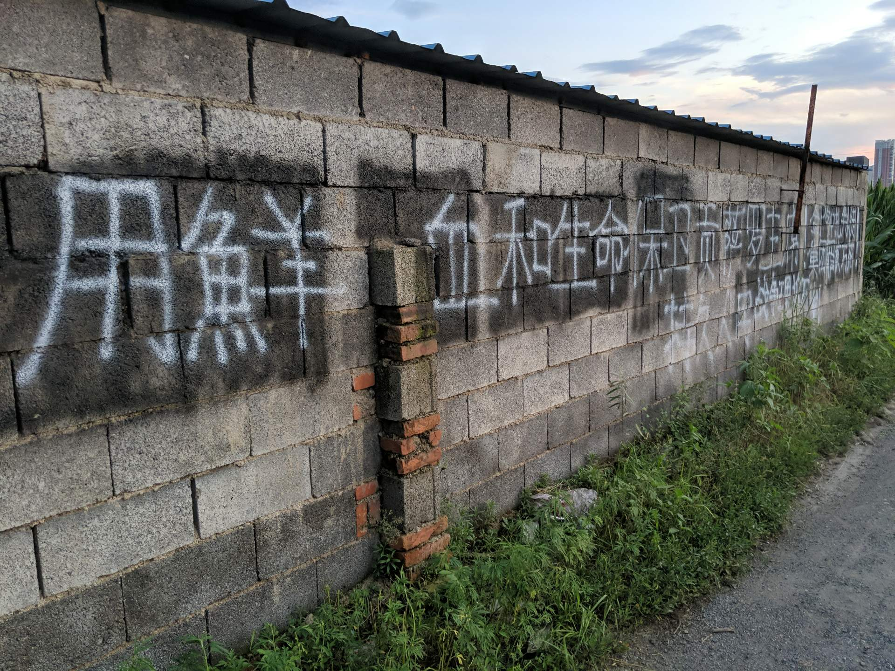

# Prolet
Historical documents (in Chinese) about the GPCR（The great proletarian cultural revolution） (Thanks Comrade RC)

**伟大的领袖和导师贡萨罗主席永垂不朽！**

**“面對馬克思、列寧、毛澤東主義作為無產階級的科學思想在中國特別是青年中的興起，中國社會帝國主義國家在絕望中審查了有關這個問題的信息和討論小組。”——https://anovademocracia.com.br/noticias/16163-pichacoes-na-china-viva-o-presidente-mao-viva-o-presidente-gonzalo**

**“毛澤東主義者在中國的日益活躍應該受到全世界革命者的歡迎。資本主義復辟以來，中國社會法西斯政府殘酷鎮壓一切共產主義組織。中國毛主義在這些困難條件下的行動和組織，顯示了他們的勇敢，應該成為高舉毛主義旗幟、為革命而戰的一種鼓舞。”——
https://tribuneofthepeople.news/2021/07/16/china-long-live-chairman-mao-long-live-chairman-gonzalo-graffiti-seen-in-northeast/
https://newepochnews.wixsite.com/newepochnews/post/china-long-live-chairman-mao-long-live-chairman-gonzalo-graffiti-seen-in-northeast**

**“此時，我們想出版一幅中國畫，它出現在中國東北一家工廠附近的建黨100週年紀念月。這幅畫說：‘毛主席萬歲！贡萨罗主席萬歲！’”——https://www.demvolkedienen.org/index.php/de/40-nachrichten/asien/5581-china-malung-zum-100-jahrestag-der-gruendung-der-kommunistischen-partei-chinas**

**“中國的進步分子需要積極學習和加深對馬克思、列宁、毛澤東主義，主要是毛澤東主義以及贡萨罗主席的普遍有效貢獻的理解。”——https://tribuneofthepeople.news/2021/08/02/communist-international-the-campaign-for-the-defense-of-chairman-gonzalo-deepens-and-broadens/**

**《毛澤東全集》全52卷，7.84GB：https://mega.nz/folder/6CwjTIib#wlYLoZLFfmazXNVtKYwiPg**

【湖北"揭批查"】夏邦银、朱鸿霞、胡厚民等人的"罪证材料"，"夏朱胡专案组"，1977年4月. RC 【供参考】
https://mega.nz/file/TsBR3SJS#m9S851K7sW5ZOpuHqIad2KT-0Ungwef1aLIoz9d9W2E

**ML之聲EBOOK 800G數據：https://mega.nz/folder/Tb5yTLza#HdahKp3RTVVX3GBTcRTJNw**

本库01/12日受赠的《金CR简史》有一些错讹和不完全不准确的地方，但是其中金日成之流活动记事，对揭露金日成资反路线的面目，无疑是很有益的，也可供参考。
惠赠资料者作的声明:【有關修╳TV、P×PER和修╳宇、林╳背叛geming的材料，以及本庫中文本的PDF版本。

**ML之聲分類TXT資料（不定期更新）：【已失效】**

**PDF已備份的The Banned Thought：【已失效】**

**《反擊》1976.05：https://mega.nz/file/eTxxAA6a#UHQGj-0WRWK0ANYd4tJycZJQB-9OBw0hYr736_avwq4**

**原創旋律《反擊》組曲：https://mega.nz/folder/WeI3lCbA#KHFSs0RgCFGOSbSVyZI6yg**

**供廣大工農兵、革命幹部、革命知識分子重命名、整理、收集、轉發、批判。**

## 文革历史资料。

### 在GitHub上怎样修改别人的库？（GNU/Linux）

1.Fork（右上角）

2.在你跳转到的Fork库Clone（下载下来，右上角下边的绿按钮）

（如果Clone的不是Fork库，而是主库，是不能发出上传请求的，因为那是别的用户的库）

即命令：git clone \<复制的git文件链接\>

修改此文件夹里的内容

cd 此库下载到的文件夹路径

git checkout -b AddingFile

git add .

git commit -m 'Adding a file'

git push --set-upstream origin AddingFile

当然，你的帐号在浏览器里要在线，最后一条命令执行完后，会弹出要不要Pull Request。

如果你的Pull Request还没被接受，你可以在不上浏览器的同时来上传。

### 在GitHub上怎样修改别人的库？（网页版方式）

1.点击右上角的fork；

2.在自己fork内的库点击下面第三个按钮pull requests；

3.点击右下方的new pull requests；

4.撰写标题后提交，待主库所有者同意后即修改成功。

### 2021/01/20 update

上传一批文件。  
1958-1976年的大部分《红旗》杂志，共44本。  

红旗58.1-7.pdf  
红旗58.8-14.pdf  
红旗59.1-8.pdf  
红旗59.17-24.pdf  
红旗59.9-16.pdf  
红旗60.1-8.pdf  
红旗60.17-24.pdf  
红旗60.9-16.pdf  
红旗61.1-8.pdf  
红旗61.17-24.pdf  
红旗61.9-16.pdf  
红旗62.1-7.pdf  
红旗62.15-21.pdf  
红旗62.8-14.pdf  
红旗63.1-8.pdf  
红旗63.17-24.pdf  
红旗63.9-16.pdf  
红旗64.1-8.pdf  
红旗64.17-24.pdf  
红旗64.9-16.pdf  
红旗64.z1-2.pdf  
红旗65.1-7.pdf  
红旗65.8-13.pdf  
红旗66.1-8.pdf  
红旗66.9-15.pdf  
红旗67.1-8.pdf  
红旗67.9-16.pdf  
红旗68.1-5.pdf  
红旗69.1-7.pdf  
红旗69.8-12.pdf  
红旗70.1-6.pdf  
红旗70.7-12.pdf  
红旗71.1-6.pdf  
红旗71.7-13.pdf  
红旗72.1-6.pdf  
红旗72.7-12.pdf  
红旗73.1-6.pdf  
红旗73.7-12.pdf  
红旗74.1-6.pdf  
红旗74.7-12.pdf  
红旗75.1-6.pdf  
红旗75.7-12.pdf  
红旗76.1-6.pdf  
红旗76.7-12.pdf  

### 2021/01/19 update

上传三本《社会主义政治经济学》

社会主义政治经济学1972年版  
社会主义政治经济学1973年版  
社会主义政治经济学1975年版

上传了湖南哲学社会科学研究所图书资料组从北京、辽宁等地理论讨论会以及报刊文章中编选的理论问题资料《关于资产阶级#就在共产党内的问题》

目录将适时更新。

---

【湖北"揭批查"】夏邦银、朱鸿霞、胡厚民等人的"罪证材料"，"夏朱胡专案组"，1977年4月. RC 【供参考】
https://mega.nz/file/TsBR3SJS#m9S851K7sW5ZOpuHqIad2KT-0Ungwef1aLIoz9d9W2E

生成TXT的源数据、以及此库内容已经备份到：[文革资料扫描成果（百度大脑）](https://mega.nz/folder/BAF1QKYT#sK5uqACKO9jw1dGCKVaXMw)

TXT格式的书籍是PDF中不含可复制的文字信息的书籍

由于文件过大（已扫描为TXT）

链接发布与下方：

[(On Bourgeois Recht)论资产阶级法权.pdf](https://mega.nz/file/4M4DGZ6K#mW5YLapLyYDyl5qpoD_vFKDY0YyQI8uTUiofGHO3JNE)

[(Thoroughly criticize the reactionary theory of the omnipotence of productive forces)彻底批判反动的唯生产力论](https://mega.nz/file/JRpHxAZI#JF_8EbPkyZ8aS47pOuExa9WLTFORo927JHojH6v3wW8)

---

供揭批过去以金日成为首的朝鲜劳动党修正主义参考的《金日成著作选集》1-5,7的目录页，配合备份库中的《金日成著作集》即可翻阅(Selected Works of Kim Il Sung)

在链接内BOOKS目录下的——[金日成著作选集 1-8 索引.7z](https://mega.nz/file/lYcXyYBJ#oR2Ov3IL6vQb07dzD23nWAyR1XhbVu1CgXJjoJtJeTA)【仅供参考】

---
为了方便搜索引擎收录，现将文件名列于下方：

On the Inner-Party Bourgeoisie(Snippet) Shanghai 1976《谈谈党内资产阶级》(上海市委写作组编著)辑佚

On the Inner-Party Bourgeoisie 论党内资产阶级-江苏人民出版社（报刊文选）（扫描版）

(References used in Snippet of On the Inner-Party Bourgeoisie Shanghai 1976 )编辑《谈谈党内资产阶级》辑佚时使用的主要参考文献（旧）

Concise Dictionary of Philosophy 哲学小辞典（辩证唯物主义和历史唯物主义部分，上海）

哲学小辞典（儒法斗争史部分，上海）

哲学小辞典（外国哲学史部分，上海）

Lecture on the history of CPC 1中国共产党历史讲义（上册，上海复旦）RC 录入版

Lecture on the history of CPC 2中国共产党历史讲义（下册，上海复旦）RC 录入版

Political Economics of Socialism 1976上海版社会主义政治经济学1976年9月（更加清晰的扫描版pdf和录入版doc）

社会主义政治经济学（1976.9）录入粗校版 ConRev 

社会主义政治经济学197609版P464-465

社会主义政治经济学 1976年9月版（模糊一些的版本，来自[马列之声电子书小组的书库](https://tieba.baidu.com/p/6212671631)（https://www.bilibili.com/read/cv11100587 ），文字版经百度云高精度含位置信息接口扫描）

The History of the International Communist Movement Vol 1 of 2 Peking Universality 1976 version 国际共产主义运动史 上册 北京大学国际政治系 1976年版

The History of the International Communist Movement Vol Ⅲ Peking Universality 1972 version 国际共产主义运动史讲义第三册 北京大学国际政治系 1972年版

The History of the International Communist Movement Vol Ⅳ Peking Universality 1972 version 国际共产主义运动史讲义第四册 北京大学国际政治系 1972年版

“文化大革命文库”【资产阶级学者编辑，包含个别台港方面伪造文件，供参考】

“建国以来文稿”与“文集”【官定本，原文可能被不当处理过，供参考】

“全国宣传会筹备组”的“四人帮”哲学、政治经济学、科学社会主义、文艺材料_RC 【供参考】

“教育部大批判组”的“四人帮”教育材料_RC 【供参考】

《关于加快工业发展的若干问题》选批

《论总纲》选批

一九七一年全国教育工作会议纪要 中发〔1971〕44号文件 （毛主席批示：同意）

一九七五年清华大学关于教育革命大辩论的情况报告 中发〔1975〕26号文件 （毛主席已圈阅）

中国共产党两条路线斗争史讲义（修改稿）1976年7月 广东

中国共产党历史讲义（上册，上海复旦1975）RC 扫描版

中国共产党历史讲义（下册，上海复旦1975）RC 扫描版

中央政治局同志在接见全国计划工作座谈会全体代表时的指示 零陵县东风镇房地产管理所版 1976年7-8月

中央领导同志接见参加全国计划工作座谈会议代表时做的指示（记录稿）山东汶上县版 1976年7-8月

党的基础知识 （旧版）青年自学丛书 上海人民出版社 

关于党内资产阶级问题的意见综述

党内资产阶级与资产阶级法权 《南开学报：哲学社会科学版》1976年 第2期

认真学习毛主席重要指示 搞清楚资产阶级就在共产党内（讲话材料供理论辅导员参考）《武汉大学学报：人文科学版》1976年 第4期

在斗争中提高对走资派的识别能力 《武汉大学学报：人文科学版》1976年 第4期

官僚主义者阶级就是党内资产阶级 《天津师范大学学报：社会科学版》1976年 第4期

北京大学学报1976年第2期 马克思主义的重大发展——学习毛主席重要指示的一点体会

北京大学学报1976年第3期 马克思主义关于资产阶级法权理论的重大发展——学习毛主席重要指示体会之二

北京大学学报1976年第3期 社会主义时期主要矛盾理论的重大发展——学习毛主席重要指示体会之三

北京大学学报1976年第4期 无产阶级专政与官僚主义者阶级——学习毛主席重要指示体会之四

北京大学学报1976年第3期 论党内走资派

北京大学学报1976年第3期 邓××反动言论选批

北京大学学报1976年第4期 马克思恩格斯反对资产阶级民主派的斗争

国际共产主义运动中两条路线斗争简史 北京大学国际政治系1976 此书每章最后一页被华集团剪掉而沾上“消毒”后附页，其余内页未动

国际共产主义运动简史 1848-1917 青年自学丛书 上海师范大学政治教育系编 上海人民出版社 1976.4

国际问题学习文件及资料汇编（1974.11）RC

宗明兰1974和1976年的部分讲话（图片）.7z

宗明兰同志在辽宁省理论讨论会上的总结发言（记录整理稿）

广播讲课讲稿 党内资产阶级的形成及其特点

怎样理解资产阶级就在共产党内——北京市第三次理论讨论会的五个发言材料_RC

政治经济学 帝国主义部分 南开大学1976修订本

政治经济学 社会主义部分 南开大学1976修订本

政治经济学 资本主义部分 南开大学

政治经济学基础知识（第二版） 青年自学丛书 《政治经济学基础知识》编写组编 上海人民出版社

政治经济学讲话（社会主义部分）1976 哲学社会科学基础读物 人民出版社

文革形势略图67

无产阶级文化大革命概述简论（简要本、全本1-6篇） 水陆洲

无产阶级文化大革命资料汇编（1-5篇） 水陆洲

“机密档案中新发现的毛泽东讲话”【资产阶级学者编辑，供参考】

李达：唯物辩证法大纲 【陶德麟执笔，1978年，仅供参考】

毛泽东思想万岁（1913-1968）武汉版。毛主席著作集

毛远新在学习辽宁朝阳农学院教育革命经验现场会上的讲话（1974年12月23日）

王洪文关于学习毛主席理论问题指示的讲话 甘肃师范版，据黄冈革委版校 750114

痛击右倾翻案风 狠批唯生产力论1-2

苏联国内资本主义复辟纪事（1953-1973年）

苏联社会帝国主义经济统计资料

谈谈资产阶级法权 by 上钢五厂工人理论小组，复旦大学红宣编写

辽宁省1976年2-3月理论讨论会材料（图片）： 《关于社会主义革命时期的阶级关系问题——关于阶级关系问题的讨论情况汇集（党内资产阶级问题）》

陈以梅 在济南市二所对济南工人谈话19740322_RC

陈以梅在山东省工农兵代表批林批孔汇报大会上的讲话19740227_RC

毛远新在学习辽宁朝阳农学院教育革命经验现场会上的讲话（1974年12月23日）

苏联社会帝国主义经济统计资料

马克思 恩格斯 列宁 斯大林 论教育革命 1971年

马克思 恩格斯 列宁 斯大林 论辩证唯物主义与历史唯物主义 上册

马克思 恩格斯 列宁 论资产阶级法权 上海五·七干校 1975年5月

马克思主义国家学说讲话 （51116部队理论组、北大哲学系72级工农兵学员） 1975 哲学社会科学基础读物 人民出版社

马克思主义文艺理论基本问题 东北地区八院校文艺理论编写组编 1973

马克思恩格斯列宁毛主席 关于社会主义政治经济学的部分论述 复旦 197603

（精加工ing）1976·9社会主义政治经济学.pdf

---
注意到git并不适合用于分发二进制格式的文件，而是适用于分发文本文件。

计划将pdf文档迁移到网络文件储存服务上（如Mega.nz）而在github上发布文档的链接。

或者在github改用纯文本格式（如md ,html）储存文档。

---
From PRD:建议保留pdf文件的备份，尤其是历史文件。txt文件用以快速检索pdf文件的内容。

---
需改造的破损文件——DOCX文件

---
百度云扫描带位置信息的文件，可以用[Reportlab](https://www.reportlab.com/docs/reportlab-userguide.pdf)（仅需加一个坐标系转换，将左下角坐标系转换为左上角坐标系）、Python等来生成一个PDF。

不论是把原PDF的背景换为纯色还是基于一个空白PDF。

可以一个字符一个drawText、也可以一段话一个drawText、也可以一行话一个drawText。

---

