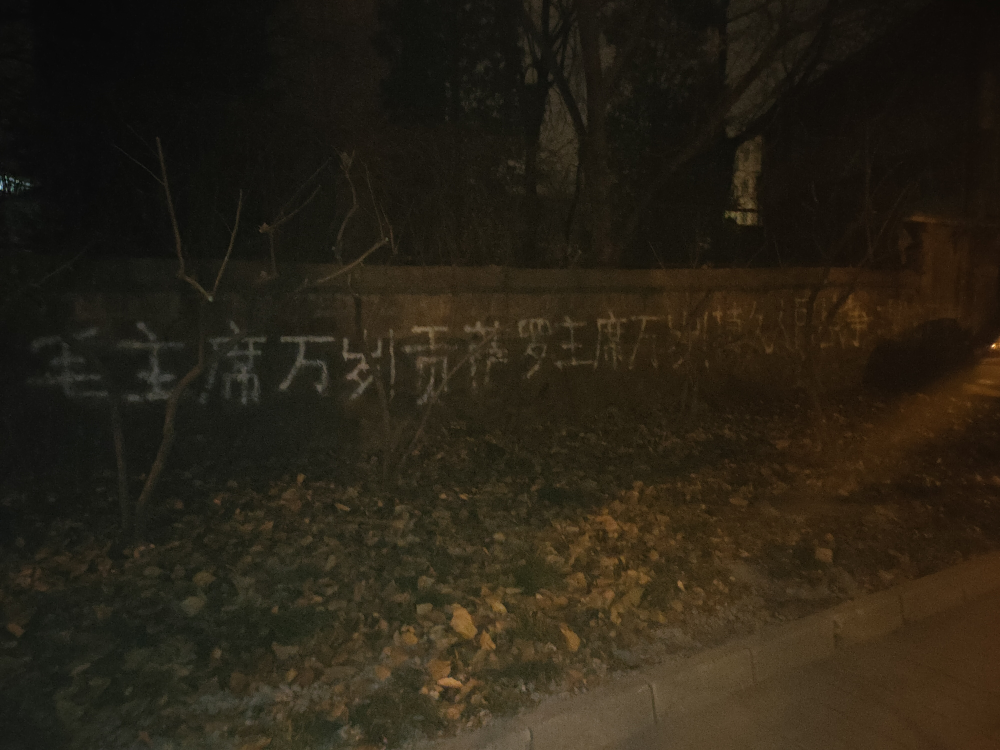
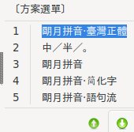

# Prolet
Historical documents (in Chinese) about the GPCR（The great proletarian cultural revolution） (Thanks Comrade RC)

### 目前TXT文件数量已经使README.md文件超越了GitHub的显示大小限制，因此A类目之外的TXT文件暂不列表。

# **[ProletRevDicta/Prolet直链下载网站](https://hubred-rev.github.io/index.htm)**

# **伟大的领袖和导师贡萨罗主席永垂不朽！**

# 以阶级斗争为纲，纲举目张，继续革命！

**《反擊》1976.05：https://mega.nz/file/eTxxAA6a#UHQGj-0WRWK0ANYd4tJycZJQB-9OBw0hYr736_avwq4**

**惠赠资料者原創旋律《反擊》組曲：https://mega.nz/folder/WeI3lCbA#KHFSs0RgCFGOSbSVyZI6yg**

[反击 开头部分影片流出.flv](J%20%E5%BB%BA%E5%9B%BD%E5%90%8E%E5%8F%8A%E6%96%87%E9%9D%A9%E6%9C%9F%E9%97%B4%E7%94%B5%E5%BD%B1%E9%9F%B3%E4%B9%90%E5%89%A7%E6%9C%AC/%E5%8F%8D%E5%87%BB%20%E5%BC%80%E5%A4%B4%E9%83%A8%E5%88%86%E5%BD%B1%E7%89%87%E6%B5%81%E5%87%BA.flv)

[反击 剧照](J%20%E5%BB%BA%E5%9B%BD%E5%90%8E%E5%8F%8A%E6%96%87%E9%9D%A9%E6%9C%9F%E9%97%B4%E7%94%B5%E5%BD%B1%E9%9F%B3%E4%B9%90%E5%89%A7%E6%9C%AC/%E5%8F%8D%E5%87%BB%20%E5%89%A7%E7%85%A7)

# Repo.惠赠资料者刋物——永不停更：https://mega.nz/folder/rWRHWIoC#6qCHgyh3DLwXpEJ9O54cfA https://mastodon.online/@NKRao

## Repo.原始圖片數據備份：

## https://gitlab.com/ProletRevDictas/Prolet-fully-unarchived

## https://mega.nz/folder/SfQxFa6R#FAKMZl3Jbn5ziieqxOYC1g

## https://github.com/ProletRevDicta/Prolet/tree/96fbf76ef3de00aae26e035245ac84d48ee34db4

**网版“毛澤東全集”全52卷，较不全，部分文稿有严重删节，仅供研究参照，7.84GB：https://mega.nz/folder/6CwjTIib#wlYLoZLFfmazXNVtKYwiPg**

网传“张春桥狱中家书”，部分较可信，部分可能有变造甚至伪造 https://bannedthought.net/China/Individuals/index.htm#ZhangChunqiao)

【湖北"揭批查"】夏邦银、朱鸿霞、胡厚民等人的"罪证材料"，"夏朱胡专案组"，1977年4月. RC 【供参考】
https://mega.nz/file/TsBR3SJS#m9S851K7sW5ZOpuHqIad2KT-0Ungwef1aLIoz9d9W2E

除了毛主席1973年12月指示外，我们从文革时期材料、“揭批查”材料和之后的其他书籍中查到的毛主席指示将在《* Some of Chairman Mao ‘s Instructions 毛主席1975-1976年部分指示补遗【待修改】.txt》中更新，我们将不重复摘录已经在流行的静火版《毛选6-7卷》和《年谱》《建国以来文稿》《建国以来军事文稿》等中已有的材料。各省“揭批查”的材料正在整理中。

关于毛主席的著作，还可以查阅水陆洲同志编选的《无产阶级文化大革命资料汇编》，参照资产阶级材料如宋永毅《中国文化大革命文库》（注意鉴别）。此外，可以参看资产阶级编选的几种《批注》《手书》和专题文集。

————某惠赠资料者注————

**“面對馬克思、列寧、毛澤東主義作為無產階級的科學思想在sina特別是青年中的興起，sino社帝在絕望中審查了有關這個問題的信息和討論小組。”——https://anovademocracia.com.br/noticias/16163-pichacoes-na-china-viva-o-presidente-mao-viva-o-presidente-gonzalo**

**“毛澤東主義者在sina的日益活躍應該受到全世界革命者的歡迎。資本主義復辟以來，sino社會束棒正甫殘酷鎮壓一切共產主義組織。sino毛主義在這些困難條件下的行動和組織，顯示了佢們的勇敢，應該成為高舉毛主義旗幟、為革命而戰的一種鼓舞。”——
https://tribuneofthepeople.news/2021/07/16/china-long-live-chairman-mao-long-live-chairman-gonzalo-graffiti-seen-in-northeast/
https://newepochnews.wixsite.com/newepochnews/post/china-long-live-chairman-mao-long-live-chairman-gonzalo-graffiti-seen-in-northeast**

**“此時，Dem Volke Dienen們想出版一幅sino畫，它出現在sina東北一家工廠附近的建黨100週年紀念月。這幅畫說：‘毛主席萬歲！贡萨罗主席萬歲！’”——https://www.demvolkedienen.org/index.php/de/40-nachrichten/asien/5581-china-malung-zum-100-jahrestag-der-gruendung-der-kommunistischen-partei-chinas**

**“sino進步分子需要積極學習和加深對馬克思、列宁、毛澤東主義，主要是毛澤東主義以及贡萨罗主席的普遍有效貢獻的理解。”——https://tribuneofthepeople.news/2021/08/02/communist-international-the-campaign-for-the-defense-of-chairman-gonzalo-deepens-and-broadens/**

**註：圖一是在NorthEastern，圖二是在Tsinghua Southern Road。**

參考資料：

MEBK電子書計劃涉及的電子書的MD5列表如下：

**ML之聲EBOOK TXT數據：https://mega.nz/folder/raAFma5R#BeD2qTjxwol47G6jrzdPmQ**

**ML之聲EBOOK 800G數據：https://mega.nz/folder/Tb5yTLza#HdahKp3RTVVX3GBTcRTJNw**

GNU/Linux Rime、M$Android Trime使用臺灣正體的方法：

M$Android Time請將放入Root/storage/emulated/0/rime。點擊Trime app圖標，再點擊「部署」。使用輸入法，在輸入法彈出後卡噸等待一段時間即部署完成。便可以點擊「標準字」、「傳承字」來切換臺灣正體和北洋繁體。

GNU/Linux Rime請將、、放入/home/a/.config/ibus/rime或fcitx其配置路徑。點擊切換輸入法的菜單，點擊「部署」，在使用輸入法時按下F4切換為「朙月拼音·臺灣正體」即可。

————————

本库01/12日受赠的《金CR简史》有一些错讹和不完全不准确的地方，但是其中金日成之流活动记事，对揭露金日成资反路线的面目，无疑是很有益的，也可供参考。
惠赠资料者作的声明:【有關修╳TV、P×PER和修╳宇、林╳背叛geming的材料，以及本庫中文本的PDF版本。

**供廣大工農兵、革命幹部、革命知識分子重命名、整理、收集、轉發、批判。**

## 文革历史资料。

### 在GitHub上怎样修改别人的库？（GNU/Linux）

# GitHub需要有repo权限的Token作为push密码。

官方教程：https://docs.github.com/en/authentication/keeping-your-account-and-data-secure/creating-a-personal-access-token

1.Fork（右上角）

2.在你跳转到的Fork库Clone（下载下来，右上角下边的绿按钮）

3.cd \<此库下载到的文件夹路径\>

4.git checkout -f HEAD

（如果Clone的不是Fork库，而是主库，是不能发出上传请求的，因为那是别的用户的库）

即命令：git clone \<复制的git文件链接\>

修改此文件夹里的内容

cd 此库下载到的文件夹路径

git add .

git commit -m '\<describe text\>'

git push

当然，你的帐号在浏览器里要在线，最后一条命令执行完后，会弹出要不要Pull Request。

如果你的Pull Request还没被接受，你可以在不上浏览器的同时来上传。

### 在GitHub上怎样修改别人的库？（网页版方式）

1.点击右上角的fork；

2.在自己fork内的库点击下面第三个按钮pull requests；

3.点击右下方的new pull requests；

4.撰写标题后提交，待主库所有者同意后即修改成功。

### 2021/01/20 update

上传一批文件。  
1958-1976年的大部分《红旗》杂志，共44本。  

红旗58.1-7.pdf  
红旗58.8-14.pdf  
红旗59.1-8.pdf  
红旗59.17-24.pdf  
红旗59.9-16.pdf  
红旗60.1-8.pdf  
红旗60.17-24.pdf  
红旗60.9-16.pdf  
红旗61.1-8.pdf  
红旗61.17-24.pdf  
红旗61.9-16.pdf  
红旗62.1-7.pdf  
红旗62.15-21.pdf  
红旗62.8-14.pdf  
红旗63.1-8.pdf  
红旗63.17-24.pdf  
红旗63.9-16.pdf  
红旗64.1-8.pdf  
红旗64.17-24.pdf  
红旗64.9-16.pdf  
红旗64.z1-2.pdf  
红旗65.1-7.pdf  
红旗65.8-13.pdf  
红旗66.1-8.pdf  
红旗66.9-15.pdf  
红旗67.1-8.pdf  
红旗67.9-16.pdf  
红旗68.1-5.pdf  
红旗69.1-7.pdf  
红旗69.8-12.pdf  
红旗70.1-6.pdf  
红旗70.7-12.pdf  
红旗71.1-6.pdf  
红旗71.7-13.pdf  
红旗72.1-6.pdf  
红旗72.7-12.pdf  
红旗73.1-6.pdf  
红旗73.7-12.pdf  
红旗74.1-6.pdf  
红旗74.7-12.pdf  
红旗75.1-6.pdf  
红旗75.7-12.pdf  
红旗76.1-6.pdf  
红旗76.7-12.pdf  

### 2021/01/19 update

上传三本《社会主义政治经济学》

社会主义政治经济学1972年版  
社会主义政治经济学1973年版  
社会主义政治经济学1975年版

上传了湖南哲学社会科学研究所图书资料组从北京、辽宁等地理论讨论会以及报刊文章中编选的理论问题资料《关于资产阶级#就在共产党内的问题》

目录将适时更新。

---

【湖北"揭批查"】夏邦银、朱鸿霞、胡厚民等人的"罪证材料"，"夏朱胡专案组"，1977年4月. RC 【供参考】
https://mega.nz/file/TsBR3SJS#m9S851K7sW5ZOpuHqIad2KT-0Ungwef1aLIoz9d9W2E

生成TXT的源数据、以及此库内容已经备份到：[文革资料扫描成果（百度大脑）](https://mega.nz/folder/BAF1QKYT#sK5uqACKO9jw1dGCKVaXMw)

TXT格式的书籍是PDF中不含可复制的文字信息的书籍

由于文件过大（已扫描为TXT）

链接发布与下方：

[(On Bourgeois Recht)论资产阶级法权.pdf](https://mega.nz/file/4M4DGZ6K#mW5YLapLyYDyl5qpoD_vFKDY0YyQI8uTUiofGHO3JNE)

[(Thoroughly criticize the reactionary theory of the omnipotence of productive forces)彻底批判反动的唯生产力论](https://mega.nz/file/JRpHxAZI#JF_8EbPkyZ8aS47pOuExa9WLTFORo927JHojH6v3wW8)

---

供揭批过去以金日成为首的朝鲜劳动党修正主义参考的《金日成著作选集》1-5,7的目录页，配合备份库中的《金日成著作集》即可翻阅(Selected Works of Kim Il Sung)

在链接内BOOKS目录下的——[金日成著作选集 1-8 索引.7z](https://mega.nz/file/lYcXyYBJ#oR2Ov3IL6vQb07dzD23nWAyR1XhbVu1CgXJjoJtJeTA)【仅供参考】

---
为了方便搜索引擎收录，现将文件名列于下方：

| TXT文件 | PDF文件 |
| ------- | ------- |
| [(On Bourgeois Recht)论资产阶级法权](A%20%E3%80%8A%E7%A4%BE%E4%BC%9A%E4%B8%BB%E4%B9%89%E6%94%BF%E6%B2%BB%E7%BB%8F%E6%B5%8E%E5%AD%A6%E3%80%8B%E4%B8%8E%E3%80%8A%E7%A4%BE%E4%BC%9A%E4%B8%BB%E4%B9%89%E6%97%B6%E6%9C%9F%E7%9A%84%E5%85%9A%E5%86%85%E8%B5%84%E4%BA%A7%E9%98%B6%E7%BA%A7%E3%80%8B/%28On%20Bourgeois%20Recht%29%E8%AE%BA%E8%B5%84%E4%BA%A7%E9%98%B6%E7%BA%A7%E6%B3%95%E6%9D%83.txt) | 暂无 |
| [(On the Inner-Party Bourgeoisie)论党内资产阶级-江苏人民出版社](A%20%E3%80%8A%E7%A4%BE%E4%BC%9A%E4%B8%BB%E4%B9%89%E6%94%BF%E6%B2%BB%E7%BB%8F%E6%B5%8E%E5%AD%A6%E3%80%8B%E4%B8%8E%E3%80%8A%E7%A4%BE%E4%BC%9A%E4%B8%BB%E4%B9%89%E6%97%B6%E6%9C%9F%E7%9A%84%E5%85%9A%E5%86%85%E8%B5%84%E4%BA%A7%E9%98%B6%E7%BA%A7%E3%80%8B/%28On%20the%20Inner-Party%20Bourgeoisie%29%E8%AE%BA%E5%85%9A%E5%86%85%E8%B5%84%E4%BA%A7%E9%98%B6%E7%BA%A7-%E6%B1%9F%E8%8B%8F%E4%BA%BA%E6%B0%91%E5%87%BA%E7%89%88%E7%A4%BE.txt) | [PDF](A%20%E3%80%8A%E7%A4%BE%E4%BC%9A%E4%B8%BB%E4%B9%89%E6%94%BF%E6%B2%BB%E7%BB%8F%E6%B5%8E%E5%AD%A6%E3%80%8B%E4%B8%8E%E3%80%8A%E7%A4%BE%E4%BC%9A%E4%B8%BB%E4%B9%89%E6%97%B6%E6%9C%9F%E7%9A%84%E5%85%9A%E5%86%85%E8%B5%84%E4%BA%A7%E9%98%B6%E7%BA%A7%E3%80%8B/%28On%20the%20Inner-Party%20Bourgeoisie%29%E8%AE%BA%E5%85%9A%E5%86%85%E8%B5%84%E4%BA%A7%E9%98%B6%E7%BA%A7-%E6%B1%9F%E8%8B%8F%E4%BA%BA%E6%B0%91%E5%87%BA%E7%89%88%E7%A4%BE.pdf) |
| [(Thoroughly criticize the reactionary theory of the omnipotence of productive forces)彻底批判反动的唯生产力论](A%20%E5%8F%8D%E5%87%BB%E5%8F%B3%E5%80%BE%E7%BF%BB%E6%A1%88%E9%A3%8E/%28Thoroughly%20criticize%20the%20reactionary%20theory%20of%20the%20omnipotence%20of%20productive%20forces%29%E5%BD%BB%E5%BA%95%E6%89%B9%E5%88%A4%E5%8F%8D%E5%8A%A8%E7%9A%84%E5%94%AF%E7%94%9F%E4%BA%A7%E5%8A%9B%E8%AE%BA.txt) | 暂无 |
| [(重要)金日成论资产阶级法权](A%20%E9%A9%AC%E5%88%97%E6%AF%9B%E4%B8%BB%E4%B9%89%E6%89%B9%E5%88%A4%E6%9C%9D%E8%B6%8A%E5%8F%A4%E8%80%81%E6%9F%AC%E9%98%BF%E4%BF%AE%E6%AD%A3%E4%B8%BB%E4%B9%89/%28%E9%87%8D%E8%A6%81%29%E9%87%91%E6%97%A5%E6%88%90%E8%AE%BA%E8%B5%84%E4%BA%A7%E9%98%B6%E7%BA%A7%E6%B3%95%E6%9D%83.txt) | [PDF](A%20%E9%A9%AC%E5%88%97%E6%AF%9B%E4%B8%BB%E4%B9%89%E6%89%B9%E5%88%A4%E6%9C%9D%E8%B6%8A%E5%8F%A4%E8%80%81%E6%9F%AC%E9%98%BF%E4%BF%AE%E6%AD%A3%E4%B8%BB%E4%B9%89/%28%E9%87%8D%E8%A6%81%29%E9%87%91%E6%97%A5%E6%88%90%E8%AE%BA%E8%B5%84%E4%BA%A7%E9%98%B6%E7%BA%A7%E6%B3%95%E6%9D%83.pdf) |
| [* Some of Chairman Mao ‘s Instructions 毛主席1975-1976年部分指示补遗【待修改】](A4%20%E6%AF%9B%E6%B3%BD%E4%B8%9C%E4%B8%BB%E5%B8%AD/%2A%20Some%20of%20Chairman%20Mao%20%E2%80%98s%20Instructions%20%E6%AF%9B%E4%B8%BB%E5%B8%AD1975-1976%E5%B9%B4%E9%83%A8%E5%88%86%E6%8C%87%E7%A4%BA%E8%A1%A5%E9%81%97%E3%80%90%E5%BE%85%E4%BF%AE%E6%94%B9%E3%80%91.txt) | 暂无 |
| [00告读者](A3%20%E6%96%B0%E7%BC%96%E6%96%AF%E5%A4%A7%E6%9E%97%E5%85%A8%E9%9B%86%E5%8F%8A%E6%A1%A3%E6%A1%88%E9%99%84%E5%8D%B7%EF%BC%88%E7%AE%80%E4%BD%93%E6%A8%AA%E6%8E%92%E6%9C%AC%EF%BC%8C%E8%AF%B8%E5%A4%8F%E6%80%80%E6%96%AF%E7%A4%BE%E7%BC%96%EF%BC%89/00%E5%91%8A%E8%AF%BB%E8%80%85.txt) | 暂无 |
| [00总目录](A3%20%E6%96%B0%E7%BC%96%E6%96%AF%E5%A4%A7%E6%9E%97%E5%85%A8%E9%9B%86%E5%8F%8A%E6%A1%A3%E6%A1%88%E9%99%84%E5%8D%B7%EF%BC%88%E7%AE%80%E4%BD%93%E6%A8%AA%E6%8E%92%E6%9C%AC%EF%BC%8C%E8%AF%B8%E5%A4%8F%E6%80%80%E6%96%AF%E7%A4%BE%E7%BC%96%EF%BC%89/00%E6%80%BB%E7%9B%AE%E5%BD%95.txt) | 暂无 |
| [01新编《斯大林全集》第一卷（1901—1907）](A3%20%E6%96%B0%E7%BC%96%E6%96%AF%E5%A4%A7%E6%9E%97%E5%85%A8%E9%9B%86%E5%8F%8A%E6%A1%A3%E6%A1%88%E9%99%84%E5%8D%B7%EF%BC%88%E7%AE%80%E4%BD%93%E6%A8%AA%E6%8E%92%E6%9C%AC%EF%BC%8C%E8%AF%B8%E5%A4%8F%E6%80%80%E6%96%AF%E7%A4%BE%E7%BC%96%EF%BC%89/01%E6%96%B0%E7%BC%96%E3%80%8A%E6%96%AF%E5%A4%A7%E6%9E%97%E5%85%A8%E9%9B%86%E3%80%8B%E7%AC%AC%E4%B8%80%E5%8D%B7%EF%BC%881901%E2%80%941907%EF%BC%89.txt) | 暂无 |
| [02新编《斯大林全集》第二卷（1907—1913）](A3%20%E6%96%B0%E7%BC%96%E6%96%AF%E5%A4%A7%E6%9E%97%E5%85%A8%E9%9B%86%E5%8F%8A%E6%A1%A3%E6%A1%88%E9%99%84%E5%8D%B7%EF%BC%88%E7%AE%80%E4%BD%93%E6%A8%AA%E6%8E%92%E6%9C%AC%EF%BC%8C%E8%AF%B8%E5%A4%8F%E6%80%80%E6%96%AF%E7%A4%BE%E7%BC%96%EF%BC%89/02%E6%96%B0%E7%BC%96%E3%80%8A%E6%96%AF%E5%A4%A7%E6%9E%97%E5%85%A8%E9%9B%86%E3%80%8B%E7%AC%AC%E4%BA%8C%E5%8D%B7%EF%BC%881907%E2%80%941913%EF%BC%89.txt) | 暂无 |
| [03新编《斯大林全集》第三卷（1917.3-10）](A3%20%E6%96%B0%E7%BC%96%E6%96%AF%E5%A4%A7%E6%9E%97%E5%85%A8%E9%9B%86%E5%8F%8A%E6%A1%A3%E6%A1%88%E9%99%84%E5%8D%B7%EF%BC%88%E7%AE%80%E4%BD%93%E6%A8%AA%E6%8E%92%E6%9C%AC%EF%BC%8C%E8%AF%B8%E5%A4%8F%E6%80%80%E6%96%AF%E7%A4%BE%E7%BC%96%EF%BC%89/03%E6%96%B0%E7%BC%96%E3%80%8A%E6%96%AF%E5%A4%A7%E6%9E%97%E5%85%A8%E9%9B%86%E3%80%8B%E7%AC%AC%E4%B8%89%E5%8D%B7%EF%BC%881917.3-10%EF%BC%89.txt) | 暂无 |
| [04新编《斯大林全集》第四卷（1917.11—1920）](A3%20%E6%96%B0%E7%BC%96%E6%96%AF%E5%A4%A7%E6%9E%97%E5%85%A8%E9%9B%86%E5%8F%8A%E6%A1%A3%E6%A1%88%E9%99%84%E5%8D%B7%EF%BC%88%E7%AE%80%E4%BD%93%E6%A8%AA%E6%8E%92%E6%9C%AC%EF%BC%8C%E8%AF%B8%E5%A4%8F%E6%80%80%E6%96%AF%E7%A4%BE%E7%BC%96%EF%BC%89/04%E6%96%B0%E7%BC%96%E3%80%8A%E6%96%AF%E5%A4%A7%E6%9E%97%E5%85%A8%E9%9B%86%E3%80%8B%E7%AC%AC%E5%9B%9B%E5%8D%B7%EF%BC%881917.11%E2%80%941920%EF%BC%89.txt) | 暂无 |
| [05新编《斯大林全集》第五卷（1921—1923）](A3%20%E6%96%B0%E7%BC%96%E6%96%AF%E5%A4%A7%E6%9E%97%E5%85%A8%E9%9B%86%E5%8F%8A%E6%A1%A3%E6%A1%88%E9%99%84%E5%8D%B7%EF%BC%88%E7%AE%80%E4%BD%93%E6%A8%AA%E6%8E%92%E6%9C%AC%EF%BC%8C%E8%AF%B8%E5%A4%8F%E6%80%80%E6%96%AF%E7%A4%BE%E7%BC%96%EF%BC%89/05%E6%96%B0%E7%BC%96%E3%80%8A%E6%96%AF%E5%A4%A7%E6%9E%97%E5%85%A8%E9%9B%86%E3%80%8B%E7%AC%AC%E4%BA%94%E5%8D%B7%EF%BC%881921%E2%80%941923%EF%BC%89.txt) | 暂无 |
| [06新编《斯大林全集》第六卷（1924）](A3%20%E6%96%B0%E7%BC%96%E6%96%AF%E5%A4%A7%E6%9E%97%E5%85%A8%E9%9B%86%E5%8F%8A%E6%A1%A3%E6%A1%88%E9%99%84%E5%8D%B7%EF%BC%88%E7%AE%80%E4%BD%93%E6%A8%AA%E6%8E%92%E6%9C%AC%EF%BC%8C%E8%AF%B8%E5%A4%8F%E6%80%80%E6%96%AF%E7%A4%BE%E7%BC%96%EF%BC%89/06%E6%96%B0%E7%BC%96%E3%80%8A%E6%96%AF%E5%A4%A7%E6%9E%97%E5%85%A8%E9%9B%86%E3%80%8B%E7%AC%AC%E5%85%AD%E5%8D%B7%EF%BC%881924%EF%BC%89.txt) | 暂无 |
| [07新编《斯大林全集》第七卷（1925）](A3%20%E6%96%B0%E7%BC%96%E6%96%AF%E5%A4%A7%E6%9E%97%E5%85%A8%E9%9B%86%E5%8F%8A%E6%A1%A3%E6%A1%88%E9%99%84%E5%8D%B7%EF%BC%88%E7%AE%80%E4%BD%93%E6%A8%AA%E6%8E%92%E6%9C%AC%EF%BC%8C%E8%AF%B8%E5%A4%8F%E6%80%80%E6%96%AF%E7%A4%BE%E7%BC%96%EF%BC%89/07%E6%96%B0%E7%BC%96%E3%80%8A%E6%96%AF%E5%A4%A7%E6%9E%97%E5%85%A8%E9%9B%86%E3%80%8B%E7%AC%AC%E4%B8%83%E5%8D%B7%EF%BC%881925%EF%BC%89.txt) | 暂无 |
| [08新编《斯大林全集》第八卷（1926.1-11)](A3%20%E6%96%B0%E7%BC%96%E6%96%AF%E5%A4%A7%E6%9E%97%E5%85%A8%E9%9B%86%E5%8F%8A%E6%A1%A3%E6%A1%88%E9%99%84%E5%8D%B7%EF%BC%88%E7%AE%80%E4%BD%93%E6%A8%AA%E6%8E%92%E6%9C%AC%EF%BC%8C%E8%AF%B8%E5%A4%8F%E6%80%80%E6%96%AF%E7%A4%BE%E7%BC%96%EF%BC%89/08%E6%96%B0%E7%BC%96%E3%80%8A%E6%96%AF%E5%A4%A7%E6%9E%97%E5%85%A8%E9%9B%86%E3%80%8B%E7%AC%AC%E5%85%AB%E5%8D%B7%EF%BC%881926.1-11%29.txt) | 暂无 |
| [09新编《斯大林全集》第九卷（1926.12—1927.7）](A3%20%E6%96%B0%E7%BC%96%E6%96%AF%E5%A4%A7%E6%9E%97%E5%85%A8%E9%9B%86%E5%8F%8A%E6%A1%A3%E6%A1%88%E9%99%84%E5%8D%B7%EF%BC%88%E7%AE%80%E4%BD%93%E6%A8%AA%E6%8E%92%E6%9C%AC%EF%BC%8C%E8%AF%B8%E5%A4%8F%E6%80%80%E6%96%AF%E7%A4%BE%E7%BC%96%EF%BC%89/09%E6%96%B0%E7%BC%96%E3%80%8A%E6%96%AF%E5%A4%A7%E6%9E%97%E5%85%A8%E9%9B%86%E3%80%8B%E7%AC%AC%E4%B9%9D%E5%8D%B7%EF%BC%881926.12%E2%80%941927.7%EF%BC%89.txt) | 暂无 |
| [10新编《斯大林全集》第十卷（1927.8-12）](A3%20%E6%96%B0%E7%BC%96%E6%96%AF%E5%A4%A7%E6%9E%97%E5%85%A8%E9%9B%86%E5%8F%8A%E6%A1%A3%E6%A1%88%E9%99%84%E5%8D%B7%EF%BC%88%E7%AE%80%E4%BD%93%E6%A8%AA%E6%8E%92%E6%9C%AC%EF%BC%8C%E8%AF%B8%E5%A4%8F%E6%80%80%E6%96%AF%E7%A4%BE%E7%BC%96%EF%BC%89/10%E6%96%B0%E7%BC%96%E3%80%8A%E6%96%AF%E5%A4%A7%E6%9E%97%E5%85%A8%E9%9B%86%E3%80%8B%E7%AC%AC%E5%8D%81%E5%8D%B7%EF%BC%881927.8-12%EF%BC%89.txt) | 暂无 |
| [11新编《斯大林全集》第十一卷（1928—1929.3）](A3%20%E6%96%B0%E7%BC%96%E6%96%AF%E5%A4%A7%E6%9E%97%E5%85%A8%E9%9B%86%E5%8F%8A%E6%A1%A3%E6%A1%88%E9%99%84%E5%8D%B7%EF%BC%88%E7%AE%80%E4%BD%93%E6%A8%AA%E6%8E%92%E6%9C%AC%EF%BC%8C%E8%AF%B8%E5%A4%8F%E6%80%80%E6%96%AF%E7%A4%BE%E7%BC%96%EF%BC%89/11%E6%96%B0%E7%BC%96%E3%80%8A%E6%96%AF%E5%A4%A7%E6%9E%97%E5%85%A8%E9%9B%86%E3%80%8B%E7%AC%AC%E5%8D%81%E4%B8%80%E5%8D%B7%EF%BC%881928%E2%80%941929.3%EF%BC%89.txt) | 暂无 |
| [12新编《斯大林全集》第十二卷（1929.4—1930.6）](A3%20%E6%96%B0%E7%BC%96%E6%96%AF%E5%A4%A7%E6%9E%97%E5%85%A8%E9%9B%86%E5%8F%8A%E6%A1%A3%E6%A1%88%E9%99%84%E5%8D%B7%EF%BC%88%E7%AE%80%E4%BD%93%E6%A8%AA%E6%8E%92%E6%9C%AC%EF%BC%8C%E8%AF%B8%E5%A4%8F%E6%80%80%E6%96%AF%E7%A4%BE%E7%BC%96%EF%BC%89/12%E6%96%B0%E7%BC%96%E3%80%8A%E6%96%AF%E5%A4%A7%E6%9E%97%E5%85%A8%E9%9B%86%E3%80%8B%E7%AC%AC%E5%8D%81%E4%BA%8C%E5%8D%B7%EF%BC%881929.4%E2%80%941930.6%EF%BC%89.txt) | 暂无 |
| [13新编《斯大林全集》第十三卷（1930.7—1934.1）](A3%20%E6%96%B0%E7%BC%96%E6%96%AF%E5%A4%A7%E6%9E%97%E5%85%A8%E9%9B%86%E5%8F%8A%E6%A1%A3%E6%A1%88%E9%99%84%E5%8D%B7%EF%BC%88%E7%AE%80%E4%BD%93%E6%A8%AA%E6%8E%92%E6%9C%AC%EF%BC%8C%E8%AF%B8%E5%A4%8F%E6%80%80%E6%96%AF%E7%A4%BE%E7%BC%96%EF%BC%89/13%E6%96%B0%E7%BC%96%E3%80%8A%E6%96%AF%E5%A4%A7%E6%9E%97%E5%85%A8%E9%9B%86%E3%80%8B%E7%AC%AC%E5%8D%81%E4%B8%89%E5%8D%B7%EF%BC%881930.7%E2%80%941934.1%EF%BC%89.txt) | 暂无 |
| [14新编《斯大林全集》第十四卷（1934—1940）](A3%20%E6%96%B0%E7%BC%96%E6%96%AF%E5%A4%A7%E6%9E%97%E5%85%A8%E9%9B%86%E5%8F%8A%E6%A1%A3%E6%A1%88%E9%99%84%E5%8D%B7%EF%BC%88%E7%AE%80%E4%BD%93%E6%A8%AA%E6%8E%92%E6%9C%AC%EF%BC%8C%E8%AF%B8%E5%A4%8F%E6%80%80%E6%96%AF%E7%A4%BE%E7%BC%96%EF%BC%89/14%E6%96%B0%E7%BC%96%E3%80%8A%E6%96%AF%E5%A4%A7%E6%9E%97%E5%85%A8%E9%9B%86%E3%80%8B%E7%AC%AC%E5%8D%81%E5%9B%9B%E5%8D%B7%EF%BC%881934%E2%80%941940%EF%BC%89.txt) | 暂无 |
| [15新编《斯大林全集》第十五卷（1938）](A3%20%E6%96%B0%E7%BC%96%E6%96%AF%E5%A4%A7%E6%9E%97%E5%85%A8%E9%9B%86%E5%8F%8A%E6%A1%A3%E6%A1%88%E9%99%84%E5%8D%B7%EF%BC%88%E7%AE%80%E4%BD%93%E6%A8%AA%E6%8E%92%E6%9C%AC%EF%BC%8C%E8%AF%B8%E5%A4%8F%E6%80%80%E6%96%AF%E7%A4%BE%E7%BC%96%EF%BC%89/15%E6%96%B0%E7%BC%96%E3%80%8A%E6%96%AF%E5%A4%A7%E6%9E%97%E5%85%A8%E9%9B%86%E3%80%8B%E7%AC%AC%E5%8D%81%E4%BA%94%E5%8D%B7%EF%BC%881938%EF%BC%89.txt) | 暂无 |
| [16新编《斯大林全集》第十六卷（1941—1945）](A3%20%E6%96%B0%E7%BC%96%E6%96%AF%E5%A4%A7%E6%9E%97%E5%85%A8%E9%9B%86%E5%8F%8A%E6%A1%A3%E6%A1%88%E9%99%84%E5%8D%B7%EF%BC%88%E7%AE%80%E4%BD%93%E6%A8%AA%E6%8E%92%E6%9C%AC%EF%BC%8C%E8%AF%B8%E5%A4%8F%E6%80%80%E6%96%AF%E7%A4%BE%E7%BC%96%EF%BC%89/16%E6%96%B0%E7%BC%96%E3%80%8A%E6%96%AF%E5%A4%A7%E6%9E%97%E5%85%A8%E9%9B%86%E3%80%8B%E7%AC%AC%E5%8D%81%E5%85%AD%E5%8D%B7%EF%BC%881941%E2%80%941945%EF%BC%89.txt) | 暂无 |
| [17新编《斯大林全集》第十七卷（1941—1945）](A3%20%E6%96%B0%E7%BC%96%E6%96%AF%E5%A4%A7%E6%9E%97%E5%85%A8%E9%9B%86%E5%8F%8A%E6%A1%A3%E6%A1%88%E9%99%84%E5%8D%B7%EF%BC%88%E7%AE%80%E4%BD%93%E6%A8%AA%E6%8E%92%E6%9C%AC%EF%BC%8C%E8%AF%B8%E5%A4%8F%E6%80%80%E6%96%AF%E7%A4%BE%E7%BC%96%EF%BC%89/17%E6%96%B0%E7%BC%96%E3%80%8A%E6%96%AF%E5%A4%A7%E6%9E%97%E5%85%A8%E9%9B%86%E3%80%8B%E7%AC%AC%E5%8D%81%E4%B8%83%E5%8D%B7%EF%BC%881941%E2%80%941945%EF%BC%89.txt) | 暂无 |
| [18新编《斯大林全集》第十八卷（1941—1945）](A3%20%E6%96%B0%E7%BC%96%E6%96%AF%E5%A4%A7%E6%9E%97%E5%85%A8%E9%9B%86%E5%8F%8A%E6%A1%A3%E6%A1%88%E9%99%84%E5%8D%B7%EF%BC%88%E7%AE%80%E4%BD%93%E6%A8%AA%E6%8E%92%E6%9C%AC%EF%BC%8C%E8%AF%B8%E5%A4%8F%E6%80%80%E6%96%AF%E7%A4%BE%E7%BC%96%EF%BC%89/18%E6%96%B0%E7%BC%96%E3%80%8A%E6%96%AF%E5%A4%A7%E6%9E%97%E5%85%A8%E9%9B%86%E3%80%8B%E7%AC%AC%E5%8D%81%E5%85%AB%E5%8D%B7%EF%BC%881941%E2%80%941945%EF%BC%89.txt) | 暂无 |
| [1958-1962年围绕资产阶级法权问题论战的部分文章汇集 辽宁省革命委员会宣传组1973](A%20%E3%80%8A%E7%A4%BE%E4%BC%9A%E4%B8%BB%E4%B9%89%E6%94%BF%E6%B2%BB%E7%BB%8F%E6%B5%8E%E5%AD%A6%E3%80%8B%E4%B8%8E%E3%80%8A%E7%A4%BE%E4%BC%9A%E4%B8%BB%E4%B9%89%E6%97%B6%E6%9C%9F%E7%9A%84%E5%85%9A%E5%86%85%E8%B5%84%E4%BA%A7%E9%98%B6%E7%BA%A7%E3%80%8B/1958-1962%E5%B9%B4%E5%9B%B4%E7%BB%95%E8%B5%84%E4%BA%A7%E9%98%B6%E7%BA%A7%E6%B3%95%E6%9D%83%E9%97%AE%E9%A2%98%E8%AE%BA%E6%88%98%E7%9A%84%E9%83%A8%E5%88%86%E6%96%87%E7%AB%A0%E6%B1%87%E9%9B%86%20%E8%BE%BD%E5%AE%81%E7%9C%81%E9%9D%A9%E5%91%BD%E5%A7%94%E5%91%98%E4%BC%9A%E5%AE%A3%E4%BC%A0%E7%BB%841973.txt) | [PDF](A%20%E3%80%8A%E7%A4%BE%E4%BC%9A%E4%B8%BB%E4%B9%89%E6%94%BF%E6%B2%BB%E7%BB%8F%E6%B5%8E%E5%AD%A6%E3%80%8B%E4%B8%8E%E3%80%8A%E7%A4%BE%E4%BC%9A%E4%B8%BB%E4%B9%89%E6%97%B6%E6%9C%9F%E7%9A%84%E5%85%9A%E5%86%85%E8%B5%84%E4%BA%A7%E9%98%B6%E7%BA%A7%E3%80%8B/1958-1962%E5%B9%B4%E5%9B%B4%E7%BB%95%E8%B5%84%E4%BA%A7%E9%98%B6%E7%BA%A7%E6%B3%95%E6%9D%83%E9%97%AE%E9%A2%98%E8%AE%BA%E6%88%98%E7%9A%84%E9%83%A8%E5%88%86%E6%96%87%E7%AB%A0%E6%B1%87%E9%9B%86%20%E8%BE%BD%E5%AE%81%E7%9C%81%E9%9D%A9%E5%91%BD%E5%A7%94%E5%91%98%E4%BC%9A%E5%AE%A3%E4%BC%A0%E7%BB%841973.pdf) |
| [1971年11月20日毛主席接见参加武汉地区座谈会的曾思玉、王六生时的讲话](A4%20%E6%AF%9B%E6%B3%BD%E4%B8%9C%E4%B8%BB%E5%B8%AD/1971%E5%B9%B411%E6%9C%8820%E6%97%A5%E6%AF%9B%E4%B8%BB%E5%B8%AD%E6%8E%A5%E8%A7%81%E5%8F%82%E5%8A%A0%E6%AD%A6%E6%B1%89%E5%9C%B0%E5%8C%BA%E5%BA%A7%E8%B0%88%E4%BC%9A%E7%9A%84%E6%9B%BE%E6%80%9D%E7%8E%89%E3%80%81%E7%8E%8B%E5%85%AD%E7%94%9F%E6%97%B6%E7%9A%84%E8%AE%B2%E8%AF%9D.txt) | 暂无 |
| [1975年2月1日中央领导同志(周,张春桥,邓)在国务院部委干部会议上讲话 湖北黄冈版](A4%20%E6%AF%9B%E6%B3%BD%E4%B8%9C%E4%B8%BB%E5%B8%AD/1975%E5%B9%B42%E6%9C%881%E6%97%A5%E4%B8%AD%E5%A4%AE%E9%A2%86%E5%AF%BC%E5%90%8C%E5%BF%97%28%E5%91%A8%2C%E5%BC%A0%E6%98%A5%E6%A1%A5%2C%E9%82%93%29%E5%9C%A8%E5%9B%BD%E5%8A%A1%E9%99%A2%E9%83%A8%E5%A7%94%E5%B9%B2%E9%83%A8%E4%BC%9A%E8%AE%AE%E4%B8%8A%E8%AE%B2%E8%AF%9D%20%E6%B9%96%E5%8C%97%E9%BB%84%E5%86%88%E7%89%88.txt) | 暂无 |
| [19新编《斯大林全集》第十九卷（1943、1945）](A3%20%E6%96%B0%E7%BC%96%E6%96%AF%E5%A4%A7%E6%9E%97%E5%85%A8%E9%9B%86%E5%8F%8A%E6%A1%A3%E6%A1%88%E9%99%84%E5%8D%B7%EF%BC%88%E7%AE%80%E4%BD%93%E6%A8%AA%E6%8E%92%E6%9C%AC%EF%BC%8C%E8%AF%B8%E5%A4%8F%E6%80%80%E6%96%AF%E7%A4%BE%E7%BC%96%EF%BC%89/19%E6%96%B0%E7%BC%96%E3%80%8A%E6%96%AF%E5%A4%A7%E6%9E%97%E5%85%A8%E9%9B%86%E3%80%8B%E7%AC%AC%E5%8D%81%E4%B9%9D%E5%8D%B7%EF%BC%881943%E3%80%811945%EF%BC%89.txt) | 暂无 |
| [20新编《斯大林全集》第二十卷（1946—1953）](A3%20%E6%96%B0%E7%BC%96%E6%96%AF%E5%A4%A7%E6%9E%97%E5%85%A8%E9%9B%86%E5%8F%8A%E6%A1%A3%E6%A1%88%E9%99%84%E5%8D%B7%EF%BC%88%E7%AE%80%E4%BD%93%E6%A8%AA%E6%8E%92%E6%9C%AC%EF%BC%8C%E8%AF%B8%E5%A4%8F%E6%80%80%E6%96%AF%E7%A4%BE%E7%BC%96%EF%BC%89/20%E6%96%B0%E7%BC%96%E3%80%8A%E6%96%AF%E5%A4%A7%E6%9E%97%E5%85%A8%E9%9B%86%E3%80%8B%E7%AC%AC%E4%BA%8C%E5%8D%81%E5%8D%B7%EF%BC%881946%E2%80%941953%EF%BC%89.txt) | 暂无 |
| [21新编《斯大林全集·档案附卷一·生平综合篇》](A3%20%E6%96%B0%E7%BC%96%E6%96%AF%E5%A4%A7%E6%9E%97%E5%85%A8%E9%9B%86%E5%8F%8A%E6%A1%A3%E6%A1%88%E9%99%84%E5%8D%B7%EF%BC%88%E7%AE%80%E4%BD%93%E6%A8%AA%E6%8E%92%E6%9C%AC%EF%BC%8C%E8%AF%B8%E5%A4%8F%E6%80%80%E6%96%AF%E7%A4%BE%E7%BC%96%EF%BC%89/21%E6%96%B0%E7%BC%96%E3%80%8A%E6%96%AF%E5%A4%A7%E6%9E%97%E5%85%A8%E9%9B%86%C2%B7%E6%A1%A3%E6%A1%88%E9%99%84%E5%8D%B7%E4%B8%80%C2%B7%E7%94%9F%E5%B9%B3%E7%BB%BC%E5%90%88%E7%AF%87%E3%80%8B.txt) | 暂无 |
| [22新编《斯大林全集·档案附卷二·中国革命篇》](A3%20%E6%96%B0%E7%BC%96%E6%96%AF%E5%A4%A7%E6%9E%97%E5%85%A8%E9%9B%86%E5%8F%8A%E6%A1%A3%E6%A1%88%E9%99%84%E5%8D%B7%EF%BC%88%E7%AE%80%E4%BD%93%E6%A8%AA%E6%8E%92%E6%9C%AC%EF%BC%8C%E8%AF%B8%E5%A4%8F%E6%80%80%E6%96%AF%E7%A4%BE%E7%BC%96%EF%BC%89/22%E6%96%B0%E7%BC%96%E3%80%8A%E6%96%AF%E5%A4%A7%E6%9E%97%E5%85%A8%E9%9B%86%C2%B7%E6%A1%A3%E6%A1%88%E9%99%84%E5%8D%B7%E4%BA%8C%C2%B7%E4%B8%AD%E5%9B%BD%E9%9D%A9%E5%91%BD%E7%AF%87%E3%80%8B.txt) | 暂无 |
| [23新编《斯大林全集·档案附卷三·苏中关系篇》](A3%20%E6%96%B0%E7%BC%96%E6%96%AF%E5%A4%A7%E6%9E%97%E5%85%A8%E9%9B%86%E5%8F%8A%E6%A1%A3%E6%A1%88%E9%99%84%E5%8D%B7%EF%BC%88%E7%AE%80%E4%BD%93%E6%A8%AA%E6%8E%92%E6%9C%AC%EF%BC%8C%E8%AF%B8%E5%A4%8F%E6%80%80%E6%96%AF%E7%A4%BE%E7%BC%96%EF%BC%89/23%E6%96%B0%E7%BC%96%E3%80%8A%E6%96%AF%E5%A4%A7%E6%9E%97%E5%85%A8%E9%9B%86%C2%B7%E6%A1%A3%E6%A1%88%E9%99%84%E5%8D%B7%E4%B8%89%C2%B7%E8%8B%8F%E4%B8%AD%E5%85%B3%E7%B3%BB%E7%AF%87%E3%80%8B.txt) | 暂无 |
| [24新编《斯大林全集·档案附卷四·朝鲜战争篇》](A3%20%E6%96%B0%E7%BC%96%E6%96%AF%E5%A4%A7%E6%9E%97%E5%85%A8%E9%9B%86%E5%8F%8A%E6%A1%A3%E6%A1%88%E9%99%84%E5%8D%B7%EF%BC%88%E7%AE%80%E4%BD%93%E6%A8%AA%E6%8E%92%E6%9C%AC%EF%BC%8C%E8%AF%B8%E5%A4%8F%E6%80%80%E6%96%AF%E7%A4%BE%E7%BC%96%EF%BC%89/24%E6%96%B0%E7%BC%96%E3%80%8A%E6%96%AF%E5%A4%A7%E6%9E%97%E5%85%A8%E9%9B%86%C2%B7%E6%A1%A3%E6%A1%88%E9%99%84%E5%8D%B7%E5%9B%9B%C2%B7%E6%9C%9D%E9%B2%9C%E6%88%98%E4%BA%89%E7%AF%87%E3%80%8B.txt) | 暂无 |
| [A 马列毛主义基本教程](A%20%E9%A9%AC%E5%88%97%E6%AF%9B%E4%B8%BB%E4%B9%89/A%20%E9%A9%AC%E5%88%97%E6%AF%9B%E4%B8%BB%E4%B9%89%E5%9F%BA%E6%9C%AC%E6%95%99%E7%A8%8B.txt) | [PDF](A%20%E9%A9%AC%E5%88%97%E6%AF%9B%E4%B8%BB%E4%B9%89/A%20%E9%A9%AC%E5%88%97%E6%AF%9B%E4%B8%BB%E4%B9%89%E5%9F%BA%E6%9C%AC%E6%95%99%E7%A8%8B.pdf) |
| [BL Gonzalo Volume 1 1968-1987 Collected Works of Communist Party of Peru](A5%20%E8%B4%A1%E8%90%A8%E7%BD%97%E9%80%89%E9%9B%86/BL%20Gonzalo%20Volume%201%201968-1987%20Collected%20Works%20of%20Communist%20Party%20of%20Peru.txt) | 暂无 |
| [BL Gonzalo Volume 2 1988-1990 Collected Works of Communist Party of Peru](A5%20%E8%B4%A1%E8%90%A8%E7%BD%97%E9%80%89%E9%9B%86/BL%20Gonzalo%20Volume%202%201988-1990%20Collected%20Works%20of%20Communist%20Party%20of%20Peru.txt) | 暂无 |
| [BL Gonzalo Volume 3 1991-1992 Collected Works of Communist Party of Peru](A5%20%E8%B4%A1%E8%90%A8%E7%BD%97%E9%80%89%E9%9B%86/BL%20Gonzalo%20Volume%203%201991-1992%20Collected%20Works%20of%20Communist%20Party%20of%20Peru.txt) | 暂无 |
| [BL Gonzalo Volume 4 1993-1999 Collected Works of Communist Party of Peru](A5%20%E8%B4%A1%E8%90%A8%E7%BD%97%E9%80%89%E9%9B%86/BL%20Gonzalo%20Volume%204%201993-1999%20Collected%20Works%20of%20Communist%20Party%20of%20Peru.txt) | 暂无 |
| [GT Gonzalo Volume 1 1968-1987 Collected Works of Communist Party of Peru](A5%20%E8%B4%A1%E8%90%A8%E7%BD%97%E9%80%89%E9%9B%86/GT%20Gonzalo%20Volume%201%201968-1987%20Collected%20Works%20of%20Communist%20Party%20of%20Peru.txt) | 暂无 |
| [GT Gonzalo Volume 2 1988-1990 Collected Works of Communist Party of Peru](A5%20%E8%B4%A1%E8%90%A8%E7%BD%97%E9%80%89%E9%9B%86/GT%20Gonzalo%20Volume%202%201988-1990%20Collected%20Works%20of%20Communist%20Party%20of%20Peru.txt) | 暂无 |
| [GT Gonzalo Volume 3 1991-1992 Collected Works of Communist Party of Peru](A5%20%E8%B4%A1%E8%90%A8%E7%BD%97%E9%80%89%E9%9B%86/GT%20Gonzalo%20Volume%203%201991-1992%20Collected%20Works%20of%20Communist%20Party%20of%20Peru.txt) | 暂无 |
| [GT Gonzalo Volume 4 1993-1999 Collected Works of Communist Party of Peru](A5%20%E8%B4%A1%E8%90%A8%E7%BD%97%E9%80%89%E9%9B%86/GT%20Gonzalo%20Volume%204%201993-1999%20Collected%20Works%20of%20Communist%20Party%20of%20Peru.txt) | 暂无 |
| [Gonzalo Volume 1 1968-1987 Collected Works of Communist Party of Peru](A5%20%E8%B4%A1%E8%90%A8%E7%BD%97%E9%80%89%E9%9B%86/Gonzalo%20Volume%201%201968-1987%20Collected%20Works%20of%20Communist%20Party%20of%20Peru.txt) | 暂无 |
| [Gonzalo Volume 2 1988-1990 Collected Works of Communist Party of Peru](A5%20%E8%B4%A1%E8%90%A8%E7%BD%97%E9%80%89%E9%9B%86/Gonzalo%20Volume%202%201988-1990%20Collected%20Works%20of%20Communist%20Party%20of%20Peru.txt) | 暂无 |
| [Gonzalo Volume 3 1991-1992 Collected Works of Communist Party of Peru](A5%20%E8%B4%A1%E8%90%A8%E7%BD%97%E9%80%89%E9%9B%86/Gonzalo%20Volume%203%201991-1992%20Collected%20Works%20of%20Communist%20Party%20of%20Peru.txt) | 暂无 |
| [Gonzalo Volume 4 1993-1999 Collected Works of Communist Party of Peru](A5%20%E8%B4%A1%E8%90%A8%E7%BD%97%E9%80%89%E9%9B%86/Gonzalo%20Volume%204%201993-1999%20Collected%20Works%20of%20Communist%20Party%20of%20Peru.txt) | 暂无 |
| [NL PES Speech-ZHANG CHUNQIAW On the all-round dictatorship over the bourgeoisie 两类哈萨克文-Haoyu LIANG 梁浩宇 村干部实用文书写作手册 维吾尔文-Kim Jong Un 金正恩 爱上吃饭不挑食 Love to eat without being picky](A5%20%E5%BC%A0%E6%98%A5%E6%A1%A5/NL%20PES%20Speech-ZHANG%20CHUNQIAW%20On%20the%20all-round%20dictatorship%20over%20the%20bourgeoisie%20%E4%B8%A4%E7%B1%BB%E5%93%88%E8%90%A8%E5%85%8B%E6%96%87-Haoyu%20LIANG%20%E6%A2%81%E6%B5%A9%E5%AE%87%20%E6%9D%91%E5%B9%B2%E9%83%A8%E5%AE%9E%E7%94%A8%E6%96%87%E4%B9%A6%E5%86%99%E4%BD%9C%E6%89%8B%E5%86%8C%20%E7%BB%B4%E5%90%BE%E5%B0%94%E6%96%87-Kim%20Jong%20Un%20%E9%87%91%E6%AD%A3%E6%81%A9%20%E7%88%B1%E4%B8%8A%E5%90%83%E9%A5%AD%E4%B8%8D%E6%8C%91%E9%A3%9F%20Love%20to%20eat%20without%20being%20picky.txt) | 暂无 |
| [NL 毛沢东 ソ连《政治経済学》読书ノート 1961-1962](A4%20%E6%AF%9B%E6%B3%BD%E4%B8%9C%E4%B8%BB%E5%B8%AD/NL%20%E6%AF%9B%E6%B2%A2%E4%B8%9C%20%E3%82%BD%E8%BF%9E%E3%80%8A%E6%94%BF%E6%B2%BB%E7%B5%8C%E6%B8%88%E5%AD%A6%E3%80%8B%E8%AA%AD%E4%B9%A6%E3%83%8E%E3%83%BC%E3%83%88%201961-1962.txt) | 暂无 |
| [NL 苏修《社会主义政治经济学》修正主义观点摘编 沈阳 1974](A%20%E3%80%8A%E7%A4%BE%E4%BC%9A%E4%B8%BB%E4%B9%89%E6%94%BF%E6%B2%BB%E7%BB%8F%E6%B5%8E%E5%AD%A6%E3%80%8B%E4%B8%8E%E3%80%8A%E7%A4%BE%E4%BC%9A%E4%B8%BB%E4%B9%89%E6%97%B6%E6%9C%9F%E7%9A%84%E5%85%9A%E5%86%85%E8%B5%84%E4%BA%A7%E9%98%B6%E7%BA%A7%E3%80%8B/NL%20%E8%8B%8F%E4%BF%AE%E3%80%8A%E7%A4%BE%E4%BC%9A%E4%B8%BB%E4%B9%89%E6%94%BF%E6%B2%BB%E7%BB%8F%E6%B5%8E%E5%AD%A6%E3%80%8B%E4%BF%AE%E6%AD%A3%E4%B8%BB%E4%B9%89%E8%A7%82%E7%82%B9%E6%91%98%E7%BC%96%20%E6%B2%88%E9%98%B3%201974.txt) | 暂无 |
| [SD BL Gonzalo Volume 1 1968-1987 Collected Works of Communist Party of Peru](A5%20%E8%B4%A1%E8%90%A8%E7%BD%97%E9%80%89%E9%9B%86/SD%20BL%20Gonzalo%20Volume%201%201968-1987%20Collected%20Works%20of%20Communist%20Party%20of%20Peru.txt) | 暂无 |
| [SD BL Gonzalo Volume 2 1988-1990 Collected Works of Communist Party of Peru](A5%20%E8%B4%A1%E8%90%A8%E7%BD%97%E9%80%89%E9%9B%86/SD%20BL%20Gonzalo%20Volume%202%201988-1990%20Collected%20Works%20of%20Communist%20Party%20of%20Peru.txt) | 暂无 |
| [SD BL Gonzalo Volume 3 1991-1992 Collected Works of Communist Party of Peru](A5%20%E8%B4%A1%E8%90%A8%E7%BD%97%E9%80%89%E9%9B%86/SD%20BL%20Gonzalo%20Volume%203%201991-1992%20Collected%20Works%20of%20Communist%20Party%20of%20Peru.txt) | 暂无 |
| [SD BL Gonzalo Volume 4 1993-1999 Collected Works of Communist Party of Peru](A5%20%E8%B4%A1%E8%90%A8%E7%BD%97%E9%80%89%E9%9B%86/SD%20BL%20Gonzalo%20Volume%204%201993-1999%20Collected%20Works%20of%20Communist%20Party%20of%20Peru.txt) | 暂无 |
| [SD GT Gonzalo Volume 1 1968-1987 Collected Works of Communist Party of Peru](A5%20%E8%B4%A1%E8%90%A8%E7%BD%97%E9%80%89%E9%9B%86/SD%20GT%20Gonzalo%20Volume%201%201968-1987%20Collected%20Works%20of%20Communist%20Party%20of%20Peru.txt) | 暂无 |
| [SD GT Gonzalo Volume 2 1988-1990 Collected Works of Communist Party of Peru](A5%20%E8%B4%A1%E8%90%A8%E7%BD%97%E9%80%89%E9%9B%86/SD%20GT%20Gonzalo%20Volume%202%201988-1990%20Collected%20Works%20of%20Communist%20Party%20of%20Peru.txt) | 暂无 |
| [SD GT Gonzalo Volume 3 1991-1992 Collected Works of Communist Party of Peru](A5%20%E8%B4%A1%E8%90%A8%E7%BD%97%E9%80%89%E9%9B%86/SD%20GT%20Gonzalo%20Volume%203%201991-1992%20Collected%20Works%20of%20Communist%20Party%20of%20Peru.txt) | 暂无 |
| [SD GT Gonzalo Volume 4 1993-1999 Collected Works of Communist Party of Peru](A5%20%E8%B4%A1%E8%90%A8%E7%BD%97%E9%80%89%E9%9B%86/SD%20GT%20Gonzalo%20Volume%204%201993-1999%20Collected%20Works%20of%20Communist%20Party%20of%20Peru.txt) | 暂无 |
| [Socialist political economy 社会主义政治经济学1976 朗读版 感谢hyliang96](A%20%E3%80%8A%E7%A4%BE%E4%BC%9A%E4%B8%BB%E4%B9%89%E6%94%BF%E6%B2%BB%E7%BB%8F%E6%B5%8E%E5%AD%A6%E3%80%8B%E4%B8%8E%E3%80%8A%E7%A4%BE%E4%BC%9A%E4%B8%BB%E4%B9%89%E6%97%B6%E6%9C%9F%E7%9A%84%E5%85%9A%E5%86%85%E8%B5%84%E4%BA%A7%E9%98%B6%E7%BA%A7%E3%80%8B/SocialistPoliticalEconomicsShanghai1976%E7%A4%BE%E4%BC%9A%E4%B8%BB%E4%B9%89%E6%94%BF%E6%B2%BB%E7%BB%8F%E6%B5%8E%E5%AD%A6/Socialist%20political%20economy%20%E7%A4%BE%E4%BC%9A%E4%B8%BB%E4%B9%89%E6%94%BF%E6%B2%BB%E7%BB%8F%E6%B5%8E%E5%AD%A61976%20%E6%9C%97%E8%AF%BB%E7%89%88%20%E6%84%9F%E8%B0%A2hyliang96.txt) | 暂无 |
| [Socialist political economy 社会主义政治经济学（1976.9）粗校版 ConRev (Google Translate-可用于英文朗读)](A%20%E3%80%8A%E7%A4%BE%E4%BC%9A%E4%B8%BB%E4%B9%89%E6%94%BF%E6%B2%BB%E7%BB%8F%E6%B5%8E%E5%AD%A6%E3%80%8B%E4%B8%8E%E3%80%8A%E7%A4%BE%E4%BC%9A%E4%B8%BB%E4%B9%89%E6%97%B6%E6%9C%9F%E7%9A%84%E5%85%9A%E5%86%85%E8%B5%84%E4%BA%A7%E9%98%B6%E7%BA%A7%E3%80%8B/Socialist%20political%20economy%20%E7%A4%BE%E4%BC%9A%E4%B8%BB%E4%B9%89%E6%94%BF%E6%B2%BB%E7%BB%8F%E6%B5%8E%E5%AD%A6%EF%BC%881976.9%EF%BC%89%E7%B2%97%E6%A0%A1%E7%89%88%20ConRev%20%28Google%20Translate-%E5%8F%AF%E7%94%A8%E4%BA%8E%E8%8B%B1%E6%96%87%E6%9C%97%E8%AF%BB%29.txt) | 暂无 |
| [The History of the International Communist Movement Vol III国际共产主义运动史讲义初稿（第三册）PekingUniversality（1972.10）RC](A%20%E5%9B%BD%E9%99%85%E5%85%B1%E4%BA%A7%E4%B8%BB%E4%B9%89%E8%BF%90%E5%8A%A8/The%20History%20of%20the%20International%20Communist%20Movement%20Vol%20III%E5%9B%BD%E9%99%85%E5%85%B1%E4%BA%A7%E4%B8%BB%E4%B9%89%E8%BF%90%E5%8A%A8%E5%8F%B2%E8%AE%B2%E4%B9%89%E5%88%9D%E7%A8%BF%EF%BC%88%E7%AC%AC%E4%B8%89%E5%86%8C%EF%BC%89PekingUniversality%EF%BC%881972.10%EF%BC%89RC.txt) | 暂无 |
| [The History of the International Communist Movement Vol IV国际共产主义运动史讲义初稿（第四册）PekingUniversality（1972.10）](A%20%E5%9B%BD%E9%99%85%E5%85%B1%E4%BA%A7%E4%B8%BB%E4%B9%89%E8%BF%90%E5%8A%A8/The%20History%20of%20the%20International%20Communist%20Movement%20Vol%20IV%E5%9B%BD%E9%99%85%E5%85%B1%E4%BA%A7%E4%B8%BB%E4%B9%89%E8%BF%90%E5%8A%A8%E5%8F%B2%E8%AE%B2%E4%B9%89%E5%88%9D%E7%A8%BF%EF%BC%88%E7%AC%AC%E5%9B%9B%E5%86%8C%EF%BC%89PekingUniversality%EF%BC%881972.10%EF%BC%89.txt) | 暂无 |
| [The History of the International Communist Movement Vol I国际共产主义运动史上册PekingUniversality1976](A%20%E5%9B%BD%E9%99%85%E5%85%B1%E4%BA%A7%E4%B8%BB%E4%B9%89%E8%BF%90%E5%8A%A8/The%20History%20of%20the%20International%20Communist%20Movement%20Vol%20I%E5%9B%BD%E9%99%85%E5%85%B1%E4%BA%A7%E4%B8%BB%E4%B9%89%E8%BF%90%E5%8A%A8%E5%8F%B2%E4%B8%8A%E5%86%8CPekingUniversality1976.txt) | 暂无 |
| [“上海市委宣传部”关于复旦《中国共产党历史讲义》的黑材料 1978年6月](A%20%E4%B8%AD%E5%9B%BD%E5%85%B1%E4%BA%A7%E5%85%9A%E5%8E%86%E5%8F%B2%E8%AE%B2%E4%B9%89%E3%80%81%E5%85%9A%E7%9A%84%E5%BB%BA%E8%AE%BE/%E2%80%9C%E4%B8%8A%E6%B5%B7%E5%B8%82%E5%A7%94%E5%AE%A3%E4%BC%A0%E9%83%A8%E2%80%9D%E5%85%B3%E4%BA%8E%E5%A4%8D%E6%97%A6%E3%80%8A%E4%B8%AD%E5%9B%BD%E5%85%B1%E4%BA%A7%E5%85%9A%E5%8E%86%E5%8F%B2%E8%AE%B2%E4%B9%89%E3%80%8B%E7%9A%84%E9%BB%91%E6%9D%90%E6%96%99%201978%E5%B9%B46%E6%9C%88.txt) | [PDF](A%20%E4%B8%AD%E5%9B%BD%E5%85%B1%E4%BA%A7%E5%85%9A%E5%8E%86%E5%8F%B2%E8%AE%B2%E4%B9%89%E3%80%81%E5%85%9A%E7%9A%84%E5%BB%BA%E8%AE%BE/%E2%80%9C%E4%B8%8A%E6%B5%B7%E5%B8%82%E5%A7%94%E5%AE%A3%E4%BC%A0%E9%83%A8%E2%80%9D%E5%85%B3%E4%BA%8E%E5%A4%8D%E6%97%A6%E3%80%8A%E4%B8%AD%E5%9B%BD%E5%85%B1%E4%BA%A7%E5%85%9A%E5%8E%86%E5%8F%B2%E8%AE%B2%E4%B9%89%E3%80%8B%E7%9A%84%E9%BB%91%E6%9D%90%E6%96%99%201978%E5%B9%B46%E6%9C%88.pdf) |
| [“全国宣传会筹备组”的“四人帮”哲学、政治经济学、科学社会主义、文艺材料 RC](A%20%E3%80%8A%E7%A4%BE%E4%BC%9A%E4%B8%BB%E4%B9%89%E6%94%BF%E6%B2%BB%E7%BB%8F%E6%B5%8E%E5%AD%A6%E3%80%8B%E4%B8%8E%E3%80%8A%E7%A4%BE%E4%BC%9A%E4%B8%BB%E4%B9%89%E6%97%B6%E6%9C%9F%E7%9A%84%E5%85%9A%E5%86%85%E8%B5%84%E4%BA%A7%E9%98%B6%E7%BA%A7%E3%80%8B/%28References%20used%20in%20Snippet%20of%20On%20the%20Inner-Party%20Bourgeoisie%20Shanghai%201976%20%29%E3%80%8A%E8%B0%88%E8%B0%88%E5%85%9A%E5%86%85%E8%B5%84%E4%BA%A7%E9%98%B6%E7%BA%A7%E3%80%8B%E8%BE%91%E4%BD%9A%E5%8F%82%E8%80%83%E6%96%87%E7%8C%AE/%E2%80%9C%E5%85%A8%E5%9B%BD%E5%AE%A3%E4%BC%A0%E4%BC%9A%E7%AD%B9%E5%A4%87%E7%BB%84%E2%80%9D%E7%9A%84%E2%80%9C%E5%9B%9B%E4%BA%BA%E5%B8%AE%E2%80%9D%E5%93%B2%E5%AD%A6%E3%80%81%E6%94%BF%E6%B2%BB%E7%BB%8F%E6%B5%8E%E5%AD%A6%E3%80%81%E7%A7%91%E5%AD%A6%E7%A4%BE%E4%BC%9A%E4%B8%BB%E4%B9%89%E3%80%81%E6%96%87%E8%89%BA%E6%9D%90%E6%96%99%20RC.txt) | 暂无 |
| [⻢列⽑主义：妇⼥解放的理论与实践](A%20%E9%A9%AC%E5%88%97%E6%AF%9B%E4%B8%BB%E4%B9%89/%E2%BB%A2%E5%88%97%E2%BD%91%E4%B8%BB%E4%B9%89%EF%BC%9A%E5%A6%87%E2%BC%A5%E8%A7%A3%E6%94%BE%E7%9A%84%E7%90%86%E8%AE%BA%E4%B8%8E%E5%AE%9E%E8%B7%B5.txt) | [PDF](A%20%E9%A9%AC%E5%88%97%E6%AF%9B%E4%B8%BB%E4%B9%89/%E2%BB%A2%E5%88%97%E2%BD%91%E4%B8%BB%E4%B9%89%EF%BC%9A%E5%A6%87%E2%BC%A5%E8%A7%A3%E6%94%BE%E7%9A%84%E7%90%86%E8%AE%BA%E4%B8%8E%E5%AE%9E%E8%B7%B5.pdf) |
| [《共产党宣言》解说 人民出版社1976年版](A0%20%E9%A9%AC%E5%85%8B%E6%80%9D%E3%80%81%E6%81%A9%E6%A0%BC%E6%96%AF/%E3%80%8A%E5%85%B1%E4%BA%A7%E5%85%9A%E5%AE%A3%E8%A8%80%E3%80%8B%E8%A7%A3%E8%AF%B4%20%E4%BA%BA%E6%B0%91%E5%87%BA%E7%89%88%E7%A4%BE1976%E5%B9%B4%E7%89%88.txt) | [PDF](A0%20%E9%A9%AC%E5%85%8B%E6%80%9D%E3%80%81%E6%81%A9%E6%A0%BC%E6%96%AF/%E3%80%8A%E5%85%B1%E4%BA%A7%E5%85%9A%E5%AE%A3%E8%A8%80%E3%80%8B%E8%A7%A3%E8%AF%B4%20%E4%BA%BA%E6%B0%91%E5%87%BA%E7%89%88%E7%A4%BE1976%E5%B9%B4%E7%89%88.pdf) |
| [《关于加快工业发展的若干问题》选批](A%20%E5%8F%8D%E5%87%BB%E5%8F%B3%E5%80%BE%E7%BF%BB%E6%A1%88%E9%A3%8E/%E3%80%8A%E5%85%B3%E4%BA%8E%E5%8A%A0%E5%BF%AB%E5%B7%A5%E4%B8%9A%E5%8F%91%E5%B1%95%E7%9A%84%E8%8B%A5%E5%B9%B2%E9%97%AE%E9%A2%98%E3%80%8B%E9%80%89%E6%89%B9.txt) | [PDF](A%20%E5%8F%8D%E5%87%BB%E5%8F%B3%E5%80%BE%E7%BF%BB%E6%A1%88%E9%A3%8E/%E3%80%8A%E5%85%B3%E4%BA%8E%E5%8A%A0%E5%BF%AB%E5%B7%A5%E4%B8%9A%E5%8F%91%E5%B1%95%E7%9A%84%E8%8B%A5%E5%B9%B2%E9%97%AE%E9%A2%98%E3%80%8B%E9%80%89%E6%89%B9.pdf) |
| [《卡奈·查特吉的光辉一生》](A%20%E5%9B%BD%E9%99%85%E5%85%B1%E4%BA%A7%E4%B8%BB%E4%B9%89%E8%BF%90%E5%8A%A8/%E3%80%8A%E5%8D%A1%E5%A5%88%C2%B7%E6%9F%A5%E7%89%B9%E5%90%89%E7%9A%84%E5%85%89%E8%BE%89%E4%B8%80%E7%94%9F%E3%80%8B.txt) | [PDF](A%20%E5%9B%BD%E9%99%85%E5%85%B1%E4%BA%A7%E4%B8%BB%E4%B9%89%E8%BF%90%E5%8A%A8/%E3%80%8A%E5%8D%A1%E5%A5%88%C2%B7%E6%9F%A5%E7%89%B9%E5%90%89%E7%9A%84%E5%85%89%E8%BE%89%E4%B8%80%E7%94%9F%E3%80%8B.pdf) |
| [《印度共产党（毛）文献集》上册](A%20%E5%9B%BD%E9%99%85%E5%85%B1%E4%BA%A7%E4%B8%BB%E4%B9%89%E8%BF%90%E5%8A%A8/%E3%80%8A%E5%8D%B0%E5%BA%A6%E5%85%B1%E4%BA%A7%E5%85%9A%EF%BC%88%E6%AF%9B%EF%BC%89%E6%96%87%E7%8C%AE%E9%9B%86%E3%80%8B%E4%B8%8A%E5%86%8C.txt) | [PDF](A%20%E5%9B%BD%E9%99%85%E5%85%B1%E4%BA%A7%E4%B8%BB%E4%B9%89%E8%BF%90%E5%8A%A8/%E3%80%8A%E5%8D%B0%E5%BA%A6%E5%85%B1%E4%BA%A7%E5%85%9A%EF%BC%88%E6%AF%9B%EF%BC%89%E6%96%87%E7%8C%AE%E9%9B%86%E3%80%8B%E4%B8%8A%E5%86%8C.pdf) |
| [《印度共产党（毛）文献集》下册](A%20%E5%9B%BD%E9%99%85%E5%85%B1%E4%BA%A7%E4%B8%BB%E4%B9%89%E8%BF%90%E5%8A%A8/%E3%80%8A%E5%8D%B0%E5%BA%A6%E5%85%B1%E4%BA%A7%E5%85%9A%EF%BC%88%E6%AF%9B%EF%BC%89%E6%96%87%E7%8C%AE%E9%9B%86%E3%80%8B%E4%B8%8B%E5%86%8C.txt) | [PDF](A%20%E5%9B%BD%E9%99%85%E5%85%B1%E4%BA%A7%E4%B8%BB%E4%B9%89%E8%BF%90%E5%8A%A8/%E3%80%8A%E5%8D%B0%E5%BA%A6%E5%85%B1%E4%BA%A7%E5%85%9A%EF%BC%88%E6%AF%9B%EF%BC%89%E6%96%87%E7%8C%AE%E9%9B%86%E3%80%8B%E4%B8%8B%E5%86%8C.pdf) |
| [《历史学笔记》卡尔马克思（1）](A0%20%E9%A9%AC%E5%85%8B%E6%80%9D%E3%80%81%E6%81%A9%E6%A0%BC%E6%96%AF/%E3%80%8A%E5%8E%86%E5%8F%B2%E5%AD%A6%E7%AC%94%E8%AE%B0%E3%80%8B%E5%8D%A1%E5%B0%94%E9%A9%AC%E5%85%8B%E6%80%9D%EF%BC%881%EF%BC%89.txt) | [PDF](A0%20%E9%A9%AC%E5%85%8B%E6%80%9D%E3%80%81%E6%81%A9%E6%A0%BC%E6%96%AF/%E3%80%8A%E5%8E%86%E5%8F%B2%E5%AD%A6%E7%AC%94%E8%AE%B0%E3%80%8B%E5%8D%A1%E5%B0%94%E9%A9%AC%E5%85%8B%E6%80%9D%EF%BC%881%EF%BC%89.pdf) |
| [《历史学笔记》卡尔马克思（2）](A0%20%E9%A9%AC%E5%85%8B%E6%80%9D%E3%80%81%E6%81%A9%E6%A0%BC%E6%96%AF/%E3%80%8A%E5%8E%86%E5%8F%B2%E5%AD%A6%E7%AC%94%E8%AE%B0%E3%80%8B%E5%8D%A1%E5%B0%94%E9%A9%AC%E5%85%8B%E6%80%9D%EF%BC%882%EF%BC%89.txt) | [PDF](A0%20%E9%A9%AC%E5%85%8B%E6%80%9D%E3%80%81%E6%81%A9%E6%A0%BC%E6%96%AF/%E3%80%8A%E5%8E%86%E5%8F%B2%E5%AD%A6%E7%AC%94%E8%AE%B0%E3%80%8B%E5%8D%A1%E5%B0%94%E9%A9%AC%E5%85%8B%E6%80%9D%EF%BC%882%EF%BC%89.pdf) |
| [《历史学笔记》卡尔马克思（3）](A0%20%E9%A9%AC%E5%85%8B%E6%80%9D%E3%80%81%E6%81%A9%E6%A0%BC%E6%96%AF/%E3%80%8A%E5%8E%86%E5%8F%B2%E5%AD%A6%E7%AC%94%E8%AE%B0%E3%80%8B%E5%8D%A1%E5%B0%94%E9%A9%AC%E5%85%8B%E6%80%9D%EF%BC%883%EF%BC%89.txt) | [PDF](A0%20%E9%A9%AC%E5%85%8B%E6%80%9D%E3%80%81%E6%81%A9%E6%A0%BC%E6%96%AF/%E3%80%8A%E5%8E%86%E5%8F%B2%E5%AD%A6%E7%AC%94%E8%AE%B0%E3%80%8B%E5%8D%A1%E5%B0%94%E9%A9%AC%E5%85%8B%E6%80%9D%EF%BC%883%EF%BC%89.pdf) |
| [《历史学笔记》卡尔马克思（4）](A0%20%E9%A9%AC%E5%85%8B%E6%80%9D%E3%80%81%E6%81%A9%E6%A0%BC%E6%96%AF/%E3%80%8A%E5%8E%86%E5%8F%B2%E5%AD%A6%E7%AC%94%E8%AE%B0%E3%80%8B%E5%8D%A1%E5%B0%94%E9%A9%AC%E5%85%8B%E6%80%9D%EF%BC%884%EF%BC%89.txt) | [PDF](A0%20%E9%A9%AC%E5%85%8B%E6%80%9D%E3%80%81%E6%81%A9%E6%A0%BC%E6%96%AF/%E3%80%8A%E5%8E%86%E5%8F%B2%E5%AD%A6%E7%AC%94%E8%AE%B0%E3%80%8B%E5%8D%A1%E5%B0%94%E9%A9%AC%E5%85%8B%E6%80%9D%EF%BC%884%EF%BC%89.pdf) |
| [《古巴：神话不再》美共](A%20%E9%A9%AC%E5%88%97%E6%AF%9B%E4%B8%BB%E4%B9%89%E6%89%B9%E5%88%A4%E6%9C%9D%E8%B6%8A%E5%8F%A4%E8%80%81%E6%9F%AC%E9%98%BF%E4%BF%AE%E6%AD%A3%E4%B8%BB%E4%B9%89/%E3%80%8A%E5%8F%A4%E5%B7%B4%EF%BC%9A%E7%A5%9E%E8%AF%9D%E4%B8%8D%E5%86%8D%E3%80%8B%E7%BE%8E%E5%85%B1.txt) | [PDF](A%20%E9%A9%AC%E5%88%97%E6%AF%9B%E4%B8%BB%E4%B9%89%E6%89%B9%E5%88%A4%E6%9C%9D%E8%B6%8A%E5%8F%A4%E8%80%81%E6%9F%AC%E9%98%BF%E4%BF%AE%E6%AD%A3%E4%B8%BB%E4%B9%89/%E3%80%8A%E5%8F%A4%E5%B7%B4%EF%BC%9A%E7%A5%9E%E8%AF%9D%E4%B8%8D%E5%86%8D%E3%80%8B%E7%BE%8E%E5%85%B1.pdf) |
| [《喀左县(甘招)大道大队党员、群众用同党内资产阶级斗争一年大变样的事实，赞颂毛主席革命路线》1976年10月22日 朝阳地区革命委员会组织组《组织工作》第三期](A%20%E3%80%8A%E7%A4%BE%E4%BC%9A%E4%B8%BB%E4%B9%89%E6%94%BF%E6%B2%BB%E7%BB%8F%E6%B5%8E%E5%AD%A6%E3%80%8B%E4%B8%8E%E3%80%8A%E7%A4%BE%E4%BC%9A%E4%B8%BB%E4%B9%89%E6%97%B6%E6%9C%9F%E7%9A%84%E5%85%9A%E5%86%85%E8%B5%84%E4%BA%A7%E9%98%B6%E7%BA%A7%E3%80%8B/%E3%80%8A%E5%96%80%E5%B7%A6%E5%8E%BF%28%E7%94%98%E6%8B%9B%29%E5%A4%A7%E9%81%93%E5%A4%A7%E9%98%9F%E5%85%9A%E5%91%98%E3%80%81%E7%BE%A4%E4%BC%97%E7%94%A8%E5%90%8C%E5%85%9A%E5%86%85%E8%B5%84%E4%BA%A7%E9%98%B6%E7%BA%A7%E6%96%97%E4%BA%89%E4%B8%80%E5%B9%B4%E5%A4%A7%E5%8F%98%E6%A0%B7%E7%9A%84%E4%BA%8B%E5%AE%9E%EF%BC%8C%E8%B5%9E%E9%A2%82%E6%AF%9B%E4%B8%BB%E5%B8%AD%E9%9D%A9%E5%91%BD%E8%B7%AF%E7%BA%BF%E3%80%8B1976%E5%B9%B410%E6%9C%8822%E6%97%A5%20%E6%9C%9D%E9%98%B3%E5%9C%B0%E5%8C%BA%E9%9D%A9%E5%91%BD%E5%A7%94%E5%91%98%E4%BC%9A%E7%BB%84%E7%BB%87%E7%BB%84%E3%80%8A%E7%BB%84%E7%BB%87%E5%B7%A5%E4%BD%9C%E3%80%8B%E7%AC%AC%E4%B8%89%E6%9C%9F.txt) | [PDF](A%20%E3%80%8A%E7%A4%BE%E4%BC%9A%E4%B8%BB%E4%B9%89%E6%94%BF%E6%B2%BB%E7%BB%8F%E6%B5%8E%E5%AD%A6%E3%80%8B%E4%B8%8E%E3%80%8A%E7%A4%BE%E4%BC%9A%E4%B8%BB%E4%B9%89%E6%97%B6%E6%9C%9F%E7%9A%84%E5%85%9A%E5%86%85%E8%B5%84%E4%BA%A7%E9%98%B6%E7%BA%A7%E3%80%8B/%E3%80%8A%E5%96%80%E5%B7%A6%E5%8E%BF%28%E7%94%98%E6%8B%9B%29%E5%A4%A7%E9%81%93%E5%A4%A7%E9%98%9F%E5%85%9A%E5%91%98%E3%80%81%E7%BE%A4%E4%BC%97%E7%94%A8%E5%90%8C%E5%85%9A%E5%86%85%E8%B5%84%E4%BA%A7%E9%98%B6%E7%BA%A7%E6%96%97%E4%BA%89%E4%B8%80%E5%B9%B4%E5%A4%A7%E5%8F%98%E6%A0%B7%E7%9A%84%E4%BA%8B%E5%AE%9E%EF%BC%8C%E8%B5%9E%E9%A2%82%E6%AF%9B%E4%B8%BB%E5%B8%AD%E9%9D%A9%E5%91%BD%E8%B7%AF%E7%BA%BF%E3%80%8B1976%E5%B9%B410%E6%9C%8822%E6%97%A5%20%E6%9C%9D%E9%98%B3%E5%9C%B0%E5%8C%BA%E9%9D%A9%E5%91%BD%E5%A7%94%E5%91%98%E4%BC%9A%E7%BB%84%E7%BB%87%E7%BB%84%E3%80%8A%E7%BB%84%E7%BB%87%E5%B7%A5%E4%BD%9C%E3%80%8B%E7%AC%AC%E4%B8%89%E6%9C%9F.pdf) |
| [《四十三年 望中犹记》 吴焱金口述 钟逸整理](A%20%E6%97%A0%E4%BA%A7%E9%98%B6%E7%BA%A7%E6%96%87%E5%8C%96%E5%A4%A7%E9%9D%A9%E5%91%BD/%E3%80%8A%E5%9B%9B%E5%8D%81%E4%B8%89%E5%B9%B4%20%E6%9C%9B%E4%B8%AD%E7%8A%B9%E8%AE%B0%E3%80%8B%20%E5%90%B4%E7%84%B1%E9%87%91%E5%8F%A3%E8%BF%B0%20%E9%92%9F%E9%80%B8%E6%95%B4%E7%90%86.txt) | 暂无 |
| [《大学》《中庸》批注 by 南开大学中文系一九七二级工农兵学员注释](A%20%E6%89%B9%E6%9E%97%E6%89%B9%E5%AD%94/%E3%80%8A%E5%A4%A7%E5%AD%A6%E3%80%8B%E3%80%8A%E4%B8%AD%E5%BA%B8%E3%80%8B%E6%89%B9%E6%B3%A8%20by%20%E5%8D%97%E5%BC%80%E5%A4%A7%E5%AD%A6%E4%B8%AD%E6%96%87%E7%B3%BB%E4%B8%80%E4%B9%9D%E4%B8%83%E4%BA%8C%E7%BA%A7%E5%B7%A5%E5%86%9C%E5%85%B5%E5%AD%A6%E5%91%98%E6%B3%A8%E9%87%8A.txt) | [PDF](A%20%E6%89%B9%E6%9E%97%E6%89%B9%E5%AD%94/%E3%80%8A%E5%A4%A7%E5%AD%A6%E3%80%8B%E3%80%8A%E4%B8%AD%E5%BA%B8%E3%80%8B%E6%89%B9%E6%B3%A8%20by%20%E5%8D%97%E5%BC%80%E5%A4%A7%E5%AD%A6%E4%B8%AD%E6%96%87%E7%B3%BB%E4%B8%80%E4%B9%9D%E4%B8%83%E4%BA%8C%E7%BA%A7%E5%B7%A5%E5%86%9C%E5%85%B5%E5%AD%A6%E5%91%98%E6%B3%A8%E9%87%8A.pdf) |
| [《孟子》批注 by 北京市建材水磨石厂工人理论组, 北京大学中文系古典文献专业一九七二级工农兵学员](A%20%E6%89%B9%E6%9E%97%E6%89%B9%E5%AD%94/%E3%80%8A%E5%AD%9F%E5%AD%90%E3%80%8B%E6%89%B9%E6%B3%A8%20by%20%E5%8C%97%E4%BA%AC%E5%B8%82%E5%BB%BA%E6%9D%90%E6%B0%B4%E7%A3%A8%E7%9F%B3%E5%8E%82%E5%B7%A5%E4%BA%BA%E7%90%86%E8%AE%BA%E7%BB%84%2C%20%E5%8C%97%E4%BA%AC%E5%A4%A7%E5%AD%A6%E4%B8%AD%E6%96%87%E7%B3%BB%E5%8F%A4%E5%85%B8%E6%96%87%E7%8C%AE%E4%B8%93%E4%B8%9A%E4%B8%80%E4%B9%9D%E4%B8%83%E4%BA%8C%E7%BA%A7%E5%B7%A5%E5%86%9C%E5%85%B5%E5%AD%A6%E5%91%98.txt) | [PDF](A%20%E6%89%B9%E6%9E%97%E6%89%B9%E5%AD%94/%E3%80%8A%E5%AD%9F%E5%AD%90%E3%80%8B%E6%89%B9%E6%B3%A8%20by%20%E5%8C%97%E4%BA%AC%E5%B8%82%E5%BB%BA%E6%9D%90%E6%B0%B4%E7%A3%A8%E7%9F%B3%E5%8E%82%E5%B7%A5%E4%BA%BA%E7%90%86%E8%AE%BA%E7%BB%84%2C%20%E5%8C%97%E4%BA%AC%E5%A4%A7%E5%AD%A6%E4%B8%AD%E6%96%87%E7%B3%BB%E5%8F%A4%E5%85%B8%E6%96%87%E7%8C%AE%E4%B8%93%E4%B8%9A%E4%B8%80%E4%B9%9D%E4%B8%83%E4%BA%8C%E7%BA%A7%E5%B7%A5%E5%86%9C%E5%85%B5%E5%AD%A6%E5%91%98.pdf) |
| [《实践论》浅说1976](A4%20%E6%AF%9B%E6%B3%BD%E4%B8%9C%E4%B8%BB%E5%B8%AD/%E3%80%8A%E5%AE%9E%E8%B7%B5%E8%AE%BA%E3%80%8B%E6%B5%85%E8%AF%B41976.txt) | [PDF](A4%20%E6%AF%9B%E6%B3%BD%E4%B8%9C%E4%B8%BB%E5%B8%AD/%E3%80%8A%E5%AE%9E%E8%B7%B5%E8%AE%BA%E3%80%8B%E6%B5%85%E8%AF%B41976.pdf) |
| [《帝国主义是资本主义的最高阶段》提示和讲解 人民出版社1975年版](A2%20%E5%88%97%E5%AE%81/%E3%80%8A%E5%B8%9D%E5%9B%BD%E4%B8%BB%E4%B9%89%E6%98%AF%E8%B5%84%E6%9C%AC%E4%B8%BB%E4%B9%89%E7%9A%84%E6%9C%80%E9%AB%98%E9%98%B6%E6%AE%B5%E3%80%8B%E6%8F%90%E7%A4%BA%E5%92%8C%E8%AE%B2%E8%A7%A3%20%E4%BA%BA%E6%B0%91%E5%87%BA%E7%89%88%E7%A4%BE1975%E5%B9%B4%E7%89%88.txt) | [PDF](A2%20%E5%88%97%E5%AE%81/%E3%80%8A%E5%B8%9D%E5%9B%BD%E4%B8%BB%E4%B9%89%E6%98%AF%E8%B5%84%E6%9C%AC%E4%B8%BB%E4%B9%89%E7%9A%84%E6%9C%80%E9%AB%98%E9%98%B6%E6%AE%B5%E3%80%8B%E6%8F%90%E7%A4%BA%E5%92%8C%E8%AE%B2%E8%A7%A3%20%E4%BA%BA%E6%B0%91%E5%87%BA%E7%89%88%E7%A4%BE1975%E5%B9%B4%E7%89%88.pdf) |
| [《无产阶级文化大革命概述间论》全集](A%20%E6%97%A0%E4%BA%A7%E9%98%B6%E7%BA%A7%E6%96%87%E5%8C%96%E5%A4%A7%E9%9D%A9%E5%91%BD/%E3%80%8A%E6%97%A0%E4%BA%A7%E9%98%B6%E7%BA%A7%E6%96%87%E5%8C%96%E5%A4%A7%E9%9D%A9%E5%91%BD%E6%A6%82%E8%BF%B0%E9%97%B4%E8%AE%BA%E3%80%8B%E5%85%A8%E9%9B%86.txt) | 暂无 |
| [《毛泽东思想万岁》武汉钢二司编 第一卷](A4%20%E6%AF%9B%E6%B3%BD%E4%B8%9C%E4%B8%BB%E5%B8%AD/%E3%80%8A%E6%AF%9B%E6%B3%BD%E4%B8%9C%E6%80%9D%E6%83%B3%E4%B8%87%E5%B2%81%E3%80%8B%E6%AD%A6%E6%B1%89%E9%92%A2%E4%BA%8C%E5%8F%B8%E7%BC%96%20%E7%AC%AC%E4%B8%80%E5%8D%B7.txt) | [PDF](A4%20%E6%AF%9B%E6%B3%BD%E4%B8%9C%E4%B8%BB%E5%B8%AD/%E3%80%8A%E6%AF%9B%E6%B3%BD%E4%B8%9C%E6%80%9D%E6%83%B3%E4%B8%87%E5%B2%81%E3%80%8B%E6%AD%A6%E6%B1%89%E9%92%A2%E4%BA%8C%E5%8F%B8%E7%BC%96%20%E7%AC%AC%E4%B8%80%E5%8D%B7.pdf) |
| [《毛泽东思想万岁》武汉钢二司编 第三卷](A4%20%E6%AF%9B%E6%B3%BD%E4%B8%9C%E4%B8%BB%E5%B8%AD/%E3%80%8A%E6%AF%9B%E6%B3%BD%E4%B8%9C%E6%80%9D%E6%83%B3%E4%B8%87%E5%B2%81%E3%80%8B%E6%AD%A6%E6%B1%89%E9%92%A2%E4%BA%8C%E5%8F%B8%E7%BC%96%20%E7%AC%AC%E4%B8%89%E5%8D%B7.txt) | [PDF](A4%20%E6%AF%9B%E6%B3%BD%E4%B8%9C%E4%B8%BB%E5%B8%AD/%E3%80%8A%E6%AF%9B%E6%B3%BD%E4%B8%9C%E6%80%9D%E6%83%B3%E4%B8%87%E5%B2%81%E3%80%8B%E6%AD%A6%E6%B1%89%E9%92%A2%E4%BA%8C%E5%8F%B8%E7%BC%96%20%E7%AC%AC%E4%B8%89%E5%8D%B7.pdf) |
| [《毛泽东思想万岁》武汉钢二司编 第二卷](A4%20%E6%AF%9B%E6%B3%BD%E4%B8%9C%E4%B8%BB%E5%B8%AD/%E3%80%8A%E6%AF%9B%E6%B3%BD%E4%B8%9C%E6%80%9D%E6%83%B3%E4%B8%87%E5%B2%81%E3%80%8B%E6%AD%A6%E6%B1%89%E9%92%A2%E4%BA%8C%E5%8F%B8%E7%BC%96%20%E7%AC%AC%E4%BA%8C%E5%8D%B7.txt) | [PDF](A4%20%E6%AF%9B%E6%B3%BD%E4%B8%9C%E4%B8%BB%E5%B8%AD/%E3%80%8A%E6%AF%9B%E6%B3%BD%E4%B8%9C%E6%80%9D%E6%83%B3%E4%B8%87%E5%B2%81%E3%80%8B%E6%AD%A6%E6%B1%89%E9%92%A2%E4%BA%8C%E5%8F%B8%E7%BC%96%20%E7%AC%AC%E4%BA%8C%E5%8D%B7.pdf) |
| [《毛泽东思想万岁》武汉钢二司编 第五卷](A4%20%E6%AF%9B%E6%B3%BD%E4%B8%9C%E4%B8%BB%E5%B8%AD/%E3%80%8A%E6%AF%9B%E6%B3%BD%E4%B8%9C%E6%80%9D%E6%83%B3%E4%B8%87%E5%B2%81%E3%80%8B%E6%AD%A6%E6%B1%89%E9%92%A2%E4%BA%8C%E5%8F%B8%E7%BC%96%20%E7%AC%AC%E4%BA%94%E5%8D%B7.txt) | [PDF](A4%20%E6%AF%9B%E6%B3%BD%E4%B8%9C%E4%B8%BB%E5%B8%AD/%E3%80%8A%E6%AF%9B%E6%B3%BD%E4%B8%9C%E6%80%9D%E6%83%B3%E4%B8%87%E5%B2%81%E3%80%8B%E6%AD%A6%E6%B1%89%E9%92%A2%E4%BA%8C%E5%8F%B8%E7%BC%96%20%E7%AC%AC%E4%BA%94%E5%8D%B7.pdf) |
| [《毛泽东思想万岁》武汉钢二司编 第四卷](A4%20%E6%AF%9B%E6%B3%BD%E4%B8%9C%E4%B8%BB%E5%B8%AD/%E3%80%8A%E6%AF%9B%E6%B3%BD%E4%B8%9C%E6%80%9D%E6%83%B3%E4%B8%87%E5%B2%81%E3%80%8B%E6%AD%A6%E6%B1%89%E9%92%A2%E4%BA%8C%E5%8F%B8%E7%BC%96%20%E7%AC%AC%E5%9B%9B%E5%8D%B7.txt) | [PDF](A4%20%E6%AF%9B%E6%B3%BD%E4%B8%9C%E4%B8%BB%E5%B8%AD/%E3%80%8A%E6%AF%9B%E6%B3%BD%E4%B8%9C%E6%80%9D%E6%83%B3%E4%B8%87%E5%B2%81%E3%80%8B%E6%AD%A6%E6%B1%89%E9%92%A2%E4%BA%8C%E5%8F%B8%E7%BC%96%20%E7%AC%AC%E5%9B%9B%E5%8D%B7.pdf) |
| [《江青在她的时代》上册](A5%20%E6%B1%9F%E9%9D%92/%E3%80%8A%E6%B1%9F%E9%9D%92%E5%9C%A8%E5%A5%B9%E7%9A%84%E6%97%B6%E4%BB%A3%E3%80%8B%E4%B8%8A%E5%86%8C.txt) | [PDF](A5%20%E6%B1%9F%E9%9D%92/%E3%80%8A%E6%B1%9F%E9%9D%92%E5%9C%A8%E5%A5%B9%E7%9A%84%E6%97%B6%E4%BB%A3%E3%80%8B%E4%B8%8A%E5%86%8C.pdf) |
| [《江青在她的时代》下册](A5%20%E6%B1%9F%E9%9D%92/%E3%80%8A%E6%B1%9F%E9%9D%92%E5%9C%A8%E5%A5%B9%E7%9A%84%E6%97%B6%E4%BB%A3%E3%80%8B%E4%B8%8B%E5%86%8C.txt) | [PDF](A5%20%E6%B1%9F%E9%9D%92/%E3%80%8A%E6%B1%9F%E9%9D%92%E5%9C%A8%E5%A5%B9%E7%9A%84%E6%97%B6%E4%BB%A3%E3%80%8B%E4%B8%8B%E5%86%8C.pdf) |
| [《矛盾论》浅说1976](A4%20%E6%AF%9B%E6%B3%BD%E4%B8%9C%E4%B8%BB%E5%B8%AD/%E3%80%8A%E7%9F%9B%E7%9B%BE%E8%AE%BA%E3%80%8B%E6%B5%85%E8%AF%B41976.txt) | [PDF](A4%20%E6%AF%9B%E6%B3%BD%E4%B8%9C%E4%B8%BB%E5%B8%AD/%E3%80%8A%E7%9F%9B%E7%9B%BE%E8%AE%BA%E3%80%8B%E6%B5%85%E8%AF%B41976.pdf) |
| [《社会主义时期的党内资产阶级》新发现部分片段图](A%20%E3%80%8A%E7%A4%BE%E4%BC%9A%E4%B8%BB%E4%B9%89%E6%94%BF%E6%B2%BB%E7%BB%8F%E6%B5%8E%E5%AD%A6%E3%80%8B%E4%B8%8E%E3%80%8A%E7%A4%BE%E4%BC%9A%E4%B8%BB%E4%B9%89%E6%97%B6%E6%9C%9F%E7%9A%84%E5%85%9A%E5%86%85%E8%B5%84%E4%BA%A7%E9%98%B6%E7%BA%A7%E3%80%8B/%E3%80%8A%E7%A4%BE%E4%BC%9A%E4%B8%BB%E4%B9%89%E6%97%B6%E6%9C%9F%E7%9A%84%E5%85%9A%E5%86%85%E8%B5%84%E4%BA%A7%E9%98%B6%E7%BA%A7%E3%80%8B%E6%96%B0%E5%8F%91%E7%8E%B0%E9%83%A8%E5%88%86%E7%89%87%E6%AE%B5%E5%9B%BE.txt) | [PDF](A%20%E3%80%8A%E7%A4%BE%E4%BC%9A%E4%B8%BB%E4%B9%89%E6%94%BF%E6%B2%BB%E7%BB%8F%E6%B5%8E%E5%AD%A6%E3%80%8B%E4%B8%8E%E3%80%8A%E7%A4%BE%E4%BC%9A%E4%B8%BB%E4%B9%89%E6%97%B6%E6%9C%9F%E7%9A%84%E5%85%9A%E5%86%85%E8%B5%84%E4%BA%A7%E9%98%B6%E7%BA%A7%E3%80%8B/%E3%80%8A%E7%A4%BE%E4%BC%9A%E4%B8%BB%E4%B9%89%E6%97%B6%E6%9C%9F%E7%9A%84%E5%85%9A%E5%86%85%E8%B5%84%E4%BA%A7%E9%98%B6%E7%BA%A7%E3%80%8B%E6%96%B0%E5%8F%91%E7%8E%B0%E9%83%A8%E5%88%86%E7%89%87%E6%AE%B5%E5%9B%BE.pdf) |
| [《红星照耀印度》](A%20%E5%9B%BD%E9%99%85%E5%85%B1%E4%BA%A7%E4%B8%BB%E4%B9%89%E8%BF%90%E5%8A%A8/%E3%80%8A%E7%BA%A2%E6%98%9F%E7%85%A7%E8%80%80%E5%8D%B0%E5%BA%A6%E3%80%8B.txt) | [PDF](A%20%E5%9B%BD%E9%99%85%E5%85%B1%E4%BA%A7%E4%B8%BB%E4%B9%89%E8%BF%90%E5%8A%A8/%E3%80%8A%E7%BA%A2%E6%98%9F%E7%85%A7%E8%80%80%E5%8D%B0%E5%BA%A6%E3%80%8B.pdf) |
| [《纳萨尔巴里三十年——斗争与牺牲的英雄史诗》](A%20%E5%9B%BD%E9%99%85%E5%85%B1%E4%BA%A7%E4%B8%BB%E4%B9%89%E8%BF%90%E5%8A%A8/%E3%80%8A%E7%BA%B3%E8%90%A8%E5%B0%94%E5%B7%B4%E9%87%8C%E4%B8%89%E5%8D%81%E5%B9%B4%E2%80%94%E2%80%94%E6%96%97%E4%BA%89%E4%B8%8E%E7%89%BA%E7%89%B2%E7%9A%84%E8%8B%B1%E9%9B%84%E5%8F%B2%E8%AF%97%E3%80%8B.txt) | [PDF](A%20%E5%9B%BD%E9%99%85%E5%85%B1%E4%BA%A7%E4%B8%BB%E4%B9%89%E8%BF%90%E5%8A%A8/%E3%80%8A%E7%BA%B3%E8%90%A8%E5%B0%94%E5%B7%B4%E9%87%8C%E4%B8%89%E5%8D%81%E5%B9%B4%E2%80%94%E2%80%94%E6%96%97%E4%BA%89%E4%B8%8E%E7%89%BA%E7%89%B2%E7%9A%84%E8%8B%B1%E9%9B%84%E5%8F%B2%E8%AF%97%E3%80%8B.pdf) |
| [《纳萨尔巴里运动》印度比普拉布·达斯古普塔 1978](A%20%E5%9B%BD%E9%99%85%E5%85%B1%E4%BA%A7%E4%B8%BB%E4%B9%89%E8%BF%90%E5%8A%A8/%E3%80%8A%E7%BA%B3%E8%90%A8%E5%B0%94%E5%B7%B4%E9%87%8C%E8%BF%90%E5%8A%A8%E3%80%8B%E5%8D%B0%E5%BA%A6%E6%AF%94%E6%99%AE%E6%8B%89%E5%B8%83%C2%B7%E8%BE%BE%E6%96%AF%E5%8F%A4%E6%99%AE%E5%A1%94%201978.txt) | [PDF](A%20%E5%9B%BD%E9%99%85%E5%85%B1%E4%BA%A7%E4%B8%BB%E4%B9%89%E8%BF%90%E5%8A%A8/%E3%80%8A%E7%BA%B3%E8%90%A8%E5%B0%94%E5%B7%B4%E9%87%8C%E8%BF%90%E5%8A%A8%E3%80%8B%E5%8D%B0%E5%BA%A6%E6%AF%94%E6%99%AE%E6%8B%89%E5%B8%83%C2%B7%E8%BE%BE%E6%96%AF%E5%8F%A4%E6%99%AE%E5%A1%94%201978.pdf) |
| [《论总纲》选批](A%20%E5%8F%8D%E5%87%BB%E5%8F%B3%E5%80%BE%E7%BF%BB%E6%A1%88%E9%A3%8E/%E3%80%8A%E8%AE%BA%E6%80%BB%E7%BA%B2%E3%80%8B%E9%80%89%E6%89%B9.txt) | [PDF](A%20%E5%8F%8D%E5%87%BB%E5%8F%B3%E5%80%BE%E7%BF%BB%E6%A1%88%E9%A3%8E/%E3%80%8A%E8%AE%BA%E6%80%BB%E7%BA%B2%E3%80%8B%E9%80%89%E6%89%B9.pdf) |
| [《论语》选批 上钢五厂二车间工人理论学习小组编](A%20%E6%89%B9%E6%9E%97%E6%89%B9%E5%AD%94/%E3%80%8A%E8%AE%BA%E8%AF%AD%E3%80%8B%E9%80%89%E6%89%B9%20%E4%B8%8A%E9%92%A2%E4%BA%94%E5%8E%82%E4%BA%8C%E8%BD%A6%E9%97%B4%E5%B7%A5%E4%BA%BA%E7%90%86%E8%AE%BA%E5%AD%A6%E4%B9%A0%E5%B0%8F%E7%BB%84%E7%BC%96.txt) | [PDF](A%20%E6%89%B9%E6%9E%97%E6%89%B9%E5%AD%94/%E3%80%8A%E8%AE%BA%E8%AF%AD%E3%80%8B%E9%80%89%E6%89%B9%20%E4%B8%8A%E9%92%A2%E4%BA%94%E5%8E%82%E4%BA%8C%E8%BD%A6%E9%97%B4%E5%B7%A5%E4%BA%BA%E7%90%86%E8%AE%BA%E5%AD%A6%E4%B9%A0%E5%B0%8F%E7%BB%84%E7%BC%96.pdf) |
| [《资产阶级确实就在共产党内——甘招公社的调查》1976年7月25日 朝阳地区革命委员会组织组《组织工作》第二期 ](A%20%E3%80%8A%E7%A4%BE%E4%BC%9A%E4%B8%BB%E4%B9%89%E6%94%BF%E6%B2%BB%E7%BB%8F%E6%B5%8E%E5%AD%A6%E3%80%8B%E4%B8%8E%E3%80%8A%E7%A4%BE%E4%BC%9A%E4%B8%BB%E4%B9%89%E6%97%B6%E6%9C%9F%E7%9A%84%E5%85%9A%E5%86%85%E8%B5%84%E4%BA%A7%E9%98%B6%E7%BA%A7%E3%80%8B/%E3%80%8A%E8%B5%84%E4%BA%A7%E9%98%B6%E7%BA%A7%E7%A1%AE%E5%AE%9E%E5%B0%B1%E5%9C%A8%E5%85%B1%E4%BA%A7%E5%85%9A%E5%86%85%E2%80%94%E2%80%94%E7%94%98%E6%8B%9B%E5%85%AC%E7%A4%BE%E7%9A%84%E8%B0%83%E6%9F%A5%E3%80%8B1976%E5%B9%B47%E6%9C%8825%E6%97%A5%20%E6%9C%9D%E9%98%B3%E5%9C%B0%E5%8C%BA%E9%9D%A9%E5%91%BD%E5%A7%94%E5%91%98%E4%BC%9A%E7%BB%84%E7%BB%87%E7%BB%84%E3%80%8A%E7%BB%84%E7%BB%87%E5%B7%A5%E4%BD%9C%E3%80%8B%E7%AC%AC%E4%BA%8C%E6%9C%9F%20.txt) | 暂无 |
| [《资产阶级确实就在共产党内——甘招公社的调查》1976年7月25日 朝阳地区革命委员会组织组《组织工作》第二期 t](A%20%E3%80%8A%E7%A4%BE%E4%BC%9A%E4%B8%BB%E4%B9%89%E6%94%BF%E6%B2%BB%E7%BB%8F%E6%B5%8E%E5%AD%A6%E3%80%8B%E4%B8%8E%E3%80%8A%E7%A4%BE%E4%BC%9A%E4%B8%BB%E4%B9%89%E6%97%B6%E6%9C%9F%E7%9A%84%E5%85%9A%E5%86%85%E8%B5%84%E4%BA%A7%E9%98%B6%E7%BA%A7%E3%80%8B/%E3%80%8A%E8%B5%84%E4%BA%A7%E9%98%B6%E7%BA%A7%E7%A1%AE%E5%AE%9E%E5%B0%B1%E5%9C%A8%E5%85%B1%E4%BA%A7%E5%85%9A%E5%86%85%E2%80%94%E2%80%94%E7%94%98%E6%8B%9B%E5%85%AC%E7%A4%BE%E7%9A%84%E8%B0%83%E6%9F%A5%E3%80%8B1976%E5%B9%B47%E6%9C%8825%E6%97%A5%20%E6%9C%9D%E9%98%B3%E5%9C%B0%E5%8C%BA%E9%9D%A9%E5%91%BD%E5%A7%94%E5%91%98%E4%BC%9A%E7%BB%84%E7%BB%87%E7%BB%84%E3%80%8A%E7%BB%84%E7%BB%87%E5%B7%A5%E4%BD%9C%E3%80%8B%E7%AC%AC%E4%BA%8C%E6%9C%9F%20t.txt) | [PDF](A%20%E3%80%8A%E7%A4%BE%E4%BC%9A%E4%B8%BB%E4%B9%89%E6%94%BF%E6%B2%BB%E7%BB%8F%E6%B5%8E%E5%AD%A6%E3%80%8B%E4%B8%8E%E3%80%8A%E7%A4%BE%E4%BC%9A%E4%B8%BB%E4%B9%89%E6%97%B6%E6%9C%9F%E7%9A%84%E5%85%9A%E5%86%85%E8%B5%84%E4%BA%A7%E9%98%B6%E7%BA%A7%E3%80%8B/%E3%80%8A%E8%B5%84%E4%BA%A7%E9%98%B6%E7%BA%A7%E7%A1%AE%E5%AE%9E%E5%B0%B1%E5%9C%A8%E5%85%B1%E4%BA%A7%E5%85%9A%E5%86%85%E2%80%94%E2%80%94%E7%94%98%E6%8B%9B%E5%85%AC%E7%A4%BE%E7%9A%84%E8%B0%83%E6%9F%A5%E3%80%8B1976%E5%B9%B47%E6%9C%8825%E6%97%A5%20%E6%9C%9D%E9%98%B3%E5%9C%B0%E5%8C%BA%E9%9D%A9%E5%91%BD%E5%A7%94%E5%91%98%E4%BC%9A%E7%BB%84%E7%BB%87%E7%BB%84%E3%80%8A%E7%BB%84%E7%BB%87%E5%B7%A5%E4%BD%9C%E3%80%8B%E7%AC%AC%E4%BA%8C%E6%9C%9F%20t.pdf) |
| [《阿努拉达·甘迪：造反派》](A%20%E5%9B%BD%E9%99%85%E5%85%B1%E4%BA%A7%E4%B8%BB%E4%B9%89%E8%BF%90%E5%8A%A8/%E3%80%8A%E9%98%BF%E5%8A%AA%E6%8B%89%E8%BE%BE%C2%B7%E7%94%98%E8%BF%AA%EF%BC%9A%E9%80%A0%E5%8F%8D%E6%B4%BE%E3%80%8B.txt) | [PDF](A%20%E5%9B%BD%E9%99%85%E5%85%B1%E4%BA%A7%E4%B8%BB%E4%B9%89%E8%BF%90%E5%8A%A8/%E3%80%8A%E9%98%BF%E5%8A%AA%E6%8B%89%E8%BE%BE%C2%B7%E7%94%98%E8%BF%AA%EF%BC%9A%E9%80%A0%E5%8F%8D%E6%B4%BE%E3%80%8B.pdf) |
| [中国共产党两条路线斗争史讲义（修改稿）1976.7](A%20%E4%B8%AD%E5%9B%BD%E5%85%B1%E4%BA%A7%E5%85%9A%E5%8E%86%E5%8F%B2%E8%AE%B2%E4%B9%89%E3%80%81%E5%85%9A%E7%9A%84%E5%BB%BA%E8%AE%BE/%E4%B8%AD%E5%9B%BD%E5%85%B1%E4%BA%A7%E5%85%9A%E4%B8%A4%E6%9D%A1%E8%B7%AF%E7%BA%BF%E6%96%97%E4%BA%89%E5%8F%B2%E8%AE%B2%E4%B9%89%EF%BC%88%E4%BF%AE%E6%94%B9%E7%A8%BF%EF%BC%891976.7.txt) | 暂无 |
| [中国共产党十次路线斗争史学习材料 上 北京师范大学中共党史系 1975.10](A%20%E4%B8%AD%E5%9B%BD%E5%85%B1%E4%BA%A7%E5%85%9A%E5%8E%86%E5%8F%B2%E8%AE%B2%E4%B9%89%E3%80%81%E5%85%9A%E7%9A%84%E5%BB%BA%E8%AE%BE/%E4%B8%AD%E5%9B%BD%E5%85%B1%E4%BA%A7%E5%85%9A%E5%8D%81%E6%AC%A1%E8%B7%AF%E7%BA%BF%E6%96%97%E4%BA%89%E5%8F%B2%E5%AD%A6%E4%B9%A0%E6%9D%90%E6%96%99%20%E4%B8%8A%20%E5%8C%97%E4%BA%AC%E5%B8%88%E8%8C%83%E5%A4%A7%E5%AD%A6%E4%B8%AD%E5%85%B1%E5%85%9A%E5%8F%B2%E7%B3%BB%201975.10.txt) | [PDF](A%20%E4%B8%AD%E5%9B%BD%E5%85%B1%E4%BA%A7%E5%85%9A%E5%8E%86%E5%8F%B2%E8%AE%B2%E4%B9%89%E3%80%81%E5%85%9A%E7%9A%84%E5%BB%BA%E8%AE%BE/%E4%B8%AD%E5%9B%BD%E5%85%B1%E4%BA%A7%E5%85%9A%E5%8D%81%E6%AC%A1%E8%B7%AF%E7%BA%BF%E6%96%97%E4%BA%89%E5%8F%B2%E5%AD%A6%E4%B9%A0%E6%9D%90%E6%96%99%20%E4%B8%8A%20%E5%8C%97%E4%BA%AC%E5%B8%88%E8%8C%83%E5%A4%A7%E5%AD%A6%E4%B8%AD%E5%85%B1%E5%85%9A%E5%8F%B2%E7%B3%BB%201975.10.pdf) |
| [中国共产党十次路线斗争史学习材料 下 北京师范大学中共党史系 1975.10](A%20%E4%B8%AD%E5%9B%BD%E5%85%B1%E4%BA%A7%E5%85%9A%E5%8E%86%E5%8F%B2%E8%AE%B2%E4%B9%89%E3%80%81%E5%85%9A%E7%9A%84%E5%BB%BA%E8%AE%BE/%E4%B8%AD%E5%9B%BD%E5%85%B1%E4%BA%A7%E5%85%9A%E5%8D%81%E6%AC%A1%E8%B7%AF%E7%BA%BF%E6%96%97%E4%BA%89%E5%8F%B2%E5%AD%A6%E4%B9%A0%E6%9D%90%E6%96%99%20%E4%B8%8B%20%E5%8C%97%E4%BA%AC%E5%B8%88%E8%8C%83%E5%A4%A7%E5%AD%A6%E4%B8%AD%E5%85%B1%E5%85%9A%E5%8F%B2%E7%B3%BB%201975.10.txt) | [PDF](A%20%E4%B8%AD%E5%9B%BD%E5%85%B1%E4%BA%A7%E5%85%9A%E5%8E%86%E5%8F%B2%E8%AE%B2%E4%B9%89%E3%80%81%E5%85%9A%E7%9A%84%E5%BB%BA%E8%AE%BE/%E4%B8%AD%E5%9B%BD%E5%85%B1%E4%BA%A7%E5%85%9A%E5%8D%81%E6%AC%A1%E8%B7%AF%E7%BA%BF%E6%96%97%E4%BA%89%E5%8F%B2%E5%AD%A6%E4%B9%A0%E6%9D%90%E6%96%99%20%E4%B8%8B%20%E5%8C%97%E4%BA%AC%E5%B8%88%E8%8C%83%E5%A4%A7%E5%AD%A6%E4%B8%AD%E5%85%B1%E5%85%9A%E5%8F%B2%E7%B3%BB%201975.10.pdf) |
| [中国共产党历史讲义 新民主主义革命部分 讨论稿 南京工学院政教组 1976.10](A%20%E4%B8%AD%E5%9B%BD%E5%85%B1%E4%BA%A7%E5%85%9A%E5%8E%86%E5%8F%B2%E8%AE%B2%E4%B9%89%E3%80%81%E5%85%9A%E7%9A%84%E5%BB%BA%E8%AE%BE/%E4%B8%AD%E5%9B%BD%E5%85%B1%E4%BA%A7%E5%85%9A%E5%8E%86%E5%8F%B2%E8%AE%B2%E4%B9%89/%E4%B8%AD%E5%9B%BD%E5%85%B1%E4%BA%A7%E5%85%9A%E5%8E%86%E5%8F%B2%E8%AE%B2%E4%B9%89%20%E6%96%B0%E6%B0%91%E4%B8%BB%E4%B8%BB%E4%B9%89%E9%9D%A9%E5%91%BD%E9%83%A8%E5%88%86%20%E8%AE%A8%E8%AE%BA%E7%A8%BF%20%E5%8D%97%E4%BA%AC%E5%B7%A5%E5%AD%A6%E9%99%A2%E6%94%BF%E6%95%99%E7%BB%84%201976.10.txt) | [PDF](A%20%E4%B8%AD%E5%9B%BD%E5%85%B1%E4%BA%A7%E5%85%9A%E5%8E%86%E5%8F%B2%E8%AE%B2%E4%B9%89%E3%80%81%E5%85%9A%E7%9A%84%E5%BB%BA%E8%AE%BE/%E4%B8%AD%E5%9B%BD%E5%85%B1%E4%BA%A7%E5%85%9A%E5%8E%86%E5%8F%B2%E8%AE%B2%E4%B9%89/%E4%B8%AD%E5%9B%BD%E5%85%B1%E4%BA%A7%E5%85%9A%E5%8E%86%E5%8F%B2%E8%AE%B2%E4%B9%89%20%E6%96%B0%E6%B0%91%E4%B8%BB%E4%B8%BB%E4%B9%89%E9%9D%A9%E5%91%BD%E9%83%A8%E5%88%86%20%E8%AE%A8%E8%AE%BA%E7%A8%BF%20%E5%8D%97%E4%BA%AC%E5%B7%A5%E5%AD%A6%E9%99%A2%E6%94%BF%E6%95%99%E7%BB%84%201976.10.pdf) |
| [中国共产党历史讲义 社会主义革命部份 贵州大学哲学系 1975.09](A%20%E4%B8%AD%E5%9B%BD%E5%85%B1%E4%BA%A7%E5%85%9A%E5%8E%86%E5%8F%B2%E8%AE%B2%E4%B9%89%E3%80%81%E5%85%9A%E7%9A%84%E5%BB%BA%E8%AE%BE/%E4%B8%AD%E5%9B%BD%E5%85%B1%E4%BA%A7%E5%85%9A%E5%8E%86%E5%8F%B2%E8%AE%B2%E4%B9%89/%E4%B8%AD%E5%9B%BD%E5%85%B1%E4%BA%A7%E5%85%9A%E5%8E%86%E5%8F%B2%E8%AE%B2%E4%B9%89%20%E7%A4%BE%E4%BC%9A%E4%B8%BB%E4%B9%89%E9%9D%A9%E5%91%BD%E9%83%A8%E4%BB%BD%20%E8%B4%B5%E5%B7%9E%E5%A4%A7%E5%AD%A6%E5%93%B2%E5%AD%A6%E7%B3%BB%201975.09.txt) | [PDF](A%20%E4%B8%AD%E5%9B%BD%E5%85%B1%E4%BA%A7%E5%85%9A%E5%8E%86%E5%8F%B2%E8%AE%B2%E4%B9%89%E3%80%81%E5%85%9A%E7%9A%84%E5%BB%BA%E8%AE%BE/%E4%B8%AD%E5%9B%BD%E5%85%B1%E4%BA%A7%E5%85%9A%E5%8E%86%E5%8F%B2%E8%AE%B2%E4%B9%89/%E4%B8%AD%E5%9B%BD%E5%85%B1%E4%BA%A7%E5%85%9A%E5%8E%86%E5%8F%B2%E8%AE%B2%E4%B9%89%20%E7%A4%BE%E4%BC%9A%E4%B8%BB%E4%B9%89%E9%9D%A9%E5%91%BD%E9%83%A8%E4%BB%BD%20%E8%B4%B5%E5%B7%9E%E5%A4%A7%E5%AD%A6%E5%93%B2%E5%AD%A6%E7%B3%BB%201975.09.pdf) |
| [中国共产党历史讲义（上册，带批注）1975](A%20%E4%B8%AD%E5%9B%BD%E5%85%B1%E4%BA%A7%E5%85%9A%E5%8E%86%E5%8F%B2%E8%AE%B2%E4%B9%89%E3%80%81%E5%85%9A%E7%9A%84%E5%BB%BA%E8%AE%BE/%E4%B8%AD%E5%9B%BD%E5%85%B1%E4%BA%A7%E5%85%9A%E5%8E%86%E5%8F%B2%E8%AE%B2%E4%B9%89/%E4%B8%AD%E5%9B%BD%E5%85%B1%E4%BA%A7%E5%85%9A%E5%8E%86%E5%8F%B2%E8%AE%B2%E4%B9%89%EF%BC%88%E4%B8%8A%E5%86%8C%EF%BC%8C%E5%B8%A6%E6%89%B9%E6%B3%A8%EF%BC%891975.txt) | [PDF](A%20%E4%B8%AD%E5%9B%BD%E5%85%B1%E4%BA%A7%E5%85%9A%E5%8E%86%E5%8F%B2%E8%AE%B2%E4%B9%89%E3%80%81%E5%85%9A%E7%9A%84%E5%BB%BA%E8%AE%BE/%E4%B8%AD%E5%9B%BD%E5%85%B1%E4%BA%A7%E5%85%9A%E5%8E%86%E5%8F%B2%E8%AE%B2%E4%B9%89/%E4%B8%AD%E5%9B%BD%E5%85%B1%E4%BA%A7%E5%85%9A%E5%8E%86%E5%8F%B2%E8%AE%B2%E4%B9%89%EF%BC%88%E4%B8%8A%E5%86%8C%EF%BC%8C%E5%B8%A6%E6%89%B9%E6%B3%A8%EF%BC%891975.pdf) |
| [中国共产党历史讲义（下册，带批注）1975](A%20%E4%B8%AD%E5%9B%BD%E5%85%B1%E4%BA%A7%E5%85%9A%E5%8E%86%E5%8F%B2%E8%AE%B2%E4%B9%89%E3%80%81%E5%85%9A%E7%9A%84%E5%BB%BA%E8%AE%BE/%E4%B8%AD%E5%9B%BD%E5%85%B1%E4%BA%A7%E5%85%9A%E5%8E%86%E5%8F%B2%E8%AE%B2%E4%B9%89/%E4%B8%AD%E5%9B%BD%E5%85%B1%E4%BA%A7%E5%85%9A%E5%8E%86%E5%8F%B2%E8%AE%B2%E4%B9%89%EF%BC%88%E4%B8%8B%E5%86%8C%EF%BC%8C%E5%B8%A6%E6%89%B9%E6%B3%A8%EF%BC%891975.txt) | [PDF](A%20%E4%B8%AD%E5%9B%BD%E5%85%B1%E4%BA%A7%E5%85%9A%E5%8E%86%E5%8F%B2%E8%AE%B2%E4%B9%89%E3%80%81%E5%85%9A%E7%9A%84%E5%BB%BA%E8%AE%BE/%E4%B8%AD%E5%9B%BD%E5%85%B1%E4%BA%A7%E5%85%9A%E5%8E%86%E5%8F%B2%E8%AE%B2%E4%B9%89/%E4%B8%AD%E5%9B%BD%E5%85%B1%E4%BA%A7%E5%85%9A%E5%8E%86%E5%8F%B2%E8%AE%B2%E4%B9%89%EF%BC%88%E4%B8%8B%E5%86%8C%EF%BC%8C%E5%B8%A6%E6%89%B9%E6%B3%A8%EF%BC%891975.pdf) |
| [中国共产党历史讲义（复旦1975）上册 扫描 RC](A%20%E4%B8%AD%E5%9B%BD%E5%85%B1%E4%BA%A7%E5%85%9A%E5%8E%86%E5%8F%B2%E8%AE%B2%E4%B9%89%E3%80%81%E5%85%9A%E7%9A%84%E5%BB%BA%E8%AE%BE/%E4%B8%AD%E5%9B%BD%E5%85%B1%E4%BA%A7%E5%85%9A%E5%8E%86%E5%8F%B2%E8%AE%B2%E4%B9%89%EF%BC%88%E5%A4%8D%E6%97%A61975%EF%BC%89%E4%B8%8A%E5%86%8C%20%E6%89%AB%E6%8F%8F%20RC.txt) | 暂无 |
| [中国共产党历史讲义（复旦1975）下册 扫描 RC](A%20%E4%B8%AD%E5%9B%BD%E5%85%B1%E4%BA%A7%E5%85%9A%E5%8E%86%E5%8F%B2%E8%AE%B2%E4%B9%89%E3%80%81%E5%85%9A%E7%9A%84%E5%BB%BA%E8%AE%BE/%E4%B8%AD%E5%9B%BD%E5%85%B1%E4%BA%A7%E5%85%9A%E5%8E%86%E5%8F%B2%E8%AE%B2%E4%B9%89%EF%BC%88%E5%A4%8D%E6%97%A61975%EF%BC%89%E4%B8%8B%E5%86%8C%20%E6%89%AB%E6%8F%8F%20RC.txt) | 暂无 |
| [中国文化大革命数据库 宋永毅](A%20%E6%97%A0%E4%BA%A7%E9%98%B6%E7%BA%A7%E6%96%87%E5%8C%96%E5%A4%A7%E9%9D%A9%E5%91%BD/%E4%B8%AD%E5%9B%BD%E6%96%87%E5%8C%96%E5%A4%A7%E9%9D%A9%E5%91%BD%E6%95%B0%E6%8D%AE%E5%BA%93%20%E5%AE%8B%E6%B0%B8%E6%AF%85.txt) | 暂无 |
| [中央领导同志1973年12月军委会议上讲话 传达毛主席重要讲话 湖北黄冈版](A4%20%E6%AF%9B%E6%B3%BD%E4%B8%9C%E4%B8%BB%E5%B8%AD/%E4%B8%AD%E5%A4%AE%E9%A2%86%E5%AF%BC%E5%90%8C%E5%BF%971973%E5%B9%B412%E6%9C%88%E5%86%9B%E5%A7%94%E4%BC%9A%E8%AE%AE%E4%B8%8A%E8%AE%B2%E8%AF%9D%20%E4%BC%A0%E8%BE%BE%E6%AF%9B%E4%B8%BB%E5%B8%AD%E9%87%8D%E8%A6%81%E8%AE%B2%E8%AF%9D%20%E6%B9%96%E5%8C%97%E9%BB%84%E5%86%88%E7%89%88.txt) | 暂无 |
| [五项基本共识](A%20%E9%A9%AC%E5%88%97%E6%AF%9B%E4%B8%BB%E4%B9%89/%E4%BA%94%E9%A1%B9%E5%9F%BA%E6%9C%AC%E5%85%B1%E8%AF%86.txt) | [PDF](A%20%E9%A9%AC%E5%88%97%E6%AF%9B%E4%B8%BB%E4%B9%89/%E4%BA%94%E9%A1%B9%E5%9F%BA%E6%9C%AC%E5%85%B1%E8%AF%86.pdf) |
| [从苏联变修看党内资产阶级1976](A%20%E3%80%8A%E7%A4%BE%E4%BC%9A%E4%B8%BB%E4%B9%89%E6%94%BF%E6%B2%BB%E7%BB%8F%E6%B5%8E%E5%AD%A6%E3%80%8B%E4%B8%8E%E3%80%8A%E7%A4%BE%E4%BC%9A%E4%B8%BB%E4%B9%89%E6%97%B6%E6%9C%9F%E7%9A%84%E5%85%9A%E5%86%85%E8%B5%84%E4%BA%A7%E9%98%B6%E7%BA%A7%E3%80%8B/%E4%BB%8E%E8%8B%8F%E8%81%94%E5%8F%98%E4%BF%AE%E7%9C%8B%E5%85%9A%E5%86%85%E8%B5%84%E4%BA%A7%E9%98%B6%E7%BA%A71976.txt) | [PDF](A%20%E3%80%8A%E7%A4%BE%E4%BC%9A%E4%B8%BB%E4%B9%89%E6%94%BF%E6%B2%BB%E7%BB%8F%E6%B5%8E%E5%AD%A6%E3%80%8B%E4%B8%8E%E3%80%8A%E7%A4%BE%E4%BC%9A%E4%B8%BB%E4%B9%89%E6%97%B6%E6%9C%9F%E7%9A%84%E5%85%9A%E5%86%85%E8%B5%84%E4%BA%A7%E9%98%B6%E7%BA%A7%E3%80%8B/%E4%BB%8E%E8%8B%8F%E8%81%94%E5%8F%98%E4%BF%AE%E7%9C%8B%E5%85%9A%E5%86%85%E8%B5%84%E4%BA%A7%E9%98%B6%E7%BA%A71976.pdf) |
| [儒法对立的自然观1976](A%20%E6%89%B9%E6%9E%97%E6%89%B9%E5%AD%94/%E5%84%92%E6%B3%95%E5%AF%B9%E7%AB%8B%E7%9A%84%E8%87%AA%E7%84%B6%E8%A7%821976.txt) | [PDF](A%20%E6%89%B9%E6%9E%97%E6%89%B9%E5%AD%94/%E5%84%92%E6%B3%95%E5%AF%B9%E7%AB%8B%E7%9A%84%E8%87%AA%E7%84%B6%E8%A7%821976.pdf) |
| [儒法斗争史话](A%20%E6%89%B9%E6%9E%97%E6%89%B9%E5%AD%94/%E5%84%92%E6%B3%95%E6%96%97%E4%BA%89%E5%8F%B2%E8%AF%9D.txt) | [PDF](A%20%E6%89%B9%E6%9E%97%E6%89%B9%E5%AD%94/%E5%84%92%E6%B3%95%E6%96%97%E4%BA%89%E5%8F%B2%E8%AF%9D.pdf) |
| [党内十次路线斗争](A%20%E4%B8%AD%E5%9B%BD%E5%85%B1%E4%BA%A7%E5%85%9A%E5%8E%86%E5%8F%B2%E8%AE%B2%E4%B9%89%E3%80%81%E5%85%9A%E7%9A%84%E5%BB%BA%E8%AE%BE/%E5%85%9A%E5%86%85%E5%8D%81%E6%AC%A1%E8%B7%AF%E7%BA%BF%E6%96%97%E4%BA%89.txt) | [PDF](A%20%E4%B8%AD%E5%9B%BD%E5%85%B1%E4%BA%A7%E5%85%9A%E5%8E%86%E5%8F%B2%E8%AE%B2%E4%B9%89%E3%80%81%E5%85%9A%E7%9A%84%E5%BB%BA%E8%AE%BE/%E5%85%9A%E5%86%85%E5%8D%81%E6%AC%A1%E8%B7%AF%E7%BA%BF%E6%96%97%E4%BA%89.pdf) |
| [党内斗争与党的发展 郑州：河南人民出版社 1976.07](A%20%E3%80%8A%E7%A4%BE%E4%BC%9A%E4%B8%BB%E4%B9%89%E6%94%BF%E6%B2%BB%E7%BB%8F%E6%B5%8E%E5%AD%A6%E3%80%8B%E4%B8%8E%E3%80%8A%E7%A4%BE%E4%BC%9A%E4%B8%BB%E4%B9%89%E6%97%B6%E6%9C%9F%E7%9A%84%E5%85%9A%E5%86%85%E8%B5%84%E4%BA%A7%E9%98%B6%E7%BA%A7%E3%80%8B/%E5%85%9A%E5%86%85%E6%96%97%E4%BA%89%E4%B8%8E%E5%85%9A%E7%9A%84%E5%8F%91%E5%B1%95%20%E9%83%91%E5%B7%9E%EF%BC%9A%E6%B2%B3%E5%8D%97%E4%BA%BA%E6%B0%91%E5%87%BA%E7%89%88%E7%A4%BE%201976.07.txt) | [PDF](A%20%E3%80%8A%E7%A4%BE%E4%BC%9A%E4%B8%BB%E4%B9%89%E6%94%BF%E6%B2%BB%E7%BB%8F%E6%B5%8E%E5%AD%A6%E3%80%8B%E4%B8%8E%E3%80%8A%E7%A4%BE%E4%BC%9A%E4%B8%BB%E4%B9%89%E6%97%B6%E6%9C%9F%E7%9A%84%E5%85%9A%E5%86%85%E8%B5%84%E4%BA%A7%E9%98%B6%E7%BA%A7%E3%80%8B/%E5%85%9A%E5%86%85%E6%96%97%E4%BA%89%E4%B8%8E%E5%85%9A%E7%9A%84%E5%8F%91%E5%B1%95%20%E9%83%91%E5%B7%9E%EF%BC%9A%E6%B2%B3%E5%8D%97%E4%BA%BA%E6%B0%91%E5%87%BA%E7%89%88%E7%A4%BE%201976.07.pdf) |
| [党的基础知识 旧版](A%20%E4%B8%AD%E5%9B%BD%E5%85%B1%E4%BA%A7%E5%85%9A%E5%8E%86%E5%8F%B2%E8%AE%B2%E4%B9%89%E3%80%81%E5%85%9A%E7%9A%84%E5%BB%BA%E8%AE%BE/%E5%85%9A%E7%9A%84%E5%9F%BA%E7%A1%80%E7%9F%A5%E8%AF%86%20%E6%97%A7%E7%89%88.txt) | [PDF](A%20%E4%B8%AD%E5%9B%BD%E5%85%B1%E4%BA%A7%E5%85%9A%E5%8E%86%E5%8F%B2%E8%AE%B2%E4%B9%89%E3%80%81%E5%85%9A%E7%9A%84%E5%BB%BA%E8%AE%BE/%E5%85%9A%E7%9A%84%E5%9F%BA%E7%A1%80%E7%9F%A5%E8%AF%86%20%E6%97%A7%E7%89%88.pdf) |
| [共识：五个基本判断及待解决的理论问题](A%20%E9%A9%AC%E5%88%97%E6%AF%9B%E4%B8%BB%E4%B9%89/%E5%85%B1%E8%AF%86%EF%BC%9A%E4%BA%94%E4%B8%AA%E5%9F%BA%E6%9C%AC%E5%88%A4%E6%96%AD%E5%8F%8A%E5%BE%85%E8%A7%A3%E5%86%B3%E7%9A%84%E7%90%86%E8%AE%BA%E9%97%AE%E9%A2%98.txt) | [PDF](A%20%E9%A9%AC%E5%88%97%E6%AF%9B%E4%B8%BB%E4%B9%89/%E5%85%B1%E8%AF%86%EF%BC%9A%E4%BA%94%E4%B8%AA%E5%9F%BA%E6%9C%AC%E5%88%A4%E6%96%AD%E5%8F%8A%E5%BE%85%E8%A7%A3%E5%86%B3%E7%9A%84%E7%90%86%E8%AE%BA%E9%97%AE%E9%A2%98.pdf) |
| [关于党内资产阶级就问题的意见综述](A%20%E3%80%8A%E7%A4%BE%E4%BC%9A%E4%B8%BB%E4%B9%89%E6%94%BF%E6%B2%BB%E7%BB%8F%E6%B5%8E%E5%AD%A6%E3%80%8B%E4%B8%8E%E3%80%8A%E7%A4%BE%E4%BC%9A%E4%B8%BB%E4%B9%89%E6%97%B6%E6%9C%9F%E7%9A%84%E5%85%9A%E5%86%85%E8%B5%84%E4%BA%A7%E9%98%B6%E7%BA%A7%E3%80%8B/%E5%85%B3%E4%BA%8E%E5%85%9A%E5%86%85%E8%B5%84%E4%BA%A7%E9%98%B6%E7%BA%A7%E5%B0%B1%E9%97%AE%E9%A2%98%E7%9A%84%E6%84%8F%E8%A7%81%E7%BB%BC%E8%BF%B0.txt) | [PDF](A%20%E3%80%8A%E7%A4%BE%E4%BC%9A%E4%B8%BB%E4%B9%89%E6%94%BF%E6%B2%BB%E7%BB%8F%E6%B5%8E%E5%AD%A6%E3%80%8B%E4%B8%8E%E3%80%8A%E7%A4%BE%E4%BC%9A%E4%B8%BB%E4%B9%89%E6%97%B6%E6%9C%9F%E7%9A%84%E5%85%9A%E5%86%85%E8%B5%84%E4%BA%A7%E9%98%B6%E7%BA%A7%E3%80%8B/%E5%85%B3%E4%BA%8E%E5%85%9A%E5%86%85%E8%B5%84%E4%BA%A7%E9%98%B6%E7%BA%A7%E5%B0%B1%E9%97%AE%E9%A2%98%E7%9A%84%E6%84%8F%E8%A7%81%E7%BB%BC%E8%BF%B0.pdf) |
| [关于国际共产主义运动总路线的论战](A%20%E5%9B%BD%E9%99%85%E5%85%B1%E4%BA%A7%E4%B8%BB%E4%B9%89%E8%BF%90%E5%8A%A8/%E5%85%B3%E4%BA%8E%E5%9B%BD%E9%99%85%E5%85%B1%E4%BA%A7%E4%B8%BB%E4%B9%89%E8%BF%90%E5%8A%A8%E6%80%BB%E8%B7%AF%E7%BA%BF%E7%9A%84%E8%AE%BA%E6%88%98.txt) | [PDF](A%20%E5%9B%BD%E9%99%85%E5%85%B1%E4%BA%A7%E4%B8%BB%E4%B9%89%E8%BF%90%E5%8A%A8/%E5%85%B3%E4%BA%8E%E5%9B%BD%E9%99%85%E5%85%B1%E4%BA%A7%E4%B8%BB%E4%B9%89%E8%BF%90%E5%8A%A8%E6%80%BB%E8%B7%AF%E7%BA%BF%E7%9A%84%E8%AE%BA%E6%88%98.pdf) |
| [关于资产阶级就在共产党内的问题 湖南省哲学社会科学研究所图书资料室编印 1976年5月](A%20%E3%80%8A%E7%A4%BE%E4%BC%9A%E4%B8%BB%E4%B9%89%E6%94%BF%E6%B2%BB%E7%BB%8F%E6%B5%8E%E5%AD%A6%E3%80%8B%E4%B8%8E%E3%80%8A%E7%A4%BE%E4%BC%9A%E4%B8%BB%E4%B9%89%E6%97%B6%E6%9C%9F%E7%9A%84%E5%85%9A%E5%86%85%E8%B5%84%E4%BA%A7%E9%98%B6%E7%BA%A7%E3%80%8B/%E5%85%B3%E4%BA%8E%E8%B5%84%E4%BA%A7%E9%98%B6%E7%BA%A7%E5%B0%B1%E5%9C%A8%E5%85%B1%E4%BA%A7%E5%85%9A%E5%86%85%E7%9A%84%E9%97%AE%E9%A2%98%20%E6%B9%96%E5%8D%97%E7%9C%81%E5%93%B2%E5%AD%A6%E7%A4%BE%E4%BC%9A%E7%A7%91%E5%AD%A6%E7%A0%94%E7%A9%B6%E6%89%80%E5%9B%BE%E4%B9%A6%E8%B5%84%E6%96%99%E5%AE%A4%E7%BC%96%E5%8D%B0%201976%E5%B9%B45%E6%9C%88.txt) | [PDF](A%20%E3%80%8A%E7%A4%BE%E4%BC%9A%E4%B8%BB%E4%B9%89%E6%94%BF%E6%B2%BB%E7%BB%8F%E6%B5%8E%E5%AD%A6%E3%80%8B%E4%B8%8E%E3%80%8A%E7%A4%BE%E4%BC%9A%E4%B8%BB%E4%B9%89%E6%97%B6%E6%9C%9F%E7%9A%84%E5%85%9A%E5%86%85%E8%B5%84%E4%BA%A7%E9%98%B6%E7%BA%A7%E3%80%8B/%E5%85%B3%E4%BA%8E%E8%B5%84%E4%BA%A7%E9%98%B6%E7%BA%A7%E5%B0%B1%E5%9C%A8%E5%85%B1%E4%BA%A7%E5%85%9A%E5%86%85%E7%9A%84%E9%97%AE%E9%A2%98%20%E6%B9%96%E5%8D%97%E7%9C%81%E5%93%B2%E5%AD%A6%E7%A4%BE%E4%BC%9A%E7%A7%91%E5%AD%A6%E7%A0%94%E7%A9%B6%E6%89%80%E5%9B%BE%E4%B9%A6%E8%B5%84%E6%96%99%E5%AE%A4%E7%BC%96%E5%8D%B0%201976%E5%B9%B45%E6%9C%88.pdf) |
| [关于资产阶级法权的通信1975](A%20%E3%80%8A%E7%A4%BE%E4%BC%9A%E4%B8%BB%E4%B9%89%E6%94%BF%E6%B2%BB%E7%BB%8F%E6%B5%8E%E5%AD%A6%E3%80%8B%E4%B8%8E%E3%80%8A%E7%A4%BE%E4%BC%9A%E4%B8%BB%E4%B9%89%E6%97%B6%E6%9C%9F%E7%9A%84%E5%85%9A%E5%86%85%E8%B5%84%E4%BA%A7%E9%98%B6%E7%BA%A7%E3%80%8B/%E5%85%B3%E4%BA%8E%E8%B5%84%E4%BA%A7%E9%98%B6%E7%BA%A7%E6%B3%95%E6%9D%83%E7%9A%84%E9%80%9A%E4%BF%A11975.txt) | [PDF](A%20%E3%80%8A%E7%A4%BE%E4%BC%9A%E4%B8%BB%E4%B9%89%E6%94%BF%E6%B2%BB%E7%BB%8F%E6%B5%8E%E5%AD%A6%E3%80%8B%E4%B8%8E%E3%80%8A%E7%A4%BE%E4%BC%9A%E4%B8%BB%E4%B9%89%E6%97%B6%E6%9C%9F%E7%9A%84%E5%85%9A%E5%86%85%E8%B5%84%E4%BA%A7%E9%98%B6%E7%BA%A7%E3%80%8B/%E5%85%B3%E4%BA%8E%E8%B5%84%E4%BA%A7%E9%98%B6%E7%BA%A7%E6%B3%95%E6%9D%83%E7%9A%84%E9%80%9A%E4%BF%A11975.pdf) |
| [关锋1966年9月28日在北京地质学院同学座谈会上的讲话 林贼1966年在军事院校的一则言论](A5%20%E6%88%9A%E6%9C%AC%E7%A6%B9%E3%80%81%E7%8E%8B%E5%8A%9B%E3%80%81%E5%85%B3%E9%94%8B/%E5%85%B3%E9%94%8B1966%E5%B9%B49%E6%9C%8828%E6%97%A5%E5%9C%A8%E5%8C%97%E4%BA%AC%E5%9C%B0%E8%B4%A8%E5%AD%A6%E9%99%A2%E5%90%8C%E5%AD%A6%E5%BA%A7%E8%B0%88%E4%BC%9A%E4%B8%8A%E7%9A%84%E8%AE%B2%E8%AF%9D%20%E6%9E%97%E8%B4%BC1966%E5%B9%B4%E5%9C%A8%E5%86%9B%E4%BA%8B%E9%99%A2%E6%A0%A1%E7%9A%84%E4%B8%80%E5%88%99%E8%A8%80%E8%AE%BA.txt) | [PDF](A5%20%E6%88%9A%E6%9C%AC%E7%A6%B9%E3%80%81%E7%8E%8B%E5%8A%9B%E3%80%81%E5%85%B3%E9%94%8B/%E5%85%B3%E9%94%8B1966%E5%B9%B49%E6%9C%8828%E6%97%A5%E5%9C%A8%E5%8C%97%E4%BA%AC%E5%9C%B0%E8%B4%A8%E5%AD%A6%E9%99%A2%E5%90%8C%E5%AD%A6%E5%BA%A7%E8%B0%88%E4%BC%9A%E4%B8%8A%E7%9A%84%E8%AE%B2%E8%AF%9D%20%E6%9E%97%E8%B4%BC1966%E5%B9%B4%E5%9C%A8%E5%86%9B%E4%BA%8B%E9%99%A2%E6%A0%A1%E7%9A%84%E4%B8%80%E5%88%99%E8%A8%80%E8%AE%BA.pdf) |
| [关锋与文革](A5%20%E6%88%9A%E6%9C%AC%E7%A6%B9%E3%80%81%E7%8E%8B%E5%8A%9B%E3%80%81%E5%85%B3%E9%94%8B/%E5%85%B3%E9%94%8B%E4%B8%8E%E6%96%87%E9%9D%A9.txt) | [PDF](A5%20%E6%88%9A%E6%9C%AC%E7%A6%B9%E3%80%81%E7%8E%8B%E5%8A%9B%E3%80%81%E5%85%B3%E9%94%8B/%E5%85%B3%E9%94%8B%E4%B8%8E%E6%96%87%E9%9D%A9.pdf) |
| [冯金传达毛远新同志1974年2月16日在生工农兵干部学习班上的讲话](A5%20%E6%AF%9B%E8%BF%9C%E6%96%B0%EF%BC%88%E8%BE%BD%E5%AE%81%EF%BC%89/%E5%86%AF%E9%87%91%E4%BC%A0%E8%BE%BE%E6%AF%9B%E8%BF%9C%E6%96%B0%E5%90%8C%E5%BF%971974%E5%B9%B42%E6%9C%8816%E6%97%A5%E5%9C%A8%E7%94%9F%E5%B7%A5%E5%86%9C%E5%85%B5%E5%B9%B2%E9%83%A8%E5%AD%A6%E4%B9%A0%E7%8F%AD%E4%B8%8A%E7%9A%84%E8%AE%B2%E8%AF%9D.txt) | [PDF](A5%20%E6%AF%9B%E8%BF%9C%E6%96%B0%EF%BC%88%E8%BE%BD%E5%AE%81%EF%BC%89/%E5%86%AF%E9%87%91%E4%BC%A0%E8%BE%BE%E6%AF%9B%E8%BF%9C%E6%96%B0%E5%90%8C%E5%BF%971974%E5%B9%B42%E6%9C%8816%E6%97%A5%E5%9C%A8%E7%94%9F%E5%B7%A5%E5%86%9C%E5%85%B5%E5%B9%B2%E9%83%A8%E5%AD%A6%E4%B9%A0%E7%8F%AD%E4%B8%8A%E7%9A%84%E8%AE%B2%E8%AF%9D.pdf) |
| [列宁全集第01卷](A2%20%E5%88%97%E5%AE%81%E5%85%A8%E9%9B%861~60/%E5%88%97%E5%AE%81%E5%85%A8%E9%9B%86%E7%AC%AC01%E5%8D%B7.txt) | 暂无 |
| [列宁全集第02卷](A2%20%E5%88%97%E5%AE%81%E5%85%A8%E9%9B%861~60/%E5%88%97%E5%AE%81%E5%85%A8%E9%9B%86%E7%AC%AC02%E5%8D%B7.txt) | 暂无 |
| [列宁全集第03卷](A2%20%E5%88%97%E5%AE%81%E5%85%A8%E9%9B%861~60/%E5%88%97%E5%AE%81%E5%85%A8%E9%9B%86%E7%AC%AC03%E5%8D%B7.txt) | 暂无 |
| [列宁全集第04卷](A2%20%E5%88%97%E5%AE%81%E5%85%A8%E9%9B%861~60/%E5%88%97%E5%AE%81%E5%85%A8%E9%9B%86%E7%AC%AC04%E5%8D%B7.txt) | 暂无 |
| [列宁全集第05卷](A2%20%E5%88%97%E5%AE%81%E5%85%A8%E9%9B%861~60/%E5%88%97%E5%AE%81%E5%85%A8%E9%9B%86%E7%AC%AC05%E5%8D%B7.txt) | 暂无 |
| [列宁全集第06卷](A2%20%E5%88%97%E5%AE%81%E5%85%A8%E9%9B%861~60/%E5%88%97%E5%AE%81%E5%85%A8%E9%9B%86%E7%AC%AC06%E5%8D%B7.txt) | 暂无 |
| [列宁全集第07卷](A2%20%E5%88%97%E5%AE%81%E5%85%A8%E9%9B%861~60/%E5%88%97%E5%AE%81%E5%85%A8%E9%9B%86%E7%AC%AC07%E5%8D%B7.txt) | 暂无 |
| [列宁全集第08卷](A2%20%E5%88%97%E5%AE%81%E5%85%A8%E9%9B%861~60/%E5%88%97%E5%AE%81%E5%85%A8%E9%9B%86%E7%AC%AC08%E5%8D%B7.txt) | 暂无 |
| [列宁全集第09卷](A2%20%E5%88%97%E5%AE%81%E5%85%A8%E9%9B%861~60/%E5%88%97%E5%AE%81%E5%85%A8%E9%9B%86%E7%AC%AC09%E5%8D%B7.txt) | 暂无 |
| [列宁全集第10卷](A2%20%E5%88%97%E5%AE%81%E5%85%A8%E9%9B%861~60/%E5%88%97%E5%AE%81%E5%85%A8%E9%9B%86%E7%AC%AC10%E5%8D%B7.txt) | 暂无 |
| [列宁全集第11卷](A2%20%E5%88%97%E5%AE%81%E5%85%A8%E9%9B%861~60/%E5%88%97%E5%AE%81%E5%85%A8%E9%9B%86%E7%AC%AC11%E5%8D%B7.txt) | 暂无 |
| [列宁全集第12卷](A2%20%E5%88%97%E5%AE%81%E5%85%A8%E9%9B%861~60/%E5%88%97%E5%AE%81%E5%85%A8%E9%9B%86%E7%AC%AC12%E5%8D%B7.txt) | 暂无 |
| [列宁全集第13卷](A2%20%E5%88%97%E5%AE%81%E5%85%A8%E9%9B%861~60/%E5%88%97%E5%AE%81%E5%85%A8%E9%9B%86%E7%AC%AC13%E5%8D%B7.txt) | 暂无 |
| [列宁全集第14卷](A2%20%E5%88%97%E5%AE%81%E5%85%A8%E9%9B%861~60/%E5%88%97%E5%AE%81%E5%85%A8%E9%9B%86%E7%AC%AC14%E5%8D%B7.txt) | 暂无 |
| [列宁全集第15卷](A2%20%E5%88%97%E5%AE%81%E5%85%A8%E9%9B%861~60/%E5%88%97%E5%AE%81%E5%85%A8%E9%9B%86%E7%AC%AC15%E5%8D%B7.txt) | 暂无 |
| [列宁全集第16卷](A2%20%E5%88%97%E5%AE%81%E5%85%A8%E9%9B%861~60/%E5%88%97%E5%AE%81%E5%85%A8%E9%9B%86%E7%AC%AC16%E5%8D%B7.txt) | 暂无 |
| [列宁全集第17卷](A2%20%E5%88%97%E5%AE%81%E5%85%A8%E9%9B%861~60/%E5%88%97%E5%AE%81%E5%85%A8%E9%9B%86%E7%AC%AC17%E5%8D%B7.txt) | 暂无 |
| [列宁全集第18卷](A2%20%E5%88%97%E5%AE%81%E5%85%A8%E9%9B%861~60/%E5%88%97%E5%AE%81%E5%85%A8%E9%9B%86%E7%AC%AC18%E5%8D%B7.txt) | 暂无 |
| [列宁全集第19卷](A2%20%E5%88%97%E5%AE%81%E5%85%A8%E9%9B%861~60/%E5%88%97%E5%AE%81%E5%85%A8%E9%9B%86%E7%AC%AC19%E5%8D%B7.txt) | 暂无 |
| [列宁全集第20卷](A2%20%E5%88%97%E5%AE%81%E5%85%A8%E9%9B%861~60/%E5%88%97%E5%AE%81%E5%85%A8%E9%9B%86%E7%AC%AC20%E5%8D%B7.txt) | 暂无 |
| [列宁全集第21卷](A2%20%E5%88%97%E5%AE%81%E5%85%A8%E9%9B%861~60/%E5%88%97%E5%AE%81%E5%85%A8%E9%9B%86%E7%AC%AC21%E5%8D%B7.txt) | 暂无 |
| [列宁全集第22卷](A2%20%E5%88%97%E5%AE%81%E5%85%A8%E9%9B%861~60/%E5%88%97%E5%AE%81%E5%85%A8%E9%9B%86%E7%AC%AC22%E5%8D%B7.txt) | 暂无 |
| [列宁全集第23卷](A2%20%E5%88%97%E5%AE%81%E5%85%A8%E9%9B%861~60/%E5%88%97%E5%AE%81%E5%85%A8%E9%9B%86%E7%AC%AC23%E5%8D%B7.txt) | 暂无 |
| [列宁全集第24卷](A2%20%E5%88%97%E5%AE%81%E5%85%A8%E9%9B%861~60/%E5%88%97%E5%AE%81%E5%85%A8%E9%9B%86%E7%AC%AC24%E5%8D%B7.txt) | 暂无 |
| [列宁全集第25卷](A2%20%E5%88%97%E5%AE%81%E5%85%A8%E9%9B%861~60/%E5%88%97%E5%AE%81%E5%85%A8%E9%9B%86%E7%AC%AC25%E5%8D%B7.txt) | 暂无 |
| [列宁全集第26卷](A2%20%E5%88%97%E5%AE%81%E5%85%A8%E9%9B%861~60/%E5%88%97%E5%AE%81%E5%85%A8%E9%9B%86%E7%AC%AC26%E5%8D%B7.txt) | 暂无 |
| [列宁全集第27卷](A2%20%E5%88%97%E5%AE%81%E5%85%A8%E9%9B%861~60/%E5%88%97%E5%AE%81%E5%85%A8%E9%9B%86%E7%AC%AC27%E5%8D%B7.txt) | 暂无 |
| [列宁全集第28卷](A2%20%E5%88%97%E5%AE%81%E5%85%A8%E9%9B%861~60/%E5%88%97%E5%AE%81%E5%85%A8%E9%9B%86%E7%AC%AC28%E5%8D%B7.txt) | 暂无 |
| [列宁全集第29卷](A2%20%E5%88%97%E5%AE%81%E5%85%A8%E9%9B%861~60/%E5%88%97%E5%AE%81%E5%85%A8%E9%9B%86%E7%AC%AC29%E5%8D%B7.txt) | 暂无 |
| [列宁全集第30卷](A2%20%E5%88%97%E5%AE%81%E5%85%A8%E9%9B%861~60/%E5%88%97%E5%AE%81%E5%85%A8%E9%9B%86%E7%AC%AC30%E5%8D%B7.txt) | 暂无 |
| [列宁全集第31卷](A2%20%E5%88%97%E5%AE%81%E5%85%A8%E9%9B%861~60/%E5%88%97%E5%AE%81%E5%85%A8%E9%9B%86%E7%AC%AC31%E5%8D%B7.txt) | 暂无 |
| [列宁全集第32卷](A2%20%E5%88%97%E5%AE%81%E5%85%A8%E9%9B%861~60/%E5%88%97%E5%AE%81%E5%85%A8%E9%9B%86%E7%AC%AC32%E5%8D%B7.txt) | 暂无 |
| [列宁全集第33卷](A2%20%E5%88%97%E5%AE%81%E5%85%A8%E9%9B%861~60/%E5%88%97%E5%AE%81%E5%85%A8%E9%9B%86%E7%AC%AC33%E5%8D%B7.txt) | 暂无 |
| [列宁全集第34卷](A2%20%E5%88%97%E5%AE%81%E5%85%A8%E9%9B%861~60/%E5%88%97%E5%AE%81%E5%85%A8%E9%9B%86%E7%AC%AC34%E5%8D%B7.txt) | 暂无 |
| [列宁全集第35卷](A2%20%E5%88%97%E5%AE%81%E5%85%A8%E9%9B%861~60/%E5%88%97%E5%AE%81%E5%85%A8%E9%9B%86%E7%AC%AC35%E5%8D%B7.txt) | 暂无 |
| [列宁全集第36卷](A2%20%E5%88%97%E5%AE%81%E5%85%A8%E9%9B%861~60/%E5%88%97%E5%AE%81%E5%85%A8%E9%9B%86%E7%AC%AC36%E5%8D%B7.txt) | 暂无 |
| [列宁全集第37卷](A2%20%E5%88%97%E5%AE%81%E5%85%A8%E9%9B%861~60/%E5%88%97%E5%AE%81%E5%85%A8%E9%9B%86%E7%AC%AC37%E5%8D%B7.txt) | 暂无 |
| [列宁全集第38卷](A2%20%E5%88%97%E5%AE%81%E5%85%A8%E9%9B%861~60/%E5%88%97%E5%AE%81%E5%85%A8%E9%9B%86%E7%AC%AC38%E5%8D%B7.txt) | 暂无 |
| [列宁全集第39卷](A2%20%E5%88%97%E5%AE%81%E5%85%A8%E9%9B%861~60/%E5%88%97%E5%AE%81%E5%85%A8%E9%9B%86%E7%AC%AC39%E5%8D%B7.txt) | 暂无 |
| [列宁全集第40卷](A2%20%E5%88%97%E5%AE%81%E5%85%A8%E9%9B%861~60/%E5%88%97%E5%AE%81%E5%85%A8%E9%9B%86%E7%AC%AC40%E5%8D%B7.txt) | 暂无 |
| [列宁全集第41卷](A2%20%E5%88%97%E5%AE%81%E5%85%A8%E9%9B%861~60/%E5%88%97%E5%AE%81%E5%85%A8%E9%9B%86%E7%AC%AC41%E5%8D%B7.txt) | 暂无 |
| [列宁全集第42卷](A2%20%E5%88%97%E5%AE%81%E5%85%A8%E9%9B%861~60/%E5%88%97%E5%AE%81%E5%85%A8%E9%9B%86%E7%AC%AC42%E5%8D%B7.txt) | 暂无 |
| [列宁全集第43卷](A2%20%E5%88%97%E5%AE%81%E5%85%A8%E9%9B%861~60/%E5%88%97%E5%AE%81%E5%85%A8%E9%9B%86%E7%AC%AC43%E5%8D%B7.txt) | 暂无 |
| [列宁全集第44卷](A2%20%E5%88%97%E5%AE%81%E5%85%A8%E9%9B%861~60/%E5%88%97%E5%AE%81%E5%85%A8%E9%9B%86%E7%AC%AC44%E5%8D%B7.txt) | 暂无 |
| [列宁全集第45卷](A2%20%E5%88%97%E5%AE%81%E5%85%A8%E9%9B%861~60/%E5%88%97%E5%AE%81%E5%85%A8%E9%9B%86%E7%AC%AC45%E5%8D%B7.txt) | 暂无 |
| [列宁全集第46卷](A2%20%E5%88%97%E5%AE%81%E5%85%A8%E9%9B%861~60/%E5%88%97%E5%AE%81%E5%85%A8%E9%9B%86%E7%AC%AC46%E5%8D%B7.txt) | 暂无 |
| [列宁全集第47卷](A2%20%E5%88%97%E5%AE%81%E5%85%A8%E9%9B%861~60/%E5%88%97%E5%AE%81%E5%85%A8%E9%9B%86%E7%AC%AC47%E5%8D%B7.txt) | 暂无 |
| [列宁全集第48卷](A2%20%E5%88%97%E5%AE%81%E5%85%A8%E9%9B%861~60/%E5%88%97%E5%AE%81%E5%85%A8%E9%9B%86%E7%AC%AC48%E5%8D%B7.txt) | 暂无 |
| [列宁全集第49卷](A2%20%E5%88%97%E5%AE%81%E5%85%A8%E9%9B%861~60/%E5%88%97%E5%AE%81%E5%85%A8%E9%9B%86%E7%AC%AC49%E5%8D%B7.txt) | 暂无 |
| [列宁全集第50卷](A2%20%E5%88%97%E5%AE%81%E5%85%A8%E9%9B%861~60/%E5%88%97%E5%AE%81%E5%85%A8%E9%9B%86%E7%AC%AC50%E5%8D%B7.txt) | 暂无 |
| [列宁全集第51卷](A2%20%E5%88%97%E5%AE%81%E5%85%A8%E9%9B%861~60/%E5%88%97%E5%AE%81%E5%85%A8%E9%9B%86%E7%AC%AC51%E5%8D%B7.txt) | 暂无 |
| [列宁全集第52卷](A2%20%E5%88%97%E5%AE%81%E5%85%A8%E9%9B%861~60/%E5%88%97%E5%AE%81%E5%85%A8%E9%9B%86%E7%AC%AC52%E5%8D%B7.txt) | 暂无 |
| [列宁全集第53卷](A2%20%E5%88%97%E5%AE%81%E5%85%A8%E9%9B%861~60/%E5%88%97%E5%AE%81%E5%85%A8%E9%9B%86%E7%AC%AC53%E5%8D%B7.txt) | 暂无 |
| [列宁全集第54卷](A2%20%E5%88%97%E5%AE%81%E5%85%A8%E9%9B%861~60/%E5%88%97%E5%AE%81%E5%85%A8%E9%9B%86%E7%AC%AC54%E5%8D%B7.txt) | 暂无 |
| [列宁全集第55卷](A2%20%E5%88%97%E5%AE%81%E5%85%A8%E9%9B%861~60/%E5%88%97%E5%AE%81%E5%85%A8%E9%9B%86%E7%AC%AC55%E5%8D%B7.txt) | 暂无 |
| [列宁全集第56卷](A2%20%E5%88%97%E5%AE%81%E5%85%A8%E9%9B%861~60/%E5%88%97%E5%AE%81%E5%85%A8%E9%9B%86%E7%AC%AC56%E5%8D%B7.txt) | 暂无 |
| [列宁全集第57卷](A2%20%E5%88%97%E5%AE%81%E5%85%A8%E9%9B%861~60/%E5%88%97%E5%AE%81%E5%85%A8%E9%9B%86%E7%AC%AC57%E5%8D%B7.txt) | 暂无 |
| [列宁全集第58卷](A2%20%E5%88%97%E5%AE%81%E5%85%A8%E9%9B%861~60/%E5%88%97%E5%AE%81%E5%85%A8%E9%9B%86%E7%AC%AC58%E5%8D%B7.txt) | 暂无 |
| [列宁全集第59卷](A2%20%E5%88%97%E5%AE%81%E5%85%A8%E9%9B%861~60/%E5%88%97%E5%AE%81%E5%85%A8%E9%9B%86%E7%AC%AC59%E5%8D%B7.txt) | 暂无 |
| [列宁全集第60卷](A2%20%E5%88%97%E5%AE%81%E5%85%A8%E9%9B%861~60/%E5%88%97%E5%AE%81%E5%85%A8%E9%9B%86%E7%AC%AC60%E5%8D%B7.txt) | 暂无 |
| [列宁对折中主义的批判1976.8](A2%20%E5%88%97%E5%AE%81/%E5%88%97%E5%AE%81%E5%AF%B9%E6%8A%98%E4%B8%AD%E4%B8%BB%E4%B9%89%E7%9A%84%E6%89%B9%E5%88%A41976.8.txt) | [PDF](A2%20%E5%88%97%E5%AE%81/%E5%88%97%E5%AE%81%E5%AF%B9%E6%8A%98%E4%B8%AD%E4%B8%BB%E4%B9%89%E7%9A%84%E6%89%B9%E5%88%A41976.8.pdf) |
| [列宁选集 1972 第1卷](A2%20%E5%88%97%E5%AE%81/%E5%88%97%E5%AE%81%E9%80%89%E9%9B%86%201972%20%E7%AC%AC1%E5%8D%B7.txt) | [PDF](A2%20%E5%88%97%E5%AE%81/%E5%88%97%E5%AE%81%E9%80%89%E9%9B%86%201972%20%E7%AC%AC1%E5%8D%B7.pdf) |
| [列宁选集 1972 第2卷](A2%20%E5%88%97%E5%AE%81/%E5%88%97%E5%AE%81%E9%80%89%E9%9B%86%201972%20%E7%AC%AC2%E5%8D%B7.txt) | [PDF](A2%20%E5%88%97%E5%AE%81/%E5%88%97%E5%AE%81%E9%80%89%E9%9B%86%201972%20%E7%AC%AC2%E5%8D%B7.pdf) |
| [列宁选集 1972 第3卷](A2%20%E5%88%97%E5%AE%81/%E5%88%97%E5%AE%81%E9%80%89%E9%9B%86%201972%20%E7%AC%AC3%E5%8D%B7.txt) | [PDF](A2%20%E5%88%97%E5%AE%81/%E5%88%97%E5%AE%81%E9%80%89%E9%9B%86%201972%20%E7%AC%AC3%E5%8D%B7.pdf) |
| [列宁选集 1972 第4卷](A2%20%E5%88%97%E5%AE%81/%E5%88%97%E5%AE%81%E9%80%89%E9%9B%86%201972%20%E7%AC%AC4%E5%8D%B7.txt) | [PDF](A2%20%E5%88%97%E5%AE%81/%E5%88%97%E5%AE%81%E9%80%89%E9%9B%86%201972%20%E7%AC%AC4%E5%8D%B7.pdf) |
| [列宁限制资产阶级法权防止资本主义复辟的革命措施1976.8](A%20%E3%80%8A%E7%A4%BE%E4%BC%9A%E4%B8%BB%E4%B9%89%E6%94%BF%E6%B2%BB%E7%BB%8F%E6%B5%8E%E5%AD%A6%E3%80%8B%E4%B8%8E%E3%80%8A%E7%A4%BE%E4%BC%9A%E4%B8%BB%E4%B9%89%E6%97%B6%E6%9C%9F%E7%9A%84%E5%85%9A%E5%86%85%E8%B5%84%E4%BA%A7%E9%98%B6%E7%BA%A7%E3%80%8B/%E5%88%97%E5%AE%81%E9%99%90%E5%88%B6%E8%B5%84%E4%BA%A7%E9%98%B6%E7%BA%A7%E6%B3%95%E6%9D%83%E9%98%B2%E6%AD%A2%E8%B5%84%E6%9C%AC%E4%B8%BB%E4%B9%89%E5%A4%8D%E8%BE%9F%E7%9A%84%E9%9D%A9%E5%91%BD%E6%8E%AA%E6%96%BD1976.8.txt) | [PDF](A%20%E3%80%8A%E7%A4%BE%E4%BC%9A%E4%B8%BB%E4%B9%89%E6%94%BF%E6%B2%BB%E7%BB%8F%E6%B5%8E%E5%AD%A6%E3%80%8B%E4%B8%8E%E3%80%8A%E7%A4%BE%E4%BC%9A%E4%B8%BB%E4%B9%89%E6%97%B6%E6%9C%9F%E7%9A%84%E5%85%9A%E5%86%85%E8%B5%84%E4%BA%A7%E9%98%B6%E7%BA%A7%E3%80%8B/%E5%88%97%E5%AE%81%E9%99%90%E5%88%B6%E8%B5%84%E4%BA%A7%E9%98%B6%E7%BA%A7%E6%B3%95%E6%9D%83%E9%98%B2%E6%AD%A2%E8%B5%84%E6%9C%AC%E4%B8%BB%E4%B9%89%E5%A4%8D%E8%BE%9F%E7%9A%84%E9%9D%A9%E5%91%BD%E6%8E%AA%E6%96%BD1976.8.pdf) |
| [列宁：帝国主义是资本主义的最高阶段](A2%20%E5%88%97%E5%AE%81/%E5%88%97%E5%AE%81%EF%BC%9A%E5%B8%9D%E5%9B%BD%E4%B8%BB%E4%B9%89%E6%98%AF%E8%B5%84%E6%9C%AC%E4%B8%BB%E4%B9%89%E7%9A%84%E6%9C%80%E9%AB%98%E9%98%B6%E6%AE%B5.txt) | [PDF](A2%20%E5%88%97%E5%AE%81/%E5%88%97%E5%AE%81%EF%BC%9A%E5%B8%9D%E5%9B%BD%E4%B8%BB%E4%B9%89%E6%98%AF%E8%B5%84%E6%9C%AC%E4%B8%BB%E4%B9%89%E7%9A%84%E6%9C%80%E9%AB%98%E9%98%B6%E6%AE%B5.pdf) |
| [列宁：无产阶级专政时代的经济与政治](A2%20%E5%88%97%E5%AE%81/%E5%88%97%E5%AE%81%EF%BC%9A%E6%97%A0%E4%BA%A7%E9%98%B6%E7%BA%A7%E4%B8%93%E6%94%BF%E6%97%B6%E4%BB%A3%E7%9A%84%E7%BB%8F%E6%B5%8E%E4%B8%8E%E6%94%BF%E6%B2%BB.txt) | [PDF](A2%20%E5%88%97%E5%AE%81/%E5%88%97%E5%AE%81%EF%BC%9A%E6%97%A0%E4%BA%A7%E9%98%B6%E7%BA%A7%E4%B8%93%E6%94%BF%E6%97%B6%E4%BB%A3%E7%9A%84%E7%BB%8F%E6%B5%8E%E4%B8%8E%E6%94%BF%E6%B2%BB.pdf) |
| [刘兴元传达1973年12月毛主席重要指示（部分）](A4%20%E6%AF%9B%E6%B3%BD%E4%B8%9C%E4%B8%BB%E5%B8%AD/%E5%88%98%E5%85%B4%E5%85%83%E4%BC%A0%E8%BE%BE1973%E5%B9%B412%E6%9C%88%E6%AF%9B%E4%B8%BB%E5%B8%AD%E9%87%8D%E8%A6%81%E6%8C%87%E7%A4%BA%EF%BC%88%E9%83%A8%E5%88%86%EF%BC%89.txt) | 暂无 |
| [剥开孔圣人的画皮](A%20%E6%89%B9%E6%9E%97%E6%89%B9%E5%AD%94/%E5%89%A5%E5%BC%80%E5%AD%94%E5%9C%A3%E4%BA%BA%E7%9A%84%E7%94%BB%E7%9A%AE.txt) | [PDF](A%20%E6%89%B9%E6%9E%97%E6%89%B9%E5%AD%94/%E5%89%A5%E5%BC%80%E5%AD%94%E5%9C%A3%E4%BA%BA%E7%9A%84%E7%94%BB%E7%9A%AE.pdf) |
| [剥开孔老二的画皮](A%20%E6%89%B9%E6%9E%97%E6%89%B9%E5%AD%94/%E5%89%A5%E5%BC%80%E5%AD%94%E8%80%81%E4%BA%8C%E7%9A%84%E7%94%BB%E7%9A%AE.txt) | [PDF](A%20%E6%89%B9%E6%9E%97%E6%89%B9%E5%AD%94/%E5%89%A5%E5%BC%80%E5%AD%94%E8%80%81%E4%BA%8C%E7%9A%84%E7%94%BB%E7%9A%AE.pdf) |
| [北京第二次理论问题讨论会的四个发言材料(关于资产阶级法权) 中共北京市委宣传组 1975年11月](A%20%E3%80%8A%E7%A4%BE%E4%BC%9A%E4%B8%BB%E4%B9%89%E6%94%BF%E6%B2%BB%E7%BB%8F%E6%B5%8E%E5%AD%A6%E3%80%8B%E4%B8%8E%E3%80%8A%E7%A4%BE%E4%BC%9A%E4%B8%BB%E4%B9%89%E6%97%B6%E6%9C%9F%E7%9A%84%E5%85%9A%E5%86%85%E8%B5%84%E4%BA%A7%E9%98%B6%E7%BA%A7%E3%80%8B/%E5%8C%97%E4%BA%AC%E7%AC%AC%E4%BA%8C%E6%AC%A1%E7%90%86%E8%AE%BA%E9%97%AE%E9%A2%98%E8%AE%A8%E8%AE%BA%E4%BC%9A%E7%9A%84%E5%9B%9B%E4%B8%AA%E5%8F%91%E8%A8%80%E6%9D%90%E6%96%99%28%E5%85%B3%E4%BA%8E%E8%B5%84%E4%BA%A7%E9%98%B6%E7%BA%A7%E6%B3%95%E6%9D%83%29%20%E4%B8%AD%E5%85%B1%E5%8C%97%E4%BA%AC%E5%B8%82%E5%A7%94%E5%AE%A3%E4%BC%A0%E7%BB%84%201975%E5%B9%B411%E6%9C%88.txt) | [PDF](A%20%E3%80%8A%E7%A4%BE%E4%BC%9A%E4%B8%BB%E4%B9%89%E6%94%BF%E6%B2%BB%E7%BB%8F%E6%B5%8E%E5%AD%A6%E3%80%8B%E4%B8%8E%E3%80%8A%E7%A4%BE%E4%BC%9A%E4%B8%BB%E4%B9%89%E6%97%B6%E6%9C%9F%E7%9A%84%E5%85%9A%E5%86%85%E8%B5%84%E4%BA%A7%E9%98%B6%E7%BA%A7%E3%80%8B/%E5%8C%97%E4%BA%AC%E7%AC%AC%E4%BA%8C%E6%AC%A1%E7%90%86%E8%AE%BA%E9%97%AE%E9%A2%98%E8%AE%A8%E8%AE%BA%E4%BC%9A%E7%9A%84%E5%9B%9B%E4%B8%AA%E5%8F%91%E8%A8%80%E6%9D%90%E6%96%99%28%E5%85%B3%E4%BA%8E%E8%B5%84%E4%BA%A7%E9%98%B6%E7%BA%A7%E6%B3%95%E6%9D%83%29%20%E4%B8%AD%E5%85%B1%E5%8C%97%E4%BA%AC%E5%B8%82%E5%A7%94%E5%AE%A3%E4%BC%A0%E7%BB%84%201975%E5%B9%B411%E6%9C%88.pdf) |
| [华修材料《毛主席在中南海住过的地方》部分毛主席读书批注照片](A4%20%E6%AF%9B%E6%B3%BD%E4%B8%9C%E4%B8%BB%E5%B8%AD/%E5%8D%8E%E4%BF%AE%E6%9D%90%E6%96%99%E3%80%8A%E6%AF%9B%E4%B8%BB%E5%B8%AD%E5%9C%A8%E4%B8%AD%E5%8D%97%E6%B5%B7%E4%BD%8F%E8%BF%87%E7%9A%84%E5%9C%B0%E6%96%B9%E3%80%8B%E9%83%A8%E5%88%86%E6%AF%9B%E4%B8%BB%E5%B8%AD%E8%AF%BB%E4%B9%A6%E6%89%B9%E6%B3%A8%E7%85%A7%E7%89%87.txt) | [PDF](A4%20%E6%AF%9B%E6%B3%BD%E4%B8%9C%E4%B8%BB%E5%B8%AD/%E5%8D%8E%E4%BF%AE%E6%9D%90%E6%96%99%E3%80%8A%E6%AF%9B%E4%B8%BB%E5%B8%AD%E5%9C%A8%E4%B8%AD%E5%8D%97%E6%B5%B7%E4%BD%8F%E8%BF%87%E7%9A%84%E5%9C%B0%E6%96%B9%E3%80%8B%E9%83%A8%E5%88%86%E6%AF%9B%E4%B8%BB%E5%B8%AD%E8%AF%BB%E4%B9%A6%E6%89%B9%E6%B3%A8%E7%85%A7%E7%89%87.pdf) |
| [印共毛：作为世界革命战略锚点的印度人民战争](A%20%E5%9B%BD%E9%99%85%E5%85%B1%E4%BA%A7%E4%B8%BB%E4%B9%89%E8%BF%90%E5%8A%A8/%E5%8D%B0%E5%85%B1%E6%AF%9B%EF%BC%9A%E4%BD%9C%E4%B8%BA%E4%B8%96%E7%95%8C%E9%9D%A9%E5%91%BD%E6%88%98%E7%95%A5%E9%94%9A%E7%82%B9%E7%9A%84%E5%8D%B0%E5%BA%A6%E4%BA%BA%E6%B0%91%E6%88%98%E4%BA%89.txt) | [PDF](A%20%E5%9B%BD%E9%99%85%E5%85%B1%E4%BA%A7%E4%B8%BB%E4%B9%89%E8%BF%90%E5%8A%A8/%E5%8D%B0%E5%85%B1%E6%AF%9B%EF%BC%9A%E4%BD%9C%E4%B8%BA%E4%B8%96%E7%95%8C%E9%9D%A9%E5%91%BD%E6%88%98%E7%95%A5%E9%94%9A%E7%82%B9%E7%9A%84%E5%8D%B0%E5%BA%A6%E4%BA%BA%E6%B0%91%E6%88%98%E4%BA%89.pdf) |
| [印共毛：党的纲领](A%20%E5%9B%BD%E9%99%85%E5%85%B1%E4%BA%A7%E4%B8%BB%E4%B9%89%E8%BF%90%E5%8A%A8/%E5%8D%B0%E5%85%B1%E6%AF%9B%EF%BC%9A%E5%85%9A%E7%9A%84%E7%BA%B2%E9%A2%86.txt) | [PDF](A%20%E5%9B%BD%E9%99%85%E5%85%B1%E4%BA%A7%E4%B8%BB%E4%B9%89%E8%BF%90%E5%8A%A8/%E5%8D%B0%E5%85%B1%E6%AF%9B%EF%BC%9A%E5%85%9A%E7%9A%84%E7%BA%B2%E9%A2%86.pdf) |
| [印共毛：城市工作手册](A%20%E5%9B%BD%E9%99%85%E5%85%B1%E4%BA%A7%E4%B8%BB%E4%B9%89%E8%BF%90%E5%8A%A8/%E5%8D%B0%E5%85%B1%E6%AF%9B%EF%BC%9A%E5%9F%8E%E5%B8%82%E5%B7%A5%E4%BD%9C%E6%89%8B%E5%86%8C.txt) | [PDF](A%20%E5%9B%BD%E9%99%85%E5%85%B1%E4%BA%A7%E4%B8%BB%E4%B9%89%E8%BF%90%E5%8A%A8/%E5%8D%B0%E5%85%B1%E6%AF%9B%EF%BC%9A%E5%9F%8E%E5%B8%82%E5%B7%A5%E4%BD%9C%E6%89%8B%E5%86%8C.pdf) |
| [印共毛：论毛主义党](A%20%E5%9B%BD%E9%99%85%E5%85%B1%E4%BA%A7%E4%B8%BB%E4%B9%89%E8%BF%90%E5%8A%A8/%E5%8D%B0%E5%85%B1%E6%AF%9B%EF%BC%9A%E8%AE%BA%E6%AF%9B%E4%B8%BB%E4%B9%89%E5%85%9A.txt) | [PDF](A%20%E5%9B%BD%E9%99%85%E5%85%B1%E4%BA%A7%E4%B8%BB%E4%B9%89%E8%BF%90%E5%8A%A8/%E5%8D%B0%E5%85%B1%E6%AF%9B%EF%BC%9A%E8%AE%BA%E6%AF%9B%E4%B8%BB%E4%B9%89%E5%85%9A.pdf) |
| [印共毛：马列毛主义与马列主义毛泽东思想不是一回事](A%20%E5%9B%BD%E9%99%85%E5%85%B1%E4%BA%A7%E4%B8%BB%E4%B9%89%E8%BF%90%E5%8A%A8/%E5%8D%B0%E5%85%B1%E6%AF%9B%EF%BC%9A%E9%A9%AC%E5%88%97%E6%AF%9B%E4%B8%BB%E4%B9%89%E4%B8%8E%E9%A9%AC%E5%88%97%E4%B8%BB%E4%B9%89%E6%AF%9B%E6%B3%BD%E4%B8%9C%E6%80%9D%E6%83%B3%E4%B8%8D%E6%98%AF%E4%B8%80%E5%9B%9E%E4%BA%8B.txt) | [PDF](A%20%E5%9B%BD%E9%99%85%E5%85%B1%E4%BA%A7%E4%B8%BB%E4%B9%89%E8%BF%90%E5%8A%A8/%E5%8D%B0%E5%85%B1%E6%AF%9B%EF%BC%9A%E9%A9%AC%E5%88%97%E6%AF%9B%E4%B8%BB%E4%B9%89%E4%B8%8E%E9%A9%AC%E5%88%97%E4%B8%BB%E4%B9%89%E6%AF%9B%E6%B3%BD%E4%B8%9C%E6%80%9D%E6%83%B3%E4%B8%8D%E6%98%AF%E4%B8%80%E5%9B%9E%E4%BA%8B.pdf) |
| [印共（毛）的崛起及发展背景 廖坚](A%20%E5%9B%BD%E9%99%85%E5%85%B1%E4%BA%A7%E4%B8%BB%E4%B9%89%E8%BF%90%E5%8A%A8/%E5%8D%B0%E5%85%B1%EF%BC%88%E6%AF%9B%EF%BC%89%E7%9A%84%E5%B4%9B%E8%B5%B7%E5%8F%8A%E5%8F%91%E5%B1%95%E8%83%8C%E6%99%AF%20%E5%BB%96%E5%9D%9A.txt) | [PDF](A%20%E5%9B%BD%E9%99%85%E5%85%B1%E4%BA%A7%E4%B8%BB%E4%B9%89%E8%BF%90%E5%8A%A8/%E5%8D%B0%E5%85%B1%EF%BC%88%E6%AF%9B%EF%BC%89%E7%9A%84%E5%B4%9B%E8%B5%B7%E5%8F%8A%E5%8F%91%E5%B1%95%E8%83%8C%E6%99%AF%20%E5%BB%96%E5%9D%9A.pdf) |
| [参考：印度的2亿“毛主义”](A%20%E5%9B%BD%E9%99%85%E5%85%B1%E4%BA%A7%E4%B8%BB%E4%B9%89%E8%BF%90%E5%8A%A8/%E5%8F%82%E8%80%83%EF%BC%9A%E5%8D%B0%E5%BA%A6%E7%9A%842%E4%BA%BF%E2%80%9C%E6%AF%9B%E4%B8%BB%E4%B9%89%E2%80%9D.txt) | [PDF](A%20%E5%9B%BD%E9%99%85%E5%85%B1%E4%BA%A7%E4%B8%BB%E4%B9%89%E8%BF%90%E5%8A%A8/%E5%8F%82%E8%80%83%EF%BC%9A%E5%8D%B0%E5%BA%A6%E7%9A%842%E4%BA%BF%E2%80%9C%E6%AF%9B%E4%B8%BB%E4%B9%89%E2%80%9D.pdf) |
| [反击右倾翻案风 把教育革命进行到底1976](A%20%E5%8F%8D%E5%87%BB%E5%8F%B3%E5%80%BE%E7%BF%BB%E6%A1%88%E9%A3%8E/%E5%8F%8D%E5%87%BB%E5%8F%B3%E5%80%BE%E7%BF%BB%E6%A1%88%E9%A3%8E%20%E6%8A%8A%E6%95%99%E8%82%B2%E9%9D%A9%E5%91%BD%E8%BF%9B%E8%A1%8C%E5%88%B0%E5%BA%951976.txt) | [PDF](A%20%E5%8F%8D%E5%87%BB%E5%8F%B3%E5%80%BE%E7%BF%BB%E6%A1%88%E9%A3%8E/%E5%8F%8D%E5%87%BB%E5%8F%B3%E5%80%BE%E7%BF%BB%E6%A1%88%E9%A3%8E%20%E6%8A%8A%E6%95%99%E8%82%B2%E9%9D%A9%E5%91%BD%E8%BF%9B%E8%A1%8C%E5%88%B0%E5%BA%951976.pdf) |
| [反动阶级的圣人——孔子](A%20%E6%89%B9%E6%9E%97%E6%89%B9%E5%AD%94/%E5%8F%8D%E5%8A%A8%E9%98%B6%E7%BA%A7%E7%9A%84%E5%9C%A3%E4%BA%BA%E2%80%94%E2%80%94%E5%AD%94%E5%AD%90.txt) | [PDF](A%20%E6%89%B9%E6%9E%97%E6%89%B9%E5%AD%94/%E5%8F%8D%E5%8A%A8%E9%98%B6%E7%BA%A7%E7%9A%84%E5%9C%A3%E4%BA%BA%E2%80%94%E2%80%94%E5%AD%94%E5%AD%90.pdf) |
| [反孔怒潮 历史上劳动人民反孔斗争故事](A%20%E6%89%B9%E6%9E%97%E6%89%B9%E5%AD%94/%E5%8F%8D%E5%AD%94%E6%80%92%E6%BD%AE%20%E5%8E%86%E5%8F%B2%E4%B8%8A%E5%8A%B3%E5%8A%A8%E4%BA%BA%E6%B0%91%E5%8F%8D%E5%AD%94%E6%96%97%E4%BA%89%E6%95%85%E4%BA%8B.txt) | [PDF](A%20%E6%89%B9%E6%9E%97%E6%89%B9%E5%AD%94/%E5%8F%8D%E5%AD%94%E6%80%92%E6%BD%AE%20%E5%8E%86%E5%8F%B2%E4%B8%8A%E5%8A%B3%E5%8A%A8%E4%BA%BA%E6%B0%91%E5%8F%8D%E5%AD%94%E6%96%97%E4%BA%89%E6%95%85%E4%BA%8B.pdf) |
| [国际主义还是民族主义？——DPRK右倾机会主义的反动本质 网页全文](A%20%E9%A9%AC%E5%88%97%E6%AF%9B%E4%B8%BB%E4%B9%89%E6%89%B9%E5%88%A4%E6%9C%9D%E8%B6%8A%E5%8F%A4%E8%80%81%E6%9F%AC%E9%98%BF%E4%BF%AE%E6%AD%A3%E4%B8%BB%E4%B9%89/%E5%9B%BD%E9%99%85%E4%B8%BB%E4%B9%89%E8%BF%98%E6%98%AF%E6%B0%91%E6%97%8F%E4%B8%BB%E4%B9%89%EF%BC%9F%E2%80%94%E2%80%94DPRK%E5%8F%B3%E5%80%BE%E6%9C%BA%E4%BC%9A%E4%B8%BB%E4%B9%89%E7%9A%84%E5%8F%8D%E5%8A%A8%E6%9C%AC%E8%B4%A8%20%E7%BD%91%E9%A1%B5%E5%85%A8%E6%96%87.txt) | 暂无 |
| [国际主义还是民族主义？——朝鲜右倾机会主义的反动本质](A%20%E9%A9%AC%E5%88%97%E6%AF%9B%E4%B8%BB%E4%B9%89%E6%89%B9%E5%88%A4%E6%9C%9D%E8%B6%8A%E5%8F%A4%E8%80%81%E6%9F%AC%E9%98%BF%E4%BF%AE%E6%AD%A3%E4%B8%BB%E4%B9%89/%E5%9B%BD%E9%99%85%E4%B8%BB%E4%B9%89%E8%BF%98%E6%98%AF%E6%B0%91%E6%97%8F%E4%B8%BB%E4%B9%89%EF%BC%9F%E2%80%94%E2%80%94%E6%9C%9D%E9%B2%9C%E5%8F%B3%E5%80%BE%E6%9C%BA%E4%BC%9A%E4%B8%BB%E4%B9%89%E7%9A%84%E5%8F%8D%E5%8A%A8%E6%9C%AC%E8%B4%A8.txt) | [PDF](A%20%E9%A9%AC%E5%88%97%E6%AF%9B%E4%B8%BB%E4%B9%89%E6%89%B9%E5%88%A4%E6%9C%9D%E8%B6%8A%E5%8F%A4%E8%80%81%E6%9F%AC%E9%98%BF%E4%BF%AE%E6%AD%A3%E4%B8%BB%E4%B9%89/%E5%9B%BD%E9%99%85%E4%B8%BB%E4%B9%89%E8%BF%98%E6%98%AF%E6%B0%91%E6%97%8F%E4%B8%BB%E4%B9%89%EF%BC%9F%E2%80%94%E2%80%94%E6%9C%9D%E9%B2%9C%E5%8F%B3%E5%80%BE%E6%9C%BA%E4%BC%9A%E4%B8%BB%E4%B9%89%E7%9A%84%E5%8F%8D%E5%8A%A8%E6%9C%AC%E8%B4%A8.pdf) |
| [国际共产主义运动中两条路线斗争简史1976](A%20%E5%9B%BD%E9%99%85%E5%85%B1%E4%BA%A7%E4%B8%BB%E4%B9%89%E8%BF%90%E5%8A%A8/%E5%9B%BD%E9%99%85%E5%85%B1%E4%BA%A7%E4%B8%BB%E4%B9%89%E8%BF%90%E5%8A%A8%E4%B8%AD%E4%B8%A4%E6%9D%A1%E8%B7%AF%E7%BA%BF%E6%96%97%E4%BA%89%E7%AE%80%E5%8F%B21976.txt) | [PDF](A%20%E5%9B%BD%E9%99%85%E5%85%B1%E4%BA%A7%E4%B8%BB%E4%B9%89%E8%BF%90%E5%8A%A8/%E5%9B%BD%E9%99%85%E5%85%B1%E4%BA%A7%E4%B8%BB%E4%B9%89%E8%BF%90%E5%8A%A8%E4%B8%AD%E4%B8%A4%E6%9D%A1%E8%B7%AF%E7%BA%BF%E6%96%97%E4%BA%89%E7%AE%80%E5%8F%B21976.pdf) |
| [国际共产主义运动史 下 广西民族学院共运史教研组 1976](A%20%E5%9B%BD%E9%99%85%E5%85%B1%E4%BA%A7%E4%B8%BB%E4%B9%89%E8%BF%90%E5%8A%A8/%E5%9B%BD%E9%99%85%E5%85%B1%E4%BA%A7%E4%B8%BB%E4%B9%89%E8%BF%90%E5%8A%A8%E5%8F%B2%20%E4%B8%8B%20%E5%B9%BF%E8%A5%BF%E6%B0%91%E6%97%8F%E5%AD%A6%E9%99%A2%E5%85%B1%E8%BF%90%E5%8F%B2%E6%95%99%E7%A0%94%E7%BB%84%201976.txt) | [PDF](A%20%E5%9B%BD%E9%99%85%E5%85%B1%E4%BA%A7%E4%B8%BB%E4%B9%89%E8%BF%90%E5%8A%A8/%E5%9B%BD%E9%99%85%E5%85%B1%E4%BA%A7%E4%B8%BB%E4%B9%89%E8%BF%90%E5%8A%A8%E5%8F%B2%20%E4%B8%8B%20%E5%B9%BF%E8%A5%BF%E6%B0%91%E6%97%8F%E5%AD%A6%E9%99%A2%E5%85%B1%E8%BF%90%E5%8F%B2%E6%95%99%E7%A0%94%E7%BB%84%201976.pdf) |
| [国际共产主义运动史 下 广西民族学院共运史教研组 第九章第三节](A%20%E5%9B%BD%E9%99%85%E5%85%B1%E4%BA%A7%E4%B8%BB%E4%B9%89%E8%BF%90%E5%8A%A8/%E5%9B%BD%E9%99%85%E5%85%B1%E4%BA%A7%E4%B8%BB%E4%B9%89%E8%BF%90%E5%8A%A8%E5%8F%B2%20%E4%B8%8B%20%E5%B9%BF%E8%A5%BF%E6%B0%91%E6%97%8F%E5%AD%A6%E9%99%A2%E5%85%B1%E8%BF%90%E5%8F%B2%E6%95%99%E7%A0%94%E7%BB%84%20%E7%AC%AC%E4%B9%9D%E7%AB%A0%E7%AC%AC%E4%B8%89%E8%8A%82.txt) | [PDF](A%20%E5%9B%BD%E9%99%85%E5%85%B1%E4%BA%A7%E4%B8%BB%E4%B9%89%E8%BF%90%E5%8A%A8/%E5%9B%BD%E9%99%85%E5%85%B1%E4%BA%A7%E4%B8%BB%E4%B9%89%E8%BF%90%E5%8A%A8%E5%8F%B2%20%E4%B8%8B%20%E5%B9%BF%E8%A5%BF%E6%B0%91%E6%97%8F%E5%AD%A6%E9%99%A2%E5%85%B1%E8%BF%90%E5%8F%B2%E6%95%99%E7%A0%94%E7%BB%84%20%E7%AC%AC%E4%B9%9D%E7%AB%A0%E7%AC%AC%E4%B8%89%E8%8A%82.pdf) |
| [国际共产主义运动史参考资料  巴黎公社 北京大学国际政治系 1974](A%20%E5%9B%BD%E9%99%85%E5%85%B1%E4%BA%A7%E4%B8%BB%E4%B9%89%E8%BF%90%E5%8A%A8/%E5%9B%BD%E9%99%85%E5%85%B1%E4%BA%A7%E4%B8%BB%E4%B9%89%E8%BF%90%E5%8A%A8%E5%8F%B2%E5%8F%82%E8%80%83%E8%B5%84%E6%96%99%20%20%E5%B7%B4%E9%BB%8E%E5%85%AC%E7%A4%BE%20%E5%8C%97%E4%BA%AC%E5%A4%A7%E5%AD%A6%E5%9B%BD%E9%99%85%E6%94%BF%E6%B2%BB%E7%B3%BB%201974.txt) | [PDF](A%20%E5%9B%BD%E9%99%85%E5%85%B1%E4%BA%A7%E4%B8%BB%E4%B9%89%E8%BF%90%E5%8A%A8/%E5%9B%BD%E9%99%85%E5%85%B1%E4%BA%A7%E4%B8%BB%E4%B9%89%E8%BF%90%E5%8A%A8%E5%8F%B2%E5%8F%82%E8%80%83%E8%B5%84%E6%96%99%20%20%E5%B7%B4%E9%BB%8E%E5%85%AC%E7%A4%BE%20%E5%8C%97%E4%BA%AC%E5%A4%A7%E5%AD%A6%E5%9B%BD%E9%99%85%E6%94%BF%E6%B2%BB%E7%B3%BB%201974.pdf) |
| [国际共产主义运动史名词解释 开封师范学院政治理论教研室 1976](A%20%E5%9B%BD%E9%99%85%E5%85%B1%E4%BA%A7%E4%B8%BB%E4%B9%89%E8%BF%90%E5%8A%A8/%E5%9B%BD%E9%99%85%E5%85%B1%E4%BA%A7%E4%B8%BB%E4%B9%89%E8%BF%90%E5%8A%A8%E5%8F%B2%E5%90%8D%E8%AF%8D%E8%A7%A3%E9%87%8A%20%E5%BC%80%E5%B0%81%E5%B8%88%E8%8C%83%E5%AD%A6%E9%99%A2%E6%94%BF%E6%B2%BB%E7%90%86%E8%AE%BA%E6%95%99%E7%A0%94%E5%AE%A4%201976.txt) | [PDF](A%20%E5%9B%BD%E9%99%85%E5%85%B1%E4%BA%A7%E4%B8%BB%E4%B9%89%E8%BF%90%E5%8A%A8/%E5%9B%BD%E9%99%85%E5%85%B1%E4%BA%A7%E4%B8%BB%E4%B9%89%E8%BF%90%E5%8A%A8%E5%8F%B2%E5%90%8D%E8%AF%8D%E8%A7%A3%E9%87%8A%20%E5%BC%80%E5%B0%81%E5%B8%88%E8%8C%83%E5%AD%A6%E9%99%A2%E6%94%BF%E6%B2%BB%E7%90%86%E8%AE%BA%E6%95%99%E7%A0%94%E5%AE%A4%201976.pdf) |
| [国际共产主义运动史大事记 1848-1970 辽宁第一师范学院政教系 1974](A%20%E5%9B%BD%E9%99%85%E5%85%B1%E4%BA%A7%E4%B8%BB%E4%B9%89%E8%BF%90%E5%8A%A8/%E5%9B%BD%E9%99%85%E5%85%B1%E4%BA%A7%E4%B8%BB%E4%B9%89%E8%BF%90%E5%8A%A8%E5%8F%B2%E5%A4%A7%E4%BA%8B%E8%AE%B0%201848-1970%20%E8%BE%BD%E5%AE%81%E7%AC%AC%E4%B8%80%E5%B8%88%E8%8C%83%E5%AD%A6%E9%99%A2%E6%94%BF%E6%95%99%E7%B3%BB%201974.txt) | [PDF](A%20%E5%9B%BD%E9%99%85%E5%85%B1%E4%BA%A7%E4%B8%BB%E4%B9%89%E8%BF%90%E5%8A%A8/%E5%9B%BD%E9%99%85%E5%85%B1%E4%BA%A7%E4%B8%BB%E4%B9%89%E8%BF%90%E5%8A%A8%E5%8F%B2%E5%A4%A7%E4%BA%8B%E8%AE%B0%201848-1970%20%E8%BE%BD%E5%AE%81%E7%AC%AC%E4%B8%80%E5%B8%88%E8%8C%83%E5%AD%A6%E9%99%A2%E6%94%BF%E6%95%99%E7%B3%BB%201974.pdf) |
| [国际共产主义运动史讲义北大（第一册+第二册）](A%20%E5%9B%BD%E9%99%85%E5%85%B1%E4%BA%A7%E4%B8%BB%E4%B9%89%E8%BF%90%E5%8A%A8/%E5%9B%BD%E9%99%85%E5%85%B1%E4%BA%A7%E4%B8%BB%E4%B9%89%E8%BF%90%E5%8A%A8%E5%8F%B2%E8%AE%B2%E4%B9%89%E5%8C%97%E5%A4%A7%EF%BC%88%E7%AC%AC%E4%B8%80%E5%86%8C%2B%E7%AC%AC%E4%BA%8C%E5%86%8C%EF%BC%89.txt) | [PDF](A%20%E5%9B%BD%E9%99%85%E5%85%B1%E4%BA%A7%E4%B8%BB%E4%B9%89%E8%BF%90%E5%8A%A8/%E5%9B%BD%E9%99%85%E5%85%B1%E4%BA%A7%E4%B8%BB%E4%B9%89%E8%BF%90%E5%8A%A8%E5%8F%B2%E8%AE%B2%E4%B9%89%E5%8C%97%E5%A4%A7%EF%BC%88%E7%AC%AC%E4%B8%80%E5%86%8C%2B%E7%AC%AC%E4%BA%8C%E5%86%8C%EF%BC%89.pdf) |
| [国际共产主义运动史讲义北大（第三册）（1972 10）](A%20%E5%9B%BD%E9%99%85%E5%85%B1%E4%BA%A7%E4%B8%BB%E4%B9%89%E8%BF%90%E5%8A%A8/%E5%9B%BD%E9%99%85%E5%85%B1%E4%BA%A7%E4%B8%BB%E4%B9%89%E8%BF%90%E5%8A%A8%E5%8F%B2%E8%AE%B2%E4%B9%89%E5%8C%97%E5%A4%A7%EF%BC%88%E7%AC%AC%E4%B8%89%E5%86%8C%EF%BC%89%EF%BC%881972%2010%EF%BC%89.txt) | [PDF](A%20%E5%9B%BD%E9%99%85%E5%85%B1%E4%BA%A7%E4%B8%BB%E4%B9%89%E8%BF%90%E5%8A%A8/%E5%9B%BD%E9%99%85%E5%85%B1%E4%BA%A7%E4%B8%BB%E4%B9%89%E8%BF%90%E5%8A%A8%E5%8F%B2%E8%AE%B2%E4%B9%89%E5%8C%97%E5%A4%A7%EF%BC%88%E7%AC%AC%E4%B8%89%E5%86%8C%EF%BC%89%EF%BC%881972%2010%EF%BC%89.pdf) |
| [国际共产主义运动史讲义北大（第四册）（1972 10）](A%20%E5%9B%BD%E9%99%85%E5%85%B1%E4%BA%A7%E4%B8%BB%E4%B9%89%E8%BF%90%E5%8A%A8/%E5%9B%BD%E9%99%85%E5%85%B1%E4%BA%A7%E4%B8%BB%E4%B9%89%E8%BF%90%E5%8A%A8%E5%8F%B2%E8%AE%B2%E4%B9%89%E5%8C%97%E5%A4%A7%EF%BC%88%E7%AC%AC%E5%9B%9B%E5%86%8C%EF%BC%89%EF%BC%881972%2010%EF%BC%89.txt) | [PDF](A%20%E5%9B%BD%E9%99%85%E5%85%B1%E4%BA%A7%E4%B8%BB%E4%B9%89%E8%BF%90%E5%8A%A8/%E5%9B%BD%E9%99%85%E5%85%B1%E4%BA%A7%E4%B8%BB%E4%B9%89%E8%BF%90%E5%8A%A8%E5%8F%B2%E8%AE%B2%E4%B9%89%E5%8C%97%E5%A4%A7%EF%BC%88%E7%AC%AC%E5%9B%9B%E5%86%8C%EF%BC%89%EF%BC%881972%2010%EF%BC%89.pdf) |
| [国际共产主义运动简史 1848-1917 青年自学丛书 上海师范大学政治教育系编 上海人民出版社 1976.4](A%20%E5%9B%BD%E9%99%85%E5%85%B1%E4%BA%A7%E4%B8%BB%E4%B9%89%E8%BF%90%E5%8A%A8/%E5%9B%BD%E9%99%85%E5%85%B1%E4%BA%A7%E4%B8%BB%E4%B9%89%E8%BF%90%E5%8A%A8%E7%AE%80%E5%8F%B2%201848-1917%20%E9%9D%92%E5%B9%B4%E8%87%AA%E5%AD%A6%E4%B8%9B%E4%B9%A6%20%E4%B8%8A%E6%B5%B7%E5%B8%88%E8%8C%83%E5%A4%A7%E5%AD%A6%E6%94%BF%E6%B2%BB%E6%95%99%E8%82%B2%E7%B3%BB%E7%BC%96%20%E4%B8%8A%E6%B5%B7%E4%BA%BA%E6%B0%91%E5%87%BA%E7%89%88%E7%A4%BE%201976.4.txt) | [PDF](A%20%E5%9B%BD%E9%99%85%E5%85%B1%E4%BA%A7%E4%B8%BB%E4%B9%89%E8%BF%90%E5%8A%A8/%E5%9B%BD%E9%99%85%E5%85%B1%E4%BA%A7%E4%B8%BB%E4%B9%89%E8%BF%90%E5%8A%A8%E7%AE%80%E5%8F%B2%201848-1917%20%E9%9D%92%E5%B9%B4%E8%87%AA%E5%AD%A6%E4%B8%9B%E4%B9%A6%20%E4%B8%8A%E6%B5%B7%E5%B8%88%E8%8C%83%E5%A4%A7%E5%AD%A6%E6%94%BF%E6%B2%BB%E6%95%99%E8%82%B2%E7%B3%BB%E7%BC%96%20%E4%B8%8A%E6%B5%B7%E4%BA%BA%E6%B0%91%E5%87%BA%E7%89%88%E7%A4%BE%201976.4.pdf) |
| [国际问题学习文件及资料汇编（1974.11）RC](A%20%E5%9B%BD%E9%99%85%E5%85%B1%E4%BA%A7%E4%B8%BB%E4%B9%89%E8%BF%90%E5%8A%A8/%E5%9B%BD%E9%99%85%E9%97%AE%E9%A2%98%E5%AD%A6%E4%B9%A0%E6%96%87%E4%BB%B6%E5%8F%8A%E8%B5%84%E6%96%99%E6%B1%87%E7%BC%96%EF%BC%881974.11%EF%BC%89RC.txt) | [PDF](A%20%E5%9B%BD%E9%99%85%E5%85%B1%E4%BA%A7%E4%B8%BB%E4%B9%89%E8%BF%90%E5%8A%A8/%E5%9B%BD%E9%99%85%E9%97%AE%E9%A2%98%E5%AD%A6%E4%B9%A0%E6%96%87%E4%BB%B6%E5%8F%8A%E8%B5%84%E6%96%99%E6%B1%87%E7%BC%96%EF%BC%881974.11%EF%BC%89RC.pdf) |
| [坚持五七道路限制资产阶级法权1976](A%20%E3%80%8A%E7%A4%BE%E4%BC%9A%E4%B8%BB%E4%B9%89%E6%94%BF%E6%B2%BB%E7%BB%8F%E6%B5%8E%E5%AD%A6%E3%80%8B%E4%B8%8E%E3%80%8A%E7%A4%BE%E4%BC%9A%E4%B8%BB%E4%B9%89%E6%97%B6%E6%9C%9F%E7%9A%84%E5%85%9A%E5%86%85%E8%B5%84%E4%BA%A7%E9%98%B6%E7%BA%A7%E3%80%8B/%E5%9D%9A%E6%8C%81%E4%BA%94%E4%B8%83%E9%81%93%E8%B7%AF%E9%99%90%E5%88%B6%E8%B5%84%E4%BA%A7%E9%98%B6%E7%BA%A7%E6%B3%95%E6%9D%831976.txt) | [PDF](A%20%E3%80%8A%E7%A4%BE%E4%BC%9A%E4%B8%BB%E4%B9%89%E6%94%BF%E6%B2%BB%E7%BB%8F%E6%B5%8E%E5%AD%A6%E3%80%8B%E4%B8%8E%E3%80%8A%E7%A4%BE%E4%BC%9A%E4%B8%BB%E4%B9%89%E6%97%B6%E6%9C%9F%E7%9A%84%E5%85%9A%E5%86%85%E8%B5%84%E4%BA%A7%E9%98%B6%E7%BA%A7%E3%80%8B/%E5%9D%9A%E6%8C%81%E4%BA%94%E4%B8%83%E9%81%93%E8%B7%AF%E9%99%90%E5%88%B6%E8%B5%84%E4%BA%A7%E9%98%B6%E7%BA%A7%E6%B3%95%E6%9D%831976.pdf) |
| [复辟资本主义的一面黑旗 评《关于加快工业发展的若干问题》](A%20%E5%8F%8D%E5%87%BB%E5%8F%B3%E5%80%BE%E7%BF%BB%E6%A1%88%E9%A3%8E/%E5%A4%8D%E8%BE%9F%E8%B5%84%E6%9C%AC%E4%B8%BB%E4%B9%89%E7%9A%84%E4%B8%80%E9%9D%A2%E9%BB%91%E6%97%97%20%E8%AF%84%E3%80%8A%E5%85%B3%E4%BA%8E%E5%8A%A0%E5%BF%AB%E5%B7%A5%E4%B8%9A%E5%8F%91%E5%B1%95%E7%9A%84%E8%8B%A5%E5%B9%B2%E9%97%AE%E9%A2%98%E3%80%8B.txt) | [PDF](A%20%E5%8F%8D%E5%87%BB%E5%8F%B3%E5%80%BE%E7%BF%BB%E6%A1%88%E9%A3%8E/%E5%A4%8D%E8%BE%9F%E8%B5%84%E6%9C%AC%E4%B8%BB%E4%B9%89%E7%9A%84%E4%B8%80%E9%9D%A2%E9%BB%91%E6%97%97%20%E8%AF%84%E3%80%8A%E5%85%B3%E4%BA%8E%E5%8A%A0%E5%BF%AB%E5%B7%A5%E4%B8%9A%E5%8F%91%E5%B1%95%E7%9A%84%E8%8B%A5%E5%B9%B2%E9%97%AE%E9%A2%98%E3%80%8B.pdf) |
| [姚文元 労働者阶级はすべてを指导しなければならない 工人阶级必须领导一切](A5%20%E5%A7%9A%E6%96%87%E5%85%83/%E5%A7%9A%E6%96%87%E5%85%83%20%E5%8A%B4%E5%83%8D%E8%80%85%E9%98%B6%E7%BA%A7%E3%81%AF%E3%81%99%E3%81%B9%E3%81%A6%E3%82%92%E6%8C%87%E5%AF%BC%E3%81%97%E3%81%AA%E3%81%91%E3%82%8C%E3%81%B0%E3%81%AA%E3%82%89%E3%81%AA%E3%81%84%20%E5%B7%A5%E4%BA%BA%E9%98%B6%E7%BA%A7%E5%BF%85%E9%A1%BB%E9%A2%86%E5%AF%BC%E4%B8%80%E5%88%87.txt) | [PDF](A5%20%E5%A7%9A%E6%96%87%E5%85%83/%E5%A7%9A%E6%96%87%E5%85%83%20%E5%8A%B4%E5%83%8D%E8%80%85%E9%98%B6%E7%BA%A7%E3%81%AF%E3%81%99%E3%81%B9%E3%81%A6%E3%82%92%E6%8C%87%E5%AF%BC%E3%81%97%E3%81%AA%E3%81%91%E3%82%8C%E3%81%B0%E3%81%AA%E3%82%89%E3%81%AA%E3%81%84%20%E5%B7%A5%E4%BA%BA%E9%98%B6%E7%BA%A7%E5%BF%85%E9%A1%BB%E9%A2%86%E5%AF%BC%E4%B8%80%E5%88%87.pdf) |
| [姚文元同志1967年3月20日在欢庆黄浦区革命委员会成立大会上的讲话](A5%20%E5%A7%9A%E6%96%87%E5%85%83/%E5%A7%9A%E6%96%87%E5%85%83%E5%90%8C%E5%BF%971967%E5%B9%B43%E6%9C%8820%E6%97%A5%E5%9C%A8%E6%AC%A2%E5%BA%86%E9%BB%84%E6%B5%A6%E5%8C%BA%E9%9D%A9%E5%91%BD%E5%A7%94%E5%91%98%E4%BC%9A%E6%88%90%E7%AB%8B%E5%A4%A7%E4%BC%9A%E4%B8%8A%E7%9A%84%E8%AE%B2%E8%AF%9D.txt) | [PDF](A5%20%E5%A7%9A%E6%96%87%E5%85%83/%E5%A7%9A%E6%96%87%E5%85%83%E5%90%8C%E5%BF%971967%E5%B9%B43%E6%9C%8820%E6%97%A5%E5%9C%A8%E6%AC%A2%E5%BA%86%E9%BB%84%E6%B5%A6%E5%8C%BA%E9%9D%A9%E5%91%BD%E5%A7%94%E5%91%98%E4%BC%9A%E6%88%90%E7%AB%8B%E5%A4%A7%E4%BC%9A%E4%B8%8A%E7%9A%84%E8%AE%B2%E8%AF%9D.pdf) |
| [姚文元同志1967年6月3日在上海市革命委员会报告会上的讲话 学习文件3](A5%20%E5%A7%9A%E6%96%87%E5%85%83/%E5%A7%9A%E6%96%87%E5%85%83%E5%90%8C%E5%BF%971967%E5%B9%B46%E6%9C%883%E6%97%A5%E5%9C%A8%E4%B8%8A%E6%B5%B7%E5%B8%82%E9%9D%A9%E5%91%BD%E5%A7%94%E5%91%98%E4%BC%9A%E6%8A%A5%E5%91%8A%E4%BC%9A%E4%B8%8A%E7%9A%84%E8%AE%B2%E8%AF%9D%20%E5%AD%A6%E4%B9%A0%E6%96%87%E4%BB%B63.txt) | [PDF](A5%20%E5%A7%9A%E6%96%87%E5%85%83/%E5%A7%9A%E6%96%87%E5%85%83%E5%90%8C%E5%BF%971967%E5%B9%B46%E6%9C%883%E6%97%A5%E5%9C%A8%E4%B8%8A%E6%B5%B7%E5%B8%82%E9%9D%A9%E5%91%BD%E5%A7%94%E5%91%98%E4%BC%9A%E6%8A%A5%E5%91%8A%E4%BC%9A%E4%B8%8A%E7%9A%84%E8%AE%B2%E8%AF%9D%20%E5%AD%A6%E4%B9%A0%E6%96%87%E4%BB%B63.pdf) |
| [姚文元同志1967年6月对上海市革命委员会同志作关于国际形势的报告](A5%20%E5%A7%9A%E6%96%87%E5%85%83/%E5%A7%9A%E6%96%87%E5%85%83%E5%90%8C%E5%BF%971967%E5%B9%B46%E6%9C%88%E5%AF%B9%E4%B8%8A%E6%B5%B7%E5%B8%82%E9%9D%A9%E5%91%BD%E5%A7%94%E5%91%98%E4%BC%9A%E5%90%8C%E5%BF%97%E4%BD%9C%E5%85%B3%E4%BA%8E%E5%9B%BD%E9%99%85%E5%BD%A2%E5%8A%BF%E7%9A%84%E6%8A%A5%E5%91%8A.txt) | [PDF](A5%20%E5%A7%9A%E6%96%87%E5%85%83/%E5%A7%9A%E6%96%87%E5%85%83%E5%90%8C%E5%BF%971967%E5%B9%B46%E6%9C%88%E5%AF%B9%E4%B8%8A%E6%B5%B7%E5%B8%82%E9%9D%A9%E5%91%BD%E5%A7%94%E5%91%98%E4%BC%9A%E5%90%8C%E5%BF%97%E4%BD%9C%E5%85%B3%E4%BA%8E%E5%9B%BD%E9%99%85%E5%BD%A2%E5%8A%BF%E7%9A%84%E6%8A%A5%E5%91%8A.pdf) |
| [姚文元文集 (www.rstxt.com)](A5%20%E5%A7%9A%E6%96%87%E5%85%83/%E5%A7%9A%E6%96%87%E5%85%83%E6%96%87%E9%9B%86%20%28www.rstxt.com%29.txt) | 暂无 |
| [姚文元：论林彪反党集团的社会基础](A5%20%E5%A7%9A%E6%96%87%E5%85%83/%E5%A7%9A%E6%96%87%E5%85%83%EF%BC%9A%E8%AE%BA%E6%9E%97%E5%BD%AA%E5%8F%8D%E5%85%9A%E9%9B%86%E5%9B%A2%E7%9A%84%E7%A4%BE%E4%BC%9A%E5%9F%BA%E7%A1%80.txt) | [PDF](A5%20%E5%A7%9A%E6%96%87%E5%85%83/%E5%A7%9A%E6%96%87%E5%85%83%EF%BC%9A%E8%AE%BA%E6%9E%97%E5%BD%AA%E5%8F%8D%E5%85%9A%E9%9B%86%E5%9B%A2%E7%9A%84%E7%A4%BE%E4%BC%9A%E5%9F%BA%E7%A1%80.pdf) |
| [孔老二的亡灵和新沙皇的迷梦 人民出版社](A%20%E6%89%B9%E6%9E%97%E6%89%B9%E5%AD%94/%E5%AD%94%E8%80%81%E4%BA%8C%E7%9A%84%E4%BA%A1%E7%81%B5%E5%92%8C%E6%96%B0%E6%B2%99%E7%9A%87%E7%9A%84%E8%BF%B7%E6%A2%A6%20%E4%BA%BA%E6%B0%91%E5%87%BA%E7%89%88%E7%A4%BE.txt) | [PDF](A%20%E6%89%B9%E6%9E%97%E6%89%B9%E5%AD%94/%E5%AD%94%E8%80%81%E4%BA%8C%E7%9A%84%E4%BA%A1%E7%81%B5%E5%92%8C%E6%96%B0%E6%B2%99%E7%9A%87%E7%9A%84%E8%BF%B7%E6%A2%A6%20%E4%BA%BA%E6%B0%91%E5%87%BA%E7%89%88%E7%A4%BE.pdf) |
| [学习《哥达纲领批判》加强无产阶级专政1975](A0%20%E9%A9%AC%E5%85%8B%E6%80%9D%E3%80%81%E6%81%A9%E6%A0%BC%E6%96%AF/%E5%AD%A6%E4%B9%A0%E3%80%8A%E5%93%A5%E8%BE%BE%E7%BA%B2%E9%A2%86%E6%89%B9%E5%88%A4%E3%80%8B%E5%8A%A0%E5%BC%BA%E6%97%A0%E4%BA%A7%E9%98%B6%E7%BA%A7%E4%B8%93%E6%94%BF1975.txt) | [PDF](A0%20%E9%A9%AC%E5%85%8B%E6%80%9D%E3%80%81%E6%81%A9%E6%A0%BC%E6%96%AF/%E5%AD%A6%E4%B9%A0%E3%80%8A%E5%93%A5%E8%BE%BE%E7%BA%B2%E9%A2%86%E6%89%B9%E5%88%A4%E3%80%8B%E5%8A%A0%E5%BC%BA%E6%97%A0%E4%BA%A7%E9%98%B6%E7%BA%A7%E4%B8%93%E6%94%BF1975.pdf) |
| [学习《实践论》讲话1976](A4%20%E6%AF%9B%E6%B3%BD%E4%B8%9C%E4%B8%BB%E5%B8%AD/%E5%AD%A6%E4%B9%A0%E3%80%8A%E5%AE%9E%E8%B7%B5%E8%AE%BA%E3%80%8B%E8%AE%B2%E8%AF%9D1976.txt) | [PDF](A4%20%E6%AF%9B%E6%B3%BD%E4%B8%9C%E4%B8%BB%E5%B8%AD/%E5%AD%A6%E4%B9%A0%E3%80%8A%E5%AE%9E%E8%B7%B5%E8%AE%BA%E3%80%8B%E8%AE%B2%E8%AF%9D1976.pdf) |
| [学习与批判 《水浒》评论集1976](A%20%E3%80%8A%E7%A4%BE%E4%BC%9A%E4%B8%BB%E4%B9%89%E6%94%BF%E6%B2%BB%E7%BB%8F%E6%B5%8E%E5%AD%A6%E3%80%8B%E4%B8%8E%E3%80%8A%E7%A4%BE%E4%BC%9A%E4%B8%BB%E4%B9%89%E6%97%B6%E6%9C%9F%E7%9A%84%E5%85%9A%E5%86%85%E8%B5%84%E4%BA%A7%E9%98%B6%E7%BA%A7%E3%80%8B/%E5%AD%A6%E4%B9%A0%E4%B8%8E%E6%89%B9%E5%88%A4%E6%9C%9F%E5%88%8A%E5%8F%8A%E5%8D%95%E8%A1%8C%E6%9C%AC%E4%B8%9B%E4%B9%A6/%E5%AD%A6%E4%B9%A0%E4%B8%8E%E6%89%B9%E5%88%A4%20%E3%80%8A%E6%B0%B4%E6%B5%92%E3%80%8B%E8%AF%84%E8%AE%BA%E9%9B%861976.txt) | [PDF](A%20%E3%80%8A%E7%A4%BE%E4%BC%9A%E4%B8%BB%E4%B9%89%E6%94%BF%E6%B2%BB%E7%BB%8F%E6%B5%8E%E5%AD%A6%E3%80%8B%E4%B8%8E%E3%80%8A%E7%A4%BE%E4%BC%9A%E4%B8%BB%E4%B9%89%E6%97%B6%E6%9C%9F%E7%9A%84%E5%85%9A%E5%86%85%E8%B5%84%E4%BA%A7%E9%98%B6%E7%BA%A7%E3%80%8B/%E5%AD%A6%E4%B9%A0%E4%B8%8E%E6%89%B9%E5%88%A4%E6%9C%9F%E5%88%8A%E5%8F%8A%E5%8D%95%E8%A1%8C%E6%9C%AC%E4%B8%9B%E4%B9%A6/%E5%AD%A6%E4%B9%A0%E4%B8%8E%E6%89%B9%E5%88%A4%20%E3%80%8A%E6%B0%B4%E6%B5%92%E3%80%8B%E8%AF%84%E8%AE%BA%E9%9B%861976.pdf) |
| [学习与批判 历史人物集1976](A%20%E3%80%8A%E7%A4%BE%E4%BC%9A%E4%B8%BB%E4%B9%89%E6%94%BF%E6%B2%BB%E7%BB%8F%E6%B5%8E%E5%AD%A6%E3%80%8B%E4%B8%8E%E3%80%8A%E7%A4%BE%E4%BC%9A%E4%B8%BB%E4%B9%89%E6%97%B6%E6%9C%9F%E7%9A%84%E5%85%9A%E5%86%85%E8%B5%84%E4%BA%A7%E9%98%B6%E7%BA%A7%E3%80%8B/%E5%AD%A6%E4%B9%A0%E4%B8%8E%E6%89%B9%E5%88%A4%E6%9C%9F%E5%88%8A%E5%8F%8A%E5%8D%95%E8%A1%8C%E6%9C%AC%E4%B8%9B%E4%B9%A6/%E5%AD%A6%E4%B9%A0%E4%B8%8E%E6%89%B9%E5%88%A4%20%E5%8E%86%E5%8F%B2%E4%BA%BA%E7%89%A9%E9%9B%861976.txt) | [PDF](A%20%E3%80%8A%E7%A4%BE%E4%BC%9A%E4%B8%BB%E4%B9%89%E6%94%BF%E6%B2%BB%E7%BB%8F%E6%B5%8E%E5%AD%A6%E3%80%8B%E4%B8%8E%E3%80%8A%E7%A4%BE%E4%BC%9A%E4%B8%BB%E4%B9%89%E6%97%B6%E6%9C%9F%E7%9A%84%E5%85%9A%E5%86%85%E8%B5%84%E4%BA%A7%E9%98%B6%E7%BA%A7%E3%80%8B/%E5%AD%A6%E4%B9%A0%E4%B8%8E%E6%89%B9%E5%88%A4%E6%9C%9F%E5%88%8A%E5%8F%8A%E5%8D%95%E8%A1%8C%E6%9C%AC%E4%B8%9B%E4%B9%A6/%E5%AD%A6%E4%B9%A0%E4%B8%8E%E6%89%B9%E5%88%A4%20%E5%8E%86%E5%8F%B2%E4%BA%BA%E7%89%A9%E9%9B%861976.pdf) |
| [学习与批判 灵璧夜谈及其他1976](A%20%E3%80%8A%E7%A4%BE%E4%BC%9A%E4%B8%BB%E4%B9%89%E6%94%BF%E6%B2%BB%E7%BB%8F%E6%B5%8E%E5%AD%A6%E3%80%8B%E4%B8%8E%E3%80%8A%E7%A4%BE%E4%BC%9A%E4%B8%BB%E4%B9%89%E6%97%B6%E6%9C%9F%E7%9A%84%E5%85%9A%E5%86%85%E8%B5%84%E4%BA%A7%E9%98%B6%E7%BA%A7%E3%80%8B/%E5%AD%A6%E4%B9%A0%E4%B8%8E%E6%89%B9%E5%88%A4%E6%9C%9F%E5%88%8A%E5%8F%8A%E5%8D%95%E8%A1%8C%E6%9C%AC%E4%B8%9B%E4%B9%A6/%E5%AD%A6%E4%B9%A0%E4%B8%8E%E6%89%B9%E5%88%A4%20%E7%81%B5%E7%92%A7%E5%A4%9C%E8%B0%88%E5%8F%8A%E5%85%B6%E4%BB%961976.txt) | [PDF](A%20%E3%80%8A%E7%A4%BE%E4%BC%9A%E4%B8%BB%E4%B9%89%E6%94%BF%E6%B2%BB%E7%BB%8F%E6%B5%8E%E5%AD%A6%E3%80%8B%E4%B8%8E%E3%80%8A%E7%A4%BE%E4%BC%9A%E4%B8%BB%E4%B9%89%E6%97%B6%E6%9C%9F%E7%9A%84%E5%85%9A%E5%86%85%E8%B5%84%E4%BA%A7%E9%98%B6%E7%BA%A7%E3%80%8B/%E5%AD%A6%E4%B9%A0%E4%B8%8E%E6%89%B9%E5%88%A4%E6%9C%9F%E5%88%8A%E5%8F%8A%E5%8D%95%E8%A1%8C%E6%9C%AC%E4%B8%9B%E4%B9%A6/%E5%AD%A6%E4%B9%A0%E4%B8%8E%E6%89%B9%E5%88%A4%20%E7%81%B5%E7%92%A7%E5%A4%9C%E8%B0%88%E5%8F%8A%E5%85%B6%E4%BB%961976.pdf) |
| [学习与批判 论儒法斗争1975](A%20%E3%80%8A%E7%A4%BE%E4%BC%9A%E4%B8%BB%E4%B9%89%E6%94%BF%E6%B2%BB%E7%BB%8F%E6%B5%8E%E5%AD%A6%E3%80%8B%E4%B8%8E%E3%80%8A%E7%A4%BE%E4%BC%9A%E4%B8%BB%E4%B9%89%E6%97%B6%E6%9C%9F%E7%9A%84%E5%85%9A%E5%86%85%E8%B5%84%E4%BA%A7%E9%98%B6%E7%BA%A7%E3%80%8B/%E5%AD%A6%E4%B9%A0%E4%B8%8E%E6%89%B9%E5%88%A4%E6%9C%9F%E5%88%8A%E5%8F%8A%E5%8D%95%E8%A1%8C%E6%9C%AC%E4%B8%9B%E4%B9%A6/%E5%AD%A6%E4%B9%A0%E4%B8%8E%E6%89%B9%E5%88%A4%20%E8%AE%BA%E5%84%92%E6%B3%95%E6%96%97%E4%BA%891975.txt) | [PDF](A%20%E3%80%8A%E7%A4%BE%E4%BC%9A%E4%B8%BB%E4%B9%89%E6%94%BF%E6%B2%BB%E7%BB%8F%E6%B5%8E%E5%AD%A6%E3%80%8B%E4%B8%8E%E3%80%8A%E7%A4%BE%E4%BC%9A%E4%B8%BB%E4%B9%89%E6%97%B6%E6%9C%9F%E7%9A%84%E5%85%9A%E5%86%85%E8%B5%84%E4%BA%A7%E9%98%B6%E7%BA%A7%E3%80%8B/%E5%AD%A6%E4%B9%A0%E4%B8%8E%E6%89%B9%E5%88%A4%E6%9C%9F%E5%88%8A%E5%8F%8A%E5%8D%95%E8%A1%8C%E6%9C%AC%E4%B8%9B%E4%B9%A6/%E5%AD%A6%E4%B9%A0%E4%B8%8E%E6%89%B9%E5%88%A4%20%E8%AE%BA%E5%84%92%E6%B3%95%E6%96%97%E4%BA%891975.pdf) |
| [学习与批判 走出“彼得堡”1976](A%20%E3%80%8A%E7%A4%BE%E4%BC%9A%E4%B8%BB%E4%B9%89%E6%94%BF%E6%B2%BB%E7%BB%8F%E6%B5%8E%E5%AD%A6%E3%80%8B%E4%B8%8E%E3%80%8A%E7%A4%BE%E4%BC%9A%E4%B8%BB%E4%B9%89%E6%97%B6%E6%9C%9F%E7%9A%84%E5%85%9A%E5%86%85%E8%B5%84%E4%BA%A7%E9%98%B6%E7%BA%A7%E3%80%8B/%E5%AD%A6%E4%B9%A0%E4%B8%8E%E6%89%B9%E5%88%A4%E6%9C%9F%E5%88%8A%E5%8F%8A%E5%8D%95%E8%A1%8C%E6%9C%AC%E4%B8%9B%E4%B9%A6/%E5%AD%A6%E4%B9%A0%E4%B8%8E%E6%89%B9%E5%88%A4%20%E8%B5%B0%E5%87%BA%E2%80%9C%E5%BD%BC%E5%BE%97%E5%A0%A1%E2%80%9D1976.txt) | [PDF](A%20%E3%80%8A%E7%A4%BE%E4%BC%9A%E4%B8%BB%E4%B9%89%E6%94%BF%E6%B2%BB%E7%BB%8F%E6%B5%8E%E5%AD%A6%E3%80%8B%E4%B8%8E%E3%80%8A%E7%A4%BE%E4%BC%9A%E4%B8%BB%E4%B9%89%E6%97%B6%E6%9C%9F%E7%9A%84%E5%85%9A%E5%86%85%E8%B5%84%E4%BA%A7%E9%98%B6%E7%BA%A7%E3%80%8B/%E5%AD%A6%E4%B9%A0%E4%B8%8E%E6%89%B9%E5%88%A4%E6%9C%9F%E5%88%8A%E5%8F%8A%E5%8D%95%E8%A1%8C%E6%9C%AC%E4%B8%9B%E4%B9%A6/%E5%AD%A6%E4%B9%A0%E4%B8%8E%E6%89%B9%E5%88%A4%20%E8%B5%B0%E5%87%BA%E2%80%9C%E5%BD%BC%E5%BE%97%E5%A0%A1%E2%80%9D1976.pdf) |
| [学习与批判 鲁迅传 上1976](A%20%E3%80%8A%E7%A4%BE%E4%BC%9A%E4%B8%BB%E4%B9%89%E6%94%BF%E6%B2%BB%E7%BB%8F%E6%B5%8E%E5%AD%A6%E3%80%8B%E4%B8%8E%E3%80%8A%E7%A4%BE%E4%BC%9A%E4%B8%BB%E4%B9%89%E6%97%B6%E6%9C%9F%E7%9A%84%E5%85%9A%E5%86%85%E8%B5%84%E4%BA%A7%E9%98%B6%E7%BA%A7%E3%80%8B/%E5%AD%A6%E4%B9%A0%E4%B8%8E%E6%89%B9%E5%88%A4%E6%9C%9F%E5%88%8A%E5%8F%8A%E5%8D%95%E8%A1%8C%E6%9C%AC%E4%B8%9B%E4%B9%A6/%E5%AD%A6%E4%B9%A0%E4%B8%8E%E6%89%B9%E5%88%A4%20%E9%B2%81%E8%BF%85%E4%BC%A0%20%E4%B8%8A1976.txt) | [PDF](A%20%E3%80%8A%E7%A4%BE%E4%BC%9A%E4%B8%BB%E4%B9%89%E6%94%BF%E6%B2%BB%E7%BB%8F%E6%B5%8E%E5%AD%A6%E3%80%8B%E4%B8%8E%E3%80%8A%E7%A4%BE%E4%BC%9A%E4%B8%BB%E4%B9%89%E6%97%B6%E6%9C%9F%E7%9A%84%E5%85%9A%E5%86%85%E8%B5%84%E4%BA%A7%E9%98%B6%E7%BA%A7%E3%80%8B/%E5%AD%A6%E4%B9%A0%E4%B8%8E%E6%89%B9%E5%88%A4%E6%9C%9F%E5%88%8A%E5%8F%8A%E5%8D%95%E8%A1%8C%E6%9C%AC%E4%B8%9B%E4%B9%A6/%E5%AD%A6%E4%B9%A0%E4%B8%8E%E6%89%B9%E5%88%A4%20%E9%B2%81%E8%BF%85%E4%BC%A0%20%E4%B8%8A1976.pdf) |
| [学习与批判1973.01](A%20%E3%80%8A%E7%A4%BE%E4%BC%9A%E4%B8%BB%E4%B9%89%E6%94%BF%E6%B2%BB%E7%BB%8F%E6%B5%8E%E5%AD%A6%E3%80%8B%E4%B8%8E%E3%80%8A%E7%A4%BE%E4%BC%9A%E4%B8%BB%E4%B9%89%E6%97%B6%E6%9C%9F%E7%9A%84%E5%85%9A%E5%86%85%E8%B5%84%E4%BA%A7%E9%98%B6%E7%BA%A7%E3%80%8B/%E5%AD%A6%E4%B9%A0%E4%B8%8E%E6%89%B9%E5%88%A4%E6%9C%9F%E5%88%8A%E5%8F%8A%E5%8D%95%E8%A1%8C%E6%9C%AC%E4%B8%9B%E4%B9%A6/1973/%E5%AD%A6%E4%B9%A0%E4%B8%8E%E6%89%B9%E5%88%A41973.01.txt) | [PDF](A%20%E3%80%8A%E7%A4%BE%E4%BC%9A%E4%B8%BB%E4%B9%89%E6%94%BF%E6%B2%BB%E7%BB%8F%E6%B5%8E%E5%AD%A6%E3%80%8B%E4%B8%8E%E3%80%8A%E7%A4%BE%E4%BC%9A%E4%B8%BB%E4%B9%89%E6%97%B6%E6%9C%9F%E7%9A%84%E5%85%9A%E5%86%85%E8%B5%84%E4%BA%A7%E9%98%B6%E7%BA%A7%E3%80%8B/%E5%AD%A6%E4%B9%A0%E4%B8%8E%E6%89%B9%E5%88%A4%E6%9C%9F%E5%88%8A%E5%8F%8A%E5%8D%95%E8%A1%8C%E6%9C%AC%E4%B8%9B%E4%B9%A6/1973/%E5%AD%A6%E4%B9%A0%E4%B8%8E%E6%89%B9%E5%88%A41973.01.pdf) |
| [学习与批判1973.02](A%20%E3%80%8A%E7%A4%BE%E4%BC%9A%E4%B8%BB%E4%B9%89%E6%94%BF%E6%B2%BB%E7%BB%8F%E6%B5%8E%E5%AD%A6%E3%80%8B%E4%B8%8E%E3%80%8A%E7%A4%BE%E4%BC%9A%E4%B8%BB%E4%B9%89%E6%97%B6%E6%9C%9F%E7%9A%84%E5%85%9A%E5%86%85%E8%B5%84%E4%BA%A7%E9%98%B6%E7%BA%A7%E3%80%8B/%E5%AD%A6%E4%B9%A0%E4%B8%8E%E6%89%B9%E5%88%A4%E6%9C%9F%E5%88%8A%E5%8F%8A%E5%8D%95%E8%A1%8C%E6%9C%AC%E4%B8%9B%E4%B9%A6/1973/%E5%AD%A6%E4%B9%A0%E4%B8%8E%E6%89%B9%E5%88%A41973.02.txt) | [PDF](A%20%E3%80%8A%E7%A4%BE%E4%BC%9A%E4%B8%BB%E4%B9%89%E6%94%BF%E6%B2%BB%E7%BB%8F%E6%B5%8E%E5%AD%A6%E3%80%8B%E4%B8%8E%E3%80%8A%E7%A4%BE%E4%BC%9A%E4%B8%BB%E4%B9%89%E6%97%B6%E6%9C%9F%E7%9A%84%E5%85%9A%E5%86%85%E8%B5%84%E4%BA%A7%E9%98%B6%E7%BA%A7%E3%80%8B/%E5%AD%A6%E4%B9%A0%E4%B8%8E%E6%89%B9%E5%88%A4%E6%9C%9F%E5%88%8A%E5%8F%8A%E5%8D%95%E8%A1%8C%E6%9C%AC%E4%B8%9B%E4%B9%A6/1973/%E5%AD%A6%E4%B9%A0%E4%B8%8E%E6%89%B9%E5%88%A41973.02.pdf) |
| [学习与批判1973.03](A%20%E3%80%8A%E7%A4%BE%E4%BC%9A%E4%B8%BB%E4%B9%89%E6%94%BF%E6%B2%BB%E7%BB%8F%E6%B5%8E%E5%AD%A6%E3%80%8B%E4%B8%8E%E3%80%8A%E7%A4%BE%E4%BC%9A%E4%B8%BB%E4%B9%89%E6%97%B6%E6%9C%9F%E7%9A%84%E5%85%9A%E5%86%85%E8%B5%84%E4%BA%A7%E9%98%B6%E7%BA%A7%E3%80%8B/%E5%AD%A6%E4%B9%A0%E4%B8%8E%E6%89%B9%E5%88%A4%E6%9C%9F%E5%88%8A%E5%8F%8A%E5%8D%95%E8%A1%8C%E6%9C%AC%E4%B8%9B%E4%B9%A6/1973/%E5%AD%A6%E4%B9%A0%E4%B8%8E%E6%89%B9%E5%88%A41973.03.txt) | [PDF](A%20%E3%80%8A%E7%A4%BE%E4%BC%9A%E4%B8%BB%E4%B9%89%E6%94%BF%E6%B2%BB%E7%BB%8F%E6%B5%8E%E5%AD%A6%E3%80%8B%E4%B8%8E%E3%80%8A%E7%A4%BE%E4%BC%9A%E4%B8%BB%E4%B9%89%E6%97%B6%E6%9C%9F%E7%9A%84%E5%85%9A%E5%86%85%E8%B5%84%E4%BA%A7%E9%98%B6%E7%BA%A7%E3%80%8B/%E5%AD%A6%E4%B9%A0%E4%B8%8E%E6%89%B9%E5%88%A4%E6%9C%9F%E5%88%8A%E5%8F%8A%E5%8D%95%E8%A1%8C%E6%9C%AC%E4%B8%9B%E4%B9%A6/1973/%E5%AD%A6%E4%B9%A0%E4%B8%8E%E6%89%B9%E5%88%A41973.03.pdf) |
| [学习与批判1973.04](A%20%E3%80%8A%E7%A4%BE%E4%BC%9A%E4%B8%BB%E4%B9%89%E6%94%BF%E6%B2%BB%E7%BB%8F%E6%B5%8E%E5%AD%A6%E3%80%8B%E4%B8%8E%E3%80%8A%E7%A4%BE%E4%BC%9A%E4%B8%BB%E4%B9%89%E6%97%B6%E6%9C%9F%E7%9A%84%E5%85%9A%E5%86%85%E8%B5%84%E4%BA%A7%E9%98%B6%E7%BA%A7%E3%80%8B/%E5%AD%A6%E4%B9%A0%E4%B8%8E%E6%89%B9%E5%88%A4%E6%9C%9F%E5%88%8A%E5%8F%8A%E5%8D%95%E8%A1%8C%E6%9C%AC%E4%B8%9B%E4%B9%A6/1973/%E5%AD%A6%E4%B9%A0%E4%B8%8E%E6%89%B9%E5%88%A41973.04.txt) | [PDF](A%20%E3%80%8A%E7%A4%BE%E4%BC%9A%E4%B8%BB%E4%B9%89%E6%94%BF%E6%B2%BB%E7%BB%8F%E6%B5%8E%E5%AD%A6%E3%80%8B%E4%B8%8E%E3%80%8A%E7%A4%BE%E4%BC%9A%E4%B8%BB%E4%B9%89%E6%97%B6%E6%9C%9F%E7%9A%84%E5%85%9A%E5%86%85%E8%B5%84%E4%BA%A7%E9%98%B6%E7%BA%A7%E3%80%8B/%E5%AD%A6%E4%B9%A0%E4%B8%8E%E6%89%B9%E5%88%A4%E6%9C%9F%E5%88%8A%E5%8F%8A%E5%8D%95%E8%A1%8C%E6%9C%AC%E4%B8%9B%E4%B9%A6/1973/%E5%AD%A6%E4%B9%A0%E4%B8%8E%E6%89%B9%E5%88%A41973.04.pdf) |
| [学习与批判1974.01](A%20%E3%80%8A%E7%A4%BE%E4%BC%9A%E4%B8%BB%E4%B9%89%E6%94%BF%E6%B2%BB%E7%BB%8F%E6%B5%8E%E5%AD%A6%E3%80%8B%E4%B8%8E%E3%80%8A%E7%A4%BE%E4%BC%9A%E4%B8%BB%E4%B9%89%E6%97%B6%E6%9C%9F%E7%9A%84%E5%85%9A%E5%86%85%E8%B5%84%E4%BA%A7%E9%98%B6%E7%BA%A7%E3%80%8B/%E5%AD%A6%E4%B9%A0%E4%B8%8E%E6%89%B9%E5%88%A4%E6%9C%9F%E5%88%8A%E5%8F%8A%E5%8D%95%E8%A1%8C%E6%9C%AC%E4%B8%9B%E4%B9%A6/1974/%E5%AD%A6%E4%B9%A0%E4%B8%8E%E6%89%B9%E5%88%A41974.01.txt) | [PDF](A%20%E3%80%8A%E7%A4%BE%E4%BC%9A%E4%B8%BB%E4%B9%89%E6%94%BF%E6%B2%BB%E7%BB%8F%E6%B5%8E%E5%AD%A6%E3%80%8B%E4%B8%8E%E3%80%8A%E7%A4%BE%E4%BC%9A%E4%B8%BB%E4%B9%89%E6%97%B6%E6%9C%9F%E7%9A%84%E5%85%9A%E5%86%85%E8%B5%84%E4%BA%A7%E9%98%B6%E7%BA%A7%E3%80%8B/%E5%AD%A6%E4%B9%A0%E4%B8%8E%E6%89%B9%E5%88%A4%E6%9C%9F%E5%88%8A%E5%8F%8A%E5%8D%95%E8%A1%8C%E6%9C%AC%E4%B8%9B%E4%B9%A6/1974/%E5%AD%A6%E4%B9%A0%E4%B8%8E%E6%89%B9%E5%88%A41974.01.pdf) |
| [学习与批判1974.02](A%20%E3%80%8A%E7%A4%BE%E4%BC%9A%E4%B8%BB%E4%B9%89%E6%94%BF%E6%B2%BB%E7%BB%8F%E6%B5%8E%E5%AD%A6%E3%80%8B%E4%B8%8E%E3%80%8A%E7%A4%BE%E4%BC%9A%E4%B8%BB%E4%B9%89%E6%97%B6%E6%9C%9F%E7%9A%84%E5%85%9A%E5%86%85%E8%B5%84%E4%BA%A7%E9%98%B6%E7%BA%A7%E3%80%8B/%E5%AD%A6%E4%B9%A0%E4%B8%8E%E6%89%B9%E5%88%A4%E6%9C%9F%E5%88%8A%E5%8F%8A%E5%8D%95%E8%A1%8C%E6%9C%AC%E4%B8%9B%E4%B9%A6/1974/%E5%AD%A6%E4%B9%A0%E4%B8%8E%E6%89%B9%E5%88%A41974.02.txt) | [PDF](A%20%E3%80%8A%E7%A4%BE%E4%BC%9A%E4%B8%BB%E4%B9%89%E6%94%BF%E6%B2%BB%E7%BB%8F%E6%B5%8E%E5%AD%A6%E3%80%8B%E4%B8%8E%E3%80%8A%E7%A4%BE%E4%BC%9A%E4%B8%BB%E4%B9%89%E6%97%B6%E6%9C%9F%E7%9A%84%E5%85%9A%E5%86%85%E8%B5%84%E4%BA%A7%E9%98%B6%E7%BA%A7%E3%80%8B/%E5%AD%A6%E4%B9%A0%E4%B8%8E%E6%89%B9%E5%88%A4%E6%9C%9F%E5%88%8A%E5%8F%8A%E5%8D%95%E8%A1%8C%E6%9C%AC%E4%B8%9B%E4%B9%A6/1974/%E5%AD%A6%E4%B9%A0%E4%B8%8E%E6%89%B9%E5%88%A41974.02.pdf) |
| [学习与批判1974.03](A%20%E3%80%8A%E7%A4%BE%E4%BC%9A%E4%B8%BB%E4%B9%89%E6%94%BF%E6%B2%BB%E7%BB%8F%E6%B5%8E%E5%AD%A6%E3%80%8B%E4%B8%8E%E3%80%8A%E7%A4%BE%E4%BC%9A%E4%B8%BB%E4%B9%89%E6%97%B6%E6%9C%9F%E7%9A%84%E5%85%9A%E5%86%85%E8%B5%84%E4%BA%A7%E9%98%B6%E7%BA%A7%E3%80%8B/%E5%AD%A6%E4%B9%A0%E4%B8%8E%E6%89%B9%E5%88%A4%E6%9C%9F%E5%88%8A%E5%8F%8A%E5%8D%95%E8%A1%8C%E6%9C%AC%E4%B8%9B%E4%B9%A6/1974/%E5%AD%A6%E4%B9%A0%E4%B8%8E%E6%89%B9%E5%88%A41974.03.txt) | [PDF](A%20%E3%80%8A%E7%A4%BE%E4%BC%9A%E4%B8%BB%E4%B9%89%E6%94%BF%E6%B2%BB%E7%BB%8F%E6%B5%8E%E5%AD%A6%E3%80%8B%E4%B8%8E%E3%80%8A%E7%A4%BE%E4%BC%9A%E4%B8%BB%E4%B9%89%E6%97%B6%E6%9C%9F%E7%9A%84%E5%85%9A%E5%86%85%E8%B5%84%E4%BA%A7%E9%98%B6%E7%BA%A7%E3%80%8B/%E5%AD%A6%E4%B9%A0%E4%B8%8E%E6%89%B9%E5%88%A4%E6%9C%9F%E5%88%8A%E5%8F%8A%E5%8D%95%E8%A1%8C%E6%9C%AC%E4%B8%9B%E4%B9%A6/1974/%E5%AD%A6%E4%B9%A0%E4%B8%8E%E6%89%B9%E5%88%A41974.03.pdf) |
| [学习与批判1974.04](A%20%E3%80%8A%E7%A4%BE%E4%BC%9A%E4%B8%BB%E4%B9%89%E6%94%BF%E6%B2%BB%E7%BB%8F%E6%B5%8E%E5%AD%A6%E3%80%8B%E4%B8%8E%E3%80%8A%E7%A4%BE%E4%BC%9A%E4%B8%BB%E4%B9%89%E6%97%B6%E6%9C%9F%E7%9A%84%E5%85%9A%E5%86%85%E8%B5%84%E4%BA%A7%E9%98%B6%E7%BA%A7%E3%80%8B/%E5%AD%A6%E4%B9%A0%E4%B8%8E%E6%89%B9%E5%88%A4%E6%9C%9F%E5%88%8A%E5%8F%8A%E5%8D%95%E8%A1%8C%E6%9C%AC%E4%B8%9B%E4%B9%A6/1974/%E5%AD%A6%E4%B9%A0%E4%B8%8E%E6%89%B9%E5%88%A41974.04.txt) | [PDF](A%20%E3%80%8A%E7%A4%BE%E4%BC%9A%E4%B8%BB%E4%B9%89%E6%94%BF%E6%B2%BB%E7%BB%8F%E6%B5%8E%E5%AD%A6%E3%80%8B%E4%B8%8E%E3%80%8A%E7%A4%BE%E4%BC%9A%E4%B8%BB%E4%B9%89%E6%97%B6%E6%9C%9F%E7%9A%84%E5%85%9A%E5%86%85%E8%B5%84%E4%BA%A7%E9%98%B6%E7%BA%A7%E3%80%8B/%E5%AD%A6%E4%B9%A0%E4%B8%8E%E6%89%B9%E5%88%A4%E6%9C%9F%E5%88%8A%E5%8F%8A%E5%8D%95%E8%A1%8C%E6%9C%AC%E4%B8%9B%E4%B9%A6/1974/%E5%AD%A6%E4%B9%A0%E4%B8%8E%E6%89%B9%E5%88%A41974.04.pdf) |
| [学习与批判1974.05](A%20%E3%80%8A%E7%A4%BE%E4%BC%9A%E4%B8%BB%E4%B9%89%E6%94%BF%E6%B2%BB%E7%BB%8F%E6%B5%8E%E5%AD%A6%E3%80%8B%E4%B8%8E%E3%80%8A%E7%A4%BE%E4%BC%9A%E4%B8%BB%E4%B9%89%E6%97%B6%E6%9C%9F%E7%9A%84%E5%85%9A%E5%86%85%E8%B5%84%E4%BA%A7%E9%98%B6%E7%BA%A7%E3%80%8B/%E5%AD%A6%E4%B9%A0%E4%B8%8E%E6%89%B9%E5%88%A4%E6%9C%9F%E5%88%8A%E5%8F%8A%E5%8D%95%E8%A1%8C%E6%9C%AC%E4%B8%9B%E4%B9%A6/1974/%E5%AD%A6%E4%B9%A0%E4%B8%8E%E6%89%B9%E5%88%A41974.05.txt) | [PDF](A%20%E3%80%8A%E7%A4%BE%E4%BC%9A%E4%B8%BB%E4%B9%89%E6%94%BF%E6%B2%BB%E7%BB%8F%E6%B5%8E%E5%AD%A6%E3%80%8B%E4%B8%8E%E3%80%8A%E7%A4%BE%E4%BC%9A%E4%B8%BB%E4%B9%89%E6%97%B6%E6%9C%9F%E7%9A%84%E5%85%9A%E5%86%85%E8%B5%84%E4%BA%A7%E9%98%B6%E7%BA%A7%E3%80%8B/%E5%AD%A6%E4%B9%A0%E4%B8%8E%E6%89%B9%E5%88%A4%E6%9C%9F%E5%88%8A%E5%8F%8A%E5%8D%95%E8%A1%8C%E6%9C%AC%E4%B8%9B%E4%B9%A6/1974/%E5%AD%A6%E4%B9%A0%E4%B8%8E%E6%89%B9%E5%88%A41974.05.pdf) |
| [学习与批判1974.06](A%20%E3%80%8A%E7%A4%BE%E4%BC%9A%E4%B8%BB%E4%B9%89%E6%94%BF%E6%B2%BB%E7%BB%8F%E6%B5%8E%E5%AD%A6%E3%80%8B%E4%B8%8E%E3%80%8A%E7%A4%BE%E4%BC%9A%E4%B8%BB%E4%B9%89%E6%97%B6%E6%9C%9F%E7%9A%84%E5%85%9A%E5%86%85%E8%B5%84%E4%BA%A7%E9%98%B6%E7%BA%A7%E3%80%8B/%E5%AD%A6%E4%B9%A0%E4%B8%8E%E6%89%B9%E5%88%A4%E6%9C%9F%E5%88%8A%E5%8F%8A%E5%8D%95%E8%A1%8C%E6%9C%AC%E4%B8%9B%E4%B9%A6/1974/%E5%AD%A6%E4%B9%A0%E4%B8%8E%E6%89%B9%E5%88%A41974.06.txt) | [PDF](A%20%E3%80%8A%E7%A4%BE%E4%BC%9A%E4%B8%BB%E4%B9%89%E6%94%BF%E6%B2%BB%E7%BB%8F%E6%B5%8E%E5%AD%A6%E3%80%8B%E4%B8%8E%E3%80%8A%E7%A4%BE%E4%BC%9A%E4%B8%BB%E4%B9%89%E6%97%B6%E6%9C%9F%E7%9A%84%E5%85%9A%E5%86%85%E8%B5%84%E4%BA%A7%E9%98%B6%E7%BA%A7%E3%80%8B/%E5%AD%A6%E4%B9%A0%E4%B8%8E%E6%89%B9%E5%88%A4%E6%9C%9F%E5%88%8A%E5%8F%8A%E5%8D%95%E8%A1%8C%E6%9C%AC%E4%B8%9B%E4%B9%A6/1974/%E5%AD%A6%E4%B9%A0%E4%B8%8E%E6%89%B9%E5%88%A41974.06.pdf) |
| [学习与批判1974.07](A%20%E3%80%8A%E7%A4%BE%E4%BC%9A%E4%B8%BB%E4%B9%89%E6%94%BF%E6%B2%BB%E7%BB%8F%E6%B5%8E%E5%AD%A6%E3%80%8B%E4%B8%8E%E3%80%8A%E7%A4%BE%E4%BC%9A%E4%B8%BB%E4%B9%89%E6%97%B6%E6%9C%9F%E7%9A%84%E5%85%9A%E5%86%85%E8%B5%84%E4%BA%A7%E9%98%B6%E7%BA%A7%E3%80%8B/%E5%AD%A6%E4%B9%A0%E4%B8%8E%E6%89%B9%E5%88%A4%E6%9C%9F%E5%88%8A%E5%8F%8A%E5%8D%95%E8%A1%8C%E6%9C%AC%E4%B8%9B%E4%B9%A6/1974/%E5%AD%A6%E4%B9%A0%E4%B8%8E%E6%89%B9%E5%88%A41974.07.txt) | [PDF](A%20%E3%80%8A%E7%A4%BE%E4%BC%9A%E4%B8%BB%E4%B9%89%E6%94%BF%E6%B2%BB%E7%BB%8F%E6%B5%8E%E5%AD%A6%E3%80%8B%E4%B8%8E%E3%80%8A%E7%A4%BE%E4%BC%9A%E4%B8%BB%E4%B9%89%E6%97%B6%E6%9C%9F%E7%9A%84%E5%85%9A%E5%86%85%E8%B5%84%E4%BA%A7%E9%98%B6%E7%BA%A7%E3%80%8B/%E5%AD%A6%E4%B9%A0%E4%B8%8E%E6%89%B9%E5%88%A4%E6%9C%9F%E5%88%8A%E5%8F%8A%E5%8D%95%E8%A1%8C%E6%9C%AC%E4%B8%9B%E4%B9%A6/1974/%E5%AD%A6%E4%B9%A0%E4%B8%8E%E6%89%B9%E5%88%A41974.07.pdf) |
| [学习与批判1974.08](A%20%E3%80%8A%E7%A4%BE%E4%BC%9A%E4%B8%BB%E4%B9%89%E6%94%BF%E6%B2%BB%E7%BB%8F%E6%B5%8E%E5%AD%A6%E3%80%8B%E4%B8%8E%E3%80%8A%E7%A4%BE%E4%BC%9A%E4%B8%BB%E4%B9%89%E6%97%B6%E6%9C%9F%E7%9A%84%E5%85%9A%E5%86%85%E8%B5%84%E4%BA%A7%E9%98%B6%E7%BA%A7%E3%80%8B/%E5%AD%A6%E4%B9%A0%E4%B8%8E%E6%89%B9%E5%88%A4%E6%9C%9F%E5%88%8A%E5%8F%8A%E5%8D%95%E8%A1%8C%E6%9C%AC%E4%B8%9B%E4%B9%A6/1974/%E5%AD%A6%E4%B9%A0%E4%B8%8E%E6%89%B9%E5%88%A41974.08.txt) | [PDF](A%20%E3%80%8A%E7%A4%BE%E4%BC%9A%E4%B8%BB%E4%B9%89%E6%94%BF%E6%B2%BB%E7%BB%8F%E6%B5%8E%E5%AD%A6%E3%80%8B%E4%B8%8E%E3%80%8A%E7%A4%BE%E4%BC%9A%E4%B8%BB%E4%B9%89%E6%97%B6%E6%9C%9F%E7%9A%84%E5%85%9A%E5%86%85%E8%B5%84%E4%BA%A7%E9%98%B6%E7%BA%A7%E3%80%8B/%E5%AD%A6%E4%B9%A0%E4%B8%8E%E6%89%B9%E5%88%A4%E6%9C%9F%E5%88%8A%E5%8F%8A%E5%8D%95%E8%A1%8C%E6%9C%AC%E4%B8%9B%E4%B9%A6/1974/%E5%AD%A6%E4%B9%A0%E4%B8%8E%E6%89%B9%E5%88%A41974.08.pdf) |
| [学习与批判1974.09](A%20%E3%80%8A%E7%A4%BE%E4%BC%9A%E4%B8%BB%E4%B9%89%E6%94%BF%E6%B2%BB%E7%BB%8F%E6%B5%8E%E5%AD%A6%E3%80%8B%E4%B8%8E%E3%80%8A%E7%A4%BE%E4%BC%9A%E4%B8%BB%E4%B9%89%E6%97%B6%E6%9C%9F%E7%9A%84%E5%85%9A%E5%86%85%E8%B5%84%E4%BA%A7%E9%98%B6%E7%BA%A7%E3%80%8B/%E5%AD%A6%E4%B9%A0%E4%B8%8E%E6%89%B9%E5%88%A4%E6%9C%9F%E5%88%8A%E5%8F%8A%E5%8D%95%E8%A1%8C%E6%9C%AC%E4%B8%9B%E4%B9%A6/1974/%E5%AD%A6%E4%B9%A0%E4%B8%8E%E6%89%B9%E5%88%A41974.09.txt) | [PDF](A%20%E3%80%8A%E7%A4%BE%E4%BC%9A%E4%B8%BB%E4%B9%89%E6%94%BF%E6%B2%BB%E7%BB%8F%E6%B5%8E%E5%AD%A6%E3%80%8B%E4%B8%8E%E3%80%8A%E7%A4%BE%E4%BC%9A%E4%B8%BB%E4%B9%89%E6%97%B6%E6%9C%9F%E7%9A%84%E5%85%9A%E5%86%85%E8%B5%84%E4%BA%A7%E9%98%B6%E7%BA%A7%E3%80%8B/%E5%AD%A6%E4%B9%A0%E4%B8%8E%E6%89%B9%E5%88%A4%E6%9C%9F%E5%88%8A%E5%8F%8A%E5%8D%95%E8%A1%8C%E6%9C%AC%E4%B8%9B%E4%B9%A6/1974/%E5%AD%A6%E4%B9%A0%E4%B8%8E%E6%89%B9%E5%88%A41974.09.pdf) |
| [学习与批判1974.10](A%20%E3%80%8A%E7%A4%BE%E4%BC%9A%E4%B8%BB%E4%B9%89%E6%94%BF%E6%B2%BB%E7%BB%8F%E6%B5%8E%E5%AD%A6%E3%80%8B%E4%B8%8E%E3%80%8A%E7%A4%BE%E4%BC%9A%E4%B8%BB%E4%B9%89%E6%97%B6%E6%9C%9F%E7%9A%84%E5%85%9A%E5%86%85%E8%B5%84%E4%BA%A7%E9%98%B6%E7%BA%A7%E3%80%8B/%E5%AD%A6%E4%B9%A0%E4%B8%8E%E6%89%B9%E5%88%A4%E6%9C%9F%E5%88%8A%E5%8F%8A%E5%8D%95%E8%A1%8C%E6%9C%AC%E4%B8%9B%E4%B9%A6/1974/%E5%AD%A6%E4%B9%A0%E4%B8%8E%E6%89%B9%E5%88%A41974.10.txt) | [PDF](A%20%E3%80%8A%E7%A4%BE%E4%BC%9A%E4%B8%BB%E4%B9%89%E6%94%BF%E6%B2%BB%E7%BB%8F%E6%B5%8E%E5%AD%A6%E3%80%8B%E4%B8%8E%E3%80%8A%E7%A4%BE%E4%BC%9A%E4%B8%BB%E4%B9%89%E6%97%B6%E6%9C%9F%E7%9A%84%E5%85%9A%E5%86%85%E8%B5%84%E4%BA%A7%E9%98%B6%E7%BA%A7%E3%80%8B/%E5%AD%A6%E4%B9%A0%E4%B8%8E%E6%89%B9%E5%88%A4%E6%9C%9F%E5%88%8A%E5%8F%8A%E5%8D%95%E8%A1%8C%E6%9C%AC%E4%B8%9B%E4%B9%A6/1974/%E5%AD%A6%E4%B9%A0%E4%B8%8E%E6%89%B9%E5%88%A41974.10.pdf) |
| [学习与批判1974.11](A%20%E3%80%8A%E7%A4%BE%E4%BC%9A%E4%B8%BB%E4%B9%89%E6%94%BF%E6%B2%BB%E7%BB%8F%E6%B5%8E%E5%AD%A6%E3%80%8B%E4%B8%8E%E3%80%8A%E7%A4%BE%E4%BC%9A%E4%B8%BB%E4%B9%89%E6%97%B6%E6%9C%9F%E7%9A%84%E5%85%9A%E5%86%85%E8%B5%84%E4%BA%A7%E9%98%B6%E7%BA%A7%E3%80%8B/%E5%AD%A6%E4%B9%A0%E4%B8%8E%E6%89%B9%E5%88%A4%E6%9C%9F%E5%88%8A%E5%8F%8A%E5%8D%95%E8%A1%8C%E6%9C%AC%E4%B8%9B%E4%B9%A6/1974/%E5%AD%A6%E4%B9%A0%E4%B8%8E%E6%89%B9%E5%88%A41974.11.txt) | [PDF](A%20%E3%80%8A%E7%A4%BE%E4%BC%9A%E4%B8%BB%E4%B9%89%E6%94%BF%E6%B2%BB%E7%BB%8F%E6%B5%8E%E5%AD%A6%E3%80%8B%E4%B8%8E%E3%80%8A%E7%A4%BE%E4%BC%9A%E4%B8%BB%E4%B9%89%E6%97%B6%E6%9C%9F%E7%9A%84%E5%85%9A%E5%86%85%E8%B5%84%E4%BA%A7%E9%98%B6%E7%BA%A7%E3%80%8B/%E5%AD%A6%E4%B9%A0%E4%B8%8E%E6%89%B9%E5%88%A4%E6%9C%9F%E5%88%8A%E5%8F%8A%E5%8D%95%E8%A1%8C%E6%9C%AC%E4%B8%9B%E4%B9%A6/1974/%E5%AD%A6%E4%B9%A0%E4%B8%8E%E6%89%B9%E5%88%A41974.11.pdf) |
| [学习与批判1974.12](A%20%E3%80%8A%E7%A4%BE%E4%BC%9A%E4%B8%BB%E4%B9%89%E6%94%BF%E6%B2%BB%E7%BB%8F%E6%B5%8E%E5%AD%A6%E3%80%8B%E4%B8%8E%E3%80%8A%E7%A4%BE%E4%BC%9A%E4%B8%BB%E4%B9%89%E6%97%B6%E6%9C%9F%E7%9A%84%E5%85%9A%E5%86%85%E8%B5%84%E4%BA%A7%E9%98%B6%E7%BA%A7%E3%80%8B/%E5%AD%A6%E4%B9%A0%E4%B8%8E%E6%89%B9%E5%88%A4%E6%9C%9F%E5%88%8A%E5%8F%8A%E5%8D%95%E8%A1%8C%E6%9C%AC%E4%B8%9B%E4%B9%A6/1974/%E5%AD%A6%E4%B9%A0%E4%B8%8E%E6%89%B9%E5%88%A41974.12.txt) | [PDF](A%20%E3%80%8A%E7%A4%BE%E4%BC%9A%E4%B8%BB%E4%B9%89%E6%94%BF%E6%B2%BB%E7%BB%8F%E6%B5%8E%E5%AD%A6%E3%80%8B%E4%B8%8E%E3%80%8A%E7%A4%BE%E4%BC%9A%E4%B8%BB%E4%B9%89%E6%97%B6%E6%9C%9F%E7%9A%84%E5%85%9A%E5%86%85%E8%B5%84%E4%BA%A7%E9%98%B6%E7%BA%A7%E3%80%8B/%E5%AD%A6%E4%B9%A0%E4%B8%8E%E6%89%B9%E5%88%A4%E6%9C%9F%E5%88%8A%E5%8F%8A%E5%8D%95%E8%A1%8C%E6%9C%AC%E4%B8%9B%E4%B9%A6/1974/%E5%AD%A6%E4%B9%A0%E4%B8%8E%E6%89%B9%E5%88%A41974.12.pdf) |
| [学习与批判1975.01](A%20%E3%80%8A%E7%A4%BE%E4%BC%9A%E4%B8%BB%E4%B9%89%E6%94%BF%E6%B2%BB%E7%BB%8F%E6%B5%8E%E5%AD%A6%E3%80%8B%E4%B8%8E%E3%80%8A%E7%A4%BE%E4%BC%9A%E4%B8%BB%E4%B9%89%E6%97%B6%E6%9C%9F%E7%9A%84%E5%85%9A%E5%86%85%E8%B5%84%E4%BA%A7%E9%98%B6%E7%BA%A7%E3%80%8B/%E5%AD%A6%E4%B9%A0%E4%B8%8E%E6%89%B9%E5%88%A4%E6%9C%9F%E5%88%8A%E5%8F%8A%E5%8D%95%E8%A1%8C%E6%9C%AC%E4%B8%9B%E4%B9%A6/1975/%E5%AD%A6%E4%B9%A0%E4%B8%8E%E6%89%B9%E5%88%A41975.01.txt) | [PDF](A%20%E3%80%8A%E7%A4%BE%E4%BC%9A%E4%B8%BB%E4%B9%89%E6%94%BF%E6%B2%BB%E7%BB%8F%E6%B5%8E%E5%AD%A6%E3%80%8B%E4%B8%8E%E3%80%8A%E7%A4%BE%E4%BC%9A%E4%B8%BB%E4%B9%89%E6%97%B6%E6%9C%9F%E7%9A%84%E5%85%9A%E5%86%85%E8%B5%84%E4%BA%A7%E9%98%B6%E7%BA%A7%E3%80%8B/%E5%AD%A6%E4%B9%A0%E4%B8%8E%E6%89%B9%E5%88%A4%E6%9C%9F%E5%88%8A%E5%8F%8A%E5%8D%95%E8%A1%8C%E6%9C%AC%E4%B8%9B%E4%B9%A6/1975/%E5%AD%A6%E4%B9%A0%E4%B8%8E%E6%89%B9%E5%88%A41975.01.pdf) |
| [学习与批判1975.02](A%20%E3%80%8A%E7%A4%BE%E4%BC%9A%E4%B8%BB%E4%B9%89%E6%94%BF%E6%B2%BB%E7%BB%8F%E6%B5%8E%E5%AD%A6%E3%80%8B%E4%B8%8E%E3%80%8A%E7%A4%BE%E4%BC%9A%E4%B8%BB%E4%B9%89%E6%97%B6%E6%9C%9F%E7%9A%84%E5%85%9A%E5%86%85%E8%B5%84%E4%BA%A7%E9%98%B6%E7%BA%A7%E3%80%8B/%E5%AD%A6%E4%B9%A0%E4%B8%8E%E6%89%B9%E5%88%A4%E6%9C%9F%E5%88%8A%E5%8F%8A%E5%8D%95%E8%A1%8C%E6%9C%AC%E4%B8%9B%E4%B9%A6/1975/%E5%AD%A6%E4%B9%A0%E4%B8%8E%E6%89%B9%E5%88%A41975.02.txt) | [PDF](A%20%E3%80%8A%E7%A4%BE%E4%BC%9A%E4%B8%BB%E4%B9%89%E6%94%BF%E6%B2%BB%E7%BB%8F%E6%B5%8E%E5%AD%A6%E3%80%8B%E4%B8%8E%E3%80%8A%E7%A4%BE%E4%BC%9A%E4%B8%BB%E4%B9%89%E6%97%B6%E6%9C%9F%E7%9A%84%E5%85%9A%E5%86%85%E8%B5%84%E4%BA%A7%E9%98%B6%E7%BA%A7%E3%80%8B/%E5%AD%A6%E4%B9%A0%E4%B8%8E%E6%89%B9%E5%88%A4%E6%9C%9F%E5%88%8A%E5%8F%8A%E5%8D%95%E8%A1%8C%E6%9C%AC%E4%B8%9B%E4%B9%A6/1975/%E5%AD%A6%E4%B9%A0%E4%B8%8E%E6%89%B9%E5%88%A41975.02.pdf) |
| [学习与批判1975.03](A%20%E3%80%8A%E7%A4%BE%E4%BC%9A%E4%B8%BB%E4%B9%89%E6%94%BF%E6%B2%BB%E7%BB%8F%E6%B5%8E%E5%AD%A6%E3%80%8B%E4%B8%8E%E3%80%8A%E7%A4%BE%E4%BC%9A%E4%B8%BB%E4%B9%89%E6%97%B6%E6%9C%9F%E7%9A%84%E5%85%9A%E5%86%85%E8%B5%84%E4%BA%A7%E9%98%B6%E7%BA%A7%E3%80%8B/%E5%AD%A6%E4%B9%A0%E4%B8%8E%E6%89%B9%E5%88%A4%E6%9C%9F%E5%88%8A%E5%8F%8A%E5%8D%95%E8%A1%8C%E6%9C%AC%E4%B8%9B%E4%B9%A6/1975/%E5%AD%A6%E4%B9%A0%E4%B8%8E%E6%89%B9%E5%88%A41975.03.txt) | [PDF](A%20%E3%80%8A%E7%A4%BE%E4%BC%9A%E4%B8%BB%E4%B9%89%E6%94%BF%E6%B2%BB%E7%BB%8F%E6%B5%8E%E5%AD%A6%E3%80%8B%E4%B8%8E%E3%80%8A%E7%A4%BE%E4%BC%9A%E4%B8%BB%E4%B9%89%E6%97%B6%E6%9C%9F%E7%9A%84%E5%85%9A%E5%86%85%E8%B5%84%E4%BA%A7%E9%98%B6%E7%BA%A7%E3%80%8B/%E5%AD%A6%E4%B9%A0%E4%B8%8E%E6%89%B9%E5%88%A4%E6%9C%9F%E5%88%8A%E5%8F%8A%E5%8D%95%E8%A1%8C%E6%9C%AC%E4%B8%9B%E4%B9%A6/1975/%E5%AD%A6%E4%B9%A0%E4%B8%8E%E6%89%B9%E5%88%A41975.03.pdf) |
| [学习与批判1975.04](A%20%E3%80%8A%E7%A4%BE%E4%BC%9A%E4%B8%BB%E4%B9%89%E6%94%BF%E6%B2%BB%E7%BB%8F%E6%B5%8E%E5%AD%A6%E3%80%8B%E4%B8%8E%E3%80%8A%E7%A4%BE%E4%BC%9A%E4%B8%BB%E4%B9%89%E6%97%B6%E6%9C%9F%E7%9A%84%E5%85%9A%E5%86%85%E8%B5%84%E4%BA%A7%E9%98%B6%E7%BA%A7%E3%80%8B/%E5%AD%A6%E4%B9%A0%E4%B8%8E%E6%89%B9%E5%88%A4%E6%9C%9F%E5%88%8A%E5%8F%8A%E5%8D%95%E8%A1%8C%E6%9C%AC%E4%B8%9B%E4%B9%A6/1975/%E5%AD%A6%E4%B9%A0%E4%B8%8E%E6%89%B9%E5%88%A41975.04.txt) | [PDF](A%20%E3%80%8A%E7%A4%BE%E4%BC%9A%E4%B8%BB%E4%B9%89%E6%94%BF%E6%B2%BB%E7%BB%8F%E6%B5%8E%E5%AD%A6%E3%80%8B%E4%B8%8E%E3%80%8A%E7%A4%BE%E4%BC%9A%E4%B8%BB%E4%B9%89%E6%97%B6%E6%9C%9F%E7%9A%84%E5%85%9A%E5%86%85%E8%B5%84%E4%BA%A7%E9%98%B6%E7%BA%A7%E3%80%8B/%E5%AD%A6%E4%B9%A0%E4%B8%8E%E6%89%B9%E5%88%A4%E6%9C%9F%E5%88%8A%E5%8F%8A%E5%8D%95%E8%A1%8C%E6%9C%AC%E4%B8%9B%E4%B9%A6/1975/%E5%AD%A6%E4%B9%A0%E4%B8%8E%E6%89%B9%E5%88%A41975.04.pdf) |
| [学习与批判1975.05](A%20%E3%80%8A%E7%A4%BE%E4%BC%9A%E4%B8%BB%E4%B9%89%E6%94%BF%E6%B2%BB%E7%BB%8F%E6%B5%8E%E5%AD%A6%E3%80%8B%E4%B8%8E%E3%80%8A%E7%A4%BE%E4%BC%9A%E4%B8%BB%E4%B9%89%E6%97%B6%E6%9C%9F%E7%9A%84%E5%85%9A%E5%86%85%E8%B5%84%E4%BA%A7%E9%98%B6%E7%BA%A7%E3%80%8B/%E5%AD%A6%E4%B9%A0%E4%B8%8E%E6%89%B9%E5%88%A4%E6%9C%9F%E5%88%8A%E5%8F%8A%E5%8D%95%E8%A1%8C%E6%9C%AC%E4%B8%9B%E4%B9%A6/1975/%E5%AD%A6%E4%B9%A0%E4%B8%8E%E6%89%B9%E5%88%A41975.05.txt) | [PDF](A%20%E3%80%8A%E7%A4%BE%E4%BC%9A%E4%B8%BB%E4%B9%89%E6%94%BF%E6%B2%BB%E7%BB%8F%E6%B5%8E%E5%AD%A6%E3%80%8B%E4%B8%8E%E3%80%8A%E7%A4%BE%E4%BC%9A%E4%B8%BB%E4%B9%89%E6%97%B6%E6%9C%9F%E7%9A%84%E5%85%9A%E5%86%85%E8%B5%84%E4%BA%A7%E9%98%B6%E7%BA%A7%E3%80%8B/%E5%AD%A6%E4%B9%A0%E4%B8%8E%E6%89%B9%E5%88%A4%E6%9C%9F%E5%88%8A%E5%8F%8A%E5%8D%95%E8%A1%8C%E6%9C%AC%E4%B8%9B%E4%B9%A6/1975/%E5%AD%A6%E4%B9%A0%E4%B8%8E%E6%89%B9%E5%88%A41975.05.pdf) |
| [学习与批判1975.06](A%20%E3%80%8A%E7%A4%BE%E4%BC%9A%E4%B8%BB%E4%B9%89%E6%94%BF%E6%B2%BB%E7%BB%8F%E6%B5%8E%E5%AD%A6%E3%80%8B%E4%B8%8E%E3%80%8A%E7%A4%BE%E4%BC%9A%E4%B8%BB%E4%B9%89%E6%97%B6%E6%9C%9F%E7%9A%84%E5%85%9A%E5%86%85%E8%B5%84%E4%BA%A7%E9%98%B6%E7%BA%A7%E3%80%8B/%E5%AD%A6%E4%B9%A0%E4%B8%8E%E6%89%B9%E5%88%A4%E6%9C%9F%E5%88%8A%E5%8F%8A%E5%8D%95%E8%A1%8C%E6%9C%AC%E4%B8%9B%E4%B9%A6/1975/%E5%AD%A6%E4%B9%A0%E4%B8%8E%E6%89%B9%E5%88%A41975.06.txt) | [PDF](A%20%E3%80%8A%E7%A4%BE%E4%BC%9A%E4%B8%BB%E4%B9%89%E6%94%BF%E6%B2%BB%E7%BB%8F%E6%B5%8E%E5%AD%A6%E3%80%8B%E4%B8%8E%E3%80%8A%E7%A4%BE%E4%BC%9A%E4%B8%BB%E4%B9%89%E6%97%B6%E6%9C%9F%E7%9A%84%E5%85%9A%E5%86%85%E8%B5%84%E4%BA%A7%E9%98%B6%E7%BA%A7%E3%80%8B/%E5%AD%A6%E4%B9%A0%E4%B8%8E%E6%89%B9%E5%88%A4%E6%9C%9F%E5%88%8A%E5%8F%8A%E5%8D%95%E8%A1%8C%E6%9C%AC%E4%B8%9B%E4%B9%A6/1975/%E5%AD%A6%E4%B9%A0%E4%B8%8E%E6%89%B9%E5%88%A41975.06.pdf) |
| [学习与批判1975.07](A%20%E3%80%8A%E7%A4%BE%E4%BC%9A%E4%B8%BB%E4%B9%89%E6%94%BF%E6%B2%BB%E7%BB%8F%E6%B5%8E%E5%AD%A6%E3%80%8B%E4%B8%8E%E3%80%8A%E7%A4%BE%E4%BC%9A%E4%B8%BB%E4%B9%89%E6%97%B6%E6%9C%9F%E7%9A%84%E5%85%9A%E5%86%85%E8%B5%84%E4%BA%A7%E9%98%B6%E7%BA%A7%E3%80%8B/%E5%AD%A6%E4%B9%A0%E4%B8%8E%E6%89%B9%E5%88%A4%E6%9C%9F%E5%88%8A%E5%8F%8A%E5%8D%95%E8%A1%8C%E6%9C%AC%E4%B8%9B%E4%B9%A6/1975/%E5%AD%A6%E4%B9%A0%E4%B8%8E%E6%89%B9%E5%88%A41975.07.txt) | [PDF](A%20%E3%80%8A%E7%A4%BE%E4%BC%9A%E4%B8%BB%E4%B9%89%E6%94%BF%E6%B2%BB%E7%BB%8F%E6%B5%8E%E5%AD%A6%E3%80%8B%E4%B8%8E%E3%80%8A%E7%A4%BE%E4%BC%9A%E4%B8%BB%E4%B9%89%E6%97%B6%E6%9C%9F%E7%9A%84%E5%85%9A%E5%86%85%E8%B5%84%E4%BA%A7%E9%98%B6%E7%BA%A7%E3%80%8B/%E5%AD%A6%E4%B9%A0%E4%B8%8E%E6%89%B9%E5%88%A4%E6%9C%9F%E5%88%8A%E5%8F%8A%E5%8D%95%E8%A1%8C%E6%9C%AC%E4%B8%9B%E4%B9%A6/1975/%E5%AD%A6%E4%B9%A0%E4%B8%8E%E6%89%B9%E5%88%A41975.07.pdf) |
| [学习与批判1975.08](A%20%E3%80%8A%E7%A4%BE%E4%BC%9A%E4%B8%BB%E4%B9%89%E6%94%BF%E6%B2%BB%E7%BB%8F%E6%B5%8E%E5%AD%A6%E3%80%8B%E4%B8%8E%E3%80%8A%E7%A4%BE%E4%BC%9A%E4%B8%BB%E4%B9%89%E6%97%B6%E6%9C%9F%E7%9A%84%E5%85%9A%E5%86%85%E8%B5%84%E4%BA%A7%E9%98%B6%E7%BA%A7%E3%80%8B/%E5%AD%A6%E4%B9%A0%E4%B8%8E%E6%89%B9%E5%88%A4%E6%9C%9F%E5%88%8A%E5%8F%8A%E5%8D%95%E8%A1%8C%E6%9C%AC%E4%B8%9B%E4%B9%A6/1975/%E5%AD%A6%E4%B9%A0%E4%B8%8E%E6%89%B9%E5%88%A41975.08.txt) | [PDF](A%20%E3%80%8A%E7%A4%BE%E4%BC%9A%E4%B8%BB%E4%B9%89%E6%94%BF%E6%B2%BB%E7%BB%8F%E6%B5%8E%E5%AD%A6%E3%80%8B%E4%B8%8E%E3%80%8A%E7%A4%BE%E4%BC%9A%E4%B8%BB%E4%B9%89%E6%97%B6%E6%9C%9F%E7%9A%84%E5%85%9A%E5%86%85%E8%B5%84%E4%BA%A7%E9%98%B6%E7%BA%A7%E3%80%8B/%E5%AD%A6%E4%B9%A0%E4%B8%8E%E6%89%B9%E5%88%A4%E6%9C%9F%E5%88%8A%E5%8F%8A%E5%8D%95%E8%A1%8C%E6%9C%AC%E4%B8%9B%E4%B9%A6/1975/%E5%AD%A6%E4%B9%A0%E4%B8%8E%E6%89%B9%E5%88%A41975.08.pdf) |
| [学习与批判1975.09](A%20%E3%80%8A%E7%A4%BE%E4%BC%9A%E4%B8%BB%E4%B9%89%E6%94%BF%E6%B2%BB%E7%BB%8F%E6%B5%8E%E5%AD%A6%E3%80%8B%E4%B8%8E%E3%80%8A%E7%A4%BE%E4%BC%9A%E4%B8%BB%E4%B9%89%E6%97%B6%E6%9C%9F%E7%9A%84%E5%85%9A%E5%86%85%E8%B5%84%E4%BA%A7%E9%98%B6%E7%BA%A7%E3%80%8B/%E5%AD%A6%E4%B9%A0%E4%B8%8E%E6%89%B9%E5%88%A4%E6%9C%9F%E5%88%8A%E5%8F%8A%E5%8D%95%E8%A1%8C%E6%9C%AC%E4%B8%9B%E4%B9%A6/1975/%E5%AD%A6%E4%B9%A0%E4%B8%8E%E6%89%B9%E5%88%A41975.09.txt) | [PDF](A%20%E3%80%8A%E7%A4%BE%E4%BC%9A%E4%B8%BB%E4%B9%89%E6%94%BF%E6%B2%BB%E7%BB%8F%E6%B5%8E%E5%AD%A6%E3%80%8B%E4%B8%8E%E3%80%8A%E7%A4%BE%E4%BC%9A%E4%B8%BB%E4%B9%89%E6%97%B6%E6%9C%9F%E7%9A%84%E5%85%9A%E5%86%85%E8%B5%84%E4%BA%A7%E9%98%B6%E7%BA%A7%E3%80%8B/%E5%AD%A6%E4%B9%A0%E4%B8%8E%E6%89%B9%E5%88%A4%E6%9C%9F%E5%88%8A%E5%8F%8A%E5%8D%95%E8%A1%8C%E6%9C%AC%E4%B8%9B%E4%B9%A6/1975/%E5%AD%A6%E4%B9%A0%E4%B8%8E%E6%89%B9%E5%88%A41975.09.pdf) |
| [学习与批判1975.10](A%20%E3%80%8A%E7%A4%BE%E4%BC%9A%E4%B8%BB%E4%B9%89%E6%94%BF%E6%B2%BB%E7%BB%8F%E6%B5%8E%E5%AD%A6%E3%80%8B%E4%B8%8E%E3%80%8A%E7%A4%BE%E4%BC%9A%E4%B8%BB%E4%B9%89%E6%97%B6%E6%9C%9F%E7%9A%84%E5%85%9A%E5%86%85%E8%B5%84%E4%BA%A7%E9%98%B6%E7%BA%A7%E3%80%8B/%E5%AD%A6%E4%B9%A0%E4%B8%8E%E6%89%B9%E5%88%A4%E6%9C%9F%E5%88%8A%E5%8F%8A%E5%8D%95%E8%A1%8C%E6%9C%AC%E4%B8%9B%E4%B9%A6/1975/%E5%AD%A6%E4%B9%A0%E4%B8%8E%E6%89%B9%E5%88%A41975.10.txt) | [PDF](A%20%E3%80%8A%E7%A4%BE%E4%BC%9A%E4%B8%BB%E4%B9%89%E6%94%BF%E6%B2%BB%E7%BB%8F%E6%B5%8E%E5%AD%A6%E3%80%8B%E4%B8%8E%E3%80%8A%E7%A4%BE%E4%BC%9A%E4%B8%BB%E4%B9%89%E6%97%B6%E6%9C%9F%E7%9A%84%E5%85%9A%E5%86%85%E8%B5%84%E4%BA%A7%E9%98%B6%E7%BA%A7%E3%80%8B/%E5%AD%A6%E4%B9%A0%E4%B8%8E%E6%89%B9%E5%88%A4%E6%9C%9F%E5%88%8A%E5%8F%8A%E5%8D%95%E8%A1%8C%E6%9C%AC%E4%B8%9B%E4%B9%A6/1975/%E5%AD%A6%E4%B9%A0%E4%B8%8E%E6%89%B9%E5%88%A41975.10.pdf) |
| [学习与批判1975.11](A%20%E3%80%8A%E7%A4%BE%E4%BC%9A%E4%B8%BB%E4%B9%89%E6%94%BF%E6%B2%BB%E7%BB%8F%E6%B5%8E%E5%AD%A6%E3%80%8B%E4%B8%8E%E3%80%8A%E7%A4%BE%E4%BC%9A%E4%B8%BB%E4%B9%89%E6%97%B6%E6%9C%9F%E7%9A%84%E5%85%9A%E5%86%85%E8%B5%84%E4%BA%A7%E9%98%B6%E7%BA%A7%E3%80%8B/%E5%AD%A6%E4%B9%A0%E4%B8%8E%E6%89%B9%E5%88%A4%E6%9C%9F%E5%88%8A%E5%8F%8A%E5%8D%95%E8%A1%8C%E6%9C%AC%E4%B8%9B%E4%B9%A6/1975/%E5%AD%A6%E4%B9%A0%E4%B8%8E%E6%89%B9%E5%88%A41975.11.txt) | [PDF](A%20%E3%80%8A%E7%A4%BE%E4%BC%9A%E4%B8%BB%E4%B9%89%E6%94%BF%E6%B2%BB%E7%BB%8F%E6%B5%8E%E5%AD%A6%E3%80%8B%E4%B8%8E%E3%80%8A%E7%A4%BE%E4%BC%9A%E4%B8%BB%E4%B9%89%E6%97%B6%E6%9C%9F%E7%9A%84%E5%85%9A%E5%86%85%E8%B5%84%E4%BA%A7%E9%98%B6%E7%BA%A7%E3%80%8B/%E5%AD%A6%E4%B9%A0%E4%B8%8E%E6%89%B9%E5%88%A4%E6%9C%9F%E5%88%8A%E5%8F%8A%E5%8D%95%E8%A1%8C%E6%9C%AC%E4%B8%9B%E4%B9%A6/1975/%E5%AD%A6%E4%B9%A0%E4%B8%8E%E6%89%B9%E5%88%A41975.11.pdf) |
| [学习与批判1975.12](A%20%E3%80%8A%E7%A4%BE%E4%BC%9A%E4%B8%BB%E4%B9%89%E6%94%BF%E6%B2%BB%E7%BB%8F%E6%B5%8E%E5%AD%A6%E3%80%8B%E4%B8%8E%E3%80%8A%E7%A4%BE%E4%BC%9A%E4%B8%BB%E4%B9%89%E6%97%B6%E6%9C%9F%E7%9A%84%E5%85%9A%E5%86%85%E8%B5%84%E4%BA%A7%E9%98%B6%E7%BA%A7%E3%80%8B/%E5%AD%A6%E4%B9%A0%E4%B8%8E%E6%89%B9%E5%88%A4%E6%9C%9F%E5%88%8A%E5%8F%8A%E5%8D%95%E8%A1%8C%E6%9C%AC%E4%B8%9B%E4%B9%A6/1975/%E5%AD%A6%E4%B9%A0%E4%B8%8E%E6%89%B9%E5%88%A41975.12.txt) | [PDF](A%20%E3%80%8A%E7%A4%BE%E4%BC%9A%E4%B8%BB%E4%B9%89%E6%94%BF%E6%B2%BB%E7%BB%8F%E6%B5%8E%E5%AD%A6%E3%80%8B%E4%B8%8E%E3%80%8A%E7%A4%BE%E4%BC%9A%E4%B8%BB%E4%B9%89%E6%97%B6%E6%9C%9F%E7%9A%84%E5%85%9A%E5%86%85%E8%B5%84%E4%BA%A7%E9%98%B6%E7%BA%A7%E3%80%8B/%E5%AD%A6%E4%B9%A0%E4%B8%8E%E6%89%B9%E5%88%A4%E6%9C%9F%E5%88%8A%E5%8F%8A%E5%8D%95%E8%A1%8C%E6%9C%AC%E4%B8%9B%E4%B9%A6/1975/%E5%AD%A6%E4%B9%A0%E4%B8%8E%E6%89%B9%E5%88%A41975.12.pdf) |
| [学习与批判1976.01](A%20%E3%80%8A%E7%A4%BE%E4%BC%9A%E4%B8%BB%E4%B9%89%E6%94%BF%E6%B2%BB%E7%BB%8F%E6%B5%8E%E5%AD%A6%E3%80%8B%E4%B8%8E%E3%80%8A%E7%A4%BE%E4%BC%9A%E4%B8%BB%E4%B9%89%E6%97%B6%E6%9C%9F%E7%9A%84%E5%85%9A%E5%86%85%E8%B5%84%E4%BA%A7%E9%98%B6%E7%BA%A7%E3%80%8B/%E5%AD%A6%E4%B9%A0%E4%B8%8E%E6%89%B9%E5%88%A4%E6%9C%9F%E5%88%8A%E5%8F%8A%E5%8D%95%E8%A1%8C%E6%9C%AC%E4%B8%9B%E4%B9%A6/1976/%E5%AD%A6%E4%B9%A0%E4%B8%8E%E6%89%B9%E5%88%A41976.01.txt) | [PDF](A%20%E3%80%8A%E7%A4%BE%E4%BC%9A%E4%B8%BB%E4%B9%89%E6%94%BF%E6%B2%BB%E7%BB%8F%E6%B5%8E%E5%AD%A6%E3%80%8B%E4%B8%8E%E3%80%8A%E7%A4%BE%E4%BC%9A%E4%B8%BB%E4%B9%89%E6%97%B6%E6%9C%9F%E7%9A%84%E5%85%9A%E5%86%85%E8%B5%84%E4%BA%A7%E9%98%B6%E7%BA%A7%E3%80%8B/%E5%AD%A6%E4%B9%A0%E4%B8%8E%E6%89%B9%E5%88%A4%E6%9C%9F%E5%88%8A%E5%8F%8A%E5%8D%95%E8%A1%8C%E6%9C%AC%E4%B8%9B%E4%B9%A6/1976/%E5%AD%A6%E4%B9%A0%E4%B8%8E%E6%89%B9%E5%88%A41976.01.pdf) |
| [学习与批判1976.02](A%20%E3%80%8A%E7%A4%BE%E4%BC%9A%E4%B8%BB%E4%B9%89%E6%94%BF%E6%B2%BB%E7%BB%8F%E6%B5%8E%E5%AD%A6%E3%80%8B%E4%B8%8E%E3%80%8A%E7%A4%BE%E4%BC%9A%E4%B8%BB%E4%B9%89%E6%97%B6%E6%9C%9F%E7%9A%84%E5%85%9A%E5%86%85%E8%B5%84%E4%BA%A7%E9%98%B6%E7%BA%A7%E3%80%8B/%E5%AD%A6%E4%B9%A0%E4%B8%8E%E6%89%B9%E5%88%A4%E6%9C%9F%E5%88%8A%E5%8F%8A%E5%8D%95%E8%A1%8C%E6%9C%AC%E4%B8%9B%E4%B9%A6/1976/%E5%AD%A6%E4%B9%A0%E4%B8%8E%E6%89%B9%E5%88%A41976.02.txt) | [PDF](A%20%E3%80%8A%E7%A4%BE%E4%BC%9A%E4%B8%BB%E4%B9%89%E6%94%BF%E6%B2%BB%E7%BB%8F%E6%B5%8E%E5%AD%A6%E3%80%8B%E4%B8%8E%E3%80%8A%E7%A4%BE%E4%BC%9A%E4%B8%BB%E4%B9%89%E6%97%B6%E6%9C%9F%E7%9A%84%E5%85%9A%E5%86%85%E8%B5%84%E4%BA%A7%E9%98%B6%E7%BA%A7%E3%80%8B/%E5%AD%A6%E4%B9%A0%E4%B8%8E%E6%89%B9%E5%88%A4%E6%9C%9F%E5%88%8A%E5%8F%8A%E5%8D%95%E8%A1%8C%E6%9C%AC%E4%B8%9B%E4%B9%A6/1976/%E5%AD%A6%E4%B9%A0%E4%B8%8E%E6%89%B9%E5%88%A41976.02.pdf) |
| [学习与批判1976.03](A%20%E3%80%8A%E7%A4%BE%E4%BC%9A%E4%B8%BB%E4%B9%89%E6%94%BF%E6%B2%BB%E7%BB%8F%E6%B5%8E%E5%AD%A6%E3%80%8B%E4%B8%8E%E3%80%8A%E7%A4%BE%E4%BC%9A%E4%B8%BB%E4%B9%89%E6%97%B6%E6%9C%9F%E7%9A%84%E5%85%9A%E5%86%85%E8%B5%84%E4%BA%A7%E9%98%B6%E7%BA%A7%E3%80%8B/%E5%AD%A6%E4%B9%A0%E4%B8%8E%E6%89%B9%E5%88%A4%E6%9C%9F%E5%88%8A%E5%8F%8A%E5%8D%95%E8%A1%8C%E6%9C%AC%E4%B8%9B%E4%B9%A6/1976/%E5%AD%A6%E4%B9%A0%E4%B8%8E%E6%89%B9%E5%88%A41976.03.txt) | [PDF](A%20%E3%80%8A%E7%A4%BE%E4%BC%9A%E4%B8%BB%E4%B9%89%E6%94%BF%E6%B2%BB%E7%BB%8F%E6%B5%8E%E5%AD%A6%E3%80%8B%E4%B8%8E%E3%80%8A%E7%A4%BE%E4%BC%9A%E4%B8%BB%E4%B9%89%E6%97%B6%E6%9C%9F%E7%9A%84%E5%85%9A%E5%86%85%E8%B5%84%E4%BA%A7%E9%98%B6%E7%BA%A7%E3%80%8B/%E5%AD%A6%E4%B9%A0%E4%B8%8E%E6%89%B9%E5%88%A4%E6%9C%9F%E5%88%8A%E5%8F%8A%E5%8D%95%E8%A1%8C%E6%9C%AC%E4%B8%9B%E4%B9%A6/1976/%E5%AD%A6%E4%B9%A0%E4%B8%8E%E6%89%B9%E5%88%A41976.03.pdf) |
| [学习与批判1976.04](A%20%E3%80%8A%E7%A4%BE%E4%BC%9A%E4%B8%BB%E4%B9%89%E6%94%BF%E6%B2%BB%E7%BB%8F%E6%B5%8E%E5%AD%A6%E3%80%8B%E4%B8%8E%E3%80%8A%E7%A4%BE%E4%BC%9A%E4%B8%BB%E4%B9%89%E6%97%B6%E6%9C%9F%E7%9A%84%E5%85%9A%E5%86%85%E8%B5%84%E4%BA%A7%E9%98%B6%E7%BA%A7%E3%80%8B/%E5%AD%A6%E4%B9%A0%E4%B8%8E%E6%89%B9%E5%88%A4%E6%9C%9F%E5%88%8A%E5%8F%8A%E5%8D%95%E8%A1%8C%E6%9C%AC%E4%B8%9B%E4%B9%A6/1976/%E5%AD%A6%E4%B9%A0%E4%B8%8E%E6%89%B9%E5%88%A41976.04.txt) | [PDF](A%20%E3%80%8A%E7%A4%BE%E4%BC%9A%E4%B8%BB%E4%B9%89%E6%94%BF%E6%B2%BB%E7%BB%8F%E6%B5%8E%E5%AD%A6%E3%80%8B%E4%B8%8E%E3%80%8A%E7%A4%BE%E4%BC%9A%E4%B8%BB%E4%B9%89%E6%97%B6%E6%9C%9F%E7%9A%84%E5%85%9A%E5%86%85%E8%B5%84%E4%BA%A7%E9%98%B6%E7%BA%A7%E3%80%8B/%E5%AD%A6%E4%B9%A0%E4%B8%8E%E6%89%B9%E5%88%A4%E6%9C%9F%E5%88%8A%E5%8F%8A%E5%8D%95%E8%A1%8C%E6%9C%AC%E4%B8%9B%E4%B9%A6/1976/%E5%AD%A6%E4%B9%A0%E4%B8%8E%E6%89%B9%E5%88%A41976.04.pdf) |
| [学习与批判1976.05](A%20%E3%80%8A%E7%A4%BE%E4%BC%9A%E4%B8%BB%E4%B9%89%E6%94%BF%E6%B2%BB%E7%BB%8F%E6%B5%8E%E5%AD%A6%E3%80%8B%E4%B8%8E%E3%80%8A%E7%A4%BE%E4%BC%9A%E4%B8%BB%E4%B9%89%E6%97%B6%E6%9C%9F%E7%9A%84%E5%85%9A%E5%86%85%E8%B5%84%E4%BA%A7%E9%98%B6%E7%BA%A7%E3%80%8B/%E5%AD%A6%E4%B9%A0%E4%B8%8E%E6%89%B9%E5%88%A4%E6%9C%9F%E5%88%8A%E5%8F%8A%E5%8D%95%E8%A1%8C%E6%9C%AC%E4%B8%9B%E4%B9%A6/1976/%E5%AD%A6%E4%B9%A0%E4%B8%8E%E6%89%B9%E5%88%A41976.05.txt) | [PDF](A%20%E3%80%8A%E7%A4%BE%E4%BC%9A%E4%B8%BB%E4%B9%89%E6%94%BF%E6%B2%BB%E7%BB%8F%E6%B5%8E%E5%AD%A6%E3%80%8B%E4%B8%8E%E3%80%8A%E7%A4%BE%E4%BC%9A%E4%B8%BB%E4%B9%89%E6%97%B6%E6%9C%9F%E7%9A%84%E5%85%9A%E5%86%85%E8%B5%84%E4%BA%A7%E9%98%B6%E7%BA%A7%E3%80%8B/%E5%AD%A6%E4%B9%A0%E4%B8%8E%E6%89%B9%E5%88%A4%E6%9C%9F%E5%88%8A%E5%8F%8A%E5%8D%95%E8%A1%8C%E6%9C%AC%E4%B8%9B%E4%B9%A6/1976/%E5%AD%A6%E4%B9%A0%E4%B8%8E%E6%89%B9%E5%88%A41976.05.pdf) |
| [学习与批判1976.06](A%20%E3%80%8A%E7%A4%BE%E4%BC%9A%E4%B8%BB%E4%B9%89%E6%94%BF%E6%B2%BB%E7%BB%8F%E6%B5%8E%E5%AD%A6%E3%80%8B%E4%B8%8E%E3%80%8A%E7%A4%BE%E4%BC%9A%E4%B8%BB%E4%B9%89%E6%97%B6%E6%9C%9F%E7%9A%84%E5%85%9A%E5%86%85%E8%B5%84%E4%BA%A7%E9%98%B6%E7%BA%A7%E3%80%8B/%E5%AD%A6%E4%B9%A0%E4%B8%8E%E6%89%B9%E5%88%A4%E6%9C%9F%E5%88%8A%E5%8F%8A%E5%8D%95%E8%A1%8C%E6%9C%AC%E4%B8%9B%E4%B9%A6/1976/%E5%AD%A6%E4%B9%A0%E4%B8%8E%E6%89%B9%E5%88%A41976.06.txt) | [PDF](A%20%E3%80%8A%E7%A4%BE%E4%BC%9A%E4%B8%BB%E4%B9%89%E6%94%BF%E6%B2%BB%E7%BB%8F%E6%B5%8E%E5%AD%A6%E3%80%8B%E4%B8%8E%E3%80%8A%E7%A4%BE%E4%BC%9A%E4%B8%BB%E4%B9%89%E6%97%B6%E6%9C%9F%E7%9A%84%E5%85%9A%E5%86%85%E8%B5%84%E4%BA%A7%E9%98%B6%E7%BA%A7%E3%80%8B/%E5%AD%A6%E4%B9%A0%E4%B8%8E%E6%89%B9%E5%88%A4%E6%9C%9F%E5%88%8A%E5%8F%8A%E5%8D%95%E8%A1%8C%E6%9C%AC%E4%B8%9B%E4%B9%A6/1976/%E5%AD%A6%E4%B9%A0%E4%B8%8E%E6%89%B9%E5%88%A41976.06.pdf) |
| [学习与批判1976.07](A%20%E3%80%8A%E7%A4%BE%E4%BC%9A%E4%B8%BB%E4%B9%89%E6%94%BF%E6%B2%BB%E7%BB%8F%E6%B5%8E%E5%AD%A6%E3%80%8B%E4%B8%8E%E3%80%8A%E7%A4%BE%E4%BC%9A%E4%B8%BB%E4%B9%89%E6%97%B6%E6%9C%9F%E7%9A%84%E5%85%9A%E5%86%85%E8%B5%84%E4%BA%A7%E9%98%B6%E7%BA%A7%E3%80%8B/%E5%AD%A6%E4%B9%A0%E4%B8%8E%E6%89%B9%E5%88%A4%E6%9C%9F%E5%88%8A%E5%8F%8A%E5%8D%95%E8%A1%8C%E6%9C%AC%E4%B8%9B%E4%B9%A6/1976/%E5%AD%A6%E4%B9%A0%E4%B8%8E%E6%89%B9%E5%88%A41976.07.txt) | [PDF](A%20%E3%80%8A%E7%A4%BE%E4%BC%9A%E4%B8%BB%E4%B9%89%E6%94%BF%E6%B2%BB%E7%BB%8F%E6%B5%8E%E5%AD%A6%E3%80%8B%E4%B8%8E%E3%80%8A%E7%A4%BE%E4%BC%9A%E4%B8%BB%E4%B9%89%E6%97%B6%E6%9C%9F%E7%9A%84%E5%85%9A%E5%86%85%E8%B5%84%E4%BA%A7%E9%98%B6%E7%BA%A7%E3%80%8B/%E5%AD%A6%E4%B9%A0%E4%B8%8E%E6%89%B9%E5%88%A4%E6%9C%9F%E5%88%8A%E5%8F%8A%E5%8D%95%E8%A1%8C%E6%9C%AC%E4%B8%9B%E4%B9%A6/1976/%E5%AD%A6%E4%B9%A0%E4%B8%8E%E6%89%B9%E5%88%A41976.07.pdf) |
| [学习与批判1976.08](A%20%E3%80%8A%E7%A4%BE%E4%BC%9A%E4%B8%BB%E4%B9%89%E6%94%BF%E6%B2%BB%E7%BB%8F%E6%B5%8E%E5%AD%A6%E3%80%8B%E4%B8%8E%E3%80%8A%E7%A4%BE%E4%BC%9A%E4%B8%BB%E4%B9%89%E6%97%B6%E6%9C%9F%E7%9A%84%E5%85%9A%E5%86%85%E8%B5%84%E4%BA%A7%E9%98%B6%E7%BA%A7%E3%80%8B/%E5%AD%A6%E4%B9%A0%E4%B8%8E%E6%89%B9%E5%88%A4%E6%9C%9F%E5%88%8A%E5%8F%8A%E5%8D%95%E8%A1%8C%E6%9C%AC%E4%B8%9B%E4%B9%A6/1976/%E5%AD%A6%E4%B9%A0%E4%B8%8E%E6%89%B9%E5%88%A41976.08.txt) | [PDF](A%20%E3%80%8A%E7%A4%BE%E4%BC%9A%E4%B8%BB%E4%B9%89%E6%94%BF%E6%B2%BB%E7%BB%8F%E6%B5%8E%E5%AD%A6%E3%80%8B%E4%B8%8E%E3%80%8A%E7%A4%BE%E4%BC%9A%E4%B8%BB%E4%B9%89%E6%97%B6%E6%9C%9F%E7%9A%84%E5%85%9A%E5%86%85%E8%B5%84%E4%BA%A7%E9%98%B6%E7%BA%A7%E3%80%8B/%E5%AD%A6%E4%B9%A0%E4%B8%8E%E6%89%B9%E5%88%A4%E6%9C%9F%E5%88%8A%E5%8F%8A%E5%8D%95%E8%A1%8C%E6%9C%AC%E4%B8%9B%E4%B9%A6/1976/%E5%AD%A6%E4%B9%A0%E4%B8%8E%E6%89%B9%E5%88%A41976.08.pdf) |
| [学习与批判1976.09](A%20%E3%80%8A%E7%A4%BE%E4%BC%9A%E4%B8%BB%E4%B9%89%E6%94%BF%E6%B2%BB%E7%BB%8F%E6%B5%8E%E5%AD%A6%E3%80%8B%E4%B8%8E%E3%80%8A%E7%A4%BE%E4%BC%9A%E4%B8%BB%E4%B9%89%E6%97%B6%E6%9C%9F%E7%9A%84%E5%85%9A%E5%86%85%E8%B5%84%E4%BA%A7%E9%98%B6%E7%BA%A7%E3%80%8B/%E5%AD%A6%E4%B9%A0%E4%B8%8E%E6%89%B9%E5%88%A4%E6%9C%9F%E5%88%8A%E5%8F%8A%E5%8D%95%E8%A1%8C%E6%9C%AC%E4%B8%9B%E4%B9%A6/1976/%E5%AD%A6%E4%B9%A0%E4%B8%8E%E6%89%B9%E5%88%A41976.09.txt) | [PDF](A%20%E3%80%8A%E7%A4%BE%E4%BC%9A%E4%B8%BB%E4%B9%89%E6%94%BF%E6%B2%BB%E7%BB%8F%E6%B5%8E%E5%AD%A6%E3%80%8B%E4%B8%8E%E3%80%8A%E7%A4%BE%E4%BC%9A%E4%B8%BB%E4%B9%89%E6%97%B6%E6%9C%9F%E7%9A%84%E5%85%9A%E5%86%85%E8%B5%84%E4%BA%A7%E9%98%B6%E7%BA%A7%E3%80%8B/%E5%AD%A6%E4%B9%A0%E4%B8%8E%E6%89%B9%E5%88%A4%E6%9C%9F%E5%88%8A%E5%8F%8A%E5%8D%95%E8%A1%8C%E6%9C%AC%E4%B8%9B%E4%B9%A6/1976/%E5%AD%A6%E4%B9%A0%E4%B8%8E%E6%89%B9%E5%88%A41976.09.pdf) |
| [学习与批判1976.10](A%20%E3%80%8A%E7%A4%BE%E4%BC%9A%E4%B8%BB%E4%B9%89%E6%94%BF%E6%B2%BB%E7%BB%8F%E6%B5%8E%E5%AD%A6%E3%80%8B%E4%B8%8E%E3%80%8A%E7%A4%BE%E4%BC%9A%E4%B8%BB%E4%B9%89%E6%97%B6%E6%9C%9F%E7%9A%84%E5%85%9A%E5%86%85%E8%B5%84%E4%BA%A7%E9%98%B6%E7%BA%A7%E3%80%8B/%E5%AD%A6%E4%B9%A0%E4%B8%8E%E6%89%B9%E5%88%A4%E6%9C%9F%E5%88%8A%E5%8F%8A%E5%8D%95%E8%A1%8C%E6%9C%AC%E4%B8%9B%E4%B9%A6/1976/%E5%AD%A6%E4%B9%A0%E4%B8%8E%E6%89%B9%E5%88%A41976.10.txt) | [PDF](A%20%E3%80%8A%E7%A4%BE%E4%BC%9A%E4%B8%BB%E4%B9%89%E6%94%BF%E6%B2%BB%E7%BB%8F%E6%B5%8E%E5%AD%A6%E3%80%8B%E4%B8%8E%E3%80%8A%E7%A4%BE%E4%BC%9A%E4%B8%BB%E4%B9%89%E6%97%B6%E6%9C%9F%E7%9A%84%E5%85%9A%E5%86%85%E8%B5%84%E4%BA%A7%E9%98%B6%E7%BA%A7%E3%80%8B/%E5%AD%A6%E4%B9%A0%E4%B8%8E%E6%89%B9%E5%88%A4%E6%9C%9F%E5%88%8A%E5%8F%8A%E5%8D%95%E8%A1%8C%E6%9C%AC%E4%B8%9B%E4%B9%A6/1976/%E5%AD%A6%E4%B9%A0%E4%B8%8E%E6%89%B9%E5%88%A41976.10.pdf) |
| [学习中共党史参考材料  历史事件、名词解释1976 (1)](A%20%E4%B8%AD%E5%9B%BD%E5%85%B1%E4%BA%A7%E5%85%9A%E5%8E%86%E5%8F%B2%E8%AE%B2%E4%B9%89%E3%80%81%E5%85%9A%E7%9A%84%E5%BB%BA%E8%AE%BE/%E5%AD%A6%E4%B9%A0%E4%B8%AD%E5%85%B1%E5%85%9A%E5%8F%B2%E5%8F%82%E8%80%83%E6%9D%90%E6%96%99%20%20%E5%8E%86%E5%8F%B2%E4%BA%8B%E4%BB%B6%E3%80%81%E5%90%8D%E8%AF%8D%E8%A7%A3%E9%87%8A1976%20%281%29.txt) | [PDF](A%20%E4%B8%AD%E5%9B%BD%E5%85%B1%E4%BA%A7%E5%85%9A%E5%8E%86%E5%8F%B2%E8%AE%B2%E4%B9%89%E3%80%81%E5%85%9A%E7%9A%84%E5%BB%BA%E8%AE%BE/%E5%AD%A6%E4%B9%A0%E4%B8%AD%E5%85%B1%E5%85%9A%E5%8F%B2%E5%8F%82%E8%80%83%E6%9D%90%E6%96%99%20%20%E5%8E%86%E5%8F%B2%E4%BA%8B%E4%BB%B6%E3%80%81%E5%90%8D%E8%AF%8D%E8%A7%A3%E9%87%8A1976%20%281%29.pdf) |
| [学习党内两条路线斗争史名词解释1976](A%20%E4%B8%AD%E5%9B%BD%E5%85%B1%E4%BA%A7%E5%85%9A%E5%8E%86%E5%8F%B2%E8%AE%B2%E4%B9%89%E3%80%81%E5%85%9A%E7%9A%84%E5%BB%BA%E8%AE%BE/%E5%AD%A6%E4%B9%A0%E5%85%9A%E5%86%85%E4%B8%A4%E6%9D%A1%E8%B7%AF%E7%BA%BF%E6%96%97%E4%BA%89%E5%8F%B2%E5%90%8D%E8%AF%8D%E8%A7%A3%E9%87%8A1976.txt) | [PDF](A%20%E4%B8%AD%E5%9B%BD%E5%85%B1%E4%BA%A7%E5%85%9A%E5%8E%86%E5%8F%B2%E8%AE%B2%E4%B9%89%E3%80%81%E5%85%9A%E7%9A%84%E5%BB%BA%E8%AE%BE/%E5%AD%A6%E4%B9%A0%E5%85%9A%E5%86%85%E4%B8%A4%E6%9D%A1%E8%B7%AF%E7%BA%BF%E6%96%97%E4%BA%89%E5%8F%B2%E5%90%8D%E8%AF%8D%E8%A7%A3%E9%87%8A1976.pdf) |
| [学习社会主义政治经济学](A%20%E3%80%8A%E7%A4%BE%E4%BC%9A%E4%B8%BB%E4%B9%89%E6%94%BF%E6%B2%BB%E7%BB%8F%E6%B5%8E%E5%AD%A6%E3%80%8B%E4%B8%8E%E3%80%8A%E7%A4%BE%E4%BC%9A%E4%B8%BB%E4%B9%89%E6%97%B6%E6%9C%9F%E7%9A%84%E5%85%9A%E5%86%85%E8%B5%84%E4%BA%A7%E9%98%B6%E7%BA%A7%E3%80%8B/%E7%A4%BE%E4%BC%9A%E4%B8%BB%E4%B9%89%E6%94%BF%E6%B2%BB%E7%BB%8F%E6%B5%8E%E5%AD%A6/%E5%AD%A6%E4%B9%A0%E7%A4%BE%E4%BC%9A%E4%B8%BB%E4%B9%89%E6%94%BF%E6%B2%BB%E7%BB%8F%E6%B5%8E%E5%AD%A6.txt) | [PDF](A%20%E3%80%8A%E7%A4%BE%E4%BC%9A%E4%B8%BB%E4%B9%89%E6%94%BF%E6%B2%BB%E7%BB%8F%E6%B5%8E%E5%AD%A6%E3%80%8B%E4%B8%8E%E3%80%8A%E7%A4%BE%E4%BC%9A%E4%B8%BB%E4%B9%89%E6%97%B6%E6%9C%9F%E7%9A%84%E5%85%9A%E5%86%85%E8%B5%84%E4%BA%A7%E9%98%B6%E7%BA%A7%E3%80%8B/%E7%A4%BE%E4%BC%9A%E4%B8%BB%E4%B9%89%E6%94%BF%E6%B2%BB%E7%BB%8F%E6%B5%8E%E5%AD%A6/%E5%AD%A6%E4%B9%A0%E7%A4%BE%E4%BC%9A%E4%B8%BB%E4%B9%89%E6%94%BF%E6%B2%BB%E7%BB%8F%E6%B5%8E%E5%AD%A6.pdf) |
| [学会使用唯物辩证法 学习《矛盾论》例选1972](A4%20%E6%AF%9B%E6%B3%BD%E4%B8%9C%E4%B8%BB%E5%B8%AD/%E5%AD%A6%E4%BC%9A%E4%BD%BF%E7%94%A8%E5%94%AF%E7%89%A9%E8%BE%A9%E8%AF%81%E6%B3%95%20%E5%AD%A6%E4%B9%A0%E3%80%8A%E7%9F%9B%E7%9B%BE%E8%AE%BA%E3%80%8B%E4%BE%8B%E9%80%891972.txt) | [PDF](A4%20%E6%AF%9B%E6%B3%BD%E4%B8%9C%E4%B8%BB%E5%B8%AD/%E5%AD%A6%E4%BC%9A%E4%BD%BF%E7%94%A8%E5%94%AF%E7%89%A9%E8%BE%A9%E8%AF%81%E6%B3%95%20%E5%AD%A6%E4%B9%A0%E3%80%8A%E7%9F%9B%E7%9B%BE%E8%AE%BA%E3%80%8B%E4%BE%8B%E9%80%891972.pdf) |
| [学生造反派资料（蒯大富, 王大宾, 韩爱晶）](A5%20%E6%96%87%E9%9D%A9%E5%AD%A6%E7%94%9F%E8%BF%90%E5%8A%A8/%E5%AD%A6%E7%94%9F%E9%80%A0%E5%8F%8D%E6%B4%BE%E8%B5%84%E6%96%99%EF%BC%88%E8%92%AF%E5%A4%A7%E5%AF%8C%2C%20%E7%8E%8B%E5%A4%A7%E5%AE%BE%2C%20%E9%9F%A9%E7%88%B1%E6%99%B6%EF%BC%89.txt) | [PDF](A5%20%E6%96%87%E9%9D%A9%E5%AD%A6%E7%94%9F%E8%BF%90%E5%8A%A8/%E5%AD%A6%E7%94%9F%E9%80%A0%E5%8F%8D%E6%B4%BE%E8%B5%84%E6%96%99%EF%BC%88%E8%92%AF%E5%A4%A7%E5%AF%8C%2C%20%E7%8E%8B%E5%A4%A7%E5%AE%BE%2C%20%E9%9F%A9%E7%88%B1%E6%99%B6%EF%BC%89.pdf) |
| [对党内资产阶级问题的看法概要1976](A%20%E3%80%8A%E7%A4%BE%E4%BC%9A%E4%B8%BB%E4%B9%89%E6%94%BF%E6%B2%BB%E7%BB%8F%E6%B5%8E%E5%AD%A6%E3%80%8B%E4%B8%8E%E3%80%8A%E7%A4%BE%E4%BC%9A%E4%B8%BB%E4%B9%89%E6%97%B6%E6%9C%9F%E7%9A%84%E5%85%9A%E5%86%85%E8%B5%84%E4%BA%A7%E9%98%B6%E7%BA%A7%E3%80%8B/%E5%AF%B9%E5%85%9A%E5%86%85%E8%B5%84%E4%BA%A7%E9%98%B6%E7%BA%A7%E9%97%AE%E9%A2%98%E7%9A%84%E7%9C%8B%E6%B3%95%E6%A6%82%E8%A6%811976.txt) | [PDF](A%20%E3%80%8A%E7%A4%BE%E4%BC%9A%E4%B8%BB%E4%B9%89%E6%94%BF%E6%B2%BB%E7%BB%8F%E6%B5%8E%E5%AD%A6%E3%80%8B%E4%B8%8E%E3%80%8A%E7%A4%BE%E4%BC%9A%E4%B8%BB%E4%B9%89%E6%97%B6%E6%9C%9F%E7%9A%84%E5%85%9A%E5%86%85%E8%B5%84%E4%BA%A7%E9%98%B6%E7%BA%A7%E3%80%8B/%E5%AF%B9%E5%85%9A%E5%86%85%E8%B5%84%E4%BA%A7%E9%98%B6%E7%BA%A7%E9%97%AE%E9%A2%98%E7%9A%84%E7%9C%8B%E6%B3%95%E6%A6%82%E8%A6%811976.pdf) |
| [广播讲课讲稿 党内资产阶级的形成及其特点](A%20%E3%80%8A%E7%A4%BE%E4%BC%9A%E4%B8%BB%E4%B9%89%E6%94%BF%E6%B2%BB%E7%BB%8F%E6%B5%8E%E5%AD%A6%E3%80%8B%E4%B8%8E%E3%80%8A%E7%A4%BE%E4%BC%9A%E4%B8%BB%E4%B9%89%E6%97%B6%E6%9C%9F%E7%9A%84%E5%85%9A%E5%86%85%E8%B5%84%E4%BA%A7%E9%98%B6%E7%BA%A7%E3%80%8B/%E5%B9%BF%E6%92%AD%E8%AE%B2%E8%AF%BE%E8%AE%B2%E7%A8%BF%20%E5%85%9A%E5%86%85%E8%B5%84%E4%BA%A7%E9%98%B6%E7%BA%A7%E7%9A%84%E5%BD%A2%E6%88%90%E5%8F%8A%E5%85%B6%E7%89%B9%E7%82%B9.txt) | [PDF](A%20%E3%80%8A%E7%A4%BE%E4%BC%9A%E4%B8%BB%E4%B9%89%E6%94%BF%E6%B2%BB%E7%BB%8F%E6%B5%8E%E5%AD%A6%E3%80%8B%E4%B8%8E%E3%80%8A%E7%A4%BE%E4%BC%9A%E4%B8%BB%E4%B9%89%E6%97%B6%E6%9C%9F%E7%9A%84%E5%85%9A%E5%86%85%E8%B5%84%E4%BA%A7%E9%98%B6%E7%BA%A7%E3%80%8B/%E5%B9%BF%E6%92%AD%E8%AE%B2%E8%AF%BE%E8%AE%B2%E7%A8%BF%20%E5%85%9A%E5%86%85%E8%B5%84%E4%BA%A7%E9%98%B6%E7%BA%A7%E7%9A%84%E5%BD%A2%E6%88%90%E5%8F%8A%E5%85%B6%E7%89%B9%E7%82%B9.pdf) |
| [康生与文革 I](A5%20%E5%BA%B7%E7%94%9F/%E5%BA%B7%E7%94%9F%E4%B8%8E%E6%96%87%E9%9D%A9%20I.txt) | [PDF](A5%20%E5%BA%B7%E7%94%9F/%E5%BA%B7%E7%94%9F%E4%B8%8E%E6%96%87%E9%9D%A9%20I.pdf) |
| [康生与文革 II](A5%20%E5%BA%B7%E7%94%9F/%E5%BA%B7%E7%94%9F%E4%B8%8E%E6%96%87%E9%9D%A9%20II.txt) | [PDF](A5%20%E5%BA%B7%E7%94%9F/%E5%BA%B7%E7%94%9F%E4%B8%8E%E6%96%87%E9%9D%A9%20II.pdf) |
| [康生与文革 III](A5%20%E5%BA%B7%E7%94%9F/%E5%BA%B7%E7%94%9F%E4%B8%8E%E6%96%87%E9%9D%A9%20III.txt) | [PDF](A5%20%E5%BA%B7%E7%94%9F/%E5%BA%B7%E7%94%9F%E4%B8%8E%E6%96%87%E9%9D%A9%20III.pdf) |
| [康生与文革 IV](A5%20%E5%BA%B7%E7%94%9F/%E5%BA%B7%E7%94%9F%E4%B8%8E%E6%96%87%E9%9D%A9%20IV.txt) | [PDF](A5%20%E5%BA%B7%E7%94%9F/%E5%BA%B7%E7%94%9F%E4%B8%8E%E6%96%87%E9%9D%A9%20IV.pdf) |
| [康生李富春江青姚文元李天佑曹轶欧1967年9月5日第三次接见安徽代表时的讲话](A5%20%E5%BA%B7%E7%94%9F/%E5%BA%B7%E7%94%9F%E6%9D%8E%E5%AF%8C%E6%98%A5%E6%B1%9F%E9%9D%92%E5%A7%9A%E6%96%87%E5%85%83%E6%9D%8E%E5%A4%A9%E4%BD%91%E6%9B%B9%E8%BD%B6%E6%AC%A71967%E5%B9%B49%E6%9C%885%E6%97%A5%E7%AC%AC%E4%B8%89%E6%AC%A1%E6%8E%A5%E8%A7%81%E5%AE%89%E5%BE%BD%E4%BB%A3%E8%A1%A8%E6%97%B6%E7%9A%84%E8%AE%B2%E8%AF%9D.txt) | [PDF](A5%20%E5%BA%B7%E7%94%9F/%E5%BA%B7%E7%94%9F%E6%9D%8E%E5%AF%8C%E6%98%A5%E6%B1%9F%E9%9D%92%E5%A7%9A%E6%96%87%E5%85%83%E6%9D%8E%E5%A4%A9%E4%BD%91%E6%9B%B9%E8%BD%B6%E6%AC%A71967%E5%B9%B49%E6%9C%885%E6%97%A5%E7%AC%AC%E4%B8%89%E6%AC%A1%E6%8E%A5%E8%A7%81%E5%AE%89%E5%BE%BD%E4%BB%A3%E8%A1%A8%E6%97%B6%E7%9A%84%E8%AE%B2%E8%AF%9D.pdf) |
| [张春桥 ブルジョア阶级にたいする全面的独裁について 论对资产阶级的全面专政](A5%20%E5%BC%A0%E6%98%A5%E6%A1%A5/%E5%BC%A0%E6%98%A5%E6%A1%A5%20%E3%83%96%E3%83%AB%E3%82%B8%E3%83%A7%E3%82%A2%E9%98%B6%E7%BA%A7%E3%81%AB%E3%81%9F%E3%81%84%E3%81%99%E3%82%8B%E5%85%A8%E9%9D%A2%E7%9A%84%E7%8B%AC%E8%A3%81%E3%81%AB%E3%81%A4%E3%81%84%E3%81%A6%20%E8%AE%BA%E5%AF%B9%E8%B5%84%E4%BA%A7%E9%98%B6%E7%BA%A7%E7%9A%84%E5%85%A8%E9%9D%A2%E4%B8%93%E6%94%BF.txt) | [PDF](A5%20%E5%BC%A0%E6%98%A5%E6%A1%A5/%E5%BC%A0%E6%98%A5%E6%A1%A5%20%E3%83%96%E3%83%AB%E3%82%B8%E3%83%A7%E3%82%A2%E9%98%B6%E7%BA%A7%E3%81%AB%E3%81%9F%E3%81%84%E3%81%99%E3%82%8B%E5%85%A8%E9%9D%A2%E7%9A%84%E7%8B%AC%E8%A3%81%E3%81%AB%E3%81%A4%E3%81%84%E3%81%A6%20%E8%AE%BA%E5%AF%B9%E8%B5%84%E4%BA%A7%E9%98%B6%E7%BA%A7%E7%9A%84%E5%85%A8%E9%9D%A2%E4%B8%93%E6%94%BF.pdf) |
| [张春桥1973年1月30日在作战部关于处理于会泳、浩亮、刘庆棠等人参观问题的检查报告上的批注，“总参谋部政治部”1976年12月“‘四人帮’罪行材料”(6)](A5%20%E5%BC%A0%E6%98%A5%E6%A1%A5/%E5%BC%A0%E6%98%A5%E6%A1%A51973%E5%B9%B41%E6%9C%8830%E6%97%A5%E5%9C%A8%E4%BD%9C%E6%88%98%E9%83%A8%E5%85%B3%E4%BA%8E%E5%A4%84%E7%90%86%E4%BA%8E%E4%BC%9A%E6%B3%B3%E3%80%81%E6%B5%A9%E4%BA%AE%E3%80%81%E5%88%98%E5%BA%86%E6%A3%A0%E7%AD%89%E4%BA%BA%E5%8F%82%E8%A7%82%E9%97%AE%E9%A2%98%E7%9A%84%E6%A3%80%E6%9F%A5%E6%8A%A5%E5%91%8A%E4%B8%8A%E7%9A%84%E6%89%B9%E6%B3%A8%EF%BC%8C%E2%80%9C%E6%80%BB%E5%8F%82%E8%B0%8B%E9%83%A8%E6%94%BF%E6%B2%BB%E9%83%A8%E2%80%9D1976%E5%B9%B412%E6%9C%88%E2%80%9C%E2%80%98%E5%9B%9B%E4%BA%BA%E5%B8%AE%E2%80%99%E7%BD%AA%E8%A1%8C%E6%9D%90%E6%96%99%E2%80%9D%286%29.txt) | [PDF](A5%20%E5%BC%A0%E6%98%A5%E6%A1%A5/%E5%BC%A0%E6%98%A5%E6%A1%A51973%E5%B9%B41%E6%9C%8830%E6%97%A5%E5%9C%A8%E4%BD%9C%E6%88%98%E9%83%A8%E5%85%B3%E4%BA%8E%E5%A4%84%E7%90%86%E4%BA%8E%E4%BC%9A%E6%B3%B3%E3%80%81%E6%B5%A9%E4%BA%AE%E3%80%81%E5%88%98%E5%BA%86%E6%A3%A0%E7%AD%89%E4%BA%BA%E5%8F%82%E8%A7%82%E9%97%AE%E9%A2%98%E7%9A%84%E6%A3%80%E6%9F%A5%E6%8A%A5%E5%91%8A%E4%B8%8A%E7%9A%84%E6%89%B9%E6%B3%A8%EF%BC%8C%E2%80%9C%E6%80%BB%E5%8F%82%E8%B0%8B%E9%83%A8%E6%94%BF%E6%B2%BB%E9%83%A8%E2%80%9D1976%E5%B9%B412%E6%9C%88%E2%80%9C%E2%80%98%E5%9B%9B%E4%BA%BA%E5%B8%AE%E2%80%99%E7%BD%AA%E8%A1%8C%E6%9D%90%E6%96%99%E2%80%9D%286%29.pdf) |
| [张春桥1973年3月15日在总参党委扩大会第一次会议上的讲话，“总参谋部政治部”1976年12月“‘四人帮’罪行材料”(2)](A5%20%E5%BC%A0%E6%98%A5%E6%A1%A5/%E5%BC%A0%E6%98%A5%E6%A1%A51973%E5%B9%B43%E6%9C%8815%E6%97%A5%E5%9C%A8%E6%80%BB%E5%8F%82%E5%85%9A%E5%A7%94%E6%89%A9%E5%A4%A7%E4%BC%9A%E7%AC%AC%E4%B8%80%E6%AC%A1%E4%BC%9A%E8%AE%AE%E4%B8%8A%E7%9A%84%E8%AE%B2%E8%AF%9D%EF%BC%8C%E2%80%9C%E6%80%BB%E5%8F%82%E8%B0%8B%E9%83%A8%E6%94%BF%E6%B2%BB%E9%83%A8%E2%80%9D1976%E5%B9%B412%E6%9C%88%E2%80%9C%E2%80%98%E5%9B%9B%E4%BA%BA%E5%B8%AE%E2%80%99%E7%BD%AA%E8%A1%8C%E6%9D%90%E6%96%99%E2%80%9D%282%29.txt) | [PDF](A5%20%E5%BC%A0%E6%98%A5%E6%A1%A5/%E5%BC%A0%E6%98%A5%E6%A1%A51973%E5%B9%B43%E6%9C%8815%E6%97%A5%E5%9C%A8%E6%80%BB%E5%8F%82%E5%85%9A%E5%A7%94%E6%89%A9%E5%A4%A7%E4%BC%9A%E7%AC%AC%E4%B8%80%E6%AC%A1%E4%BC%9A%E8%AE%AE%E4%B8%8A%E7%9A%84%E8%AE%B2%E8%AF%9D%EF%BC%8C%E2%80%9C%E6%80%BB%E5%8F%82%E8%B0%8B%E9%83%A8%E6%94%BF%E6%B2%BB%E9%83%A8%E2%80%9D1976%E5%B9%B412%E6%9C%88%E2%80%9C%E2%80%98%E5%9B%9B%E4%BA%BA%E5%B8%AE%E2%80%99%E7%BD%AA%E8%A1%8C%E6%9D%90%E6%96%99%E2%80%9D%282%29.pdf) |
| [张春桥1975年2月8日在总政、解放军报社部分同志座谈会上的讲话（4页，目前只找到头尾各1页）](A5%20%E5%BC%A0%E6%98%A5%E6%A1%A5/%E5%BC%A0%E6%98%A5%E6%A1%A51975%E5%B9%B42%E6%9C%888%E6%97%A5%E5%9C%A8%E6%80%BB%E6%94%BF%E3%80%81%E8%A7%A3%E6%94%BE%E5%86%9B%E6%8A%A5%E7%A4%BE%E9%83%A8%E5%88%86%E5%90%8C%E5%BF%97%E5%BA%A7%E8%B0%88%E4%BC%9A%E4%B8%8A%E7%9A%84%E8%AE%B2%E8%AF%9D%EF%BC%884%E9%A1%B5%EF%BC%8C%E7%9B%AE%E5%89%8D%E5%8F%AA%E6%89%BE%E5%88%B0%E5%A4%B4%E5%B0%BE%E5%90%841%E9%A1%B5%EF%BC%89.txt) | [PDF](A5%20%E5%BC%A0%E6%98%A5%E6%A1%A5/%E5%BC%A0%E6%98%A5%E6%A1%A51975%E5%B9%B42%E6%9C%888%E6%97%A5%E5%9C%A8%E6%80%BB%E6%94%BF%E3%80%81%E8%A7%A3%E6%94%BE%E5%86%9B%E6%8A%A5%E7%A4%BE%E9%83%A8%E5%88%86%E5%90%8C%E5%BF%97%E5%BA%A7%E8%B0%88%E4%BC%9A%E4%B8%8A%E7%9A%84%E8%AE%B2%E8%AF%9D%EF%BC%884%E9%A1%B5%EF%BC%8C%E7%9B%AE%E5%89%8D%E5%8F%AA%E6%89%BE%E5%88%B0%E5%A4%B4%E5%B0%BE%E5%90%841%E9%A1%B5%EF%BC%89.pdf) |
| [张春桥同志 王效禹同志1967年5月在济南军区讲话](A5%20%E5%BC%A0%E6%98%A5%E6%A1%A5/%E5%BC%A0%E6%98%A5%E6%A1%A5%E5%90%8C%E5%BF%97%20%E7%8E%8B%E6%95%88%E7%A6%B9%E5%90%8C%E5%BF%971967%E5%B9%B45%E6%9C%88%E5%9C%A8%E6%B5%8E%E5%8D%97%E5%86%9B%E5%8C%BA%E8%AE%B2%E8%AF%9D.txt) | [PDF](A5%20%E5%BC%A0%E6%98%A5%E6%A1%A5/%E5%BC%A0%E6%98%A5%E6%A1%A5%E5%90%8C%E5%BF%97%20%E7%8E%8B%E6%95%88%E7%A6%B9%E5%90%8C%E5%BF%971967%E5%B9%B45%E6%9C%88%E5%9C%A8%E6%B5%8E%E5%8D%97%E5%86%9B%E5%8C%BA%E8%AE%B2%E8%AF%9D.pdf) |
| [张春桥同志1956年11月关于日本问题的报告](A5%20%E5%BC%A0%E6%98%A5%E6%A1%A5/%E5%BC%A0%E6%98%A5%E6%A1%A5%E5%90%8C%E5%BF%971956%E5%B9%B411%E6%9C%88%E5%85%B3%E4%BA%8E%E6%97%A5%E6%9C%AC%E9%97%AE%E9%A2%98%E7%9A%84%E6%8A%A5%E5%91%8A.txt) | [PDF](A5%20%E5%BC%A0%E6%98%A5%E6%A1%A5/%E5%BC%A0%E6%98%A5%E6%A1%A5%E5%90%8C%E5%BF%971956%E5%B9%B411%E6%9C%88%E5%85%B3%E4%BA%8E%E6%97%A5%E6%9C%AC%E9%97%AE%E9%A2%98%E7%9A%84%E6%8A%A5%E5%91%8A.pdf) |
| [张春桥同志1966年10月7日接见福建部分赴京革命同学的讲话 关锋1966年9月28日在北京地质学院同学座谈会上的讲话 手抄 ](A5%20%E5%BC%A0%E6%98%A5%E6%A1%A5/%E5%BC%A0%E6%98%A5%E6%A1%A5%E5%90%8C%E5%BF%971966%E5%B9%B410%E6%9C%887%E6%97%A5%E6%8E%A5%E8%A7%81%E7%A6%8F%E5%BB%BA%E9%83%A8%E5%88%86%E8%B5%B4%E4%BA%AC%E9%9D%A9%E5%91%BD%E5%90%8C%E5%AD%A6%E7%9A%84%E8%AE%B2%E8%AF%9D%20%E5%85%B3%E9%94%8B1966%E5%B9%B49%E6%9C%8828%E6%97%A5%E5%9C%A8%E5%8C%97%E4%BA%AC%E5%9C%B0%E8%B4%A8%E5%AD%A6%E9%99%A2%E5%90%8C%E5%AD%A6%E5%BA%A7%E8%B0%88%E4%BC%9A%E4%B8%8A%E7%9A%84%E8%AE%B2%E8%AF%9D%20%E6%89%8B%E6%8A%84%20.txt) | [PDF](A5%20%E5%BC%A0%E6%98%A5%E6%A1%A5/%E5%BC%A0%E6%98%A5%E6%A1%A5%E5%90%8C%E5%BF%971966%E5%B9%B410%E6%9C%887%E6%97%A5%E6%8E%A5%E8%A7%81%E7%A6%8F%E5%BB%BA%E9%83%A8%E5%88%86%E8%B5%B4%E4%BA%AC%E9%9D%A9%E5%91%BD%E5%90%8C%E5%AD%A6%E7%9A%84%E8%AE%B2%E8%AF%9D%20%E5%85%B3%E9%94%8B1966%E5%B9%B49%E6%9C%8828%E6%97%A5%E5%9C%A8%E5%8C%97%E4%BA%AC%E5%9C%B0%E8%B4%A8%E5%AD%A6%E9%99%A2%E5%90%8C%E5%AD%A6%E5%BA%A7%E8%B0%88%E4%BC%9A%E4%B8%8A%E7%9A%84%E8%AE%B2%E8%AF%9D%20%E6%89%8B%E6%8A%84%20.pdf) |
| [张春桥同志1966年10月7日接见福建部分赴京革命同学讲话](A5%20%E5%BC%A0%E6%98%A5%E6%A1%A5/%E5%BC%A0%E6%98%A5%E6%A1%A5%E5%90%8C%E5%BF%971966%E5%B9%B410%E6%9C%887%E6%97%A5%E6%8E%A5%E8%A7%81%E7%A6%8F%E5%BB%BA%E9%83%A8%E5%88%86%E8%B5%B4%E4%BA%AC%E9%9D%A9%E5%91%BD%E5%90%8C%E5%AD%A6%E8%AE%B2%E8%AF%9D.txt) | [PDF](A5%20%E5%BC%A0%E6%98%A5%E6%A1%A5/%E5%BC%A0%E6%98%A5%E6%A1%A5%E5%90%8C%E5%BF%971966%E5%B9%B410%E6%9C%887%E6%97%A5%E6%8E%A5%E8%A7%81%E7%A6%8F%E5%BB%BA%E9%83%A8%E5%88%86%E8%B5%B4%E4%BA%AC%E9%9D%A9%E5%91%BD%E5%90%8C%E5%AD%A6%E8%AE%B2%E8%AF%9D.pdf) |
| [张春桥同志1966年12月23日接见上海红革会与工总司代表的谈话记录 1966年12月23日](A5%20%E5%BC%A0%E6%98%A5%E6%A1%A5/%E5%BC%A0%E6%98%A5%E6%A1%A5%E5%90%8C%E5%BF%971966%E5%B9%B412%E6%9C%8823%E6%97%A5%E6%8E%A5%E8%A7%81%E4%B8%8A%E6%B5%B7%E7%BA%A2%E9%9D%A9%E4%BC%9A%E4%B8%8E%E5%B7%A5%E6%80%BB%E5%8F%B8%E4%BB%A3%E8%A1%A8%E7%9A%84%E8%B0%88%E8%AF%9D%E8%AE%B0%E5%BD%95%201966%E5%B9%B412%E6%9C%8823%E6%97%A5.txt) | [PDF](A5%20%E5%BC%A0%E6%98%A5%E6%A1%A5/%E5%BC%A0%E6%98%A5%E6%A1%A5%E5%90%8C%E5%BF%971966%E5%B9%B412%E6%9C%8823%E6%97%A5%E6%8E%A5%E8%A7%81%E4%B8%8A%E6%B5%B7%E7%BA%A2%E9%9D%A9%E4%BC%9A%E4%B8%8E%E5%B7%A5%E6%80%BB%E5%8F%B8%E4%BB%A3%E8%A1%A8%E7%9A%84%E8%B0%88%E8%AF%9D%E8%AE%B0%E5%BD%95%201966%E5%B9%B412%E6%9C%8823%E6%97%A5.pdf) |
| [张春桥同志1967年10月16日在上海市革命委员会报告会上的讲话](A5%20%E5%BC%A0%E6%98%A5%E6%A1%A5/%E5%BC%A0%E6%98%A5%E6%A1%A5%E5%90%8C%E5%BF%971967%E5%B9%B410%E6%9C%8816%E6%97%A5%E5%9C%A8%E4%B8%8A%E6%B5%B7%E5%B8%82%E9%9D%A9%E5%91%BD%E5%A7%94%E5%91%98%E4%BC%9A%E6%8A%A5%E5%91%8A%E4%BC%9A%E4%B8%8A%E7%9A%84%E8%AE%B2%E8%AF%9D.txt) | [PDF](A5%20%E5%BC%A0%E6%98%A5%E6%A1%A5/%E5%BC%A0%E6%98%A5%E6%A1%A5%E5%90%8C%E5%BF%971967%E5%B9%B410%E6%9C%8816%E6%97%A5%E5%9C%A8%E4%B8%8A%E6%B5%B7%E5%B8%82%E9%9D%A9%E5%91%BD%E5%A7%94%E5%91%98%E4%BC%9A%E6%8A%A5%E5%91%8A%E4%BC%9A%E4%B8%8A%E7%9A%84%E8%AE%B2%E8%AF%9D.pdf) |
| [张春桥同志1967年10月16日重要报告](A5%20%E5%BC%A0%E6%98%A5%E6%A1%A5/%E5%BC%A0%E6%98%A5%E6%A1%A5%E5%90%8C%E5%BF%971967%E5%B9%B410%E6%9C%8816%E6%97%A5%E9%87%8D%E8%A6%81%E6%8A%A5%E5%91%8A.txt) | [PDF](A5%20%E5%BC%A0%E6%98%A5%E6%A1%A5/%E5%BC%A0%E6%98%A5%E6%A1%A5%E5%90%8C%E5%BF%971967%E5%B9%B410%E6%9C%8816%E6%97%A5%E9%87%8D%E8%A6%81%E6%8A%A5%E5%91%8A.pdf) |
| [张春桥同志1967年10月6日在工总司召开的坚决响应毛主席伟大号召斗私批修誓师大会上的讲话](A5%20%E5%BC%A0%E6%98%A5%E6%A1%A5/%E5%BC%A0%E6%98%A5%E6%A1%A5%E5%90%8C%E5%BF%971967%E5%B9%B410%E6%9C%886%E6%97%A5%E5%9C%A8%E5%B7%A5%E6%80%BB%E5%8F%B8%E5%8F%AC%E5%BC%80%E7%9A%84%E5%9D%9A%E5%86%B3%E5%93%8D%E5%BA%94%E6%AF%9B%E4%B8%BB%E5%B8%AD%E4%BC%9F%E5%A4%A7%E5%8F%B7%E5%8F%AC%E6%96%97%E7%A7%81%E6%89%B9%E4%BF%AE%E8%AA%93%E5%B8%88%E5%A4%A7%E4%BC%9A%E4%B8%8A%E7%9A%84%E8%AE%B2%E8%AF%9D.txt) | [PDF](A5%20%E5%BC%A0%E6%98%A5%E6%A1%A5/%E5%BC%A0%E6%98%A5%E6%A1%A5%E5%90%8C%E5%BF%971967%E5%B9%B410%E6%9C%886%E6%97%A5%E5%9C%A8%E5%B7%A5%E6%80%BB%E5%8F%B8%E5%8F%AC%E5%BC%80%E7%9A%84%E5%9D%9A%E5%86%B3%E5%93%8D%E5%BA%94%E6%AF%9B%E4%B8%BB%E5%B8%AD%E4%BC%9F%E5%A4%A7%E5%8F%B7%E5%8F%AC%E6%96%97%E7%A7%81%E6%89%B9%E4%BF%AE%E8%AA%93%E5%B8%88%E5%A4%A7%E4%BC%9A%E4%B8%8A%E7%9A%84%E8%AE%B2%E8%AF%9D.pdf) |
| [张春桥同志1967年11月19日在上海市革命委员会扩大会议上的讲话t](A5%20%E5%BC%A0%E6%98%A5%E6%A1%A5/%E5%BC%A0%E6%98%A5%E6%A1%A5%E5%90%8C%E5%BF%971967%E5%B9%B411%E6%9C%8819%E6%97%A5%E5%9C%A8%E4%B8%8A%E6%B5%B7%E5%B8%82%E9%9D%A9%E5%91%BD%E5%A7%94%E5%91%98%E4%BC%9A%E6%89%A9%E5%A4%A7%E4%BC%9A%E8%AE%AE%E4%B8%8A%E7%9A%84%E8%AE%B2%E8%AF%9Dt.txt) | [PDF](A5%20%E5%BC%A0%E6%98%A5%E6%A1%A5/%E5%BC%A0%E6%98%A5%E6%A1%A5%E5%90%8C%E5%BF%971967%E5%B9%B411%E6%9C%8819%E6%97%A5%E5%9C%A8%E4%B8%8A%E6%B5%B7%E5%B8%82%E9%9D%A9%E5%91%BD%E5%A7%94%E5%91%98%E4%BC%9A%E6%89%A9%E5%A4%A7%E4%BC%9A%E8%AE%AE%E4%B8%8A%E7%9A%84%E8%AE%B2%E8%AF%9Dt.pdf) |
| [张春桥同志1967年11月19日在上海市革命委员会扩大会议上的重要指示](A5%20%E5%BC%A0%E6%98%A5%E6%A1%A5/%E5%BC%A0%E6%98%A5%E6%A1%A5%E5%90%8C%E5%BF%971967%E5%B9%B411%E6%9C%8819%E6%97%A5%E5%9C%A8%E4%B8%8A%E6%B5%B7%E5%B8%82%E9%9D%A9%E5%91%BD%E5%A7%94%E5%91%98%E4%BC%9A%E6%89%A9%E5%A4%A7%E4%BC%9A%E8%AE%AE%E4%B8%8A%E7%9A%84%E9%87%8D%E8%A6%81%E6%8C%87%E7%A4%BA.txt) | [PDF](A5%20%E5%BC%A0%E6%98%A5%E6%A1%A5/%E5%BC%A0%E6%98%A5%E6%A1%A5%E5%90%8C%E5%BF%971967%E5%B9%B411%E6%9C%8819%E6%97%A5%E5%9C%A8%E4%B8%8A%E6%B5%B7%E5%B8%82%E9%9D%A9%E5%91%BD%E5%A7%94%E5%91%98%E4%BC%9A%E6%89%A9%E5%A4%A7%E4%BC%9A%E8%AE%AE%E4%B8%8A%E7%9A%84%E9%87%8D%E8%A6%81%E6%8C%87%E7%A4%BA.pdf) |
| [张春桥同志1967年11月25日在上海市革命委员会扩大会议上的讲话纪要](A5%20%E5%BC%A0%E6%98%A5%E6%A1%A5/%E5%BC%A0%E6%98%A5%E6%A1%A5%E5%90%8C%E5%BF%971967%E5%B9%B411%E6%9C%8825%E6%97%A5%E5%9C%A8%E4%B8%8A%E6%B5%B7%E5%B8%82%E9%9D%A9%E5%91%BD%E5%A7%94%E5%91%98%E4%BC%9A%E6%89%A9%E5%A4%A7%E4%BC%9A%E8%AE%AE%E4%B8%8A%E7%9A%84%E8%AE%B2%E8%AF%9D%E7%BA%AA%E8%A6%81.txt) | [PDF](A5%20%E5%BC%A0%E6%98%A5%E6%A1%A5/%E5%BC%A0%E6%98%A5%E6%A1%A5%E5%90%8C%E5%BF%971967%E5%B9%B411%E6%9C%8825%E6%97%A5%E5%9C%A8%E4%B8%8A%E6%B5%B7%E5%B8%82%E9%9D%A9%E5%91%BD%E5%A7%94%E5%91%98%E4%BC%9A%E6%89%A9%E5%A4%A7%E4%BC%9A%E8%AE%AE%E4%B8%8A%E7%9A%84%E8%AE%B2%E8%AF%9D%E7%BA%AA%E8%A6%81.pdf) |
| [张春桥同志1967年12月10日下午接见宣传系统代表讲话](A5%20%E5%BC%A0%E6%98%A5%E6%A1%A5/%E5%BC%A0%E6%98%A5%E6%A1%A5%E5%90%8C%E5%BF%971967%E5%B9%B412%E6%9C%8810%E6%97%A5%E4%B8%8B%E5%8D%88%E6%8E%A5%E8%A7%81%E5%AE%A3%E4%BC%A0%E7%B3%BB%E7%BB%9F%E4%BB%A3%E8%A1%A8%E8%AE%B2%E8%AF%9D.txt) | [PDF](A5%20%E5%BC%A0%E6%98%A5%E6%A1%A5/%E5%BC%A0%E6%98%A5%E6%A1%A5%E5%90%8C%E5%BF%971967%E5%B9%B412%E6%9C%8810%E6%97%A5%E4%B8%8B%E5%8D%88%E6%8E%A5%E8%A7%81%E5%AE%A3%E4%BC%A0%E7%B3%BB%E7%BB%9F%E4%BB%A3%E8%A1%A8%E8%AE%B2%E8%AF%9D.pdf) |
| [张春桥同志1967年12月10日下午接见文艺界代表讲话](A5%20%E5%BC%A0%E6%98%A5%E6%A1%A5/%E5%BC%A0%E6%98%A5%E6%A1%A5%E5%90%8C%E5%BF%971967%E5%B9%B412%E6%9C%8810%E6%97%A5%E4%B8%8B%E5%8D%88%E6%8E%A5%E8%A7%81%E6%96%87%E8%89%BA%E7%95%8C%E4%BB%A3%E8%A1%A8%E8%AE%B2%E8%AF%9D.txt) | [PDF](A5%20%E5%BC%A0%E6%98%A5%E6%A1%A5/%E5%BC%A0%E6%98%A5%E6%A1%A5%E5%90%8C%E5%BF%971967%E5%B9%B412%E6%9C%8810%E6%97%A5%E4%B8%8B%E5%8D%88%E6%8E%A5%E8%A7%81%E6%96%87%E8%89%BA%E7%95%8C%E4%BB%A3%E8%A1%A8%E8%AE%B2%E8%AF%9D.pdf) |
| [张春桥同志1967年12月19日在热烈欢迎中国人民解放军毛泽东思想宣传队进驻市公安局大会上讲话等 工总司办公室资料摘编第7期](A5%20%E5%BC%A0%E6%98%A5%E6%A1%A5/%E5%BC%A0%E6%98%A5%E6%A1%A5%E5%90%8C%E5%BF%971967%E5%B9%B412%E6%9C%8819%E6%97%A5%E5%9C%A8%E7%83%AD%E7%83%88%E6%AC%A2%E8%BF%8E%E4%B8%AD%E5%9B%BD%E4%BA%BA%E6%B0%91%E8%A7%A3%E6%94%BE%E5%86%9B%E6%AF%9B%E6%B3%BD%E4%B8%9C%E6%80%9D%E6%83%B3%E5%AE%A3%E4%BC%A0%E9%98%9F%E8%BF%9B%E9%A9%BB%E5%B8%82%E5%85%AC%E5%AE%89%E5%B1%80%E5%A4%A7%E4%BC%9A%E4%B8%8A%E8%AE%B2%E8%AF%9D%E7%AD%89%20%E5%B7%A5%E6%80%BB%E5%8F%B8%E5%8A%9E%E5%85%AC%E5%AE%A4%E8%B5%84%E6%96%99%E6%91%98%E7%BC%96%E7%AC%AC7%E6%9C%9F.txt) | [PDF](A5%20%E5%BC%A0%E6%98%A5%E6%A1%A5/%E5%BC%A0%E6%98%A5%E6%A1%A5%E5%90%8C%E5%BF%971967%E5%B9%B412%E6%9C%8819%E6%97%A5%E5%9C%A8%E7%83%AD%E7%83%88%E6%AC%A2%E8%BF%8E%E4%B8%AD%E5%9B%BD%E4%BA%BA%E6%B0%91%E8%A7%A3%E6%94%BE%E5%86%9B%E6%AF%9B%E6%B3%BD%E4%B8%9C%E6%80%9D%E6%83%B3%E5%AE%A3%E4%BC%A0%E9%98%9F%E8%BF%9B%E9%A9%BB%E5%B8%82%E5%85%AC%E5%AE%89%E5%B1%80%E5%A4%A7%E4%BC%9A%E4%B8%8A%E8%AE%B2%E8%AF%9D%E7%AD%89%20%E5%B7%A5%E6%80%BB%E5%8F%B8%E5%8A%9E%E5%85%AC%E5%AE%A4%E8%B5%84%E6%96%99%E6%91%98%E7%BC%96%E7%AC%AC7%E6%9C%9F.pdf) |
| [张春桥同志1967年12月27日在上海市革命委员会扩大会议上的讲话](A5%20%E5%BC%A0%E6%98%A5%E6%A1%A5/%E5%BC%A0%E6%98%A5%E6%A1%A5%E5%90%8C%E5%BF%971967%E5%B9%B412%E6%9C%8827%E6%97%A5%E5%9C%A8%E4%B8%8A%E6%B5%B7%E5%B8%82%E9%9D%A9%E5%91%BD%E5%A7%94%E5%91%98%E4%BC%9A%E6%89%A9%E5%A4%A7%E4%BC%9A%E8%AE%AE%E4%B8%8A%E7%9A%84%E8%AE%B2%E8%AF%9D.txt) | [PDF](A5%20%E5%BC%A0%E6%98%A5%E6%A1%A5/%E5%BC%A0%E6%98%A5%E6%A1%A5%E5%90%8C%E5%BF%971967%E5%B9%B412%E6%9C%8827%E6%97%A5%E5%9C%A8%E4%B8%8A%E6%B5%B7%E5%B8%82%E9%9D%A9%E5%91%BD%E5%A7%94%E5%91%98%E4%BC%9A%E6%89%A9%E5%A4%A7%E4%BC%9A%E8%AE%AE%E4%B8%8A%E7%9A%84%E8%AE%B2%E8%AF%9D.pdf) |
| [张春桥同志1967年1月10日在上海的讲话](A5%20%E5%BC%A0%E6%98%A5%E6%A1%A5/%E5%BC%A0%E6%98%A5%E6%A1%A5%E5%90%8C%E5%BF%971967%E5%B9%B41%E6%9C%8810%E6%97%A5%E5%9C%A8%E4%B8%8A%E6%B5%B7%E7%9A%84%E8%AE%B2%E8%AF%9D.txt) | [PDF](A5%20%E5%BC%A0%E6%98%A5%E6%A1%A5/%E5%BC%A0%E6%98%A5%E6%A1%A5%E5%90%8C%E5%BF%971967%E5%B9%B41%E6%9C%8810%E6%97%A5%E5%9C%A8%E4%B8%8A%E6%B5%B7%E7%9A%84%E8%AE%B2%E8%AF%9D.pdf) |
| [张春桥同志1967年1月22日讲话(关于二兵团上三司突然个别夺权等)](A5%20%E5%BC%A0%E6%98%A5%E6%A1%A5/%E5%BC%A0%E6%98%A5%E6%A1%A5%E5%90%8C%E5%BF%971967%E5%B9%B41%E6%9C%8822%E6%97%A5%E8%AE%B2%E8%AF%9D%28%E5%85%B3%E4%BA%8E%E4%BA%8C%E5%85%B5%E5%9B%A2%E4%B8%8A%E4%B8%89%E5%8F%B8%E7%AA%81%E7%84%B6%E4%B8%AA%E5%88%AB%E5%A4%BA%E6%9D%83%E7%AD%89%29.txt) | [PDF](A5%20%E5%BC%A0%E6%98%A5%E6%A1%A5/%E5%BC%A0%E6%98%A5%E6%A1%A5%E5%90%8C%E5%BF%971967%E5%B9%B41%E6%9C%8822%E6%97%A5%E8%AE%B2%E8%AF%9D%28%E5%85%B3%E4%BA%8E%E4%BA%8C%E5%85%B5%E5%9B%A2%E4%B8%8A%E4%B8%89%E5%8F%B8%E7%AA%81%E7%84%B6%E4%B8%AA%E5%88%AB%E5%A4%BA%E6%9D%83%E7%AD%89%29.pdf) |
| [张春桥同志1967年2月24日在上海市革命委员会高举毛泽东思想伟大红旗进一步开展三结合夺权斗争誓师大会上的讲话t](A5%20%E5%BC%A0%E6%98%A5%E6%A1%A5/%E5%BC%A0%E6%98%A5%E6%A1%A5%E5%90%8C%E5%BF%971967%E5%B9%B42%E6%9C%8824%E6%97%A5%E5%9C%A8%E4%B8%8A%E6%B5%B7%E5%B8%82%E9%9D%A9%E5%91%BD%E5%A7%94%E5%91%98%E4%BC%9A%E9%AB%98%E4%B8%BE%E6%AF%9B%E6%B3%BD%E4%B8%9C%E6%80%9D%E6%83%B3%E4%BC%9F%E5%A4%A7%E7%BA%A2%E6%97%97%E8%BF%9B%E4%B8%80%E6%AD%A5%E5%BC%80%E5%B1%95%E4%B8%89%E7%BB%93%E5%90%88%E5%A4%BA%E6%9D%83%E6%96%97%E4%BA%89%E8%AA%93%E5%B8%88%E5%A4%A7%E4%BC%9A%E4%B8%8A%E7%9A%84%E8%AE%B2%E8%AF%9Dt.txt) | [PDF](A5%20%E5%BC%A0%E6%98%A5%E6%A1%A5/%E5%BC%A0%E6%98%A5%E6%A1%A5%E5%90%8C%E5%BF%971967%E5%B9%B42%E6%9C%8824%E6%97%A5%E5%9C%A8%E4%B8%8A%E6%B5%B7%E5%B8%82%E9%9D%A9%E5%91%BD%E5%A7%94%E5%91%98%E4%BC%9A%E9%AB%98%E4%B8%BE%E6%AF%9B%E6%B3%BD%E4%B8%9C%E6%80%9D%E6%83%B3%E4%BC%9F%E5%A4%A7%E7%BA%A2%E6%97%97%E8%BF%9B%E4%B8%80%E6%AD%A5%E5%BC%80%E5%B1%95%E4%B8%89%E7%BB%93%E5%90%88%E5%A4%BA%E6%9D%83%E6%96%97%E4%BA%89%E8%AA%93%E5%B8%88%E5%A4%A7%E4%BC%9A%E4%B8%8A%E7%9A%84%E8%AE%B2%E8%AF%9Dt.pdf) |
| [张春桥同志1967年2月24日在高举毛泽东思想伟大红旗进一步开展三结合夺权斗争誓师大会上的讲话](A5%20%E5%BC%A0%E6%98%A5%E6%A1%A5/%E5%BC%A0%E6%98%A5%E6%A1%A5%E5%90%8C%E5%BF%971967%E5%B9%B42%E6%9C%8824%E6%97%A5%E5%9C%A8%E9%AB%98%E4%B8%BE%E6%AF%9B%E6%B3%BD%E4%B8%9C%E6%80%9D%E6%83%B3%E4%BC%9F%E5%A4%A7%E7%BA%A2%E6%97%97%E8%BF%9B%E4%B8%80%E6%AD%A5%E5%BC%80%E5%B1%95%E4%B8%89%E7%BB%93%E5%90%88%E5%A4%BA%E6%9D%83%E6%96%97%E4%BA%89%E8%AA%93%E5%B8%88%E5%A4%A7%E4%BC%9A%E4%B8%8A%E7%9A%84%E8%AE%B2%E8%AF%9D.txt) | [PDF](A5%20%E5%BC%A0%E6%98%A5%E6%A1%A5/%E5%BC%A0%E6%98%A5%E6%A1%A5%E5%90%8C%E5%BF%971967%E5%B9%B42%E6%9C%8824%E6%97%A5%E5%9C%A8%E9%AB%98%E4%B8%BE%E6%AF%9B%E6%B3%BD%E4%B8%9C%E6%80%9D%E6%83%B3%E4%BC%9F%E5%A4%A7%E7%BA%A2%E6%97%97%E8%BF%9B%E4%B8%80%E6%AD%A5%E5%BC%80%E5%B1%95%E4%B8%89%E7%BB%93%E5%90%88%E5%A4%BA%E6%9D%83%E6%96%97%E4%BA%89%E8%AA%93%E5%B8%88%E5%A4%A7%E4%BC%9A%E4%B8%8A%E7%9A%84%E8%AE%B2%E8%AF%9D.pdf) |
| [张春桥同志1967年2月24日在高举毛泽东思想伟大红旗进一步开展三结合夺权斗争誓师大会上讲话 ](A5%20%E5%BC%A0%E6%98%A5%E6%A1%A5/%E5%BC%A0%E6%98%A5%E6%A1%A5%E5%90%8C%E5%BF%971967%E5%B9%B42%E6%9C%8824%E6%97%A5%E5%9C%A8%E9%AB%98%E4%B8%BE%E6%AF%9B%E6%B3%BD%E4%B8%9C%E6%80%9D%E6%83%B3%E4%BC%9F%E5%A4%A7%E7%BA%A2%E6%97%97%E8%BF%9B%E4%B8%80%E6%AD%A5%E5%BC%80%E5%B1%95%E4%B8%89%E7%BB%93%E5%90%88%E5%A4%BA%E6%9D%83%E6%96%97%E4%BA%89%E8%AA%93%E5%B8%88%E5%A4%A7%E4%BC%9A%E4%B8%8A%E8%AE%B2%E8%AF%9D%20.txt) | [PDF](A5%20%E5%BC%A0%E6%98%A5%E6%A1%A5/%E5%BC%A0%E6%98%A5%E6%A1%A5%E5%90%8C%E5%BF%971967%E5%B9%B42%E6%9C%8824%E6%97%A5%E5%9C%A8%E9%AB%98%E4%B8%BE%E6%AF%9B%E6%B3%BD%E4%B8%9C%E6%80%9D%E6%83%B3%E4%BC%9F%E5%A4%A7%E7%BA%A2%E6%97%97%E8%BF%9B%E4%B8%80%E6%AD%A5%E5%BC%80%E5%B1%95%E4%B8%89%E7%BB%93%E5%90%88%E5%A4%BA%E6%9D%83%E6%96%97%E4%BA%89%E8%AA%93%E5%B8%88%E5%A4%A7%E4%BC%9A%E4%B8%8A%E8%AE%B2%E8%AF%9D%20.pdf) |
| [张春桥同志1967年2月25日与华东局革命造反派座谈纪要 油印版](A5%20%E5%BC%A0%E6%98%A5%E6%A1%A5/%E5%BC%A0%E6%98%A5%E6%A1%A5%E5%90%8C%E5%BF%971967%E5%B9%B42%E6%9C%8825%E6%97%A5%E4%B8%8E%E5%8D%8E%E4%B8%9C%E5%B1%80%E9%9D%A9%E5%91%BD%E9%80%A0%E5%8F%8D%E6%B4%BE%E5%BA%A7%E8%B0%88%E7%BA%AA%E8%A6%81%20%E6%B2%B9%E5%8D%B0%E7%89%88.txt) | [PDF](A5%20%E5%BC%A0%E6%98%A5%E6%A1%A5/%E5%BC%A0%E6%98%A5%E6%A1%A5%E5%90%8C%E5%BF%971967%E5%B9%B42%E6%9C%8825%E6%97%A5%E4%B8%8E%E5%8D%8E%E4%B8%9C%E5%B1%80%E9%9D%A9%E5%91%BD%E9%80%A0%E5%8F%8D%E6%B4%BE%E5%BA%A7%E8%B0%88%E7%BA%AA%E8%A6%81%20%E6%B2%B9%E5%8D%B0%E7%89%88.pdf) |
| [张春桥同志1967年2月25日与华东局革命造反派座谈纪要 铅印版](A5%20%E5%BC%A0%E6%98%A5%E6%A1%A5/%E5%BC%A0%E6%98%A5%E6%A1%A5%E5%90%8C%E5%BF%971967%E5%B9%B42%E6%9C%8825%E6%97%A5%E4%B8%8E%E5%8D%8E%E4%B8%9C%E5%B1%80%E9%9D%A9%E5%91%BD%E9%80%A0%E5%8F%8D%E6%B4%BE%E5%BA%A7%E8%B0%88%E7%BA%AA%E8%A6%81%20%E9%93%85%E5%8D%B0%E7%89%88.txt) | [PDF](A5%20%E5%BC%A0%E6%98%A5%E6%A1%A5/%E5%BC%A0%E6%98%A5%E6%A1%A5%E5%90%8C%E5%BF%971967%E5%B9%B42%E6%9C%8825%E6%97%A5%E4%B8%8E%E5%8D%8E%E4%B8%9C%E5%B1%80%E9%9D%A9%E5%91%BD%E9%80%A0%E5%8F%8D%E6%B4%BE%E5%BA%A7%E8%B0%88%E7%BA%AA%E8%A6%81%20%E9%93%85%E5%8D%B0%E7%89%88.pdf) |
| [张春桥同志1967年3月13日在上海市市政交通系统革命派抓革命促生产誓师大会上的讲话](A5%20%E5%BC%A0%E6%98%A5%E6%A1%A5/%E5%BC%A0%E6%98%A5%E6%A1%A5%E5%90%8C%E5%BF%971967%E5%B9%B43%E6%9C%8813%E6%97%A5%E5%9C%A8%E4%B8%8A%E6%B5%B7%E5%B8%82%E5%B8%82%E6%94%BF%E4%BA%A4%E9%80%9A%E7%B3%BB%E7%BB%9F%E9%9D%A9%E5%91%BD%E6%B4%BE%E6%8A%93%E9%9D%A9%E5%91%BD%E4%BF%83%E7%94%9F%E4%BA%A7%E8%AA%93%E5%B8%88%E5%A4%A7%E4%BC%9A%E4%B8%8A%E7%9A%84%E8%AE%B2%E8%AF%9D.txt) | [PDF](A5%20%E5%BC%A0%E6%98%A5%E6%A1%A5/%E5%BC%A0%E6%98%A5%E6%A1%A5%E5%90%8C%E5%BF%971967%E5%B9%B43%E6%9C%8813%E6%97%A5%E5%9C%A8%E4%B8%8A%E6%B5%B7%E5%B8%82%E5%B8%82%E6%94%BF%E4%BA%A4%E9%80%9A%E7%B3%BB%E7%BB%9F%E9%9D%A9%E5%91%BD%E6%B4%BE%E6%8A%93%E9%9D%A9%E5%91%BD%E4%BF%83%E7%94%9F%E4%BA%A7%E8%AA%93%E5%B8%88%E5%A4%A7%E4%BC%9A%E4%B8%8A%E7%9A%84%E8%AE%B2%E8%AF%9D.pdf) |
| [张春桥同志1967年3月13日在上海市市政交通系统革命派誓师大会上的讲话](A5%20%E5%BC%A0%E6%98%A5%E6%A1%A5/%E5%BC%A0%E6%98%A5%E6%A1%A5%E5%90%8C%E5%BF%971967%E5%B9%B43%E6%9C%8813%E6%97%A5%E5%9C%A8%E4%B8%8A%E6%B5%B7%E5%B8%82%E5%B8%82%E6%94%BF%E4%BA%A4%E9%80%9A%E7%B3%BB%E7%BB%9F%E9%9D%A9%E5%91%BD%E6%B4%BE%E8%AA%93%E5%B8%88%E5%A4%A7%E4%BC%9A%E4%B8%8A%E7%9A%84%E8%AE%B2%E8%AF%9D.txt) | [PDF](A5%20%E5%BC%A0%E6%98%A5%E6%A1%A5/%E5%BC%A0%E6%98%A5%E6%A1%A5%E5%90%8C%E5%BF%971967%E5%B9%B43%E6%9C%8813%E6%97%A5%E5%9C%A8%E4%B8%8A%E6%B5%B7%E5%B8%82%E5%B8%82%E6%94%BF%E4%BA%A4%E9%80%9A%E7%B3%BB%E7%BB%9F%E9%9D%A9%E5%91%BD%E6%B4%BE%E8%AA%93%E5%B8%88%E5%A4%A7%E4%BC%9A%E4%B8%8A%E7%9A%84%E8%AE%B2%E8%AF%9D.pdf) |
| [张春桥同志1967年3月26日在上海文化革命广场的讲话](A5%20%E5%BC%A0%E6%98%A5%E6%A1%A5/%E5%BC%A0%E6%98%A5%E6%A1%A5%E5%90%8C%E5%BF%971967%E5%B9%B43%E6%9C%8826%E6%97%A5%E5%9C%A8%E4%B8%8A%E6%B5%B7%E6%96%87%E5%8C%96%E9%9D%A9%E5%91%BD%E5%B9%BF%E5%9C%BA%E7%9A%84%E8%AE%B2%E8%AF%9D.txt) | [PDF](A5%20%E5%BC%A0%E6%98%A5%E6%A1%A5/%E5%BC%A0%E6%98%A5%E6%A1%A5%E5%90%8C%E5%BF%971967%E5%B9%B43%E6%9C%8826%E6%97%A5%E5%9C%A8%E4%B8%8A%E6%B5%B7%E6%96%87%E5%8C%96%E9%9D%A9%E5%91%BD%E5%B9%BF%E5%9C%BA%E7%9A%84%E8%AE%B2%E8%AF%9D.pdf) |
| [张春桥同志1967年3月指示，16日下午化工联合指挥部传达](A5%20%E5%BC%A0%E6%98%A5%E6%A1%A5/%E5%BC%A0%E6%98%A5%E6%A1%A5%E5%90%8C%E5%BF%971967%E5%B9%B43%E6%9C%88%E6%8C%87%E7%A4%BA%EF%BC%8C16%E6%97%A5%E4%B8%8B%E5%8D%88%E5%8C%96%E5%B7%A5%E8%81%94%E5%90%88%E6%8C%87%E6%8C%A5%E9%83%A8%E4%BC%A0%E8%BE%BE.txt) | [PDF](A5%20%E5%BC%A0%E6%98%A5%E6%A1%A5/%E5%BC%A0%E6%98%A5%E6%A1%A5%E5%90%8C%E5%BF%971967%E5%B9%B43%E6%9C%88%E6%8C%87%E7%A4%BA%EF%BC%8C16%E6%97%A5%E4%B8%8B%E5%8D%88%E5%8C%96%E5%B7%A5%E8%81%94%E5%90%88%E6%8C%87%E6%8C%A5%E9%83%A8%E4%BC%A0%E8%BE%BE.pdf) |
| [张春桥同志1967年5月14日在南京体育馆的讲话](A5%20%E5%BC%A0%E6%98%A5%E6%A1%A5/%E5%BC%A0%E6%98%A5%E6%A1%A5%E5%90%8C%E5%BF%971967%E5%B9%B45%E6%9C%8814%E6%97%A5%E5%9C%A8%E5%8D%97%E4%BA%AC%E4%BD%93%E8%82%B2%E9%A6%86%E7%9A%84%E8%AE%B2%E8%AF%9D.txt) | [PDF](A5%20%E5%BC%A0%E6%98%A5%E6%A1%A5/%E5%BC%A0%E6%98%A5%E6%A1%A5%E5%90%8C%E5%BF%971967%E5%B9%B45%E6%9C%8814%E6%97%A5%E5%9C%A8%E5%8D%97%E4%BA%AC%E4%BD%93%E8%82%B2%E9%A6%86%E7%9A%84%E8%AE%B2%E8%AF%9D.pdf) |
| [张春桥同志1967年6月10日在工总司骨干学习会上的讲话](A5%20%E5%BC%A0%E6%98%A5%E6%A1%A5/%E5%BC%A0%E6%98%A5%E6%A1%A5%E5%90%8C%E5%BF%971967%E5%B9%B46%E6%9C%8810%E6%97%A5%E5%9C%A8%E5%B7%A5%E6%80%BB%E5%8F%B8%E9%AA%A8%E5%B9%B2%E5%AD%A6%E4%B9%A0%E4%BC%9A%E4%B8%8A%E7%9A%84%E8%AE%B2%E8%AF%9D.txt) | [PDF](A5%20%E5%BC%A0%E6%98%A5%E6%A1%A5/%E5%BC%A0%E6%98%A5%E6%A1%A5%E5%90%8C%E5%BF%971967%E5%B9%B46%E6%9C%8810%E6%97%A5%E5%9C%A8%E5%B7%A5%E6%80%BB%E5%8F%B8%E9%AA%A8%E5%B9%B2%E5%AD%A6%E4%B9%A0%E4%BC%9A%E4%B8%8A%E7%9A%84%E8%AE%B2%E8%AF%9D.pdf) |
| [张春桥同志1967年6月3日在上海市革命委员会报告会上的讲话 学习文件2](A5%20%E5%BC%A0%E6%98%A5%E6%A1%A5/%E5%BC%A0%E6%98%A5%E6%A1%A5%E5%90%8C%E5%BF%971967%E5%B9%B46%E6%9C%883%E6%97%A5%E5%9C%A8%E4%B8%8A%E6%B5%B7%E5%B8%82%E9%9D%A9%E5%91%BD%E5%A7%94%E5%91%98%E4%BC%9A%E6%8A%A5%E5%91%8A%E4%BC%9A%E4%B8%8A%E7%9A%84%E8%AE%B2%E8%AF%9D%20%E5%AD%A6%E4%B9%A0%E6%96%87%E4%BB%B62.txt) | [PDF](A5%20%E5%BC%A0%E6%98%A5%E6%A1%A5/%E5%BC%A0%E6%98%A5%E6%A1%A5%E5%90%8C%E5%BF%971967%E5%B9%B46%E6%9C%883%E6%97%A5%E5%9C%A8%E4%B8%8A%E6%B5%B7%E5%B8%82%E9%9D%A9%E5%91%BD%E5%A7%94%E5%91%98%E4%BC%9A%E6%8A%A5%E5%91%8A%E4%BC%9A%E4%B8%8A%E7%9A%84%E8%AE%B2%E8%AF%9D%20%E5%AD%A6%E4%B9%A0%E6%96%87%E4%BB%B62.pdf) |
| [张春桥同志1967年9月11日在上海市革命委员会常委会上的讲话](A5%20%E5%BC%A0%E6%98%A5%E6%A1%A5/%E5%BC%A0%E6%98%A5%E6%A1%A5%E5%90%8C%E5%BF%971967%E5%B9%B49%E6%9C%8811%E6%97%A5%E5%9C%A8%E4%B8%8A%E6%B5%B7%E5%B8%82%E9%9D%A9%E5%91%BD%E5%A7%94%E5%91%98%E4%BC%9A%E5%B8%B8%E5%A7%94%E4%BC%9A%E4%B8%8A%E7%9A%84%E8%AE%B2%E8%AF%9D.txt) | [PDF](A5%20%E5%BC%A0%E6%98%A5%E6%A1%A5/%E5%BC%A0%E6%98%A5%E6%A1%A5%E5%90%8C%E5%BF%971967%E5%B9%B49%E6%9C%8811%E6%97%A5%E5%9C%A8%E4%B8%8A%E6%B5%B7%E5%B8%82%E9%9D%A9%E5%91%BD%E5%A7%94%E5%91%98%E4%BC%9A%E5%B8%B8%E5%A7%94%E4%BC%9A%E4%B8%8A%E7%9A%84%E8%AE%B2%E8%AF%9D.pdf) |
| [张春桥同志1967年9月8日接见工总司常委时的讲话](A5%20%E5%BC%A0%E6%98%A5%E6%A1%A5/%E5%BC%A0%E6%98%A5%E6%A1%A5%E5%90%8C%E5%BF%971967%E5%B9%B49%E6%9C%888%E6%97%A5%E6%8E%A5%E8%A7%81%E5%B7%A5%E6%80%BB%E5%8F%B8%E5%B8%B8%E5%A7%94%E6%97%B6%E7%9A%84%E8%AE%B2%E8%AF%9D.txt) | [PDF](A5%20%E5%BC%A0%E6%98%A5%E6%A1%A5/%E5%BC%A0%E6%98%A5%E6%A1%A5%E5%90%8C%E5%BF%971967%E5%B9%B49%E6%9C%888%E6%97%A5%E6%8E%A5%E8%A7%81%E5%B7%A5%E6%80%BB%E5%8F%B8%E5%B8%B8%E5%A7%94%E6%97%B6%E7%9A%84%E8%AE%B2%E8%AF%9D.pdf) |
| [张春桥同志1968年1月11日在上海市革命委员会扩大会议上的讲话](A5%20%E5%BC%A0%E6%98%A5%E6%A1%A5/%E5%BC%A0%E6%98%A5%E6%A1%A5%E5%90%8C%E5%BF%971968%E5%B9%B41%E6%9C%8811%E6%97%A5%E5%9C%A8%E4%B8%8A%E6%B5%B7%E5%B8%82%E9%9D%A9%E5%91%BD%E5%A7%94%E5%91%98%E4%BC%9A%E6%89%A9%E5%A4%A7%E4%BC%9A%E8%AE%AE%E4%B8%8A%E7%9A%84%E8%AE%B2%E8%AF%9D.txt) | [PDF](A5%20%E5%BC%A0%E6%98%A5%E6%A1%A5/%E5%BC%A0%E6%98%A5%E6%A1%A5%E5%90%8C%E5%BF%971968%E5%B9%B41%E6%9C%8811%E6%97%A5%E5%9C%A8%E4%B8%8A%E6%B5%B7%E5%B8%82%E9%9D%A9%E5%91%BD%E5%A7%94%E5%91%98%E4%BC%9A%E6%89%A9%E5%A4%A7%E4%BC%9A%E8%AE%AE%E4%B8%8A%E7%9A%84%E8%AE%B2%E8%AF%9D.pdf) |
| [张春桥同志1968年1月3日在上海市革命委员会扩大会议上的讲话 2](A5%20%E5%BC%A0%E6%98%A5%E6%A1%A5/%E5%BC%A0%E6%98%A5%E6%A1%A5%E5%90%8C%E5%BF%971968%E5%B9%B41%E6%9C%883%E6%97%A5%E5%9C%A8%E4%B8%8A%E6%B5%B7%E5%B8%82%E9%9D%A9%E5%91%BD%E5%A7%94%E5%91%98%E4%BC%9A%E6%89%A9%E5%A4%A7%E4%BC%9A%E8%AE%AE%E4%B8%8A%E7%9A%84%E8%AE%B2%E8%AF%9D%202.txt) | [PDF](A5%20%E5%BC%A0%E6%98%A5%E6%A1%A5/%E5%BC%A0%E6%98%A5%E6%A1%A5%E5%90%8C%E5%BF%971968%E5%B9%B41%E6%9C%883%E6%97%A5%E5%9C%A8%E4%B8%8A%E6%B5%B7%E5%B8%82%E9%9D%A9%E5%91%BD%E5%A7%94%E5%91%98%E4%BC%9A%E6%89%A9%E5%A4%A7%E4%BC%9A%E8%AE%AE%E4%B8%8A%E7%9A%84%E8%AE%B2%E8%AF%9D%202.pdf) |
| [张春桥同志1968年1月3日在上海市革命委员会扩大会议上的讲话](A5%20%E5%BC%A0%E6%98%A5%E6%A1%A5/%E5%BC%A0%E6%98%A5%E6%A1%A5%E5%90%8C%E5%BF%971968%E5%B9%B41%E6%9C%883%E6%97%A5%E5%9C%A8%E4%B8%8A%E6%B5%B7%E5%B8%82%E9%9D%A9%E5%91%BD%E5%A7%94%E5%91%98%E4%BC%9A%E6%89%A9%E5%A4%A7%E4%BC%9A%E8%AE%AE%E4%B8%8A%E7%9A%84%E8%AE%B2%E8%AF%9D.txt) | [PDF](A5%20%E5%BC%A0%E6%98%A5%E6%A1%A5/%E5%BC%A0%E6%98%A5%E6%A1%A5%E5%90%8C%E5%BF%971968%E5%B9%B41%E6%9C%883%E6%97%A5%E5%9C%A8%E4%B8%8A%E6%B5%B7%E5%B8%82%E9%9D%A9%E5%91%BD%E5%A7%94%E5%91%98%E4%BC%9A%E6%89%A9%E5%A4%A7%E4%BC%9A%E8%AE%AE%E4%B8%8A%E7%9A%84%E8%AE%B2%E8%AF%9D.pdf) |
| [张春桥同志1968年1月3日在上海市革命委员会扩大会议上的讲话2](A5%20%E5%BC%A0%E6%98%A5%E6%A1%A5/%E5%BC%A0%E6%98%A5%E6%A1%A5%E5%90%8C%E5%BF%971968%E5%B9%B41%E6%9C%883%E6%97%A5%E5%9C%A8%E4%B8%8A%E6%B5%B7%E5%B8%82%E9%9D%A9%E5%91%BD%E5%A7%94%E5%91%98%E4%BC%9A%E6%89%A9%E5%A4%A7%E4%BC%9A%E8%AE%AE%E4%B8%8A%E7%9A%84%E8%AE%B2%E8%AF%9D2.txt) | [PDF](A5%20%E5%BC%A0%E6%98%A5%E6%A1%A5/%E5%BC%A0%E6%98%A5%E6%A1%A5%E5%90%8C%E5%BF%971968%E5%B9%B41%E6%9C%883%E6%97%A5%E5%9C%A8%E4%B8%8A%E6%B5%B7%E5%B8%82%E9%9D%A9%E5%91%BD%E5%A7%94%E5%91%98%E4%BC%9A%E6%89%A9%E5%A4%A7%E4%BC%9A%E8%AE%AE%E4%B8%8A%E7%9A%84%E8%AE%B2%E8%AF%9D2.pdf) |
| [张春桥同志1968年1月4日在上海市革命委员会扩大会议上的讲话](A5%20%E5%BC%A0%E6%98%A5%E6%A1%A5/%E5%BC%A0%E6%98%A5%E6%A1%A5%E5%90%8C%E5%BF%971968%E5%B9%B41%E6%9C%884%E6%97%A5%E5%9C%A8%E4%B8%8A%E6%B5%B7%E5%B8%82%E9%9D%A9%E5%91%BD%E5%A7%94%E5%91%98%E4%BC%9A%E6%89%A9%E5%A4%A7%E4%BC%9A%E8%AE%AE%E4%B8%8A%E7%9A%84%E8%AE%B2%E8%AF%9D.txt) | [PDF](A5%20%E5%BC%A0%E6%98%A5%E6%A1%A5/%E5%BC%A0%E6%98%A5%E6%A1%A5%E5%90%8C%E5%BF%971968%E5%B9%B41%E6%9C%884%E6%97%A5%E5%9C%A8%E4%B8%8A%E6%B5%B7%E5%B8%82%E9%9D%A9%E5%91%BD%E5%A7%94%E5%91%98%E4%BC%9A%E6%89%A9%E5%A4%A7%E4%BC%9A%E8%AE%AE%E4%B8%8A%E7%9A%84%E8%AE%B2%E8%AF%9D.pdf) |
| [张春桥同志1968年3月27日下午在省市革命委员会座谈会上的讲话](A5%20%E5%BC%A0%E6%98%A5%E6%A1%A5/%E5%BC%A0%E6%98%A5%E6%A1%A5%E5%90%8C%E5%BF%971968%E5%B9%B43%E6%9C%8827%E6%97%A5%E4%B8%8B%E5%8D%88%E5%9C%A8%E7%9C%81%E5%B8%82%E9%9D%A9%E5%91%BD%E5%A7%94%E5%91%98%E4%BC%9A%E5%BA%A7%E8%B0%88%E4%BC%9A%E4%B8%8A%E7%9A%84%E8%AE%B2%E8%AF%9D.txt) | [PDF](A5%20%E5%BC%A0%E6%98%A5%E6%A1%A5/%E5%BC%A0%E6%98%A5%E6%A1%A5%E5%90%8C%E5%BF%971968%E5%B9%B43%E6%9C%8827%E6%97%A5%E4%B8%8B%E5%8D%88%E5%9C%A8%E7%9C%81%E5%B8%82%E9%9D%A9%E5%91%BD%E5%A7%94%E5%91%98%E4%BC%9A%E5%BA%A7%E8%B0%88%E4%BC%9A%E4%B8%8A%E7%9A%84%E8%AE%B2%E8%AF%9D.pdf) |
| [张春桥同志1968年4月4日在在上海市活学活用毛泽东思想积极分子代表大会（积代会）上的讲话](A5%20%E5%BC%A0%E6%98%A5%E6%A1%A5/%E5%BC%A0%E6%98%A5%E6%A1%A5%E5%90%8C%E5%BF%971968%E5%B9%B44%E6%9C%884%E6%97%A5%E5%9C%A8%E5%9C%A8%E4%B8%8A%E6%B5%B7%E5%B8%82%E6%B4%BB%E5%AD%A6%E6%B4%BB%E7%94%A8%E6%AF%9B%E6%B3%BD%E4%B8%9C%E6%80%9D%E6%83%B3%E7%A7%AF%E6%9E%81%E5%88%86%E5%AD%90%E4%BB%A3%E8%A1%A8%E5%A4%A7%E4%BC%9A%EF%BC%88%E7%A7%AF%E4%BB%A3%E4%BC%9A%EF%BC%89%E4%B8%8A%E7%9A%84%E8%AE%B2%E8%AF%9D.txt) | [PDF](A5%20%E5%BC%A0%E6%98%A5%E6%A1%A5/%E5%BC%A0%E6%98%A5%E6%A1%A5%E5%90%8C%E5%BF%971968%E5%B9%B44%E6%9C%884%E6%97%A5%E5%9C%A8%E5%9C%A8%E4%B8%8A%E6%B5%B7%E5%B8%82%E6%B4%BB%E5%AD%A6%E6%B4%BB%E7%94%A8%E6%AF%9B%E6%B3%BD%E4%B8%9C%E6%80%9D%E6%83%B3%E7%A7%AF%E6%9E%81%E5%88%86%E5%AD%90%E4%BB%A3%E8%A1%A8%E5%A4%A7%E4%BC%9A%EF%BC%88%E7%A7%AF%E4%BB%A3%E4%BC%9A%EF%BC%89%E4%B8%8A%E7%9A%84%E8%AE%B2%E8%AF%9D.pdf) |
| [张春桥同志1969年6月17日在上海市革命委员会活学活用毛泽东思想、”九大“文献讲用会上的讲话](A5%20%E5%BC%A0%E6%98%A5%E6%A1%A5/%E5%BC%A0%E6%98%A5%E6%A1%A5%E5%90%8C%E5%BF%971969%E5%B9%B46%E6%9C%8817%E6%97%A5%E5%9C%A8%E4%B8%8A%E6%B5%B7%E5%B8%82%E9%9D%A9%E5%91%BD%E5%A7%94%E5%91%98%E4%BC%9A%E6%B4%BB%E5%AD%A6%E6%B4%BB%E7%94%A8%E6%AF%9B%E6%B3%BD%E4%B8%9C%E6%80%9D%E6%83%B3%E3%80%81%E2%80%9D%E4%B9%9D%E5%A4%A7%E2%80%9C%E6%96%87%E7%8C%AE%E8%AE%B2%E7%94%A8%E4%BC%9A%E4%B8%8A%E7%9A%84%E8%AE%B2%E8%AF%9D.txt) | [PDF](A5%20%E5%BC%A0%E6%98%A5%E6%A1%A5/%E5%BC%A0%E6%98%A5%E6%A1%A5%E5%90%8C%E5%BF%971969%E5%B9%B46%E6%9C%8817%E6%97%A5%E5%9C%A8%E4%B8%8A%E6%B5%B7%E5%B8%82%E9%9D%A9%E5%91%BD%E5%A7%94%E5%91%98%E4%BC%9A%E6%B4%BB%E5%AD%A6%E6%B4%BB%E7%94%A8%E6%AF%9B%E6%B3%BD%E4%B8%9C%E6%80%9D%E6%83%B3%E3%80%81%E2%80%9D%E4%B9%9D%E5%A4%A7%E2%80%9C%E6%96%87%E7%8C%AE%E8%AE%B2%E7%94%A8%E4%BC%9A%E4%B8%8A%E7%9A%84%E8%AE%B2%E8%AF%9D.pdf) |
| [张春桥同志1976年7月13日与美国参议院共和党领袖斯科特的会谈记录（译文）](A5%20%E5%BC%A0%E6%98%A5%E6%A1%A5/%E5%BC%A0%E6%98%A5%E6%A1%A5%E5%90%8C%E5%BF%971976%E5%B9%B47%E6%9C%8813%E6%97%A5%E4%B8%8E%E7%BE%8E%E5%9B%BD%E5%8F%82%E8%AE%AE%E9%99%A2%E5%85%B1%E5%92%8C%E5%85%9A%E9%A2%86%E8%A2%96%E6%96%AF%E7%A7%91%E7%89%B9%E7%9A%84%E4%BC%9A%E8%B0%88%E8%AE%B0%E5%BD%95%EF%BC%88%E8%AF%91%E6%96%87%EF%BC%89.txt) | 暂无 |
| [张春桥同志姚文元同志1966年12月6日-7日接见上海工人革命造反总司令部赴京代表团的讲话 油印](A5%20%E5%BC%A0%E6%98%A5%E6%A1%A5/%E5%BC%A0%E6%98%A5%E6%A1%A5%E5%90%8C%E5%BF%97%E5%A7%9A%E6%96%87%E5%85%83%E5%90%8C%E5%BF%971966%E5%B9%B412%E6%9C%886%E6%97%A5-7%E6%97%A5%E6%8E%A5%E8%A7%81%E4%B8%8A%E6%B5%B7%E5%B7%A5%E4%BA%BA%E9%9D%A9%E5%91%BD%E9%80%A0%E5%8F%8D%E6%80%BB%E5%8F%B8%E4%BB%A4%E9%83%A8%E8%B5%B4%E4%BA%AC%E4%BB%A3%E8%A1%A8%E5%9B%A2%E7%9A%84%E8%AE%B2%E8%AF%9D%20%E6%B2%B9%E5%8D%B0.txt) | [PDF](A5%20%E5%BC%A0%E6%98%A5%E6%A1%A5/%E5%BC%A0%E6%98%A5%E6%A1%A5%E5%90%8C%E5%BF%97%E5%A7%9A%E6%96%87%E5%85%83%E5%90%8C%E5%BF%971966%E5%B9%B412%E6%9C%886%E6%97%A5-7%E6%97%A5%E6%8E%A5%E8%A7%81%E4%B8%8A%E6%B5%B7%E5%B7%A5%E4%BA%BA%E9%9D%A9%E5%91%BD%E9%80%A0%E5%8F%8D%E6%80%BB%E5%8F%B8%E4%BB%A4%E9%83%A8%E8%B5%B4%E4%BA%AC%E4%BB%A3%E8%A1%A8%E5%9B%A2%E7%9A%84%E8%AE%B2%E8%AF%9D%20%E6%B2%B9%E5%8D%B0.pdf) |
| [张春桥同志姚文元同志1966年12月6日-7日接见上海工人革命造反总司令部赴京代表团的讲话](A5%20%E5%BC%A0%E6%98%A5%E6%A1%A5/%E5%BC%A0%E6%98%A5%E6%A1%A5%E5%90%8C%E5%BF%97%E5%A7%9A%E6%96%87%E5%85%83%E5%90%8C%E5%BF%971966%E5%B9%B412%E6%9C%886%E6%97%A5-7%E6%97%A5%E6%8E%A5%E8%A7%81%E4%B8%8A%E6%B5%B7%E5%B7%A5%E4%BA%BA%E9%9D%A9%E5%91%BD%E9%80%A0%E5%8F%8D%E6%80%BB%E5%8F%B8%E4%BB%A4%E9%83%A8%E8%B5%B4%E4%BA%AC%E4%BB%A3%E8%A1%A8%E5%9B%A2%E7%9A%84%E8%AE%B2%E8%AF%9D.txt) | [PDF](A5%20%E5%BC%A0%E6%98%A5%E6%A1%A5/%E5%BC%A0%E6%98%A5%E6%A1%A5%E5%90%8C%E5%BF%97%E5%A7%9A%E6%96%87%E5%85%83%E5%90%8C%E5%BF%971966%E5%B9%B412%E6%9C%886%E6%97%A5-7%E6%97%A5%E6%8E%A5%E8%A7%81%E4%B8%8A%E6%B5%B7%E5%B7%A5%E4%BA%BA%E9%9D%A9%E5%91%BD%E9%80%A0%E5%8F%8D%E6%80%BB%E5%8F%B8%E4%BB%A4%E9%83%A8%E8%B5%B4%E4%BA%AC%E4%BB%A3%E8%A1%A8%E5%9B%A2%E7%9A%84%E8%AE%B2%E8%AF%9D.pdf) |
| [张春桥同志姚文元同志1967年1月11日晚在上海市革命造反派座谈会上的讲话](A5%20%E5%BC%A0%E6%98%A5%E6%A1%A5/%E5%BC%A0%E6%98%A5%E6%A1%A5%E5%90%8C%E5%BF%97%E5%A7%9A%E6%96%87%E5%85%83%E5%90%8C%E5%BF%971967%E5%B9%B41%E6%9C%8811%E6%97%A5%E6%99%9A%E5%9C%A8%E4%B8%8A%E6%B5%B7%E5%B8%82%E9%9D%A9%E5%91%BD%E9%80%A0%E5%8F%8D%E6%B4%BE%E5%BA%A7%E8%B0%88%E4%BC%9A%E4%B8%8A%E7%9A%84%E8%AE%B2%E8%AF%9D.txt) | [PDF](A5%20%E5%BC%A0%E6%98%A5%E6%A1%A5/%E5%BC%A0%E6%98%A5%E6%A1%A5%E5%90%8C%E5%BF%97%E5%A7%9A%E6%96%87%E5%85%83%E5%90%8C%E5%BF%971967%E5%B9%B41%E6%9C%8811%E6%97%A5%E6%99%9A%E5%9C%A8%E4%B8%8A%E6%B5%B7%E5%B8%82%E9%9D%A9%E5%91%BD%E9%80%A0%E5%8F%8D%E6%B4%BE%E5%BA%A7%E8%B0%88%E4%BC%9A%E4%B8%8A%E7%9A%84%E8%AE%B2%E8%AF%9D.pdf) |
| [张春桥同志姚文元同志1967年1月17日接见红革会等代表时讲话纪要 复旦大学新闻系纪念鲁迅专刊](A5%20%E5%BC%A0%E6%98%A5%E6%A1%A5/%E5%BC%A0%E6%98%A5%E6%A1%A5%E5%90%8C%E5%BF%97%E5%A7%9A%E6%96%87%E5%85%83%E5%90%8C%E5%BF%971967%E5%B9%B41%E6%9C%8817%E6%97%A5%E6%8E%A5%E8%A7%81%E7%BA%A2%E9%9D%A9%E4%BC%9A%E7%AD%89%E4%BB%A3%E8%A1%A8%E6%97%B6%E8%AE%B2%E8%AF%9D%E7%BA%AA%E8%A6%81%20%E5%A4%8D%E6%97%A6%E5%A4%A7%E5%AD%A6%E6%96%B0%E9%97%BB%E7%B3%BB%E7%BA%AA%E5%BF%B5%E9%B2%81%E8%BF%85%E4%B8%93%E5%88%8A.txt) | [PDF](A5%20%E5%BC%A0%E6%98%A5%E6%A1%A5/%E5%BC%A0%E6%98%A5%E6%A1%A5%E5%90%8C%E5%BF%97%E5%A7%9A%E6%96%87%E5%85%83%E5%90%8C%E5%BF%971967%E5%B9%B41%E6%9C%8817%E6%97%A5%E6%8E%A5%E8%A7%81%E7%BA%A2%E9%9D%A9%E4%BC%9A%E7%AD%89%E4%BB%A3%E8%A1%A8%E6%97%B6%E8%AE%B2%E8%AF%9D%E7%BA%AA%E8%A6%81%20%E5%A4%8D%E6%97%A6%E5%A4%A7%E5%AD%A6%E6%96%B0%E9%97%BB%E7%B3%BB%E7%BA%AA%E5%BF%B5%E9%B2%81%E8%BF%85%E4%B8%93%E5%88%8A.pdf) |
| [张春桥同志姚文元同志1967年1月18日和上海广革会战士的谈话](A5%20%E5%BC%A0%E6%98%A5%E6%A1%A5/%E5%BC%A0%E6%98%A5%E6%A1%A5%E5%90%8C%E5%BF%97%E5%A7%9A%E6%96%87%E5%85%83%E5%90%8C%E5%BF%971967%E5%B9%B41%E6%9C%8818%E6%97%A5%E5%92%8C%E4%B8%8A%E6%B5%B7%E5%B9%BF%E9%9D%A9%E4%BC%9A%E6%88%98%E5%A3%AB%E7%9A%84%E8%B0%88%E8%AF%9D.txt) | 暂无 |
| [张春桥同志姚文元同志1967年2月24日在高举毛泽东思想伟大红旗进一步开展三结合夺权斗争誓师大会上的讲话](A5%20%E5%BC%A0%E6%98%A5%E6%A1%A5/%E5%BC%A0%E6%98%A5%E6%A1%A5%E5%90%8C%E5%BF%97%E5%A7%9A%E6%96%87%E5%85%83%E5%90%8C%E5%BF%971967%E5%B9%B42%E6%9C%8824%E6%97%A5%E5%9C%A8%E9%AB%98%E4%B8%BE%E6%AF%9B%E6%B3%BD%E4%B8%9C%E6%80%9D%E6%83%B3%E4%BC%9F%E5%A4%A7%E7%BA%A2%E6%97%97%E8%BF%9B%E4%B8%80%E6%AD%A5%E5%BC%80%E5%B1%95%E4%B8%89%E7%BB%93%E5%90%88%E5%A4%BA%E6%9D%83%E6%96%97%E4%BA%89%E8%AA%93%E5%B8%88%E5%A4%A7%E4%BC%9A%E4%B8%8A%E7%9A%84%E8%AE%B2%E8%AF%9D.txt) | [PDF](A5%20%E5%BC%A0%E6%98%A5%E6%A1%A5/%E5%BC%A0%E6%98%A5%E6%A1%A5%E5%90%8C%E5%BF%97%E5%A7%9A%E6%96%87%E5%85%83%E5%90%8C%E5%BF%971967%E5%B9%B42%E6%9C%8824%E6%97%A5%E5%9C%A8%E9%AB%98%E4%B8%BE%E6%AF%9B%E6%B3%BD%E4%B8%9C%E6%80%9D%E6%83%B3%E4%BC%9F%E5%A4%A7%E7%BA%A2%E6%97%97%E8%BF%9B%E4%B8%80%E6%AD%A5%E5%BC%80%E5%B1%95%E4%B8%89%E7%BB%93%E5%90%88%E5%A4%BA%E6%9D%83%E6%96%97%E4%BA%89%E8%AA%93%E5%B8%88%E5%A4%A7%E4%BC%9A%E4%B8%8A%E7%9A%84%E8%AE%B2%E8%AF%9D.pdf) |
| [张春桥同志姚文元同志1967年3月12日下午在上海市革命委员会扩大会议上的讲话](A5%20%E5%BC%A0%E6%98%A5%E6%A1%A5/%E5%BC%A0%E6%98%A5%E6%A1%A5%E5%90%8C%E5%BF%97%E5%A7%9A%E6%96%87%E5%85%83%E5%90%8C%E5%BF%971967%E5%B9%B43%E6%9C%8812%E6%97%A5%E4%B8%8B%E5%8D%88%E5%9C%A8%E4%B8%8A%E6%B5%B7%E5%B8%82%E9%9D%A9%E5%91%BD%E5%A7%94%E5%91%98%E4%BC%9A%E6%89%A9%E5%A4%A7%E4%BC%9A%E8%AE%AE%E4%B8%8A%E7%9A%84%E8%AE%B2%E8%AF%9D.txt) | [PDF](A5%20%E5%BC%A0%E6%98%A5%E6%A1%A5/%E5%BC%A0%E6%98%A5%E6%A1%A5%E5%90%8C%E5%BF%97%E5%A7%9A%E6%96%87%E5%85%83%E5%90%8C%E5%BF%971967%E5%B9%B43%E6%9C%8812%E6%97%A5%E4%B8%8B%E5%8D%88%E5%9C%A8%E4%B8%8A%E6%B5%B7%E5%B8%82%E9%9D%A9%E5%91%BD%E5%A7%94%E5%91%98%E4%BC%9A%E6%89%A9%E5%A4%A7%E4%BC%9A%E8%AE%AE%E4%B8%8A%E7%9A%84%E8%AE%B2%E8%AF%9D.pdf) |
| [张春桥同志姚文元同志1967年3月20日晚接见上海市革命委员会工作人员、学生、群众组织时的讲话](A5%20%E5%BC%A0%E6%98%A5%E6%A1%A5/%E5%BC%A0%E6%98%A5%E6%A1%A5%E5%90%8C%E5%BF%97%E5%A7%9A%E6%96%87%E5%85%83%E5%90%8C%E5%BF%971967%E5%B9%B43%E6%9C%8820%E6%97%A5%E6%99%9A%E6%8E%A5%E8%A7%81%E4%B8%8A%E6%B5%B7%E5%B8%82%E9%9D%A9%E5%91%BD%E5%A7%94%E5%91%98%E4%BC%9A%E5%B7%A5%E4%BD%9C%E4%BA%BA%E5%91%98%E3%80%81%E5%AD%A6%E7%94%9F%E3%80%81%E7%BE%A4%E4%BC%97%E7%BB%84%E7%BB%87%E6%97%B6%E7%9A%84%E8%AE%B2%E8%AF%9D.txt) | [PDF](A5%20%E5%BC%A0%E6%98%A5%E6%A1%A5/%E5%BC%A0%E6%98%A5%E6%A1%A5%E5%90%8C%E5%BF%97%E5%A7%9A%E6%96%87%E5%85%83%E5%90%8C%E5%BF%971967%E5%B9%B43%E6%9C%8820%E6%97%A5%E6%99%9A%E6%8E%A5%E8%A7%81%E4%B8%8A%E6%B5%B7%E5%B8%82%E9%9D%A9%E5%91%BD%E5%A7%94%E5%91%98%E4%BC%9A%E5%B7%A5%E4%BD%9C%E4%BA%BA%E5%91%98%E3%80%81%E5%AD%A6%E7%94%9F%E3%80%81%E7%BE%A4%E4%BC%97%E7%BB%84%E7%BB%87%E6%97%B6%E7%9A%84%E8%AE%B2%E8%AF%9D.pdf) |
| [张春桥同志姚文元同志1967年3月26日在整风报告会上的讲话](A5%20%E5%BC%A0%E6%98%A5%E6%A1%A5/%E5%BC%A0%E6%98%A5%E6%A1%A5%E5%90%8C%E5%BF%97%E5%A7%9A%E6%96%87%E5%85%83%E5%90%8C%E5%BF%971967%E5%B9%B43%E6%9C%8826%E6%97%A5%E5%9C%A8%E6%95%B4%E9%A3%8E%E6%8A%A5%E5%91%8A%E4%BC%9A%E4%B8%8A%E7%9A%84%E8%AE%B2%E8%AF%9D.txt) | [PDF](A5%20%E5%BC%A0%E6%98%A5%E6%A1%A5/%E5%BC%A0%E6%98%A5%E6%A1%A5%E5%90%8C%E5%BF%97%E5%A7%9A%E6%96%87%E5%85%83%E5%90%8C%E5%BF%971967%E5%B9%B43%E6%9C%8826%E6%97%A5%E5%9C%A8%E6%95%B4%E9%A3%8E%E6%8A%A5%E5%91%8A%E4%BC%9A%E4%B8%8A%E7%9A%84%E8%AE%B2%E8%AF%9D.pdf) |
| [张春桥同志姚文元同志1967年3月在上海市革命委员会教卫小组座谈会上的讲话](A5%20%E5%BC%A0%E6%98%A5%E6%A1%A5/%E5%BC%A0%E6%98%A5%E6%A1%A5%E5%90%8C%E5%BF%97%E5%A7%9A%E6%96%87%E5%85%83%E5%90%8C%E5%BF%971967%E5%B9%B43%E6%9C%88%E5%9C%A8%E4%B8%8A%E6%B5%B7%E5%B8%82%E9%9D%A9%E5%91%BD%E5%A7%94%E5%91%98%E4%BC%9A%E6%95%99%E5%8D%AB%E5%B0%8F%E7%BB%84%E5%BA%A7%E8%B0%88%E4%BC%9A%E4%B8%8A%E7%9A%84%E8%AE%B2%E8%AF%9D.txt) | [PDF](A5%20%E5%BC%A0%E6%98%A5%E6%A1%A5/%E5%BC%A0%E6%98%A5%E6%A1%A5%E5%90%8C%E5%BF%97%E5%A7%9A%E6%96%87%E5%85%83%E5%90%8C%E5%BF%971967%E5%B9%B43%E6%9C%88%E5%9C%A8%E4%B8%8A%E6%B5%B7%E5%B8%82%E9%9D%A9%E5%91%BD%E5%A7%94%E5%91%98%E4%BC%9A%E6%95%99%E5%8D%AB%E5%B0%8F%E7%BB%84%E5%BA%A7%E8%B0%88%E4%BC%9A%E4%B8%8A%E7%9A%84%E8%AE%B2%E8%AF%9D.pdf) |
| [张春桥同志姚文元同志1967年5月14日对江苏省和南京市无产阶级革命派的讲话](A5%20%E5%BC%A0%E6%98%A5%E6%A1%A5/%E5%BC%A0%E6%98%A5%E6%A1%A5%E5%90%8C%E5%BF%97%E5%A7%9A%E6%96%87%E5%85%83%E5%90%8C%E5%BF%971967%E5%B9%B45%E6%9C%8814%E6%97%A5%E5%AF%B9%E6%B1%9F%E8%8B%8F%E7%9C%81%E5%92%8C%E5%8D%97%E4%BA%AC%E5%B8%82%E6%97%A0%E4%BA%A7%E9%98%B6%E7%BA%A7%E9%9D%A9%E5%91%BD%E6%B4%BE%E7%9A%84%E8%AE%B2%E8%AF%9D.txt) | [PDF](A5%20%E5%BC%A0%E6%98%A5%E6%A1%A5/%E5%BC%A0%E6%98%A5%E6%A1%A5%E5%90%8C%E5%BF%97%E5%A7%9A%E6%96%87%E5%85%83%E5%90%8C%E5%BF%971967%E5%B9%B45%E6%9C%8814%E6%97%A5%E5%AF%B9%E6%B1%9F%E8%8B%8F%E7%9C%81%E5%92%8C%E5%8D%97%E4%BA%AC%E5%B8%82%E6%97%A0%E4%BA%A7%E9%98%B6%E7%BA%A7%E9%9D%A9%E5%91%BD%E6%B4%BE%E7%9A%84%E8%AE%B2%E8%AF%9D.pdf) |
| [张春桥同志姚文元同志1967年5月在济南军区机关排以上干部会议上的讲话 张春桥同志1967年6月8日下午对驻沪三军负责人的讲话](A5%20%E5%BC%A0%E6%98%A5%E6%A1%A5/%E5%BC%A0%E6%98%A5%E6%A1%A5%E5%90%8C%E5%BF%97%E5%A7%9A%E6%96%87%E5%85%83%E5%90%8C%E5%BF%971967%E5%B9%B45%E6%9C%88%E5%9C%A8%E6%B5%8E%E5%8D%97%E5%86%9B%E5%8C%BA%E6%9C%BA%E5%85%B3%E6%8E%92%E4%BB%A5%E4%B8%8A%E5%B9%B2%E9%83%A8%E4%BC%9A%E8%AE%AE%E4%B8%8A%E7%9A%84%E8%AE%B2%E8%AF%9D%20%E5%BC%A0%E6%98%A5%E6%A1%A5%E5%90%8C%E5%BF%971967%E5%B9%B46%E6%9C%888%E6%97%A5%E4%B8%8B%E5%8D%88%E5%AF%B9%E9%A9%BB%E6%B2%AA%E4%B8%89%E5%86%9B%E8%B4%9F%E8%B4%A3%E4%BA%BA%E7%9A%84%E8%AE%B2%E8%AF%9D.txt) | [PDF](A5%20%E5%BC%A0%E6%98%A5%E6%A1%A5/%E5%BC%A0%E6%98%A5%E6%A1%A5%E5%90%8C%E5%BF%97%E5%A7%9A%E6%96%87%E5%85%83%E5%90%8C%E5%BF%971967%E5%B9%B45%E6%9C%88%E5%9C%A8%E6%B5%8E%E5%8D%97%E5%86%9B%E5%8C%BA%E6%9C%BA%E5%85%B3%E6%8E%92%E4%BB%A5%E4%B8%8A%E5%B9%B2%E9%83%A8%E4%BC%9A%E8%AE%AE%E4%B8%8A%E7%9A%84%E8%AE%B2%E8%AF%9D%20%E5%BC%A0%E6%98%A5%E6%A1%A5%E5%90%8C%E5%BF%971967%E5%B9%B46%E6%9C%888%E6%97%A5%E4%B8%8B%E5%8D%88%E5%AF%B9%E9%A9%BB%E6%B2%AA%E4%B8%89%E5%86%9B%E8%B4%9F%E8%B4%A3%E4%BA%BA%E7%9A%84%E8%AE%B2%E8%AF%9D.pdf) |
| [张春桥同志姚文元同志1972年10月在《社会主义政治经济学》座谈会上的讲话 张春桥1976年3月在上海市委写作组工作计划纲要中社会主义政治经济学一项上的批语](A5%20%E5%BC%A0%E6%98%A5%E6%A1%A5/%E5%BC%A0%E6%98%A5%E6%A1%A5%E5%90%8C%E5%BF%97%E5%A7%9A%E6%96%87%E5%85%83%E5%90%8C%E5%BF%971972%E5%B9%B410%E6%9C%88%E5%9C%A8%E3%80%8A%E7%A4%BE%E4%BC%9A%E4%B8%BB%E4%B9%89%E6%94%BF%E6%B2%BB%E7%BB%8F%E6%B5%8E%E5%AD%A6%E3%80%8B%E5%BA%A7%E8%B0%88%E4%BC%9A%E4%B8%8A%E7%9A%84%E8%AE%B2%E8%AF%9D%20%E5%BC%A0%E6%98%A5%E6%A1%A51976%E5%B9%B43%E6%9C%88%E5%9C%A8%E4%B8%8A%E6%B5%B7%E5%B8%82%E5%A7%94%E5%86%99%E4%BD%9C%E7%BB%84%E5%B7%A5%E4%BD%9C%E8%AE%A1%E5%88%92%E7%BA%B2%E8%A6%81%E4%B8%AD%E7%A4%BE%E4%BC%9A%E4%B8%BB%E4%B9%89%E6%94%BF%E6%B2%BB%E7%BB%8F%E6%B5%8E%E5%AD%A6%E4%B8%80%E9%A1%B9%E4%B8%8A%E7%9A%84%E6%89%B9%E8%AF%AD.txt) | [PDF](A5%20%E5%BC%A0%E6%98%A5%E6%A1%A5/%E5%BC%A0%E6%98%A5%E6%A1%A5%E5%90%8C%E5%BF%97%E5%A7%9A%E6%96%87%E5%85%83%E5%90%8C%E5%BF%971972%E5%B9%B410%E6%9C%88%E5%9C%A8%E3%80%8A%E7%A4%BE%E4%BC%9A%E4%B8%BB%E4%B9%89%E6%94%BF%E6%B2%BB%E7%BB%8F%E6%B5%8E%E5%AD%A6%E3%80%8B%E5%BA%A7%E8%B0%88%E4%BC%9A%E4%B8%8A%E7%9A%84%E8%AE%B2%E8%AF%9D%20%E5%BC%A0%E6%98%A5%E6%A1%A51976%E5%B9%B43%E6%9C%88%E5%9C%A8%E4%B8%8A%E6%B5%B7%E5%B8%82%E5%A7%94%E5%86%99%E4%BD%9C%E7%BB%84%E5%B7%A5%E4%BD%9C%E8%AE%A1%E5%88%92%E7%BA%B2%E8%A6%81%E4%B8%AD%E7%A4%BE%E4%BC%9A%E4%B8%BB%E4%B9%89%E6%94%BF%E6%B2%BB%E7%BB%8F%E6%B5%8E%E5%AD%A6%E4%B8%80%E9%A1%B9%E4%B8%8A%E7%9A%84%E6%89%B9%E8%AF%AD.pdf) |
| [张春桥姚文元在上海欢呼中央贺电大会上的讲话](A5%20%E5%BC%A0%E6%98%A5%E6%A1%A5/%E5%BC%A0%E6%98%A5%E6%A1%A5%E5%A7%9A%E6%96%87%E5%85%83%E5%9C%A8%E4%B8%8A%E6%B5%B7%E6%AC%A2%E5%91%BC%E4%B8%AD%E5%A4%AE%E8%B4%BA%E7%94%B5%E5%A4%A7%E4%BC%9A%E4%B8%8A%E7%9A%84%E8%AE%B2%E8%AF%9D.txt) | [PDF](A5%20%E5%BC%A0%E6%98%A5%E6%A1%A5/%E5%BC%A0%E6%98%A5%E6%A1%A5%E5%A7%9A%E6%96%87%E5%85%83%E5%9C%A8%E4%B8%8A%E6%B5%B7%E6%AC%A2%E5%91%BC%E4%B8%AD%E5%A4%AE%E8%B4%BA%E7%94%B5%E5%A4%A7%E4%BC%9A%E4%B8%8A%E7%9A%84%E8%AE%B2%E8%AF%9D.pdf) |
| [张春桥姚文元在高举毛泽东思想伟大红旗进一步开展三结合夺权斗争誓师大会上的讲话](A5%20%E5%BC%A0%E6%98%A5%E6%A1%A5/%E5%BC%A0%E6%98%A5%E6%A1%A5%E5%A7%9A%E6%96%87%E5%85%83%E5%9C%A8%E9%AB%98%E4%B8%BE%E6%AF%9B%E6%B3%BD%E4%B8%9C%E6%80%9D%E6%83%B3%E4%BC%9F%E5%A4%A7%E7%BA%A2%E6%97%97%E8%BF%9B%E4%B8%80%E6%AD%A5%E5%BC%80%E5%B1%95%E4%B8%89%E7%BB%93%E5%90%88%E5%A4%BA%E6%9D%83%E6%96%97%E4%BA%89%E8%AA%93%E5%B8%88%E5%A4%A7%E4%BC%9A%E4%B8%8A%E7%9A%84%E8%AE%B2%E8%AF%9D.txt) | [PDF](A5%20%E5%BC%A0%E6%98%A5%E6%A1%A5/%E5%BC%A0%E6%98%A5%E6%A1%A5%E5%A7%9A%E6%96%87%E5%85%83%E5%9C%A8%E9%AB%98%E4%B8%BE%E6%AF%9B%E6%B3%BD%E4%B8%9C%E6%80%9D%E6%83%B3%E4%BC%9F%E5%A4%A7%E7%BA%A2%E6%97%97%E8%BF%9B%E4%B8%80%E6%AD%A5%E5%BC%80%E5%B1%95%E4%B8%89%E7%BB%93%E5%90%88%E5%A4%BA%E6%9D%83%E6%96%97%E4%BA%89%E8%AA%93%E5%B8%88%E5%A4%A7%E4%BC%9A%E4%B8%8A%E7%9A%84%E8%AE%B2%E8%AF%9D.pdf) |
| [张春桥文录 (www.rstxt.com)](A5%20%E5%BC%A0%E6%98%A5%E6%A1%A5/%E5%BC%A0%E6%98%A5%E6%A1%A5%E6%96%87%E5%BD%95%20%28www.rstxt.com%29.txt) | 暂无 |
| [张春桥文集](A5%20%E5%BC%A0%E6%98%A5%E6%A1%A5/%E5%BC%A0%E6%98%A5%E6%A1%A5%E6%96%87%E9%9B%86.txt) | [PDF](A5%20%E5%BC%A0%E6%98%A5%E6%A1%A5/%E5%BC%A0%E6%98%A5%E6%A1%A5%E6%96%87%E9%9B%86.pdf) |
| [张春桥江青姚文元与文化部同志批判《创业》《海霞》《园丁之歌》的材料](A5%20%E5%BC%A0%E6%98%A5%E6%A1%A5/%E5%BC%A0%E6%98%A5%E6%A1%A5%E6%B1%9F%E9%9D%92%E5%A7%9A%E6%96%87%E5%85%83%E4%B8%8E%E6%96%87%E5%8C%96%E9%83%A8%E5%90%8C%E5%BF%97%E6%89%B9%E5%88%A4%E3%80%8A%E5%88%9B%E4%B8%9A%E3%80%8B%E3%80%8A%E6%B5%B7%E9%9C%9E%E3%80%8B%E3%80%8A%E5%9B%AD%E4%B8%81%E4%B9%8B%E6%AD%8C%E3%80%8B%E7%9A%84%E6%9D%90%E6%96%99.txt) | [PDF](A5%20%E5%BC%A0%E6%98%A5%E6%A1%A5/%E5%BC%A0%E6%98%A5%E6%A1%A5%E6%B1%9F%E9%9D%92%E5%A7%9A%E6%96%87%E5%85%83%E4%B8%8E%E6%96%87%E5%8C%96%E9%83%A8%E5%90%8C%E5%BF%97%E6%89%B9%E5%88%A4%E3%80%8A%E5%88%9B%E4%B8%9A%E3%80%8B%E3%80%8A%E6%B5%B7%E9%9C%9E%E3%80%8B%E3%80%8A%E5%9B%AD%E4%B8%81%E4%B9%8B%E6%AD%8C%E3%80%8B%E7%9A%84%E6%9D%90%E6%96%99.pdf) |
| [张春桥狱中家书](A5%20%E5%BC%A0%E6%98%A5%E6%A1%A5/%E5%BC%A0%E6%98%A5%E6%A1%A5%E7%8B%B1%E4%B8%AD%E5%AE%B6%E4%B9%A6.txt) | [PDF](A5%20%E5%BC%A0%E6%98%A5%E6%A1%A5/%E5%BC%A0%E6%98%A5%E6%A1%A5%E7%8B%B1%E4%B8%AD%E5%AE%B6%E4%B9%A6.pdf) |
| [张春桥的革命之路—济南、上海、延安、晋察冀](A5%20%E5%BC%A0%E6%98%A5%E6%A1%A5/%E5%BC%A0%E6%98%A5%E6%A1%A5%E7%9A%84%E9%9D%A9%E5%91%BD%E4%B9%8B%E8%B7%AF%E2%80%94%E6%B5%8E%E5%8D%97%E3%80%81%E4%B8%8A%E6%B5%B7%E3%80%81%E5%BB%B6%E5%AE%89%E3%80%81%E6%99%8B%E5%AF%9F%E5%86%80.txt) | [PDF](A5%20%E5%BC%A0%E6%98%A5%E6%A1%A5/%E5%BC%A0%E6%98%A5%E6%A1%A5%E7%9A%84%E9%9D%A9%E5%91%BD%E4%B9%8B%E8%B7%AF%E2%80%94%E6%B5%8E%E5%8D%97%E3%80%81%E4%B8%8A%E6%B5%B7%E3%80%81%E5%BB%B6%E5%AE%89%E3%80%81%E6%99%8B%E5%AF%9F%E5%86%80.pdf) |
| [彻底批判反动的唯生产力论](A%20%E5%8F%8D%E5%87%BB%E5%8F%B3%E5%80%BE%E7%BF%BB%E6%A1%88%E9%A3%8E/%E5%BD%BB%E5%BA%95%E6%89%B9%E5%88%A4%E5%8F%8D%E5%8A%A8%E7%9A%84%E5%94%AF%E7%94%9F%E4%BA%A7%E5%8A%9B%E8%AE%BA.txt) | 暂无 |
| [彻底批判孔孟之道](A%20%E6%89%B9%E6%9E%97%E6%89%B9%E5%AD%94/%E5%BD%BB%E5%BA%95%E6%89%B9%E5%88%A4%E5%AD%94%E5%AD%9F%E4%B9%8B%E9%81%93.txt) | [PDF](A%20%E6%89%B9%E6%9E%97%E6%89%B9%E5%AD%94/%E5%BD%BB%E5%BA%95%E6%89%B9%E5%88%A4%E5%AD%94%E5%AD%9F%E4%B9%8B%E9%81%93.pdf) |
| [彻底批判林彪反革命复辟的理论纲领天才论 兰州大学历史系73级工农兵学员编](A%20%E6%89%B9%E6%9E%97%E6%89%B9%E5%AD%94/%E5%BD%BB%E5%BA%95%E6%89%B9%E5%88%A4%E6%9E%97%E5%BD%AA%E5%8F%8D%E9%9D%A9%E5%91%BD%E5%A4%8D%E8%BE%9F%E7%9A%84%E7%90%86%E8%AE%BA%E7%BA%B2%E9%A2%86%E5%A4%A9%E6%89%8D%E8%AE%BA%20%E5%85%B0%E5%B7%9E%E5%A4%A7%E5%AD%A6%E5%8E%86%E5%8F%B2%E7%B3%BB73%E7%BA%A7%E5%B7%A5%E5%86%9C%E5%85%B5%E5%AD%A6%E5%91%98%E7%BC%96.txt) | [PDF](A%20%E6%89%B9%E6%9E%97%E6%89%B9%E5%AD%94/%E5%BD%BB%E5%BA%95%E6%89%B9%E5%88%A4%E6%9E%97%E5%BD%AA%E5%8F%8D%E9%9D%A9%E5%91%BD%E5%A4%8D%E8%BE%9F%E7%9A%84%E7%90%86%E8%AE%BA%E7%BA%B2%E9%A2%86%E5%A4%A9%E6%89%8D%E8%AE%BA%20%E5%85%B0%E5%B7%9E%E5%A4%A7%E5%AD%A6%E5%8E%86%E5%8F%B2%E7%B3%BB73%E7%BA%A7%E5%B7%A5%E5%86%9C%E5%85%B5%E5%AD%A6%E5%91%98%E7%BC%96.pdf) |
| [怎样理解资产阶级就在共产党内——北京市第三次理论讨论会的五个发言材料 RC](A%20%E3%80%8A%E7%A4%BE%E4%BC%9A%E4%B8%BB%E4%B9%89%E6%94%BF%E6%B2%BB%E7%BB%8F%E6%B5%8E%E5%AD%A6%E3%80%8B%E4%B8%8E%E3%80%8A%E7%A4%BE%E4%BC%9A%E4%B8%BB%E4%B9%89%E6%97%B6%E6%9C%9F%E7%9A%84%E5%85%9A%E5%86%85%E8%B5%84%E4%BA%A7%E9%98%B6%E7%BA%A7%E3%80%8B/%28References%20used%20in%20Snippet%20of%20On%20the%20Inner-Party%20Bourgeoisie%20Shanghai%201976%20%29%E3%80%8A%E8%B0%88%E8%B0%88%E5%85%9A%E5%86%85%E8%B5%84%E4%BA%A7%E9%98%B6%E7%BA%A7%E3%80%8B%E8%BE%91%E4%BD%9A%E5%8F%82%E8%80%83%E6%96%87%E7%8C%AE/%E6%80%8E%E6%A0%B7%E7%90%86%E8%A7%A3%E8%B5%84%E4%BA%A7%E9%98%B6%E7%BA%A7%E5%B0%B1%E5%9C%A8%E5%85%B1%E4%BA%A7%E5%85%9A%E5%86%85%E2%80%94%E2%80%94%E5%8C%97%E4%BA%AC%E5%B8%82%E7%AC%AC%E4%B8%89%E6%AC%A1%E7%90%86%E8%AE%BA%E8%AE%A8%E8%AE%BA%E4%BC%9A%E7%9A%84%E4%BA%94%E4%B8%AA%E5%8F%91%E8%A8%80%E6%9D%90%E6%96%99%20RC.txt) | 暂无 |
| [恩格斯《家庭、私有制与国家的起源》](A0%20%E9%A9%AC%E5%85%8B%E6%80%9D%E3%80%81%E6%81%A9%E6%A0%BC%E6%96%AF/%E6%81%A9%E6%A0%BC%E6%96%AF%E3%80%8A%E5%AE%B6%E5%BA%AD%E3%80%81%E7%A7%81%E6%9C%89%E5%88%B6%E4%B8%8E%E5%9B%BD%E5%AE%B6%E7%9A%84%E8%B5%B7%E6%BA%90%E3%80%8B.txt) | [PDF](A0%20%E9%A9%AC%E5%85%8B%E6%80%9D%E3%80%81%E6%81%A9%E6%A0%BC%E6%96%AF/%E6%81%A9%E6%A0%BC%E6%96%AF%E3%80%8A%E5%AE%B6%E5%BA%AD%E3%80%81%E7%A7%81%E6%9C%89%E5%88%B6%E4%B8%8E%E5%9B%BD%E5%AE%B6%E7%9A%84%E8%B5%B7%E6%BA%90%E3%80%8B.pdf) |
| [恩格斯：反杜林论](A0%20%E9%A9%AC%E5%85%8B%E6%80%9D%E3%80%81%E6%81%A9%E6%A0%BC%E6%96%AF/%E6%81%A9%E6%A0%BC%E6%96%AF%EF%BC%9A%E5%8F%8D%E6%9D%9C%E6%9E%97%E8%AE%BA.txt) | [PDF](A0%20%E9%A9%AC%E5%85%8B%E6%80%9D%E3%80%81%E6%81%A9%E6%A0%BC%E6%96%AF/%E6%81%A9%E6%A0%BC%E6%96%AF%EF%BC%9A%E5%8F%8D%E6%9D%9C%E6%9E%97%E8%AE%BA.pdf) |
| [戚本禹 小话剧 新时代的“狂人”](A5%20%E6%88%9A%E6%9C%AC%E7%A6%B9%E3%80%81%E7%8E%8B%E5%8A%9B%E3%80%81%E5%85%B3%E9%94%8B/%E6%88%9A%E6%9C%AC%E7%A6%B9%20%E5%B0%8F%E8%AF%9D%E5%89%A7%20%E6%96%B0%E6%97%B6%E4%BB%A3%E7%9A%84%E2%80%9C%E7%8B%82%E4%BA%BA%E2%80%9D.txt) | [PDF](A5%20%E6%88%9A%E6%9C%AC%E7%A6%B9%E3%80%81%E7%8E%8B%E5%8A%9B%E3%80%81%E5%85%B3%E9%94%8B/%E6%88%9A%E6%9C%AC%E7%A6%B9%20%E5%B0%8F%E8%AF%9D%E5%89%A7%20%E6%96%B0%E6%97%B6%E4%BB%A3%E7%9A%84%E2%80%9C%E7%8B%82%E4%BA%BA%E2%80%9D.pdf) |
| [戚本禹与文革Ⅰ](A5%20%E6%88%9A%E6%9C%AC%E7%A6%B9%E3%80%81%E7%8E%8B%E5%8A%9B%E3%80%81%E5%85%B3%E9%94%8B/%E6%88%9A%E6%9C%AC%E7%A6%B9%E4%B8%8E%E6%96%87%E9%9D%A9%E2%85%A0.txt) | [PDF](A5%20%E6%88%9A%E6%9C%AC%E7%A6%B9%E3%80%81%E7%8E%8B%E5%8A%9B%E3%80%81%E5%85%B3%E9%94%8B/%E6%88%9A%E6%9C%AC%E7%A6%B9%E4%B8%8E%E6%96%87%E9%9D%A9%E2%85%A0.pdf) |
| [戚本禹与文革Ⅱ](A5%20%E6%88%9A%E6%9C%AC%E7%A6%B9%E3%80%81%E7%8E%8B%E5%8A%9B%E3%80%81%E5%85%B3%E9%94%8B/%E6%88%9A%E6%9C%AC%E7%A6%B9%E4%B8%8E%E6%96%87%E9%9D%A9%E2%85%A1.txt) | [PDF](A5%20%E6%88%9A%E6%9C%AC%E7%A6%B9%E3%80%81%E7%8E%8B%E5%8A%9B%E3%80%81%E5%85%B3%E9%94%8B/%E6%88%9A%E6%9C%AC%E7%A6%B9%E4%B8%8E%E6%96%87%E9%9D%A9%E2%85%A1.pdf) |
| [戚本禹与文革Ⅲ](A5%20%E6%88%9A%E6%9C%AC%E7%A6%B9%E3%80%81%E7%8E%8B%E5%8A%9B%E3%80%81%E5%85%B3%E9%94%8B/%E6%88%9A%E6%9C%AC%E7%A6%B9%E4%B8%8E%E6%96%87%E9%9D%A9%E2%85%A2.txt) | [PDF](A5%20%E6%88%9A%E6%9C%AC%E7%A6%B9%E3%80%81%E7%8E%8B%E5%8A%9B%E3%80%81%E5%85%B3%E9%94%8B/%E6%88%9A%E6%9C%AC%E7%A6%B9%E4%B8%8E%E6%96%87%E9%9D%A9%E2%85%A2.pdf) |
| [戚本禹回忆录（简体）](A5%20%E6%88%9A%E6%9C%AC%E7%A6%B9%E3%80%81%E7%8E%8B%E5%8A%9B%E3%80%81%E5%85%B3%E9%94%8B/%E6%88%9A%E6%9C%AC%E7%A6%B9%E5%9B%9E%E5%BF%86%E5%BD%95%EF%BC%88%E7%AE%80%E4%BD%93%EF%BC%89.txt) | [PDF](A5%20%E6%88%9A%E6%9C%AC%E7%A6%B9%E3%80%81%E7%8E%8B%E5%8A%9B%E3%80%81%E5%85%B3%E9%94%8B/%E6%88%9A%E6%9C%AC%E7%A6%B9%E5%9B%9E%E5%BF%86%E5%BD%95%EF%BC%88%E7%AE%80%E4%BD%93%EF%BC%89.pdf) |
| [批判几本儒家反动小册子](A%20%E6%89%B9%E6%9E%97%E6%89%B9%E5%AD%94/%E6%89%B9%E5%88%A4%E5%87%A0%E6%9C%AC%E5%84%92%E5%AE%B6%E5%8F%8D%E5%8A%A8%E5%B0%8F%E5%86%8C%E5%AD%90.txt) | [PDF](A%20%E6%89%B9%E6%9E%97%E6%89%B9%E5%AD%94/%E6%89%B9%E5%88%A4%E5%87%A0%E6%9C%AC%E5%84%92%E5%AE%B6%E5%8F%8D%E5%8A%A8%E5%B0%8F%E5%86%8C%E5%AD%90.pdf) |
| [批判林彪破坏基本路线的罪行](A%20%E6%89%B9%E6%9E%97%E6%89%B9%E5%AD%94/%E6%89%B9%E5%88%A4%E6%9E%97%E5%BD%AA%E7%A0%B4%E5%9D%8F%E5%9F%BA%E6%9C%AC%E8%B7%AF%E7%BA%BF%E7%9A%84%E7%BD%AA%E8%A1%8C.txt) | [PDF](A%20%E6%89%B9%E6%9E%97%E6%89%B9%E5%AD%94/%E6%89%B9%E5%88%A4%E6%9E%97%E5%BD%AA%E7%A0%B4%E5%9D%8F%E5%9F%BA%E6%9C%AC%E8%B7%AF%E7%BA%BF%E7%9A%84%E7%BD%AA%E8%A1%8C.pdf) |
| [批林批孔学习资料（批判林彪资产阶级军事路线）](A%20%E6%89%B9%E6%9E%97%E6%89%B9%E5%AD%94/%E6%89%B9%E6%9E%97%E6%89%B9%E5%AD%94%E5%AD%A6%E4%B9%A0%E8%B5%84%E6%96%99%EF%BC%88%E6%89%B9%E5%88%A4%E6%9E%97%E5%BD%AA%E8%B5%84%E4%BA%A7%E9%98%B6%E7%BA%A7%E5%86%9B%E4%BA%8B%E8%B7%AF%E7%BA%BF%EF%BC%89.txt) | [PDF](A%20%E6%89%B9%E6%9E%97%E6%89%B9%E5%AD%94/%E6%89%B9%E6%9E%97%E6%89%B9%E5%AD%94%E5%AD%A6%E4%B9%A0%E8%B5%84%E6%96%99%EF%BC%88%E6%89%B9%E5%88%A4%E6%9E%97%E5%BD%AA%E8%B5%84%E4%BA%A7%E9%98%B6%E7%BA%A7%E5%86%9B%E4%BA%8B%E8%B7%AF%E7%BA%BF%EF%BC%89.pdf) |
| [拒腐蚀 防演变 破除资产阶级法权思想先进事迹1975](A%20%E3%80%8A%E7%A4%BE%E4%BC%9A%E4%B8%BB%E4%B9%89%E6%94%BF%E6%B2%BB%E7%BB%8F%E6%B5%8E%E5%AD%A6%E3%80%8B%E4%B8%8E%E3%80%8A%E7%A4%BE%E4%BC%9A%E4%B8%BB%E4%B9%89%E6%97%B6%E6%9C%9F%E7%9A%84%E5%85%9A%E5%86%85%E8%B5%84%E4%BA%A7%E9%98%B6%E7%BA%A7%E3%80%8B/%E6%8B%92%E8%85%90%E8%9A%80%20%E9%98%B2%E6%BC%94%E5%8F%98%20%E7%A0%B4%E9%99%A4%E8%B5%84%E4%BA%A7%E9%98%B6%E7%BA%A7%E6%B3%95%E6%9D%83%E6%80%9D%E6%83%B3%E5%85%88%E8%BF%9B%E4%BA%8B%E8%BF%B91975.txt) | [PDF](A%20%E3%80%8A%E7%A4%BE%E4%BC%9A%E4%B8%BB%E4%B9%89%E6%94%BF%E6%B2%BB%E7%BB%8F%E6%B5%8E%E5%AD%A6%E3%80%8B%E4%B8%8E%E3%80%8A%E7%A4%BE%E4%BC%9A%E4%B8%BB%E4%B9%89%E6%97%B6%E6%9C%9F%E7%9A%84%E5%85%9A%E5%86%85%E8%B5%84%E4%BA%A7%E9%98%B6%E7%BA%A7%E3%80%8B/%E6%8B%92%E8%85%90%E8%9A%80%20%E9%98%B2%E6%BC%94%E5%8F%98%20%E7%A0%B4%E9%99%A4%E8%B5%84%E4%BA%A7%E9%98%B6%E7%BA%A7%E6%B3%95%E6%9D%83%E6%80%9D%E6%83%B3%E5%85%88%E8%BF%9B%E4%BA%8B%E8%BF%B91975.pdf) |
| [挫败美国 杜特尔特政权残酷的反革命战争! 克服一切障碍推进人民民主革命!](A%20%E5%9B%BD%E9%99%85%E5%85%B1%E4%BA%A7%E4%B8%BB%E4%B9%89%E8%BF%90%E5%8A%A8/%E6%8C%AB%E8%B4%A5%E7%BE%8E%E5%9B%BD%20%E6%9D%9C%E7%89%B9%E5%B0%94%E7%89%B9%E6%94%BF%E6%9D%83%E6%AE%8B%E9%85%B7%E7%9A%84%E5%8F%8D%E9%9D%A9%E5%91%BD%E6%88%98%E4%BA%89%21%20%E5%85%8B%E6%9C%8D%E4%B8%80%E5%88%87%E9%9A%9C%E7%A2%8D%E6%8E%A8%E8%BF%9B%E4%BA%BA%E6%B0%91%E6%B0%91%E4%B8%BB%E9%9D%A9%E5%91%BD%21.txt) | [PDF](A%20%E5%9B%BD%E9%99%85%E5%85%B1%E4%BA%A7%E4%B8%BB%E4%B9%89%E8%BF%90%E5%8A%A8/%E6%8C%AB%E8%B4%A5%E7%BE%8E%E5%9B%BD%20%E6%9D%9C%E7%89%B9%E5%B0%94%E7%89%B9%E6%94%BF%E6%9D%83%E6%AE%8B%E9%85%B7%E7%9A%84%E5%8F%8D%E9%9D%A9%E5%91%BD%E6%88%98%E4%BA%89%21%20%E5%85%8B%E6%9C%8D%E4%B8%80%E5%88%87%E9%9A%9C%E7%A2%8D%E6%8E%A8%E8%BF%9B%E4%BA%BA%E6%B0%91%E6%B0%91%E4%B8%BB%E9%9D%A9%E5%91%BD%21.pdf) |
| [政治经济学 社会主义部分 南开1976修订本](A%20%E3%80%8A%E7%A4%BE%E4%BC%9A%E4%B8%BB%E4%B9%89%E6%94%BF%E6%B2%BB%E7%BB%8F%E6%B5%8E%E5%AD%A6%E3%80%8B%E4%B8%8E%E3%80%8A%E7%A4%BE%E4%BC%9A%E4%B8%BB%E4%B9%89%E6%97%B6%E6%9C%9F%E7%9A%84%E5%85%9A%E5%86%85%E8%B5%84%E4%BA%A7%E9%98%B6%E7%BA%A7%E3%80%8B/%E6%94%BF%E6%B2%BB%E7%BB%8F%E6%B5%8E%E5%AD%A6%20%E7%A4%BE%E4%BC%9A%E4%B8%BB%E4%B9%89%E9%83%A8%E5%88%86%20%E5%8D%97%E5%BC%801976%E4%BF%AE%E8%AE%A2%E6%9C%AC.txt) | 暂无 |
| [文化大革命研究资料上册](A%20%E6%97%A0%E4%BA%A7%E9%98%B6%E7%BA%A7%E6%96%87%E5%8C%96%E5%A4%A7%E9%9D%A9%E5%91%BD/%E6%96%87%E5%8C%96%E5%A4%A7%E9%9D%A9%E5%91%BD%E7%A0%94%E7%A9%B6%E8%B5%84%E6%96%99%E4%B8%8A%E5%86%8C.txt) | [PDF](A%20%E6%97%A0%E4%BA%A7%E9%98%B6%E7%BA%A7%E6%96%87%E5%8C%96%E5%A4%A7%E9%9D%A9%E5%91%BD/%E6%96%87%E5%8C%96%E5%A4%A7%E9%9D%A9%E5%91%BD%E7%A0%94%E7%A9%B6%E8%B5%84%E6%96%99%E4%B8%8A%E5%86%8C.pdf) |
| [文化大革命研究资料下册](A%20%E6%97%A0%E4%BA%A7%E9%98%B6%E7%BA%A7%E6%96%87%E5%8C%96%E5%A4%A7%E9%9D%A9%E5%91%BD/%E6%96%87%E5%8C%96%E5%A4%A7%E9%9D%A9%E5%91%BD%E7%A0%94%E7%A9%B6%E8%B5%84%E6%96%99%E4%B8%8B%E5%86%8C.txt) | [PDF](A%20%E6%97%A0%E4%BA%A7%E9%98%B6%E7%BA%A7%E6%96%87%E5%8C%96%E5%A4%A7%E9%9D%A9%E5%91%BD/%E6%96%87%E5%8C%96%E5%A4%A7%E9%9D%A9%E5%91%BD%E7%A0%94%E7%A9%B6%E8%B5%84%E6%96%99%E4%B8%8B%E5%86%8C.pdf) |
| [文化大革命研究资料中册](A%20%E6%97%A0%E4%BA%A7%E9%98%B6%E7%BA%A7%E6%96%87%E5%8C%96%E5%A4%A7%E9%9D%A9%E5%91%BD/%E6%96%87%E5%8C%96%E5%A4%A7%E9%9D%A9%E5%91%BD%E7%A0%94%E7%A9%B6%E8%B5%84%E6%96%99%E4%B8%AD%E5%86%8C.txt) | [PDF](A%20%E6%97%A0%E4%BA%A7%E9%98%B6%E7%BA%A7%E6%96%87%E5%8C%96%E5%A4%A7%E9%9D%A9%E5%91%BD/%E6%96%87%E5%8C%96%E5%A4%A7%E9%9D%A9%E5%91%BD%E7%A0%94%E7%A9%B6%E8%B5%84%E6%96%99%E4%B8%AD%E5%86%8C.pdf) |
| [文革以来我国科学技术的重大成就](A%20%E6%97%A0%E4%BA%A7%E9%98%B6%E7%BA%A7%E6%96%87%E5%8C%96%E5%A4%A7%E9%9D%A9%E5%91%BD/%E6%96%87%E9%9D%A9%E4%BB%A5%E6%9D%A5%E6%88%91%E5%9B%BD%E7%A7%91%E5%AD%A6%E6%8A%80%E6%9C%AF%E7%9A%84%E9%87%8D%E5%A4%A7%E6%88%90%E5%B0%B1.txt) | [PDF](A%20%E6%97%A0%E4%BA%A7%E9%98%B6%E7%BA%A7%E6%96%87%E5%8C%96%E5%A4%A7%E9%9D%A9%E5%91%BD/%E6%96%87%E9%9D%A9%E4%BB%A5%E6%9D%A5%E6%88%91%E5%9B%BD%E7%A7%91%E5%AD%A6%E6%8A%80%E6%9C%AF%E7%9A%84%E9%87%8D%E5%A4%A7%E6%88%90%E5%B0%B1.pdf) |
| [文革十六条](A%20%E6%97%A0%E4%BA%A7%E9%98%B6%E7%BA%A7%E6%96%87%E5%8C%96%E5%A4%A7%E9%9D%A9%E5%91%BD/%E6%96%87%E9%9D%A9%E5%8D%81%E5%85%AD%E6%9D%A1.txt) | [PDF](A%20%E6%97%A0%E4%BA%A7%E9%98%B6%E7%BA%A7%E6%96%87%E5%8C%96%E5%A4%A7%E9%9D%A9%E5%91%BD/%E6%96%87%E9%9D%A9%E5%8D%81%E5%85%AD%E6%9D%A1.pdf) |
| [文革大事记 天翻地覆慷而慨（1963-1967年史）](A%20%E6%97%A0%E4%BA%A7%E9%98%B6%E7%BA%A7%E6%96%87%E5%8C%96%E5%A4%A7%E9%9D%A9%E5%91%BD/%E6%96%87%E9%9D%A9%E5%A4%A7%E4%BA%8B%E8%AE%B0%20%E5%A4%A9%E7%BF%BB%E5%9C%B0%E8%A6%86%E6%85%B7%E8%80%8C%E6%85%A8%EF%BC%881963-1967%E5%B9%B4%E5%8F%B2%EF%BC%89.txt) | [PDF](A%20%E6%97%A0%E4%BA%A7%E9%98%B6%E7%BA%A7%E6%96%87%E5%8C%96%E5%A4%A7%E9%9D%A9%E5%91%BD/%E6%96%87%E9%9D%A9%E5%A4%A7%E4%BA%8B%E8%AE%B0%20%E5%A4%A9%E7%BF%BB%E5%9C%B0%E8%A6%86%E6%85%B7%E8%80%8C%E6%85%A8%EF%BC%881963-1967%E5%B9%B4%E5%8F%B2%EF%BC%89.pdf) |
| [文革大字报选1](A%20%E6%97%A0%E4%BA%A7%E9%98%B6%E7%BA%A7%E6%96%87%E5%8C%96%E5%A4%A7%E9%9D%A9%E5%91%BD/%E6%96%87%E9%9D%A9%E5%A4%A7%E5%AD%97%E6%8A%A5%E9%80%891.txt) | [PDF](A%20%E6%97%A0%E4%BA%A7%E9%98%B6%E7%BA%A7%E6%96%87%E5%8C%96%E5%A4%A7%E9%9D%A9%E5%91%BD/%E6%96%87%E9%9D%A9%E5%A4%A7%E5%AD%97%E6%8A%A5%E9%80%891.pdf) |
| [文革形势略图67](A%20%E6%97%A0%E4%BA%A7%E9%98%B6%E7%BA%A7%E6%96%87%E5%8C%96%E5%A4%A7%E9%9D%A9%E5%91%BD/%E6%96%87%E9%9D%A9%E5%BD%A2%E5%8A%BF%E7%95%A5%E5%9B%BE67.txt) | [PDF](A%20%E6%97%A0%E4%BA%A7%E9%98%B6%E7%BA%A7%E6%96%87%E5%8C%96%E5%A4%A7%E9%9D%A9%E5%91%BD/%E6%96%87%E9%9D%A9%E5%BD%A2%E5%8A%BF%E7%95%A5%E5%9B%BE67.pdf) |
| [斯大林文选（1934—1952）](A3%20%E6%96%AF%E5%A4%A7%E6%9E%97/%E6%96%AF%E5%A4%A7%E6%9E%97%E6%96%87%E9%80%89%EF%BC%881934%E2%80%941952%EF%BC%89.txt) | [PDF](A3%20%E6%96%AF%E5%A4%A7%E6%9E%97/%E6%96%AF%E5%A4%A7%E6%9E%97%E6%96%87%E9%80%89%EF%BC%881934%E2%80%941952%EF%BC%89.pdf) |
| [斯大林评价中具有争议性问题的新分析](A3%20%E6%96%AF%E5%A4%A7%E6%9E%97/%E6%96%AF%E5%A4%A7%E6%9E%97%E8%AF%84%E4%BB%B7%E4%B8%AD%E5%85%B7%E6%9C%89%E4%BA%89%E8%AE%AE%E6%80%A7%E9%97%AE%E9%A2%98%E7%9A%84%E6%96%B0%E5%88%86%E6%9E%90.txt) | [PDF](A3%20%E6%96%AF%E5%A4%A7%E6%9E%97/%E6%96%AF%E5%A4%A7%E6%9E%97%E8%AF%84%E4%BB%B7%E4%B8%AD%E5%85%B7%E6%9C%89%E4%BA%89%E8%AE%AE%E6%80%A7%E9%97%AE%E9%A2%98%E7%9A%84%E6%96%B0%E5%88%86%E6%9E%90.pdf) |
| [无产阶级专政学习文章集](A%20%E3%80%8A%E7%A4%BE%E4%BC%9A%E4%B8%BB%E4%B9%89%E6%94%BF%E6%B2%BB%E7%BB%8F%E6%B5%8E%E5%AD%A6%E3%80%8B%E4%B8%8E%E3%80%8A%E7%A4%BE%E4%BC%9A%E4%B8%BB%E4%B9%89%E6%97%B6%E6%9C%9F%E7%9A%84%E5%85%9A%E5%86%85%E8%B5%84%E4%BA%A7%E9%98%B6%E7%BA%A7%E3%80%8B/%E6%97%A0%E4%BA%A7%E9%98%B6%E7%BA%A7%E4%B8%93%E6%94%BF%E5%AD%A6%E4%B9%A0%E6%96%87%E7%AB%A0%E9%9B%86.txt) | [PDF](A%20%E3%80%8A%E7%A4%BE%E4%BC%9A%E4%B8%BB%E4%B9%89%E6%94%BF%E6%B2%BB%E7%BB%8F%E6%B5%8E%E5%AD%A6%E3%80%8B%E4%B8%8E%E3%80%8A%E7%A4%BE%E4%BC%9A%E4%B8%BB%E4%B9%89%E6%97%B6%E6%9C%9F%E7%9A%84%E5%85%9A%E5%86%85%E8%B5%84%E4%BA%A7%E9%98%B6%E7%BA%A7%E3%80%8B/%E6%97%A0%E4%BA%A7%E9%98%B6%E7%BA%A7%E4%B8%93%E6%94%BF%E5%AD%A6%E4%B9%A0%E6%96%87%E7%AB%A0%E9%9B%86.pdf) |
| [无产阶级文化大革命中上海反对经济主义大事记（讨论稿）](A%20%E6%97%A0%E4%BA%A7%E9%98%B6%E7%BA%A7%E6%96%87%E5%8C%96%E5%A4%A7%E9%9D%A9%E5%91%BD/%E6%97%A0%E4%BA%A7%E9%98%B6%E7%BA%A7%E6%96%87%E5%8C%96%E5%A4%A7%E9%9D%A9%E5%91%BD%E4%B8%AD%E4%B8%8A%E6%B5%B7%E5%8F%8D%E5%AF%B9%E7%BB%8F%E6%B5%8E%E4%B8%BB%E4%B9%89%E5%A4%A7%E4%BA%8B%E8%AE%B0%EF%BC%88%E8%AE%A8%E8%AE%BA%E7%A8%BF%EF%BC%89.txt) | [PDF](A%20%E6%97%A0%E4%BA%A7%E9%98%B6%E7%BA%A7%E6%96%87%E5%8C%96%E5%A4%A7%E9%9D%A9%E5%91%BD/%E6%97%A0%E4%BA%A7%E9%98%B6%E7%BA%A7%E6%96%87%E5%8C%96%E5%A4%A7%E9%9D%A9%E5%91%BD%E4%B8%AD%E4%B8%8A%E6%B5%B7%E5%8F%8D%E5%AF%B9%E7%BB%8F%E6%B5%8E%E4%B8%BB%E4%B9%89%E5%A4%A7%E4%BA%8B%E8%AE%B0%EF%BC%88%E8%AE%A8%E8%AE%BA%E7%A8%BF%EF%BC%89.pdf) |
| [春秋战国时期的儒法斗争](A%20%E6%89%B9%E6%9E%97%E6%89%B9%E5%AD%94/%E6%98%A5%E7%A7%8B%E6%88%98%E5%9B%BD%E6%97%B6%E6%9C%9F%E7%9A%84%E5%84%92%E6%B3%95%E6%96%97%E4%BA%89.txt) | [PDF](A%20%E6%89%B9%E6%9E%97%E6%89%B9%E5%AD%94/%E6%98%A5%E7%A7%8B%E6%88%98%E5%9B%BD%E6%97%B6%E6%9C%9F%E7%9A%84%E5%84%92%E6%B3%95%E6%96%97%E4%BA%89.pdf) |
| [最新上传《批判斯大林——历史资料对照录（50例）》](A3%20%E6%96%B0%E7%BC%96%E6%96%AF%E5%A4%A7%E6%9E%97%E5%85%A8%E9%9B%86%E5%8F%8A%E6%A1%A3%E6%A1%88%E9%99%84%E5%8D%B7%EF%BC%88%E7%AE%80%E4%BD%93%E6%A8%AA%E6%8E%92%E6%9C%AC%EF%BC%8C%E8%AF%B8%E5%A4%8F%E6%80%80%E6%96%AF%E7%A4%BE%E7%BC%96%EF%BC%89/%E6%9C%80%E6%96%B0%E4%B8%8A%E4%BC%A0%E3%80%8A%E6%89%B9%E5%88%A4%E6%96%AF%E5%A4%A7%E6%9E%97%E2%80%94%E2%80%94%E5%8E%86%E5%8F%B2%E8%B5%84%E6%96%99%E5%AF%B9%E7%85%A7%E5%BD%95%EF%BC%8850%E4%BE%8B%EF%BC%89%E3%80%8B.txt) | 暂无 |
| [最新上传《读点……》（个人网文选）](A3%20%E6%96%B0%E7%BC%96%E6%96%AF%E5%A4%A7%E6%9E%97%E5%85%A8%E9%9B%86%E5%8F%8A%E6%A1%A3%E6%A1%88%E9%99%84%E5%8D%B7%EF%BC%88%E7%AE%80%E4%BD%93%E6%A8%AA%E6%8E%92%E6%9C%AC%EF%BC%8C%E8%AF%B8%E5%A4%8F%E6%80%80%E6%96%AF%E7%A4%BE%E7%BC%96%EF%BC%89/%E6%9C%80%E6%96%B0%E4%B8%8A%E4%BC%A0%E3%80%8A%E8%AF%BB%E7%82%B9%E2%80%A6%E2%80%A6%E3%80%8B%EF%BC%88%E4%B8%AA%E4%BA%BA%E7%BD%91%E6%96%87%E9%80%89%EF%BC%89.txt) | 暂无 |
| [最新上传新编《斯大林全集》正卷全20卷【合集】](A3%20%E6%96%B0%E7%BC%96%E6%96%AF%E5%A4%A7%E6%9E%97%E5%85%A8%E9%9B%86%E5%8F%8A%E6%A1%A3%E6%A1%88%E9%99%84%E5%8D%B7%EF%BC%88%E7%AE%80%E4%BD%93%E6%A8%AA%E6%8E%92%E6%9C%AC%EF%BC%8C%E8%AF%B8%E5%A4%8F%E6%80%80%E6%96%AF%E7%A4%BE%E7%BC%96%EF%BC%89/%E6%9C%80%E6%96%B0%E4%B8%8A%E4%BC%A0%E6%96%B0%E7%BC%96%E3%80%8A%E6%96%AF%E5%A4%A7%E6%9E%97%E5%85%A8%E9%9B%86%E3%80%8B%E6%AD%A3%E5%8D%B7%E5%85%A820%E5%8D%B7%E3%80%90%E5%90%88%E9%9B%86%E3%80%91.txt) | 暂无 |
| [朝鲜是社会主义国家吗？——从经济基础的角度分析11](A%20%E9%A9%AC%E5%88%97%E6%AF%9B%E4%B8%BB%E4%B9%89%E6%89%B9%E5%88%A4%E6%9C%9D%E8%B6%8A%E5%8F%A4%E8%80%81%E6%9F%AC%E9%98%BF%E4%BF%AE%E6%AD%A3%E4%B8%BB%E4%B9%89/%E6%9C%9D%E9%B2%9C%E6%98%AF%E7%A4%BE%E4%BC%9A%E4%B8%BB%E4%B9%89%E5%9B%BD%E5%AE%B6%E5%90%97%EF%BC%9F%E2%80%94%E2%80%94%E4%BB%8E%E7%BB%8F%E6%B5%8E%E5%9F%BA%E7%A1%80%E7%9A%84%E8%A7%92%E5%BA%A6%E5%88%86%E6%9E%9011.txt) | [PDF](A%20%E9%A9%AC%E5%88%97%E6%AF%9B%E4%B8%BB%E4%B9%89%E6%89%B9%E5%88%A4%E6%9C%9D%E8%B6%8A%E5%8F%A4%E8%80%81%E6%9F%AC%E9%98%BF%E4%BF%AE%E6%AD%A3%E4%B8%BB%E4%B9%89/%E6%9C%9D%E9%B2%9C%E6%98%AF%E7%A4%BE%E4%BC%9A%E4%B8%BB%E4%B9%89%E5%9B%BD%E5%AE%B6%E5%90%97%EF%BC%9F%E2%80%94%E2%80%94%E4%BB%8E%E7%BB%8F%E6%B5%8E%E5%9F%BA%E7%A1%80%E7%9A%84%E8%A7%92%E5%BA%A6%E5%88%86%E6%9E%9011.pdf) |
| [李学忠传达1973年12月29日中央党政军直属机关传达报告会 毛主席重要讲话 湖北黄冈版](A4%20%E6%AF%9B%E6%B3%BD%E4%B8%9C%E4%B8%BB%E5%B8%AD/%E6%9D%8E%E5%AD%A6%E5%BF%A0%E4%BC%A0%E8%BE%BE1973%E5%B9%B412%E6%9C%8829%E6%97%A5%E4%B8%AD%E5%A4%AE%E5%85%9A%E6%94%BF%E5%86%9B%E7%9B%B4%E5%B1%9E%E6%9C%BA%E5%85%B3%E4%BC%A0%E8%BE%BE%E6%8A%A5%E5%91%8A%E4%BC%9A%20%E6%AF%9B%E4%B8%BB%E5%B8%AD%E9%87%8D%E8%A6%81%E8%AE%B2%E8%AF%9D%20%E6%B9%96%E5%8C%97%E9%BB%84%E5%86%88%E7%89%88.txt) | 暂无 |
| [材料](A%20%E3%80%8A%E7%A4%BE%E4%BC%9A%E4%B8%BB%E4%B9%89%E6%94%BF%E6%B2%BB%E7%BB%8F%E6%B5%8E%E5%AD%A6%E3%80%8B%E4%B8%8E%E3%80%8A%E7%A4%BE%E4%BC%9A%E4%B8%BB%E4%B9%89%E6%97%B6%E6%9C%9F%E7%9A%84%E5%85%9A%E5%86%85%E8%B5%84%E4%BA%A7%E9%98%B6%E7%BA%A7%E3%80%8B/%E6%9D%90%E6%96%99.txt) | [PDF](A%20%E3%80%8A%E7%A4%BE%E4%BC%9A%E4%B8%BB%E4%B9%89%E6%94%BF%E6%B2%BB%E7%BB%8F%E6%B5%8E%E5%AD%A6%E3%80%8B%E4%B8%8E%E3%80%8A%E7%A4%BE%E4%BC%9A%E4%B8%BB%E4%B9%89%E6%97%B6%E6%9C%9F%E7%9A%84%E5%85%9A%E5%86%85%E8%B5%84%E4%BA%A7%E9%98%B6%E7%BA%A7%E3%80%8B/%E6%9D%90%E6%96%99.pdf) |
| [材料](A%20%E3%80%8A%E7%A4%BE%E4%BC%9A%E4%B8%BB%E4%B9%89%E6%94%BF%E6%B2%BB%E7%BB%8F%E6%B5%8E%E5%AD%A6%E3%80%8B%E4%B8%8E%E3%80%8A%E7%A4%BE%E4%BC%9A%E4%B8%BB%E4%B9%89%E6%97%B6%E6%9C%9F%E7%9A%84%E5%85%9A%E5%86%85%E8%B5%84%E4%BA%A7%E9%98%B6%E7%BA%A7%E3%80%8B/%28References%20used%20in%20Snippet%20of%20On%20the%20Inner-Party%20Bourgeoisie%20Shanghai%201976%20%29%E3%80%8A%E8%B0%88%E8%B0%88%E5%85%9A%E5%86%85%E8%B5%84%E4%BA%A7%E9%98%B6%E7%BA%A7%E3%80%8B%E8%BE%91%E4%BD%9A%E5%8F%82%E8%80%83%E6%96%87%E7%8C%AE/%E6%9D%90%E6%96%99.txt) | [PDF](A%20%E3%80%8A%E7%A4%BE%E4%BC%9A%E4%B8%BB%E4%B9%89%E6%94%BF%E6%B2%BB%E7%BB%8F%E6%B5%8E%E5%AD%A6%E3%80%8B%E4%B8%8E%E3%80%8A%E7%A4%BE%E4%BC%9A%E4%B8%BB%E4%B9%89%E6%97%B6%E6%9C%9F%E7%9A%84%E5%85%9A%E5%86%85%E8%B5%84%E4%BA%A7%E9%98%B6%E7%BA%A7%E3%80%8B/%28References%20used%20in%20Snippet%20of%20On%20the%20Inner-Party%20Bourgeoisie%20Shanghai%201976%20%29%E3%80%8A%E8%B0%88%E8%B0%88%E5%85%9A%E5%86%85%E8%B5%84%E4%BA%A7%E9%98%B6%E7%BA%A7%E3%80%8B%E8%BE%91%E4%BD%9A%E5%8F%82%E8%80%83%E6%96%87%E7%8C%AE/%E6%9D%90%E6%96%99.pdf) |
| [林彪与孔孟之道](A%20%E6%89%B9%E6%9E%97%E6%89%B9%E5%AD%94/%E6%9E%97%E5%BD%AA%E4%B8%8E%E5%AD%94%E5%AD%9F%E4%B9%8B%E9%81%93.txt) | [PDF](A%20%E6%89%B9%E6%9E%97%E6%89%B9%E5%AD%94/%E6%9E%97%E5%BD%AA%E4%B8%8E%E5%AD%94%E5%AD%9F%E4%B9%8B%E9%81%93.pdf) |
| [林彪与孔老二](A%20%E6%89%B9%E6%9E%97%E6%89%B9%E5%AD%94/%E6%9E%97%E5%BD%AA%E4%B8%8E%E5%AD%94%E8%80%81%E4%BA%8C.txt) | [PDF](A%20%E6%89%B9%E6%9E%97%E6%89%B9%E5%AD%94/%E6%9E%97%E5%BD%AA%E4%B8%8E%E5%AD%94%E8%80%81%E4%BA%8C.pdf) |
| [林彪吹捧董仲舒是为了复辟](A%20%E6%89%B9%E6%9E%97%E6%89%B9%E5%AD%94/%E6%9E%97%E5%BD%AA%E5%90%B9%E6%8D%A7%E8%91%A3%E4%BB%B2%E8%88%92%E6%98%AF%E4%B8%BA%E4%BA%86%E5%A4%8D%E8%BE%9F.txt) | [PDF](A%20%E6%89%B9%E6%9E%97%E6%89%B9%E5%AD%94/%E6%9E%97%E5%BD%AA%E5%90%B9%E6%8D%A7%E8%91%A3%E4%BB%B2%E8%88%92%E6%98%AF%E4%B8%BA%E4%BA%86%E5%A4%8D%E8%BE%9F.pdf) |
| [林彪是一个地地道道的孔老二的信徒 工农兵批林批孔文章选编](A%20%E6%89%B9%E6%9E%97%E6%89%B9%E5%AD%94/%E6%9E%97%E5%BD%AA%E6%98%AF%E4%B8%80%E4%B8%AA%E5%9C%B0%E5%9C%B0%E9%81%93%E9%81%93%E7%9A%84%E5%AD%94%E8%80%81%E4%BA%8C%E7%9A%84%E4%BF%A1%E5%BE%92%20%E5%B7%A5%E5%86%9C%E5%85%B5%E6%89%B9%E6%9E%97%E6%89%B9%E5%AD%94%E6%96%87%E7%AB%A0%E9%80%89%E7%BC%96.txt) | [PDF](A%20%E6%89%B9%E6%9E%97%E6%89%B9%E5%AD%94/%E6%9E%97%E5%BD%AA%E6%98%AF%E4%B8%80%E4%B8%AA%E5%9C%B0%E5%9C%B0%E9%81%93%E9%81%93%E7%9A%84%E5%AD%94%E8%80%81%E4%BA%8C%E7%9A%84%E4%BF%A1%E5%BE%92%20%E5%B7%A5%E5%86%9C%E5%85%B5%E6%89%B9%E6%9E%97%E6%89%B9%E5%AD%94%E6%96%87%E7%AB%A0%E9%80%89%E7%BC%96.pdf) |
| [柳下跖痛骂孔老二](A%20%E6%89%B9%E6%9E%97%E6%89%B9%E5%AD%94/%E6%9F%B3%E4%B8%8B%E8%B7%96%E7%97%9B%E9%AA%82%E5%AD%94%E8%80%81%E4%BA%8C.txt) | [PDF](A%20%E6%89%B9%E6%9E%97%E6%89%B9%E5%AD%94/%E6%9F%B3%E4%B8%8B%E8%B7%96%E7%97%9B%E9%AA%82%E5%AD%94%E8%80%81%E4%BA%8C.pdf) |
| [格雷弗·弗：被抹黑的斯大林](A3%20%E6%96%AF%E5%A4%A7%E6%9E%97/%E6%A0%BC%E9%9B%B7%E5%BC%97%C2%B7%E5%BC%97%EF%BC%9A%E8%A2%AB%E6%8A%B9%E9%BB%91%E7%9A%84%E6%96%AF%E5%A4%A7%E6%9E%97.txt) | [PDF](A3%20%E6%96%AF%E5%A4%A7%E6%9E%97/%E6%A0%BC%E9%9B%B7%E5%BC%97%C2%B7%E5%BC%97%EF%BC%9A%E8%A2%AB%E6%8A%B9%E9%BB%91%E7%9A%84%E6%96%AF%E5%A4%A7%E6%9E%97.pdf) |
| [武汉地区文革纪实-上 本书编写组（杨道远等）](A%20%E6%97%A0%E4%BA%A7%E9%98%B6%E7%BA%A7%E6%96%87%E5%8C%96%E5%A4%A7%E9%9D%A9%E5%91%BD/%E6%AD%A6%E6%B1%89%E5%9C%B0%E5%8C%BA%E6%96%87%E9%9D%A9%E7%BA%AA%E5%AE%9E-%E4%B8%8A%20%E6%9C%AC%E4%B9%A6%E7%BC%96%E5%86%99%E7%BB%84%EF%BC%88%E6%9D%A8%E9%81%93%E8%BF%9C%E7%AD%89%EF%BC%89.txt) | 暂无 |
| [武汉地区文革纪实-下 本书编写组（杨道远等）](A%20%E6%97%A0%E4%BA%A7%E9%98%B6%E7%BA%A7%E6%96%87%E5%8C%96%E5%A4%A7%E9%9D%A9%E5%91%BD/%E6%AD%A6%E6%B1%89%E5%9C%B0%E5%8C%BA%E6%96%87%E9%9D%A9%E7%BA%AA%E5%AE%9E-%E4%B8%8B%20%E6%9C%AC%E4%B9%A6%E7%BC%96%E5%86%99%E7%BB%84%EF%BC%88%E6%9D%A8%E9%81%93%E8%BF%9C%E7%AD%89%EF%BC%89.txt) | 暂无 |
| [毛主席1967年9月26日接见在京军事干部 周恩来陈伯达康生江青杨成武张春桥讲话 ](A4%20%E6%AF%9B%E6%B3%BD%E4%B8%9C%E4%B8%BB%E5%B8%AD/%E6%AF%9B%E4%B8%BB%E5%B8%AD1967%E5%B9%B49%E6%9C%8826%E6%97%A5%E6%8E%A5%E8%A7%81%E5%9C%A8%E4%BA%AC%E5%86%9B%E4%BA%8B%E5%B9%B2%E9%83%A8%20%E5%91%A8%E6%81%A9%E6%9D%A5%E9%99%88%E4%BC%AF%E8%BE%BE%E5%BA%B7%E7%94%9F%E6%B1%9F%E9%9D%92%E6%9D%A8%E6%88%90%E6%AD%A6%E5%BC%A0%E6%98%A5%E6%A1%A5%E8%AE%B2%E8%AF%9D%20.txt) | [PDF](A4%20%E6%AF%9B%E6%B3%BD%E4%B8%9C%E4%B8%BB%E5%B8%AD/%E6%AF%9B%E4%B8%BB%E5%B8%AD1967%E5%B9%B49%E6%9C%8826%E6%97%A5%E6%8E%A5%E8%A7%81%E5%9C%A8%E4%BA%AC%E5%86%9B%E4%BA%8B%E5%B9%B2%E9%83%A8%20%E5%91%A8%E6%81%A9%E6%9D%A5%E9%99%88%E4%BC%AF%E8%BE%BE%E5%BA%B7%E7%94%9F%E6%B1%9F%E9%9D%92%E6%9D%A8%E6%88%90%E6%AD%A6%E5%BC%A0%E6%98%A5%E6%A1%A5%E8%AE%B2%E8%AF%9D%20.pdf) |
| [毛主席《读政治经济学教科书下册的笔记》](A4%20%E6%AF%9B%E6%B3%BD%E4%B8%9C%E4%B8%BB%E5%B8%AD/%E6%AF%9B%E4%B8%BB%E5%B8%AD%E3%80%8A%E8%AF%BB%E6%94%BF%E6%B2%BB%E7%BB%8F%E6%B5%8E%E5%AD%A6%E6%95%99%E7%A7%91%E4%B9%A6%E4%B8%8B%E5%86%8C%E7%9A%84%E7%AC%94%E8%AE%B0%E3%80%8B.txt) | [PDF](A4%20%E6%AF%9B%E6%B3%BD%E4%B8%9C%E4%B8%BB%E5%B8%AD/%E6%AF%9B%E4%B8%BB%E5%B8%AD%E3%80%8A%E8%AF%BB%E6%94%BF%E6%B2%BB%E7%BB%8F%E6%B5%8E%E5%AD%A6%E6%95%99%E7%A7%91%E4%B9%A6%E4%B8%8B%E5%86%8C%E7%9A%84%E7%AC%94%E8%AE%B0%E3%80%8B.pdf) |
| [毛主席关于政治经济学的部分论述 社会主义部分](A4%20%E6%AF%9B%E6%B3%BD%E4%B8%9C%E4%B8%BB%E5%B8%AD/%E6%AF%9B%E4%B8%BB%E5%B8%AD%E5%85%B3%E4%BA%8E%E6%94%BF%E6%B2%BB%E7%BB%8F%E6%B5%8E%E5%AD%A6%E7%9A%84%E9%83%A8%E5%88%86%E8%AE%BA%E8%BF%B0%20%E7%A4%BE%E4%BC%9A%E4%B8%BB%E4%B9%89%E9%83%A8%E5%88%86.txt) | [PDF](A4%20%E6%AF%9B%E6%B3%BD%E4%B8%9C%E4%B8%BB%E5%B8%AD/%E6%AF%9B%E4%B8%BB%E5%B8%AD%E5%85%B3%E4%BA%8E%E6%94%BF%E6%B2%BB%E7%BB%8F%E6%B5%8E%E5%AD%A6%E7%9A%84%E9%83%A8%E5%88%86%E8%AE%BA%E8%BF%B0%20%E7%A4%BE%E4%BC%9A%E4%B8%BB%E4%B9%89%E9%83%A8%E5%88%86.pdf) |
| [毛主席在《国家与革命》27页（第二章第一节末）的批注](A4%20%E6%AF%9B%E6%B3%BD%E4%B8%9C%E4%B8%BB%E5%B8%AD/%E5%8D%8E%E4%BF%AE%E6%9D%90%E6%96%99%E3%80%8A%E6%AF%9B%E4%B8%BB%E5%B8%AD%E5%9C%A8%E4%B8%AD%E5%8D%97%E6%B5%B7%E4%BD%8F%E8%BF%87%E7%9A%84%E5%9C%B0%E6%96%B9%E3%80%8B%E9%83%A8%E5%88%86%E6%AF%9B%E4%B8%BB%E5%B8%AD%E8%AF%BB%E4%B9%A6%E6%89%B9%E6%B3%A8%E7%85%A7%E7%89%87/%E6%AF%9B%E4%B8%BB%E5%B8%AD%E5%9C%A8%E3%80%8A%E5%9B%BD%E5%AE%B6%E4%B8%8E%E9%9D%A9%E5%91%BD%E3%80%8B27%E9%A1%B5%EF%BC%88%E7%AC%AC%E4%BA%8C%E7%AB%A0%E7%AC%AC%E4%B8%80%E8%8A%82%E6%9C%AB%EF%BC%89%E7%9A%84%E6%89%B9%E6%B3%A8.txt) | [PDF](A4%20%E6%AF%9B%E6%B3%BD%E4%B8%9C%E4%B8%BB%E5%B8%AD/%E5%8D%8E%E4%BF%AE%E6%9D%90%E6%96%99%E3%80%8A%E6%AF%9B%E4%B8%BB%E5%B8%AD%E5%9C%A8%E4%B8%AD%E5%8D%97%E6%B5%B7%E4%BD%8F%E8%BF%87%E7%9A%84%E5%9C%B0%E6%96%B9%E3%80%8B%E9%83%A8%E5%88%86%E6%AF%9B%E4%B8%BB%E5%B8%AD%E8%AF%BB%E4%B9%A6%E6%89%B9%E6%B3%A8%E7%85%A7%E7%89%87/%E6%AF%9B%E4%B8%BB%E5%B8%AD%E5%9C%A8%E3%80%8A%E5%9B%BD%E5%AE%B6%E4%B8%8E%E9%9D%A9%E5%91%BD%E3%80%8B27%E9%A1%B5%EF%BC%88%E7%AC%AC%E4%BA%8C%E7%AB%A0%E7%AC%AC%E4%B8%80%E8%8A%82%E6%9C%AB%EF%BC%89%E7%9A%84%E6%89%B9%E6%B3%A8.pdf) |
| [毛主席在井冈山（部分）](A4%20%E6%AF%9B%E6%B3%BD%E4%B8%9C%E4%B8%BB%E5%B8%AD/%E6%AF%9B%E4%B8%BB%E5%B8%AD%E5%9C%A8%E4%BA%95%E5%86%88%E5%B1%B1%EF%BC%88%E9%83%A8%E5%88%86%EF%BC%89.txt) | [PDF](A4%20%E6%AF%9B%E6%B3%BD%E4%B8%9C%E4%B8%BB%E5%B8%AD/%E6%AF%9B%E4%B8%BB%E5%B8%AD%E5%9C%A8%E4%BA%95%E5%86%88%E5%B1%B1%EF%BC%88%E9%83%A8%E5%88%86%EF%BC%89.pdf) |
| [毛主席在某种马列语录一页的批注](A4%20%E6%AF%9B%E6%B3%BD%E4%B8%9C%E4%B8%BB%E5%B8%AD/%E5%8D%8E%E4%BF%AE%E6%9D%90%E6%96%99%E3%80%8A%E6%AF%9B%E4%B8%BB%E5%B8%AD%E5%9C%A8%E4%B8%AD%E5%8D%97%E6%B5%B7%E4%BD%8F%E8%BF%87%E7%9A%84%E5%9C%B0%E6%96%B9%E3%80%8B%E9%83%A8%E5%88%86%E6%AF%9B%E4%B8%BB%E5%B8%AD%E8%AF%BB%E4%B9%A6%E6%89%B9%E6%B3%A8%E7%85%A7%E7%89%87/%E6%AF%9B%E4%B8%BB%E5%B8%AD%E5%9C%A8%E6%9F%90%E7%A7%8D%E9%A9%AC%E5%88%97%E8%AF%AD%E5%BD%95%E4%B8%80%E9%A1%B5%E7%9A%84%E6%89%B9%E6%B3%A8.txt) | [PDF](A4%20%E6%AF%9B%E6%B3%BD%E4%B8%9C%E4%B8%BB%E5%B8%AD/%E5%8D%8E%E4%BF%AE%E6%9D%90%E6%96%99%E3%80%8A%E6%AF%9B%E4%B8%BB%E5%B8%AD%E5%9C%A8%E4%B8%AD%E5%8D%97%E6%B5%B7%E4%BD%8F%E8%BF%87%E7%9A%84%E5%9C%B0%E6%96%B9%E3%80%8B%E9%83%A8%E5%88%86%E6%AF%9B%E4%B8%BB%E5%B8%AD%E8%AF%BB%E4%B9%A6%E6%89%B9%E6%B3%A8%E7%85%A7%E7%89%87/%E6%AF%9B%E4%B8%BB%E5%B8%AD%E5%9C%A8%E6%9F%90%E7%A7%8D%E9%A9%AC%E5%88%97%E8%AF%AD%E5%BD%95%E4%B8%80%E9%A1%B5%E7%9A%84%E6%89%B9%E6%B3%A8.pdf) |
| [毛主席在视察华北、中南和华东地区时的重要指示 1967年](A4%20%E6%AF%9B%E6%B3%BD%E4%B8%9C%E4%B8%BB%E5%B8%AD/%E6%AF%9B%E4%B8%BB%E5%B8%AD%E5%9C%A8%E8%A7%86%E5%AF%9F%E5%8D%8E%E5%8C%97%E3%80%81%E4%B8%AD%E5%8D%97%E5%92%8C%E5%8D%8E%E4%B8%9C%E5%9C%B0%E5%8C%BA%E6%97%B6%E7%9A%84%E9%87%8D%E8%A6%81%E6%8C%87%E7%A4%BA%201967%E5%B9%B4.txt) | [PDF](A4%20%E6%AF%9B%E6%B3%BD%E4%B8%9C%E4%B8%BB%E5%B8%AD/%E6%AF%9B%E4%B8%BB%E5%B8%AD%E5%9C%A8%E8%A7%86%E5%AF%9F%E5%8D%8E%E5%8C%97%E3%80%81%E4%B8%AD%E5%8D%97%E5%92%8C%E5%8D%8E%E4%B8%9C%E5%9C%B0%E5%8C%BA%E6%97%B6%E7%9A%84%E9%87%8D%E8%A6%81%E6%8C%87%E7%A4%BA%201967%E5%B9%B4.pdf) |
| [毛主席是我们心中的红太阳](A4%20%E6%AF%9B%E6%B3%BD%E4%B8%9C%E4%B8%BB%E5%B8%AD/%E6%AF%9B%E4%B8%BB%E5%B8%AD%E6%98%AF%E6%88%91%E4%BB%AC%E5%BF%83%E4%B8%AD%E7%9A%84%E7%BA%A2%E5%A4%AA%E9%98%B3.txt) | [PDF](A4%20%E6%AF%9B%E6%B3%BD%E4%B8%9C%E4%B8%BB%E5%B8%AD/%E6%AF%9B%E4%B8%BB%E5%B8%AD%E6%98%AF%E6%88%91%E4%BB%AC%E5%BF%83%E4%B8%AD%E7%9A%84%E7%BA%A2%E5%A4%AA%E9%98%B3.pdf) |
| [毛主席的回忆1893——1936-未校对](A4%20%E6%AF%9B%E6%B3%BD%E4%B8%9C%E4%B8%BB%E5%B8%AD/%E6%AF%9B%E4%B8%BB%E5%B8%AD%E7%9A%84%E5%9B%9E%E5%BF%861893%E2%80%94%E2%80%941936-%E6%9C%AA%E6%A0%A1%E5%AF%B9.txt) | [PDF](A4%20%E6%AF%9B%E6%B3%BD%E4%B8%9C%E4%B8%BB%E5%B8%AD/%E6%AF%9B%E4%B8%BB%E5%B8%AD%E7%9A%84%E5%9B%9E%E5%BF%861893%E2%80%94%E2%80%941936-%E6%9C%AA%E6%A0%A1%E5%AF%B9.pdf) |
| [毛主席的革命路线胜利万岁 党内两条路线斗争大事记 1969](A%20%E4%B8%AD%E5%9B%BD%E5%85%B1%E4%BA%A7%E5%85%9A%E5%8E%86%E5%8F%B2%E8%AE%B2%E4%B9%89%E3%80%81%E5%85%9A%E7%9A%84%E5%BB%BA%E8%AE%BE/%E6%AF%9B%E4%B8%BB%E5%B8%AD%E7%9A%84%E9%9D%A9%E5%91%BD%E8%B7%AF%E7%BA%BF%E8%83%9C%E5%88%A9%E4%B8%87%E5%B2%81%20%E5%85%9A%E5%86%85%E4%B8%A4%E6%9D%A1%E8%B7%AF%E7%BA%BF%E6%96%97%E4%BA%89%E5%A4%A7%E4%BA%8B%E8%AE%B0%201969.txt) | [PDF](A%20%E4%B8%AD%E5%9B%BD%E5%85%B1%E4%BA%A7%E5%85%9A%E5%8E%86%E5%8F%B2%E8%AE%B2%E4%B9%89%E3%80%81%E5%85%9A%E7%9A%84%E5%BB%BA%E8%AE%BE/%E6%AF%9B%E4%B8%BB%E5%B8%AD%E7%9A%84%E9%9D%A9%E5%91%BD%E8%B7%AF%E7%BA%BF%E8%83%9C%E5%88%A9%E4%B8%87%E5%B2%81%20%E5%85%9A%E5%86%85%E4%B8%A4%E6%9D%A1%E8%B7%AF%E7%BA%BF%E6%96%97%E4%BA%89%E5%A4%A7%E4%BA%8B%E8%AE%B0%201969.pdf) |
| [毛主席论教育革命 (毛泽东) (z-lib.org)](A4%20%E6%AF%9B%E6%B3%BD%E4%B8%9C%E4%B8%BB%E5%B8%AD/%E6%AF%9B%E4%B8%BB%E5%B8%AD%E8%AE%BA%E6%95%99%E8%82%B2%E9%9D%A9%E5%91%BD%20%28%E6%AF%9B%E6%B3%BD%E4%B8%9C%29%20%28z-lib.org%29.txt) | [PDF](A4%20%E6%AF%9B%E6%B3%BD%E4%B8%9C%E4%B8%BB%E5%B8%AD/%E6%AF%9B%E4%B8%BB%E5%B8%AD%E8%AE%BA%E6%95%99%E8%82%B2%E9%9D%A9%E5%91%BD%20%28%E6%AF%9B%E6%B3%BD%E4%B8%9C%29%20%28z-lib.org%29.pdf) |
| [毛主席论无产阶级专政下继续革命1971](A%20%E3%80%8A%E7%A4%BE%E4%BC%9A%E4%B8%BB%E4%B9%89%E6%94%BF%E6%B2%BB%E7%BB%8F%E6%B5%8E%E5%AD%A6%E3%80%8B%E4%B8%8E%E3%80%8A%E7%A4%BE%E4%BC%9A%E4%B8%BB%E4%B9%89%E6%97%B6%E6%9C%9F%E7%9A%84%E5%85%9A%E5%86%85%E8%B5%84%E4%BA%A7%E9%98%B6%E7%BA%A7%E3%80%8B/%E6%AF%9B%E4%B8%BB%E5%B8%AD%E8%AE%BA%E6%97%A0%E4%BA%A7%E9%98%B6%E7%BA%A7%E4%B8%93%E6%94%BF%E4%B8%8B%E7%BB%A7%E7%BB%AD%E9%9D%A9%E5%91%BD1971.txt) | [PDF](A%20%E3%80%8A%E7%A4%BE%E4%BC%9A%E4%B8%BB%E4%B9%89%E6%94%BF%E6%B2%BB%E7%BB%8F%E6%B5%8E%E5%AD%A6%E3%80%8B%E4%B8%8E%E3%80%8A%E7%A4%BE%E4%BC%9A%E4%B8%BB%E4%B9%89%E6%97%B6%E6%9C%9F%E7%9A%84%E5%85%9A%E5%86%85%E8%B5%84%E4%BA%A7%E9%98%B6%E7%BA%A7%E3%80%8B/%E6%AF%9B%E4%B8%BB%E5%B8%AD%E8%AE%BA%E6%97%A0%E4%BA%A7%E9%98%B6%E7%BA%A7%E4%B8%93%E6%94%BF%E4%B8%8B%E7%BB%A7%E7%BB%AD%E9%9D%A9%E5%91%BD1971.pdf) |
| [毛主席读《政治经济学教科书》第三版社会主义部分的笔记1967](A4%20%E6%AF%9B%E6%B3%BD%E4%B8%9C%E4%B8%BB%E5%B8%AD/%E6%AF%9B%E4%B8%BB%E5%B8%AD%E8%AF%BB%E3%80%8A%E6%94%BF%E6%B2%BB%E7%BB%8F%E6%B5%8E%E5%AD%A6%E6%95%99%E7%A7%91%E4%B9%A6%E3%80%8B%E7%AC%AC%E4%B8%89%E7%89%88%E7%A4%BE%E4%BC%9A%E4%B8%BB%E4%B9%89%E9%83%A8%E5%88%86%E7%9A%84%E7%AC%94%E8%AE%B01967.txt) | [PDF](A4%20%E6%AF%9B%E6%B3%BD%E4%B8%9C%E4%B8%BB%E5%B8%AD/%E6%AF%9B%E4%B8%BB%E5%B8%AD%E8%AF%BB%E3%80%8A%E6%94%BF%E6%B2%BB%E7%BB%8F%E6%B5%8E%E5%AD%A6%E6%95%99%E7%A7%91%E4%B9%A6%E3%80%8B%E7%AC%AC%E4%B8%89%E7%89%88%E7%A4%BE%E4%BC%9A%E4%B8%BB%E4%B9%89%E9%83%A8%E5%88%86%E7%9A%84%E7%AC%94%E8%AE%B01967.pdf) |
| [毛泽东 驳第三次“左”倾路线(辑轶)](A4%20%E6%AF%9B%E6%B3%BD%E4%B8%9C%E4%B8%BB%E5%B8%AD/%E6%AF%9B%E6%B3%BD%E4%B8%9C%20%E9%A9%B3%E7%AC%AC%E4%B8%89%E6%AC%A1%E2%80%9C%E5%B7%A6%E2%80%9D%E5%80%BE%E8%B7%AF%E7%BA%BF%28%E8%BE%91%E8%BD%B6%29.txt) | 暂无 |
| [毛泽东《辩证法唯物论》(讲授提纲)](A4%20%E6%AF%9B%E6%B3%BD%E4%B8%9C%E4%B8%BB%E5%B8%AD/%E6%AF%9B%E6%B3%BD%E4%B8%9C%E3%80%8A%E8%BE%A9%E8%AF%81%E6%B3%95%E5%94%AF%E7%89%A9%E8%AE%BA%E3%80%8B%28%E8%AE%B2%E6%8E%88%E6%8F%90%E7%BA%B2%29.txt) | [PDF](A4%20%E6%AF%9B%E6%B3%BD%E4%B8%9C%E4%B8%BB%E5%B8%AD/%E6%AF%9B%E6%B3%BD%E4%B8%9C%E3%80%8A%E8%BE%A9%E8%AF%81%E6%B3%95%E5%94%AF%E7%89%A9%E8%AE%BA%E3%80%8B%28%E8%AE%B2%E6%8E%88%E6%8F%90%E7%BA%B2%29.pdf) |
| [毛泽东主席1967年1月27日在军委扩大会议上的讲话 张春桥姚文元1967年2月2日接见上海人民公社各组织代表讲话 上海动态 ”贺龙二月兵变表“等 翻印红革会《文革通讯》25期](A4%20%E6%AF%9B%E6%B3%BD%E4%B8%9C%E4%B8%BB%E5%B8%AD/%E6%AF%9B%E6%B3%BD%E4%B8%9C%E4%B8%BB%E5%B8%AD1967%E5%B9%B41%E6%9C%8827%E6%97%A5%E5%9C%A8%E5%86%9B%E5%A7%94%E6%89%A9%E5%A4%A7%E4%BC%9A%E8%AE%AE%E4%B8%8A%E7%9A%84%E8%AE%B2%E8%AF%9D%20%E5%BC%A0%E6%98%A5%E6%A1%A5%E5%A7%9A%E6%96%87%E5%85%831967%E5%B9%B42%E6%9C%882%E6%97%A5%E6%8E%A5%E8%A7%81%E4%B8%8A%E6%B5%B7%E4%BA%BA%E6%B0%91%E5%85%AC%E7%A4%BE%E5%90%84%E7%BB%84%E7%BB%87%E4%BB%A3%E8%A1%A8%E8%AE%B2%E8%AF%9D%20%E4%B8%8A%E6%B5%B7%E5%8A%A8%E6%80%81%20%E2%80%9D%E8%B4%BA%E9%BE%99%E4%BA%8C%E6%9C%88%E5%85%B5%E5%8F%98%E8%A1%A8%E2%80%9C%E7%AD%89%20%E7%BF%BB%E5%8D%B0%E7%BA%A2%E9%9D%A9%E4%BC%9A%E3%80%8A%E6%96%87%E9%9D%A9%E9%80%9A%E8%AE%AF%E3%80%8B25%E6%9C%9F.txt) | [PDF](A4%20%E6%AF%9B%E6%B3%BD%E4%B8%9C%E4%B8%BB%E5%B8%AD/%E6%AF%9B%E6%B3%BD%E4%B8%9C%E4%B8%BB%E5%B8%AD1967%E5%B9%B41%E6%9C%8827%E6%97%A5%E5%9C%A8%E5%86%9B%E5%A7%94%E6%89%A9%E5%A4%A7%E4%BC%9A%E8%AE%AE%E4%B8%8A%E7%9A%84%E8%AE%B2%E8%AF%9D%20%E5%BC%A0%E6%98%A5%E6%A1%A5%E5%A7%9A%E6%96%87%E5%85%831967%E5%B9%B42%E6%9C%882%E6%97%A5%E6%8E%A5%E8%A7%81%E4%B8%8A%E6%B5%B7%E4%BA%BA%E6%B0%91%E5%85%AC%E7%A4%BE%E5%90%84%E7%BB%84%E7%BB%87%E4%BB%A3%E8%A1%A8%E8%AE%B2%E8%AF%9D%20%E4%B8%8A%E6%B5%B7%E5%8A%A8%E6%80%81%20%E2%80%9D%E8%B4%BA%E9%BE%99%E4%BA%8C%E6%9C%88%E5%85%B5%E5%8F%98%E8%A1%A8%E2%80%9C%E7%AD%89%20%E7%BF%BB%E5%8D%B0%E7%BA%A2%E9%9D%A9%E4%BC%9A%E3%80%8A%E6%96%87%E9%9D%A9%E9%80%9A%E8%AE%AF%E3%80%8B25%E6%9C%9F.pdf) |
| [毛泽东全集 1](A4%20%E6%AF%9B%E6%B3%BD%E4%B8%9C%E5%85%A8%E9%9B%86/%E6%AF%9B%E6%B3%BD%E4%B8%9C%E5%85%A8%E9%9B%86%201.txt) | 暂无 |
| [毛泽东全集 10](A4%20%E6%AF%9B%E6%B3%BD%E4%B8%9C%E5%85%A8%E9%9B%86/%E6%AF%9B%E6%B3%BD%E4%B8%9C%E5%85%A8%E9%9B%86%2010.txt) | 暂无 |
| [毛泽东全集 11](A4%20%E6%AF%9B%E6%B3%BD%E4%B8%9C%E5%85%A8%E9%9B%86/%E6%AF%9B%E6%B3%BD%E4%B8%9C%E5%85%A8%E9%9B%86%2011.txt) | 暂无 |
| [毛泽东全集 12](A4%20%E6%AF%9B%E6%B3%BD%E4%B8%9C%E5%85%A8%E9%9B%86/%E6%AF%9B%E6%B3%BD%E4%B8%9C%E5%85%A8%E9%9B%86%2012.txt) | 暂无 |
| [毛泽东全集 13](A4%20%E6%AF%9B%E6%B3%BD%E4%B8%9C%E5%85%A8%E9%9B%86/%E6%AF%9B%E6%B3%BD%E4%B8%9C%E5%85%A8%E9%9B%86%2013.txt) | 暂无 |
| [毛泽东全集 14](A4%20%E6%AF%9B%E6%B3%BD%E4%B8%9C%E5%85%A8%E9%9B%86/%E6%AF%9B%E6%B3%BD%E4%B8%9C%E5%85%A8%E9%9B%86%2014.txt) | 暂无 |
| [毛泽东全集 15](A4%20%E6%AF%9B%E6%B3%BD%E4%B8%9C%E5%85%A8%E9%9B%86/%E6%AF%9B%E6%B3%BD%E4%B8%9C%E5%85%A8%E9%9B%86%2015.txt) | 暂无 |
| [毛泽东全集 16](A4%20%E6%AF%9B%E6%B3%BD%E4%B8%9C%E5%85%A8%E9%9B%86/%E6%AF%9B%E6%B3%BD%E4%B8%9C%E5%85%A8%E9%9B%86%2016.txt) | 暂无 |
| [毛泽东全集 17](A4%20%E6%AF%9B%E6%B3%BD%E4%B8%9C%E5%85%A8%E9%9B%86/%E6%AF%9B%E6%B3%BD%E4%B8%9C%E5%85%A8%E9%9B%86%2017.txt) | 暂无 |
| [毛泽东全集 18](A4%20%E6%AF%9B%E6%B3%BD%E4%B8%9C%E5%85%A8%E9%9B%86/%E6%AF%9B%E6%B3%BD%E4%B8%9C%E5%85%A8%E9%9B%86%2018.txt) | 暂无 |
| [毛泽东全集 19](A4%20%E6%AF%9B%E6%B3%BD%E4%B8%9C%E5%85%A8%E9%9B%86/%E6%AF%9B%E6%B3%BD%E4%B8%9C%E5%85%A8%E9%9B%86%2019.txt) | 暂无 |
| [毛泽东全集 2](A4%20%E6%AF%9B%E6%B3%BD%E4%B8%9C%E5%85%A8%E9%9B%86/%E6%AF%9B%E6%B3%BD%E4%B8%9C%E5%85%A8%E9%9B%86%202.txt) | 暂无 |
| [毛泽东全集 20](A4%20%E6%AF%9B%E6%B3%BD%E4%B8%9C%E5%85%A8%E9%9B%86/%E6%AF%9B%E6%B3%BD%E4%B8%9C%E5%85%A8%E9%9B%86%2020.txt) | 暂无 |
| [毛泽东全集 21](A4%20%E6%AF%9B%E6%B3%BD%E4%B8%9C%E5%85%A8%E9%9B%86/%E6%AF%9B%E6%B3%BD%E4%B8%9C%E5%85%A8%E9%9B%86%2021.txt) | 暂无 |
| [毛泽东全集 22](A4%20%E6%AF%9B%E6%B3%BD%E4%B8%9C%E5%85%A8%E9%9B%86/%E6%AF%9B%E6%B3%BD%E4%B8%9C%E5%85%A8%E9%9B%86%2022.txt) | 暂无 |
| [毛泽东全集 23](A4%20%E6%AF%9B%E6%B3%BD%E4%B8%9C%E5%85%A8%E9%9B%86/%E6%AF%9B%E6%B3%BD%E4%B8%9C%E5%85%A8%E9%9B%86%2023.txt) | 暂无 |
| [毛泽东全集 24](A4%20%E6%AF%9B%E6%B3%BD%E4%B8%9C%E5%85%A8%E9%9B%86/%E6%AF%9B%E6%B3%BD%E4%B8%9C%E5%85%A8%E9%9B%86%2024.txt) | 暂无 |
| [毛泽东全集 25](A4%20%E6%AF%9B%E6%B3%BD%E4%B8%9C%E5%85%A8%E9%9B%86/%E6%AF%9B%E6%B3%BD%E4%B8%9C%E5%85%A8%E9%9B%86%2025.txt) | 暂无 |
| [毛泽东全集 26](A4%20%E6%AF%9B%E6%B3%BD%E4%B8%9C%E5%85%A8%E9%9B%86/%E6%AF%9B%E6%B3%BD%E4%B8%9C%E5%85%A8%E9%9B%86%2026.txt) | 暂无 |
| [毛泽东全集 27](A4%20%E6%AF%9B%E6%B3%BD%E4%B8%9C%E5%85%A8%E9%9B%86/%E6%AF%9B%E6%B3%BD%E4%B8%9C%E5%85%A8%E9%9B%86%2027.txt) | 暂无 |
| [毛泽东全集 28](A4%20%E6%AF%9B%E6%B3%BD%E4%B8%9C%E5%85%A8%E9%9B%86/%E6%AF%9B%E6%B3%BD%E4%B8%9C%E5%85%A8%E9%9B%86%2028.txt) | 暂无 |
| [毛泽东全集 29](A4%20%E6%AF%9B%E6%B3%BD%E4%B8%9C%E5%85%A8%E9%9B%86/%E6%AF%9B%E6%B3%BD%E4%B8%9C%E5%85%A8%E9%9B%86%2029.txt) | 暂无 |
| [毛泽东全集 3](A4%20%E6%AF%9B%E6%B3%BD%E4%B8%9C%E5%85%A8%E9%9B%86/%E6%AF%9B%E6%B3%BD%E4%B8%9C%E5%85%A8%E9%9B%86%203.txt) | 暂无 |
| [毛泽东全集 30](A4%20%E6%AF%9B%E6%B3%BD%E4%B8%9C%E5%85%A8%E9%9B%86/%E6%AF%9B%E6%B3%BD%E4%B8%9C%E5%85%A8%E9%9B%86%2030.txt) | 暂无 |
| [毛泽东全集 31](A4%20%E6%AF%9B%E6%B3%BD%E4%B8%9C%E5%85%A8%E9%9B%86/%E6%AF%9B%E6%B3%BD%E4%B8%9C%E5%85%A8%E9%9B%86%2031.txt) | 暂无 |
| [毛泽东全集 32](A4%20%E6%AF%9B%E6%B3%BD%E4%B8%9C%E5%85%A8%E9%9B%86/%E6%AF%9B%E6%B3%BD%E4%B8%9C%E5%85%A8%E9%9B%86%2032.txt) | 暂无 |
| [毛泽东全集 33](A4%20%E6%AF%9B%E6%B3%BD%E4%B8%9C%E5%85%A8%E9%9B%86/%E6%AF%9B%E6%B3%BD%E4%B8%9C%E5%85%A8%E9%9B%86%2033.txt) | 暂无 |
| [毛泽东全集 34](A4%20%E6%AF%9B%E6%B3%BD%E4%B8%9C%E5%85%A8%E9%9B%86/%E6%AF%9B%E6%B3%BD%E4%B8%9C%E5%85%A8%E9%9B%86%2034.txt) | 暂无 |
| [毛泽东全集 35](A4%20%E6%AF%9B%E6%B3%BD%E4%B8%9C%E5%85%A8%E9%9B%86/%E6%AF%9B%E6%B3%BD%E4%B8%9C%E5%85%A8%E9%9B%86%2035.txt) | 暂无 |
| [毛泽东全集 36](A4%20%E6%AF%9B%E6%B3%BD%E4%B8%9C%E5%85%A8%E9%9B%86/%E6%AF%9B%E6%B3%BD%E4%B8%9C%E5%85%A8%E9%9B%86%2036.txt) | 暂无 |
| [毛泽东全集 37](A4%20%E6%AF%9B%E6%B3%BD%E4%B8%9C%E5%85%A8%E9%9B%86/%E6%AF%9B%E6%B3%BD%E4%B8%9C%E5%85%A8%E9%9B%86%2037.txt) | 暂无 |
| [毛泽东全集 38](A4%20%E6%AF%9B%E6%B3%BD%E4%B8%9C%E5%85%A8%E9%9B%86/%E6%AF%9B%E6%B3%BD%E4%B8%9C%E5%85%A8%E9%9B%86%2038.txt) | 暂无 |
| [毛泽东全集 39](A4%20%E6%AF%9B%E6%B3%BD%E4%B8%9C%E5%85%A8%E9%9B%86/%E6%AF%9B%E6%B3%BD%E4%B8%9C%E5%85%A8%E9%9B%86%2039.txt) | 暂无 |
| [毛泽东全集 4](A4%20%E6%AF%9B%E6%B3%BD%E4%B8%9C%E5%85%A8%E9%9B%86/%E6%AF%9B%E6%B3%BD%E4%B8%9C%E5%85%A8%E9%9B%86%204.txt) | 暂无 |
| [毛泽东全集 40](A4%20%E6%AF%9B%E6%B3%BD%E4%B8%9C%E5%85%A8%E9%9B%86/%E6%AF%9B%E6%B3%BD%E4%B8%9C%E5%85%A8%E9%9B%86%2040.txt) | 暂无 |
| [毛泽东全集 41](A4%20%E6%AF%9B%E6%B3%BD%E4%B8%9C%E5%85%A8%E9%9B%86/%E6%AF%9B%E6%B3%BD%E4%B8%9C%E5%85%A8%E9%9B%86%2041.txt) | 暂无 |
| [毛泽东全集 42](A4%20%E6%AF%9B%E6%B3%BD%E4%B8%9C%E5%85%A8%E9%9B%86/%E6%AF%9B%E6%B3%BD%E4%B8%9C%E5%85%A8%E9%9B%86%2042.txt) | 暂无 |
| [毛泽东全集 43](A4%20%E6%AF%9B%E6%B3%BD%E4%B8%9C%E5%85%A8%E9%9B%86/%E6%AF%9B%E6%B3%BD%E4%B8%9C%E5%85%A8%E9%9B%86%2043.txt) | 暂无 |
| [毛泽东全集 44](A4%20%E6%AF%9B%E6%B3%BD%E4%B8%9C%E5%85%A8%E9%9B%86/%E6%AF%9B%E6%B3%BD%E4%B8%9C%E5%85%A8%E9%9B%86%2044.txt) | 暂无 |
| [毛泽东全集 45](A4%20%E6%AF%9B%E6%B3%BD%E4%B8%9C%E5%85%A8%E9%9B%86/%E6%AF%9B%E6%B3%BD%E4%B8%9C%E5%85%A8%E9%9B%86%2045.txt) | 暂无 |
| [毛泽东全集 46](A4%20%E6%AF%9B%E6%B3%BD%E4%B8%9C%E5%85%A8%E9%9B%86/%E6%AF%9B%E6%B3%BD%E4%B8%9C%E5%85%A8%E9%9B%86%2046.txt) | 暂无 |
| [毛泽东全集 47](A4%20%E6%AF%9B%E6%B3%BD%E4%B8%9C%E5%85%A8%E9%9B%86/%E6%AF%9B%E6%B3%BD%E4%B8%9C%E5%85%A8%E9%9B%86%2047.txt) | 暂无 |
| [毛泽东全集 48](A4%20%E6%AF%9B%E6%B3%BD%E4%B8%9C%E5%85%A8%E9%9B%86/%E6%AF%9B%E6%B3%BD%E4%B8%9C%E5%85%A8%E9%9B%86%2048.txt) | 暂无 |
| [毛泽东全集 49](A4%20%E6%AF%9B%E6%B3%BD%E4%B8%9C%E5%85%A8%E9%9B%86/%E6%AF%9B%E6%B3%BD%E4%B8%9C%E5%85%A8%E9%9B%86%2049.txt) | 暂无 |
| [毛泽东全集 5](A4%20%E6%AF%9B%E6%B3%BD%E4%B8%9C%E5%85%A8%E9%9B%86/%E6%AF%9B%E6%B3%BD%E4%B8%9C%E5%85%A8%E9%9B%86%205.txt) | 暂无 |
| [毛泽东全集 50](A4%20%E6%AF%9B%E6%B3%BD%E4%B8%9C%E5%85%A8%E9%9B%86/%E6%AF%9B%E6%B3%BD%E4%B8%9C%E5%85%A8%E9%9B%86%2050.txt) | 暂无 |
| [毛泽东全集 51](A4%20%E6%AF%9B%E6%B3%BD%E4%B8%9C%E5%85%A8%E9%9B%86/%E6%AF%9B%E6%B3%BD%E4%B8%9C%E5%85%A8%E9%9B%86%2051.txt) | 暂无 |
| [毛泽东全集 52](A4%20%E6%AF%9B%E6%B3%BD%E4%B8%9C%E5%85%A8%E9%9B%86/%E6%AF%9B%E6%B3%BD%E4%B8%9C%E5%85%A8%E9%9B%86%2052.txt) | 暂无 |
| [毛泽东全集 6](A4%20%E6%AF%9B%E6%B3%BD%E4%B8%9C%E5%85%A8%E9%9B%86/%E6%AF%9B%E6%B3%BD%E4%B8%9C%E5%85%A8%E9%9B%86%206.txt) | 暂无 |
| [毛泽东全集 7](A4%20%E6%AF%9B%E6%B3%BD%E4%B8%9C%E5%85%A8%E9%9B%86/%E6%AF%9B%E6%B3%BD%E4%B8%9C%E5%85%A8%E9%9B%86%207.txt) | 暂无 |
| [毛泽东全集 8](A4%20%E6%AF%9B%E6%B3%BD%E4%B8%9C%E5%85%A8%E9%9B%86/%E6%AF%9B%E6%B3%BD%E4%B8%9C%E5%85%A8%E9%9B%86%208.txt) | 暂无 |
| [毛泽东全集 9](A4%20%E6%AF%9B%E6%B3%BD%E4%B8%9C%E5%85%A8%E9%9B%86/%E6%AF%9B%E6%B3%BD%E4%B8%9C%E5%85%A8%E9%9B%86%209.txt) | 暂无 |
| [毛泽东农村调查文集](A4%20%E6%AF%9B%E6%B3%BD%E4%B8%9C%E4%B8%BB%E5%B8%AD/%E6%AF%9B%E6%B3%BD%E4%B8%9C%E5%86%9C%E6%9D%91%E8%B0%83%E6%9F%A5%E6%96%87%E9%9B%86.txt) | [PDF](A4%20%E6%AF%9B%E6%B3%BD%E4%B8%9C%E4%B8%BB%E5%B8%AD/%E6%AF%9B%E6%B3%BD%E4%B8%9C%E5%86%9C%E6%9D%91%E8%B0%83%E6%9F%A5%E6%96%87%E9%9B%86.pdf) |
| [毛泽东哲学批注集](A4%20%E6%AF%9B%E6%B3%BD%E4%B8%9C%E4%B8%BB%E5%B8%AD/%E6%AF%9B%E6%B3%BD%E4%B8%9C%E5%93%B2%E5%AD%A6%E6%89%B9%E6%B3%A8%E9%9B%86.txt) | [PDF](A4%20%E6%AF%9B%E6%B3%BD%E4%B8%9C%E4%B8%BB%E5%B8%AD/%E6%AF%9B%E6%B3%BD%E4%B8%9C%E5%93%B2%E5%AD%A6%E6%89%B9%E6%B3%A8%E9%9B%86.pdf) |
| [毛泽东的旗手—江青与文革（上）](A5%20%E6%B1%9F%E9%9D%92/%E6%AF%9B%E6%B3%BD%E4%B8%9C%E7%9A%84%E6%97%97%E6%89%8B%E2%80%94%E6%B1%9F%E9%9D%92%E4%B8%8E%E6%96%87%E9%9D%A9%EF%BC%88%E4%B8%8A%EF%BC%89.txt) | [PDF](A5%20%E6%B1%9F%E9%9D%92/%E6%AF%9B%E6%B3%BD%E4%B8%9C%E7%9A%84%E6%97%97%E6%89%8B%E2%80%94%E6%B1%9F%E9%9D%92%E4%B8%8E%E6%96%87%E9%9D%A9%EF%BC%88%E4%B8%8A%EF%BC%89.pdf) |
| [毛泽东的旗手—江青与文革（下）](A5%20%E6%B1%9F%E9%9D%92/%E6%AF%9B%E6%B3%BD%E4%B8%9C%E7%9A%84%E6%97%97%E6%89%8B%E2%80%94%E6%B1%9F%E9%9D%92%E4%B8%8E%E6%96%87%E9%9D%A9%EF%BC%88%E4%B8%8B%EF%BC%89.txt) | [PDF](A5%20%E6%B1%9F%E9%9D%92/%E6%AF%9B%E6%B3%BD%E4%B8%9C%E7%9A%84%E6%97%97%E6%89%8B%E2%80%94%E6%B1%9F%E9%9D%92%E4%B8%8E%E6%96%87%E9%9D%A9%EF%BC%88%E4%B8%8B%EF%BC%89.pdf) |
| [毛泽东的理论家-张春桥与文革-上](A5%20%E5%BC%A0%E6%98%A5%E6%A1%A5/%E6%AF%9B%E6%B3%BD%E4%B8%9C%E7%9A%84%E7%90%86%E8%AE%BA%E5%AE%B6-%E5%BC%A0%E6%98%A5%E6%A1%A5%E4%B8%8E%E6%96%87%E9%9D%A9-%E4%B8%8A.txt) | [PDF](A5%20%E5%BC%A0%E6%98%A5%E6%A1%A5/%E6%AF%9B%E6%B3%BD%E4%B8%9C%E7%9A%84%E7%90%86%E8%AE%BA%E5%AE%B6-%E5%BC%A0%E6%98%A5%E6%A1%A5%E4%B8%8E%E6%96%87%E9%9D%A9-%E4%B8%8A.pdf) |
| [毛泽东的理论家-张春桥与文革-下](A5%20%E5%BC%A0%E6%98%A5%E6%A1%A5/%E6%AF%9B%E6%B3%BD%E4%B8%9C%E7%9A%84%E7%90%86%E8%AE%BA%E5%AE%B6-%E5%BC%A0%E6%98%A5%E6%A1%A5%E4%B8%8E%E6%96%87%E9%9D%A9-%E4%B8%8B.txt) | [PDF](A5%20%E5%BC%A0%E6%98%A5%E6%A1%A5/%E6%AF%9B%E6%B3%BD%E4%B8%9C%E7%9A%84%E7%90%86%E8%AE%BA%E5%AE%B6-%E5%BC%A0%E6%98%A5%E6%A1%A5%E4%B8%8E%E6%96%87%E9%9D%A9-%E4%B8%8B.pdf) |
| [毛泽东的金棍子 姚文元与「文革」（上）](A5%20%E5%A7%9A%E6%96%87%E5%85%83/%E6%AF%9B%E6%B3%BD%E4%B8%9C%E7%9A%84%E9%87%91%E6%A3%8D%E5%AD%90%20%E5%A7%9A%E6%96%87%E5%85%83%E4%B8%8E%E3%80%8C%E6%96%87%E9%9D%A9%E3%80%8D%EF%BC%88%E4%B8%8A%EF%BC%89.txt) | [PDF](A5%20%E5%A7%9A%E6%96%87%E5%85%83/%E6%AF%9B%E6%B3%BD%E4%B8%9C%E7%9A%84%E9%87%91%E6%A3%8D%E5%AD%90%20%E5%A7%9A%E6%96%87%E5%85%83%E4%B8%8E%E3%80%8C%E6%96%87%E9%9D%A9%E3%80%8D%EF%BC%88%E4%B8%8A%EF%BC%89.pdf) |
| [毛泽东的金棍子 姚文元与「文革」（下）](A5%20%E5%A7%9A%E6%96%87%E5%85%83/%E6%AF%9B%E6%B3%BD%E4%B8%9C%E7%9A%84%E9%87%91%E6%A3%8D%E5%AD%90%20%E5%A7%9A%E6%96%87%E5%85%83%E4%B8%8E%E3%80%8C%E6%96%87%E9%9D%A9%E3%80%8D%EF%BC%88%E4%B8%8B%EF%BC%89.txt) | [PDF](A5%20%E5%A7%9A%E6%96%87%E5%85%83/%E6%AF%9B%E6%B3%BD%E4%B8%9C%E7%9A%84%E9%87%91%E6%A3%8D%E5%AD%90%20%E5%A7%9A%E6%96%87%E5%85%83%E4%B8%8E%E3%80%8C%E6%96%87%E9%9D%A9%E3%80%8D%EF%BC%88%E4%B8%8B%EF%BC%89.pdf) |
| [毛泽东著作选读（乙种本）1版 1965](A4%20%E6%AF%9B%E6%B3%BD%E4%B8%9C%E4%B8%BB%E5%B8%AD/%E6%AF%9B%E6%B3%BD%E4%B8%9C%E8%91%97%E4%BD%9C%E9%80%89%E8%AF%BB%EF%BC%88%E4%B9%99%E7%A7%8D%E6%9C%AC%EF%BC%891%E7%89%88%201965.txt) | [PDF](A4%20%E6%AF%9B%E6%B3%BD%E4%B8%9C%E4%B8%BB%E5%B8%AD/%E6%AF%9B%E6%B3%BD%E4%B8%9C%E8%91%97%E4%BD%9C%E9%80%89%E8%AF%BB%EF%BC%88%E4%B9%99%E7%A7%8D%E6%9C%AC%EF%BC%891%E7%89%88%201965.pdf) |
| [毛泽东著作选读（甲种本）1版上 1964](A4%20%E6%AF%9B%E6%B3%BD%E4%B8%9C%E4%B8%BB%E5%B8%AD/%E6%AF%9B%E6%B3%BD%E4%B8%9C%E8%91%97%E4%BD%9C%E9%80%89%E8%AF%BB%EF%BC%88%E7%94%B2%E7%A7%8D%E6%9C%AC%EF%BC%891%E7%89%88%E4%B8%8A%201964.txt) | [PDF](A4%20%E6%AF%9B%E6%B3%BD%E4%B8%9C%E4%B8%BB%E5%B8%AD/%E6%AF%9B%E6%B3%BD%E4%B8%9C%E8%91%97%E4%BD%9C%E9%80%89%E8%AF%BB%EF%BC%88%E7%94%B2%E7%A7%8D%E6%9C%AC%EF%BC%891%E7%89%88%E4%B8%8A%201964.pdf) |
| [毛泽东著作选读（甲种本）1版下 1964](A4%20%E6%AF%9B%E6%B3%BD%E4%B8%9C%E4%B8%BB%E5%B8%AD/%E6%AF%9B%E6%B3%BD%E4%B8%9C%E8%91%97%E4%BD%9C%E9%80%89%E8%AF%BB%EF%BC%88%E7%94%B2%E7%A7%8D%E6%9C%AC%EF%BC%891%E7%89%88%E4%B8%8B%201964.txt) | [PDF](A4%20%E6%AF%9B%E6%B3%BD%E4%B8%9C%E4%B8%BB%E5%B8%AD/%E6%AF%9B%E6%B3%BD%E4%B8%9C%E8%91%97%E4%BD%9C%E9%80%89%E8%AF%BB%EF%BC%88%E7%94%B2%E7%A7%8D%E6%9C%AC%EF%BC%891%E7%89%88%E4%B8%8B%201964.pdf) |
| [毛泽东读书笔记 上](A4%20%E6%AF%9B%E6%B3%BD%E4%B8%9C%E4%B8%BB%E5%B8%AD/%E6%AF%9B%E6%B3%BD%E4%B8%9C%E8%AF%BB%E4%B9%A6%E7%AC%94%E8%AE%B0%20%E4%B8%8A.txt) | [PDF](A4%20%E6%AF%9B%E6%B3%BD%E4%B8%9C%E4%B8%BB%E5%B8%AD/%E6%AF%9B%E6%B3%BD%E4%B8%9C%E8%AF%BB%E4%B9%A6%E7%AC%94%E8%AE%B0%20%E4%B8%8A.pdf) |
| [毛泽东读书笔记 下](A4%20%E6%AF%9B%E6%B3%BD%E4%B8%9C%E4%B8%BB%E5%B8%AD/%E6%AF%9B%E6%B3%BD%E4%B8%9C%E8%AF%BB%E4%B9%A6%E7%AC%94%E8%AE%B0%20%E4%B8%8B.txt) | [PDF](A4%20%E6%AF%9B%E6%B3%BD%E4%B8%9C%E4%B8%BB%E5%B8%AD/%E6%AF%9B%E6%B3%BD%E4%B8%9C%E8%AF%BB%E4%B9%A6%E7%AC%94%E8%AE%B0%20%E4%B8%8B.pdf) |
| [毛泽东读文史古籍批语集](A4%20%E6%AF%9B%E6%B3%BD%E4%B8%9C%E4%B8%BB%E5%B8%AD/%E6%AF%9B%E6%B3%BD%E4%B8%9C%E8%AF%BB%E6%96%87%E5%8F%B2%E5%8F%A4%E7%B1%8D%E6%89%B9%E8%AF%AD%E9%9B%86.txt) | [PDF](A4%20%E6%AF%9B%E6%B3%BD%E4%B8%9C%E4%B8%BB%E5%B8%AD/%E6%AF%9B%E6%B3%BD%E4%B8%9C%E8%AF%BB%E6%96%87%E5%8F%B2%E5%8F%A4%E7%B1%8D%E6%89%B9%E8%AF%AD%E9%9B%86.pdf) |
| [毛泽东读社会主义政治经济学批注和谈话（下册）中华人民共和国国史学会](A4%20%E6%AF%9B%E6%B3%BD%E4%B8%9C%E4%B8%BB%E5%B8%AD/%E6%AF%9B%E6%B3%BD%E4%B8%9C%E8%AF%BB%E7%A4%BE%E4%BC%9A%E4%B8%BB%E4%B9%89%E6%94%BF%E6%B2%BB%E7%BB%8F%E6%B5%8E%E5%AD%A6%E6%89%B9%E6%B3%A8%E5%92%8C%E8%B0%88%E8%AF%9D%EF%BC%88%E4%B8%8B%E5%86%8C%EF%BC%89%E4%B8%AD%E5%8D%8E%E4%BA%BA%E6%B0%91%E5%85%B1%E5%92%8C%E5%9B%BD%E5%9B%BD%E5%8F%B2%E5%AD%A6%E4%BC%9A.txt) | [PDF](A4%20%E6%AF%9B%E6%B3%BD%E4%B8%9C%E4%B8%BB%E5%B8%AD/%E6%AF%9B%E6%B3%BD%E4%B8%9C%E8%AF%BB%E7%A4%BE%E4%BC%9A%E4%B8%BB%E4%B9%89%E6%94%BF%E6%B2%BB%E7%BB%8F%E6%B5%8E%E5%AD%A6%E6%89%B9%E6%B3%A8%E5%92%8C%E8%B0%88%E8%AF%9D%EF%BC%88%E4%B8%8B%E5%86%8C%EF%BC%89%E4%B8%AD%E5%8D%8E%E4%BA%BA%E6%B0%91%E5%85%B1%E5%92%8C%E5%9B%BD%E5%9B%BD%E5%8F%B2%E5%AD%A6%E4%BC%9A.pdf) |
| [毛泽东读社会主义政治经济学批注和谈话（简本）](A4%20%E6%AF%9B%E6%B3%BD%E4%B8%9C%E4%B8%BB%E5%B8%AD/%E6%AF%9B%E6%B3%BD%E4%B8%9C%E8%AF%BB%E7%A4%BE%E4%BC%9A%E4%B8%BB%E4%B9%89%E6%94%BF%E6%B2%BB%E7%BB%8F%E6%B5%8E%E5%AD%A6%E6%89%B9%E6%B3%A8%E5%92%8C%E8%B0%88%E8%AF%9D%EF%BC%88%E7%AE%80%E6%9C%AC%EF%BC%89.txt) | [PDF](A4%20%E6%AF%9B%E6%B3%BD%E4%B8%9C%E4%B8%BB%E5%B8%AD/%E6%AF%9B%E6%B3%BD%E4%B8%9C%E8%AF%BB%E7%A4%BE%E4%BC%9A%E4%B8%BB%E4%B9%89%E6%94%BF%E6%B2%BB%E7%BB%8F%E6%B5%8E%E5%AD%A6%E6%89%B9%E6%B3%A8%E5%92%8C%E8%B0%88%E8%AF%9D%EF%BC%88%E7%AE%80%E6%9C%AC%EF%BC%89.pdf) |
| [毛泽东选集第1-5卷](A4%20%E6%AF%9B%E6%B3%BD%E4%B8%9C%E4%B8%BB%E5%B8%AD/%E6%AF%9B%E6%B3%BD%E4%B8%9C%E9%80%89%E9%9B%86%E7%AC%AC1-5%E5%8D%B7.txt) | [PDF](A4%20%E6%AF%9B%E6%B3%BD%E4%B8%9C%E4%B8%BB%E5%B8%AD/%E6%AF%9B%E6%B3%BD%E4%B8%9C%E9%80%89%E9%9B%86%E7%AC%AC1-5%E5%8D%B7.pdf) |
| [毛远新1966-1974年的部分讲话文章](A5%20%E6%AF%9B%E8%BF%9C%E6%96%B0%EF%BC%88%E8%BE%BD%E5%AE%81%EF%BC%89/%E6%AF%9B%E8%BF%9C%E6%96%B01966-1974%E5%B9%B4%E7%9A%84%E9%83%A8%E5%88%86%E8%AE%B2%E8%AF%9D%E6%96%87%E7%AB%A0.txt) | [PDF](A5%20%E6%AF%9B%E8%BF%9C%E6%96%B0%EF%BC%88%E8%BE%BD%E5%AE%81%EF%BC%89/%E6%AF%9B%E8%BF%9C%E6%96%B01966-1974%E5%B9%B4%E7%9A%84%E9%83%A8%E5%88%86%E8%AE%B2%E8%AF%9D%E6%96%87%E7%AB%A0.pdf) |
| [毛远新1973-1975年关于民兵问题的部分讲话](A5%20%E6%AF%9B%E8%BF%9C%E6%96%B0%EF%BC%88%E8%BE%BD%E5%AE%81%EF%BC%89/%E6%AF%9B%E8%BF%9C%E6%96%B01973-1975%E5%B9%B4%E5%85%B3%E4%BA%8E%E6%B0%91%E5%85%B5%E9%97%AE%E9%A2%98%E7%9A%84%E9%83%A8%E5%88%86%E8%AE%B2%E8%AF%9D.txt) | [PDF](A5%20%E6%AF%9B%E8%BF%9C%E6%96%B0%EF%BC%88%E8%BE%BD%E5%AE%81%EF%BC%89/%E6%AF%9B%E8%BF%9C%E6%96%B01973-1975%E5%B9%B4%E5%85%B3%E4%BA%8E%E6%B0%91%E5%85%B5%E9%97%AE%E9%A2%98%E7%9A%84%E9%83%A8%E5%88%86%E8%AE%B2%E8%AF%9D.pdf) |
| [毛远新1974年1月在团省委召开的学习吴献忠座谈会上的讲话（节录）](A5%20%E6%AF%9B%E8%BF%9C%E6%96%B0%EF%BC%88%E8%BE%BD%E5%AE%81%EF%BC%89/%E6%AF%9B%E8%BF%9C%E6%96%B01974%E5%B9%B41%E6%9C%88%E5%9C%A8%E5%9B%A2%E7%9C%81%E5%A7%94%E5%8F%AC%E5%BC%80%E7%9A%84%E5%AD%A6%E4%B9%A0%E5%90%B4%E7%8C%AE%E5%BF%A0%E5%BA%A7%E8%B0%88%E4%BC%9A%E4%B8%8A%E7%9A%84%E8%AE%B2%E8%AF%9D%EF%BC%88%E8%8A%82%E5%BD%95%EF%BC%89.txt) | [PDF](A5%20%E6%AF%9B%E8%BF%9C%E6%96%B0%EF%BC%88%E8%BE%BD%E5%AE%81%EF%BC%89/%E6%AF%9B%E8%BF%9C%E6%96%B01974%E5%B9%B41%E6%9C%88%E5%9C%A8%E5%9B%A2%E7%9C%81%E5%A7%94%E5%8F%AC%E5%BC%80%E7%9A%84%E5%AD%A6%E4%B9%A0%E5%90%B4%E7%8C%AE%E5%BF%A0%E5%BA%A7%E8%B0%88%E4%BC%9A%E4%B8%8A%E7%9A%84%E8%AE%B2%E8%AF%9D%EF%BC%88%E8%8A%82%E5%BD%95%EF%BC%89.pdf) |
| [毛远新1974年2月9日在省委常委会议上的发言（摘录）](A5%20%E6%AF%9B%E8%BF%9C%E6%96%B0%EF%BC%88%E8%BE%BD%E5%AE%81%EF%BC%89/%E6%AF%9B%E8%BF%9C%E6%96%B01974%E5%B9%B42%E6%9C%889%E6%97%A5%E5%9C%A8%E7%9C%81%E5%A7%94%E5%B8%B8%E5%A7%94%E4%BC%9A%E8%AE%AE%E4%B8%8A%E7%9A%84%E5%8F%91%E8%A8%80%EF%BC%88%E6%91%98%E5%BD%95%EF%BC%89.txt) | [PDF](A5%20%E6%AF%9B%E8%BF%9C%E6%96%B0%EF%BC%88%E8%BE%BD%E5%AE%81%EF%BC%89/%E6%AF%9B%E8%BF%9C%E6%96%B01974%E5%B9%B42%E6%9C%889%E6%97%A5%E5%9C%A8%E7%9C%81%E5%A7%94%E5%B8%B8%E5%A7%94%E4%BC%9A%E8%AE%AE%E4%B8%8A%E7%9A%84%E5%8F%91%E8%A8%80%EF%BC%88%E6%91%98%E5%BD%95%EF%BC%89.pdf) |
| [毛远新1974年7-10月有关研究儒法斗争史的三次讲话（摘编）](A5%20%E6%AF%9B%E8%BF%9C%E6%96%B0%EF%BC%88%E8%BE%BD%E5%AE%81%EF%BC%89/%E6%AF%9B%E8%BF%9C%E6%96%B01974%E5%B9%B47-10%E6%9C%88%E6%9C%89%E5%85%B3%E7%A0%94%E7%A9%B6%E5%84%92%E6%B3%95%E6%96%97%E4%BA%89%E5%8F%B2%E7%9A%84%E4%B8%89%E6%AC%A1%E8%AE%B2%E8%AF%9D%EF%BC%88%E6%91%98%E7%BC%96%EF%BC%89.txt) | [PDF](A5%20%E6%AF%9B%E8%BF%9C%E6%96%B0%EF%BC%88%E8%BE%BD%E5%AE%81%EF%BC%89/%E6%AF%9B%E8%BF%9C%E6%96%B01974%E5%B9%B47-10%E6%9C%88%E6%9C%89%E5%85%B3%E7%A0%94%E7%A9%B6%E5%84%92%E6%B3%95%E6%96%97%E4%BA%89%E5%8F%B2%E7%9A%84%E4%B8%89%E6%AC%A1%E8%AE%B2%E8%AF%9D%EF%BC%88%E6%91%98%E7%BC%96%EF%BC%89.pdf) |
| [毛远新1975-1976年关于反击右倾翻案风的部分讲话节录](A5%20%E6%AF%9B%E8%BF%9C%E6%96%B0%EF%BC%88%E8%BE%BD%E5%AE%81%EF%BC%89/%E6%AF%9B%E8%BF%9C%E6%96%B01975-1976%E5%B9%B4%E5%85%B3%E4%BA%8E%E5%8F%8D%E5%87%BB%E5%8F%B3%E5%80%BE%E7%BF%BB%E6%A1%88%E9%A3%8E%E7%9A%84%E9%83%A8%E5%88%86%E8%AE%B2%E8%AF%9D%E8%8A%82%E5%BD%95.txt) | [PDF](A5%20%E6%AF%9B%E8%BF%9C%E6%96%B0%EF%BC%88%E8%BE%BD%E5%AE%81%EF%BC%89/%E6%AF%9B%E8%BF%9C%E6%96%B01975-1976%E5%B9%B4%E5%85%B3%E4%BA%8E%E5%8F%8D%E5%87%BB%E5%8F%B3%E5%80%BE%E7%BF%BB%E6%A1%88%E9%A3%8E%E7%9A%84%E9%83%A8%E5%88%86%E8%AE%B2%E8%AF%9D%E8%8A%82%E5%BD%95.pdf) |
| [毛远新1975年12月2日在市地委书记会议召集人会上的讲话记录](A5%20%E6%AF%9B%E8%BF%9C%E6%96%B0%EF%BC%88%E8%BE%BD%E5%AE%81%EF%BC%89/%E6%AF%9B%E8%BF%9C%E6%96%B01975%E5%B9%B412%E6%9C%882%E6%97%A5%E5%9C%A8%E5%B8%82%E5%9C%B0%E5%A7%94%E4%B9%A6%E8%AE%B0%E4%BC%9A%E8%AE%AE%E5%8F%AC%E9%9B%86%E4%BA%BA%E4%BC%9A%E4%B8%8A%E7%9A%84%E8%AE%B2%E8%AF%9D%E8%AE%B0%E5%BD%95.txt) | [PDF](A5%20%E6%AF%9B%E8%BF%9C%E6%96%B0%EF%BC%88%E8%BE%BD%E5%AE%81%EF%BC%89/%E6%AF%9B%E8%BF%9C%E6%96%B01975%E5%B9%B412%E6%9C%882%E6%97%A5%E5%9C%A8%E5%B8%82%E5%9C%B0%E5%A7%94%E4%B9%A6%E8%AE%B0%E4%BC%9A%E8%AE%AE%E5%8F%AC%E9%9B%86%E4%BA%BA%E4%BC%9A%E4%B8%8A%E7%9A%84%E8%AE%B2%E8%AF%9D%E8%AE%B0%E5%BD%95.pdf) |
| [毛远新1975年3-7月就中央与地方关系批条条专政的几次讲话](A5%20%E6%AF%9B%E8%BF%9C%E6%96%B0%EF%BC%88%E8%BE%BD%E5%AE%81%EF%BC%89/%E6%AF%9B%E8%BF%9C%E6%96%B01975%E5%B9%B43-7%E6%9C%88%E5%B0%B1%E4%B8%AD%E5%A4%AE%E4%B8%8E%E5%9C%B0%E6%96%B9%E5%85%B3%E7%B3%BB%E6%89%B9%E6%9D%A1%E6%9D%A1%E4%B8%93%E6%94%BF%E7%9A%84%E5%87%A0%E6%AC%A1%E8%AE%B2%E8%AF%9D.txt) | [PDF](A5%20%E6%AF%9B%E8%BF%9C%E6%96%B0%EF%BC%88%E8%BE%BD%E5%AE%81%EF%BC%89/%E6%AF%9B%E8%BF%9C%E6%96%B01975%E5%B9%B43-7%E6%9C%88%E5%B0%B1%E4%B8%AD%E5%A4%AE%E4%B8%8E%E5%9C%B0%E6%96%B9%E5%85%B3%E7%B3%BB%E6%89%B9%E6%9D%A1%E6%9D%A1%E4%B8%93%E6%94%BF%E7%9A%84%E5%87%A0%E6%AC%A1%E8%AE%B2%E8%AF%9D.pdf) |
| [毛远新1975年7月7日在鞍山市党员干部会议上的讲话涉及宋江的部分](A5%20%E6%AF%9B%E8%BF%9C%E6%96%B0%EF%BC%88%E8%BE%BD%E5%AE%81%EF%BC%89/%E6%AF%9B%E8%BF%9C%E6%96%B01975%E5%B9%B47%E6%9C%887%E6%97%A5%E5%9C%A8%E9%9E%8D%E5%B1%B1%E5%B8%82%E5%85%9A%E5%91%98%E5%B9%B2%E9%83%A8%E4%BC%9A%E8%AE%AE%E4%B8%8A%E7%9A%84%E8%AE%B2%E8%AF%9D%E6%B6%89%E5%8F%8A%E5%AE%8B%E6%B1%9F%E7%9A%84%E9%83%A8%E5%88%86.txt) | [PDF](A5%20%E6%AF%9B%E8%BF%9C%E6%96%B0%EF%BC%88%E8%BE%BD%E5%AE%81%EF%BC%89/%E6%AF%9B%E8%BF%9C%E6%96%B01975%E5%B9%B47%E6%9C%887%E6%97%A5%E5%9C%A8%E9%9E%8D%E5%B1%B1%E5%B8%82%E5%85%9A%E5%91%98%E5%B9%B2%E9%83%A8%E4%BC%9A%E8%AE%AE%E4%B8%8A%E7%9A%84%E8%AE%B2%E8%AF%9D%E6%B6%89%E5%8F%8A%E5%AE%8B%E6%B1%9F%E7%9A%84%E9%83%A8%E5%88%86.pdf) |
| [毛远新1975年批经验主义问题的部分材料节录](A5%20%E6%AF%9B%E8%BF%9C%E6%96%B0%EF%BC%88%E8%BE%BD%E5%AE%81%EF%BC%89/%E6%AF%9B%E8%BF%9C%E6%96%B01975%E5%B9%B4%E6%89%B9%E7%BB%8F%E9%AA%8C%E4%B8%BB%E4%B9%89%E9%97%AE%E9%A2%98%E7%9A%84%E9%83%A8%E5%88%86%E6%9D%90%E6%96%99%E8%8A%82%E5%BD%95.txt) | [PDF](A5%20%E6%AF%9B%E8%BF%9C%E6%96%B0%EF%BC%88%E8%BE%BD%E5%AE%81%EF%BC%89/%E6%AF%9B%E8%BF%9C%E6%96%B01975%E5%B9%B4%E6%89%B9%E7%BB%8F%E9%AA%8C%E4%B8%BB%E4%B9%89%E9%97%AE%E9%A2%98%E7%9A%84%E9%83%A8%E5%88%86%E6%9D%90%E6%96%99%E8%8A%82%E5%BD%95.pdf) |
| [毛远新1976年1月1日的谈话记录](A5%20%E6%AF%9B%E8%BF%9C%E6%96%B0%EF%BC%88%E8%BE%BD%E5%AE%81%EF%BC%89/%E6%AF%9B%E8%BF%9C%E6%96%B01976%E5%B9%B41%E6%9C%881%E6%97%A5%E7%9A%84%E8%B0%88%E8%AF%9D%E8%AE%B0%E5%BD%95.txt) | [PDF](A5%20%E6%AF%9B%E8%BF%9C%E6%96%B0%EF%BC%88%E8%BE%BD%E5%AE%81%EF%BC%89/%E6%AF%9B%E8%BF%9C%E6%96%B01976%E5%B9%B41%E6%9C%881%E6%97%A5%E7%9A%84%E8%B0%88%E8%AF%9D%E8%AE%B0%E5%BD%95.pdf) |
| [毛远新1976年2月8日的谈话记录](A5%20%E6%AF%9B%E8%BF%9C%E6%96%B0%EF%BC%88%E8%BE%BD%E5%AE%81%EF%BC%89/%E6%AF%9B%E8%BF%9C%E6%96%B01976%E5%B9%B42%E6%9C%888%E6%97%A5%E7%9A%84%E8%B0%88%E8%AF%9D%E8%AE%B0%E5%BD%95.txt) | [PDF](A5%20%E6%AF%9B%E8%BF%9C%E6%96%B0%EF%BC%88%E8%BE%BD%E5%AE%81%EF%BC%89/%E6%AF%9B%E8%BF%9C%E6%96%B01976%E5%B9%B42%E6%9C%888%E6%97%A5%E7%9A%84%E8%B0%88%E8%AF%9D%E8%AE%B0%E5%BD%95.pdf) |
| [毛远新1976年4月19日对当前工作的意见](A5%20%E6%AF%9B%E8%BF%9C%E6%96%B0%EF%BC%88%E8%BE%BD%E5%AE%81%EF%BC%89/%E6%AF%9B%E8%BF%9C%E6%96%B01976%E5%B9%B44%E6%9C%8819%E6%97%A5%E5%AF%B9%E5%BD%93%E5%89%8D%E5%B7%A5%E4%BD%9C%E7%9A%84%E6%84%8F%E8%A7%81.txt) | [PDF](A5%20%E6%AF%9B%E8%BF%9C%E6%96%B0%EF%BC%88%E8%BE%BD%E5%AE%81%EF%BC%89/%E6%AF%9B%E8%BF%9C%E6%96%B01976%E5%B9%B44%E6%9C%8819%E6%97%A5%E5%AF%B9%E5%BD%93%E5%89%8D%E5%B7%A5%E4%BD%9C%E7%9A%84%E6%84%8F%E8%A7%81.pdf) |
| [毛远新1976年4月22日谈话记录](A5%20%E6%AF%9B%E8%BF%9C%E6%96%B0%EF%BC%88%E8%BE%BD%E5%AE%81%EF%BC%89/%E6%AF%9B%E8%BF%9C%E6%96%B01976%E5%B9%B44%E6%9C%8822%E6%97%A5%E8%B0%88%E8%AF%9D%E8%AE%B0%E5%BD%95.txt) | [PDF](A5%20%E6%AF%9B%E8%BF%9C%E6%96%B0%EF%BC%88%E8%BE%BD%E5%AE%81%EF%BC%89/%E6%AF%9B%E8%BF%9C%E6%96%B01976%E5%B9%B44%E6%9C%8822%E6%97%A5%E8%B0%88%E8%AF%9D%E8%AE%B0%E5%BD%95.pdf) |
| [毛远新1976年6月2日、5日的两次谈话记录](A5%20%E6%AF%9B%E8%BF%9C%E6%96%B0%EF%BC%88%E8%BE%BD%E5%AE%81%EF%BC%89/%E6%AF%9B%E8%BF%9C%E6%96%B01976%E5%B9%B46%E6%9C%882%E6%97%A5%E3%80%815%E6%97%A5%E7%9A%84%E4%B8%A4%E6%AC%A1%E8%B0%88%E8%AF%9D%E8%AE%B0%E5%BD%95.txt) | [PDF](A5%20%E6%AF%9B%E8%BF%9C%E6%96%B0%EF%BC%88%E8%BE%BD%E5%AE%81%EF%BC%89/%E6%AF%9B%E8%BF%9C%E6%96%B01976%E5%B9%B46%E6%9C%882%E6%97%A5%E3%80%815%E6%97%A5%E7%9A%84%E4%B8%A4%E6%AC%A1%E8%B0%88%E8%AF%9D%E8%AE%B0%E5%BD%95.pdf) |
| [毛远新一九七五年七月七日在鞍山市党员干部会议上的讲话涉及宋江的部分](A5%20%E6%AF%9B%E8%BF%9C%E6%96%B0%EF%BC%88%E8%BE%BD%E5%AE%81%EF%BC%89/%E6%AF%9B%E8%BF%9C%E6%96%B0%E4%B8%80%E4%B9%9D%E4%B8%83%E4%BA%94%E5%B9%B4%E4%B8%83%E6%9C%88%E4%B8%83%E6%97%A5%E5%9C%A8%E9%9E%8D%E5%B1%B1%E5%B8%82%E5%85%9A%E5%91%98%E5%B9%B2%E9%83%A8%E4%BC%9A%E8%AE%AE%E4%B8%8A%E7%9A%84%E8%AE%B2%E8%AF%9D%E6%B6%89%E5%8F%8A%E5%AE%8B%E6%B1%9F%E7%9A%84%E9%83%A8%E5%88%86.txt) | [PDF](A5%20%E6%AF%9B%E8%BF%9C%E6%96%B0%EF%BC%88%E8%BE%BD%E5%AE%81%EF%BC%89/%E6%AF%9B%E8%BF%9C%E6%96%B0%E4%B8%80%E4%B9%9D%E4%B8%83%E4%BA%94%E5%B9%B4%E4%B8%83%E6%9C%88%E4%B8%83%E6%97%A5%E5%9C%A8%E9%9E%8D%E5%B1%B1%E5%B8%82%E5%85%9A%E5%91%98%E5%B9%B2%E9%83%A8%E4%BC%9A%E8%AE%AE%E4%B8%8A%E7%9A%84%E8%AE%B2%E8%AF%9D%E6%B6%89%E5%8F%8A%E5%AE%8B%E6%B1%9F%E7%9A%84%E9%83%A8%E5%88%86.pdf) |
| [毛远新一九七五年三至七月就中央与地方关系批条条专政的几次讲话](A5%20%E6%AF%9B%E8%BF%9C%E6%96%B0%EF%BC%88%E8%BE%BD%E5%AE%81%EF%BC%89/%E6%AF%9B%E8%BF%9C%E6%96%B0%E4%B8%80%E4%B9%9D%E4%B8%83%E4%BA%94%E5%B9%B4%E4%B8%89%E8%87%B3%E4%B8%83%E6%9C%88%E5%B0%B1%E4%B8%AD%E5%A4%AE%E4%B8%8E%E5%9C%B0%E6%96%B9%E5%85%B3%E7%B3%BB%E6%89%B9%E6%9D%A1%E6%9D%A1%E4%B8%93%E6%94%BF%E7%9A%84%E5%87%A0%E6%AC%A1%E8%AE%B2%E8%AF%9D.txt) | [PDF](A5%20%E6%AF%9B%E8%BF%9C%E6%96%B0%EF%BC%88%E8%BE%BD%E5%AE%81%EF%BC%89/%E6%AF%9B%E8%BF%9C%E6%96%B0%E4%B8%80%E4%B9%9D%E4%B8%83%E4%BA%94%E5%B9%B4%E4%B8%89%E8%87%B3%E4%B8%83%E6%9C%88%E5%B0%B1%E4%B8%AD%E5%A4%AE%E4%B8%8E%E5%9C%B0%E6%96%B9%E5%85%B3%E7%B3%BB%E6%89%B9%E6%9D%A1%E6%9D%A1%E4%B8%93%E6%94%BF%E7%9A%84%E5%87%A0%E6%AC%A1%E8%AE%B2%E8%AF%9D.pdf) |
| [毛远新一九七四年一月在团省委召开的学习吴献忠座谈会上的讲话（节录）](A5%20%E6%AF%9B%E8%BF%9C%E6%96%B0%EF%BC%88%E8%BE%BD%E5%AE%81%EF%BC%89/%E6%AF%9B%E8%BF%9C%E6%96%B0%E4%B8%80%E4%B9%9D%E4%B8%83%E5%9B%9B%E5%B9%B4%E4%B8%80%E6%9C%88%E5%9C%A8%E5%9B%A2%E7%9C%81%E5%A7%94%E5%8F%AC%E5%BC%80%E7%9A%84%E5%AD%A6%E4%B9%A0%E5%90%B4%E7%8C%AE%E5%BF%A0%E5%BA%A7%E8%B0%88%E4%BC%9A%E4%B8%8A%E7%9A%84%E8%AE%B2%E8%AF%9D%EF%BC%88%E8%8A%82%E5%BD%95%EF%BC%89.txt) | [PDF](A5%20%E6%AF%9B%E8%BF%9C%E6%96%B0%EF%BC%88%E8%BE%BD%E5%AE%81%EF%BC%89/%E6%AF%9B%E8%BF%9C%E6%96%B0%E4%B8%80%E4%B9%9D%E4%B8%83%E5%9B%9B%E5%B9%B4%E4%B8%80%E6%9C%88%E5%9C%A8%E5%9B%A2%E7%9C%81%E5%A7%94%E5%8F%AC%E5%BC%80%E7%9A%84%E5%AD%A6%E4%B9%A0%E5%90%B4%E7%8C%AE%E5%BF%A0%E5%BA%A7%E8%B0%88%E4%BC%9A%E4%B8%8A%E7%9A%84%E8%AE%B2%E8%AF%9D%EF%BC%88%E8%8A%82%E5%BD%95%EF%BC%89.pdf) |
| [毛远新一九七四年二月九日在省委常委会议上的发言（摘录）](A5%20%E6%AF%9B%E8%BF%9C%E6%96%B0%EF%BC%88%E8%BE%BD%E5%AE%81%EF%BC%89/%E6%AF%9B%E8%BF%9C%E6%96%B0%E4%B8%80%E4%B9%9D%E4%B8%83%E5%9B%9B%E5%B9%B4%E4%BA%8C%E6%9C%88%E4%B9%9D%E6%97%A5%E5%9C%A8%E7%9C%81%E5%A7%94%E5%B8%B8%E5%A7%94%E4%BC%9A%E8%AE%AE%E4%B8%8A%E7%9A%84%E5%8F%91%E8%A8%80%EF%BC%88%E6%91%98%E5%BD%95%EF%BC%89.txt) | [PDF](A5%20%E6%AF%9B%E8%BF%9C%E6%96%B0%EF%BC%88%E8%BE%BD%E5%AE%81%EF%BC%89/%E6%AF%9B%E8%BF%9C%E6%96%B0%E4%B8%80%E4%B9%9D%E4%B8%83%E5%9B%9B%E5%B9%B4%E4%BA%8C%E6%9C%88%E4%B9%9D%E6%97%A5%E5%9C%A8%E7%9C%81%E5%A7%94%E5%B8%B8%E5%A7%94%E4%BC%9A%E8%AE%AE%E4%B8%8A%E7%9A%84%E5%8F%91%E8%A8%80%EF%BC%88%E6%91%98%E5%BD%95%EF%BC%89.pdf) |
| [毛远新关于教育革命的部分讲话](A5%20%E6%AF%9B%E8%BF%9C%E6%96%B0%EF%BC%88%E8%BE%BD%E5%AE%81%EF%BC%89/%E6%AF%9B%E8%BF%9C%E6%96%B0%E5%85%B3%E4%BA%8E%E6%95%99%E8%82%B2%E9%9D%A9%E5%91%BD%E7%9A%84%E9%83%A8%E5%88%86%E8%AE%B2%E8%AF%9D.txt) | [PDF](A5%20%E6%AF%9B%E8%BF%9C%E6%96%B0%EF%BC%88%E8%BE%BD%E5%AE%81%EF%BC%89/%E6%AF%9B%E8%BF%9C%E6%96%B0%E5%85%B3%E4%BA%8E%E6%95%99%E8%82%B2%E9%9D%A9%E5%91%BD%E7%9A%84%E9%83%A8%E5%88%86%E8%AE%B2%E8%AF%9D.pdf) |
| [毛远新关于教育革命的部分讲话（“辽宁省教育局大批判组”1976年12月整理的黑材料“‘四人帮’死党毛远新‘破坏’教育革命言论摘编”）](A5%20%E6%AF%9B%E8%BF%9C%E6%96%B0%EF%BC%88%E8%BE%BD%E5%AE%81%EF%BC%89/%E6%AF%9B%E8%BF%9C%E6%96%B0%E5%85%B3%E4%BA%8E%E6%95%99%E8%82%B2%E9%9D%A9%E5%91%BD%E7%9A%84%E9%83%A8%E5%88%86%E8%AE%B2%E8%AF%9D%EF%BC%88%E2%80%9C%E8%BE%BD%E5%AE%81%E7%9C%81%E6%95%99%E8%82%B2%E5%B1%80%E5%A4%A7%E6%89%B9%E5%88%A4%E7%BB%84%E2%80%9D1976%E5%B9%B412%E6%9C%88%E6%95%B4%E7%90%86%E7%9A%84%E9%BB%91%E6%9D%90%E6%96%99%E2%80%9C%E2%80%98%E5%9B%9B%E4%BA%BA%E5%B8%AE%E2%80%99%E6%AD%BB%E5%85%9A%E6%AF%9B%E8%BF%9C%E6%96%B0%E2%80%98%E7%A0%B4%E5%9D%8F%E2%80%99%E6%95%99%E8%82%B2%E9%9D%A9%E5%91%BD%E8%A8%80%E8%AE%BA%E6%91%98%E7%BC%96%E2%80%9D%EF%BC%89.txt) | [PDF](A5%20%E6%AF%9B%E8%BF%9C%E6%96%B0%EF%BC%88%E8%BE%BD%E5%AE%81%EF%BC%89/%E6%AF%9B%E8%BF%9C%E6%96%B0%E5%85%B3%E4%BA%8E%E6%95%99%E8%82%B2%E9%9D%A9%E5%91%BD%E7%9A%84%E9%83%A8%E5%88%86%E8%AE%B2%E8%AF%9D%EF%BC%88%E2%80%9C%E8%BE%BD%E5%AE%81%E7%9C%81%E6%95%99%E8%82%B2%E5%B1%80%E5%A4%A7%E6%89%B9%E5%88%A4%E7%BB%84%E2%80%9D1976%E5%B9%B412%E6%9C%88%E6%95%B4%E7%90%86%E7%9A%84%E9%BB%91%E6%9D%90%E6%96%99%E2%80%9C%E2%80%98%E5%9B%9B%E4%BA%BA%E5%B8%AE%E2%80%99%E6%AD%BB%E5%85%9A%E6%AF%9B%E8%BF%9C%E6%96%B0%E2%80%98%E7%A0%B4%E5%9D%8F%E2%80%99%E6%95%99%E8%82%B2%E9%9D%A9%E5%91%BD%E8%A8%80%E8%AE%BA%E6%91%98%E7%BC%96%E2%80%9D%EF%BC%89.pdf) |
| [毛远新在省工农兵干部学习班的几次讲话（摘编） 1974年2-6月](A5%20%E6%AF%9B%E8%BF%9C%E6%96%B0%EF%BC%88%E8%BE%BD%E5%AE%81%EF%BC%89/%E6%AF%9B%E8%BF%9C%E6%96%B0%E5%9C%A8%E7%9C%81%E5%B7%A5%E5%86%9C%E5%85%B5%E5%B9%B2%E9%83%A8%E5%AD%A6%E4%B9%A0%E7%8F%AD%E7%9A%84%E5%87%A0%E6%AC%A1%E8%AE%B2%E8%AF%9D%EF%BC%88%E6%91%98%E7%BC%96%EF%BC%89%201974%E5%B9%B42-6%E6%9C%88.txt) | [PDF](A5%20%E6%AF%9B%E8%BF%9C%E6%96%B0%EF%BC%88%E8%BE%BD%E5%AE%81%EF%BC%89/%E6%AF%9B%E8%BF%9C%E6%96%B0%E5%9C%A8%E7%9C%81%E5%B7%A5%E5%86%9C%E5%85%B5%E5%B9%B2%E9%83%A8%E5%AD%A6%E4%B9%A0%E7%8F%AD%E7%9A%84%E5%87%A0%E6%AC%A1%E8%AE%B2%E8%AF%9D%EF%BC%88%E6%91%98%E7%BC%96%EF%BC%89%201974%E5%B9%B42-6%E6%9C%88.pdf) |
| [毛远新对当前工作的意见 1976年4月19日](A5%20%E6%AF%9B%E8%BF%9C%E6%96%B0%EF%BC%88%E8%BE%BD%E5%AE%81%EF%BC%89/%E6%AF%9B%E8%BF%9C%E6%96%B0%E5%AF%B9%E5%BD%93%E5%89%8D%E5%B7%A5%E4%BD%9C%E7%9A%84%E6%84%8F%E8%A7%81%201976%E5%B9%B44%E6%9C%8819%E6%97%A5.txt) | [PDF](A5%20%E6%AF%9B%E8%BF%9C%E6%96%B0%EF%BC%88%E8%BE%BD%E5%AE%81%EF%BC%89/%E6%AF%9B%E8%BF%9C%E6%96%B0%E5%AF%B9%E5%BD%93%E5%89%8D%E5%B7%A5%E4%BD%9C%E7%9A%84%E6%84%8F%E8%A7%81%201976%E5%B9%B44%E6%9C%8819%E6%97%A5.pdf) |
| [毛远新有关研究儒法斗争史的三次讲话（摘编） 1974年 7-10月](A5%20%E6%AF%9B%E8%BF%9C%E6%96%B0%EF%BC%88%E8%BE%BD%E5%AE%81%EF%BC%89/%E6%AF%9B%E8%BF%9C%E6%96%B0%E6%9C%89%E5%85%B3%E7%A0%94%E7%A9%B6%E5%84%92%E6%B3%95%E6%96%97%E4%BA%89%E5%8F%B2%E7%9A%84%E4%B8%89%E6%AC%A1%E8%AE%B2%E8%AF%9D%EF%BC%88%E6%91%98%E7%BC%96%EF%BC%89%201974%E5%B9%B4%207-10%E6%9C%88.txt) | [PDF](A5%20%E6%AF%9B%E8%BF%9C%E6%96%B0%EF%BC%88%E8%BE%BD%E5%AE%81%EF%BC%89/%E6%AF%9B%E8%BF%9C%E6%96%B0%E6%9C%89%E5%85%B3%E7%A0%94%E7%A9%B6%E5%84%92%E6%B3%95%E6%96%97%E4%BA%89%E5%8F%B2%E7%9A%84%E4%B8%89%E6%AC%A1%E8%AE%B2%E8%AF%9D%EF%BC%88%E6%91%98%E7%BC%96%EF%BC%89%201974%E5%B9%B4%207-10%E6%9C%88.pdf) |
| [毛远新的谈话记录 1976年1月1日](A5%20%E6%AF%9B%E8%BF%9C%E6%96%B0%EF%BC%88%E8%BE%BD%E5%AE%81%EF%BC%89/%E6%AF%9B%E8%BF%9C%E6%96%B0%E7%9A%84%E8%B0%88%E8%AF%9D%E8%AE%B0%E5%BD%95%201976%E5%B9%B41%E6%9C%881%E6%97%A5.txt) | [PDF](A5%20%E6%AF%9B%E8%BF%9C%E6%96%B0%EF%BC%88%E8%BE%BD%E5%AE%81%EF%BC%89/%E6%AF%9B%E8%BF%9C%E6%96%B0%E7%9A%84%E8%B0%88%E8%AF%9D%E8%AE%B0%E5%BD%95%201976%E5%B9%B41%E6%9C%881%E6%97%A5.pdf) |
| [毛远新的谈话记录 1976年2月8日](A5%20%E6%AF%9B%E8%BF%9C%E6%96%B0%EF%BC%88%E8%BE%BD%E5%AE%81%EF%BC%89/%E6%AF%9B%E8%BF%9C%E6%96%B0%E7%9A%84%E8%B0%88%E8%AF%9D%E8%AE%B0%E5%BD%95%201976%E5%B9%B42%E6%9C%888%E6%97%A5.txt) | [PDF](A5%20%E6%AF%9B%E8%BF%9C%E6%96%B0%EF%BC%88%E8%BE%BD%E5%AE%81%EF%BC%89/%E6%AF%9B%E8%BF%9C%E6%96%B0%E7%9A%84%E8%B0%88%E8%AF%9D%E8%AE%B0%E5%BD%95%201976%E5%B9%B42%E6%9C%888%E6%97%A5.pdf) |
| [毛远新著述摘编（“‘四人帮’‘死党’毛远新的‘反动’言论摘编”，“中共辽宁省委清查‘四人帮’罪行小组” 1978年6月）](A5%20%E6%AF%9B%E8%BF%9C%E6%96%B0%EF%BC%88%E8%BE%BD%E5%AE%81%EF%BC%89/%E6%AF%9B%E8%BF%9C%E6%96%B0%E8%91%97%E8%BF%B0%E6%91%98%E7%BC%96%EF%BC%88%E2%80%9C%E2%80%98%E5%9B%9B%E4%BA%BA%E5%B8%AE%E2%80%99%E2%80%98%E6%AD%BB%E5%85%9A%E2%80%99%E6%AF%9B%E8%BF%9C%E6%96%B0%E7%9A%84%E2%80%98%E5%8F%8D%E5%8A%A8%E2%80%99%E8%A8%80%E8%AE%BA%E6%91%98%E7%BC%96%E2%80%9D%EF%BC%8C%E2%80%9C%E4%B8%AD%E5%85%B1%E8%BE%BD%E5%AE%81%E7%9C%81%E5%A7%94%E6%B8%85%E6%9F%A5%E2%80%98%E5%9B%9B%E4%BA%BA%E5%B8%AE%E2%80%99%E7%BD%AA%E8%A1%8C%E5%B0%8F%E7%BB%84%E2%80%9D%201978%E5%B9%B46%E6%9C%88%EF%BC%89.txt) | 暂无 |
| [毛远新谈话记录 1976年4月22日](A5%20%E6%AF%9B%E8%BF%9C%E6%96%B0%EF%BC%88%E8%BE%BD%E5%AE%81%EF%BC%89/%E6%AF%9B%E8%BF%9C%E6%96%B0%E8%B0%88%E8%AF%9D%E8%AE%B0%E5%BD%95%201976%E5%B9%B44%E6%9C%8822%E6%97%A5.txt) | [PDF](A5%20%E6%AF%9B%E8%BF%9C%E6%96%B0%EF%BC%88%E8%BE%BD%E5%AE%81%EF%BC%89/%E6%AF%9B%E8%BF%9C%E6%96%B0%E8%B0%88%E8%AF%9D%E8%AE%B0%E5%BD%95%201976%E5%B9%B44%E6%9C%8822%E6%97%A5.pdf) |
| [江青 张春桥 陈伯达 康生 周恩来 谢富治 1967年9月1日在北京市革命委员会常委扩大会议上的讲话](A5%20%E6%B1%9F%E9%9D%92/%E6%B1%9F%E9%9D%92%20%E5%BC%A0%E6%98%A5%E6%A1%A5%20%E9%99%88%E4%BC%AF%E8%BE%BE%20%E5%BA%B7%E7%94%9F%20%E5%91%A8%E6%81%A9%E6%9D%A5%20%E8%B0%A2%E5%AF%8C%E6%B2%BB%201967%E5%B9%B49%E6%9C%881%E6%97%A5%E5%9C%A8%E5%8C%97%E4%BA%AC%E5%B8%82%E9%9D%A9%E5%91%BD%E5%A7%94%E5%91%98%E4%BC%9A%E5%B8%B8%E5%A7%94%E6%89%A9%E5%A4%A7%E4%BC%9A%E8%AE%AE%E4%B8%8A%E7%9A%84%E8%AE%B2%E8%AF%9D.txt) | [PDF](A5%20%E6%B1%9F%E9%9D%92/%E6%B1%9F%E9%9D%92%20%E5%BC%A0%E6%98%A5%E6%A1%A5%20%E9%99%88%E4%BC%AF%E8%BE%BE%20%E5%BA%B7%E7%94%9F%20%E5%91%A8%E6%81%A9%E6%9D%A5%20%E8%B0%A2%E5%AF%8C%E6%B2%BB%201967%E5%B9%B49%E6%9C%881%E6%97%A5%E5%9C%A8%E5%8C%97%E4%BA%AC%E5%B8%82%E9%9D%A9%E5%91%BD%E5%A7%94%E5%91%98%E4%BC%9A%E5%B8%B8%E5%A7%94%E6%89%A9%E5%A4%A7%E4%BC%9A%E8%AE%AE%E4%B8%8A%E7%9A%84%E8%AE%B2%E8%AF%9D.pdf) |
| [江青1974年1月24日各中央军委的信；迟群、谢静宜1974年1月24日在军委直属单位批林批孔报告会上的讲话，“总参谋部政治部”1976年12月“‘四人帮’罪行材料”(1)](A5%20%E6%B1%9F%E9%9D%92/%E6%B1%9F%E9%9D%921974%E5%B9%B41%E6%9C%8824%E6%97%A5%E5%90%84%E4%B8%AD%E5%A4%AE%E5%86%9B%E5%A7%94%E7%9A%84%E4%BF%A1%EF%BC%9B%E8%BF%9F%E7%BE%A4%E3%80%81%E8%B0%A2%E9%9D%99%E5%AE%9C1974%E5%B9%B41%E6%9C%8824%E6%97%A5%E5%9C%A8%E5%86%9B%E5%A7%94%E7%9B%B4%E5%B1%9E%E5%8D%95%E4%BD%8D%E6%89%B9%E6%9E%97%E6%89%B9%E5%AD%94%E6%8A%A5%E5%91%8A%E4%BC%9A%E4%B8%8A%E7%9A%84%E8%AE%B2%E8%AF%9D%EF%BC%8C%E2%80%9C%E6%80%BB%E5%8F%82%E8%B0%8B%E9%83%A8%E6%94%BF%E6%B2%BB%E9%83%A8%E2%80%9D1976%E5%B9%B412%E6%9C%88%E2%80%9C%E2%80%98%E5%9B%9B%E4%BA%BA%E5%B8%AE%E2%80%99%E7%BD%AA%E8%A1%8C%E6%9D%90%E6%96%99%E2%80%9D%281%29.txt) | [PDF](A5%20%E6%B1%9F%E9%9D%92/%E6%B1%9F%E9%9D%921974%E5%B9%B41%E6%9C%8824%E6%97%A5%E5%90%84%E4%B8%AD%E5%A4%AE%E5%86%9B%E5%A7%94%E7%9A%84%E4%BF%A1%EF%BC%9B%E8%BF%9F%E7%BE%A4%E3%80%81%E8%B0%A2%E9%9D%99%E5%AE%9C1974%E5%B9%B41%E6%9C%8824%E6%97%A5%E5%9C%A8%E5%86%9B%E5%A7%94%E7%9B%B4%E5%B1%9E%E5%8D%95%E4%BD%8D%E6%89%B9%E6%9E%97%E6%89%B9%E5%AD%94%E6%8A%A5%E5%91%8A%E4%BC%9A%E4%B8%8A%E7%9A%84%E8%AE%B2%E8%AF%9D%EF%BC%8C%E2%80%9C%E6%80%BB%E5%8F%82%E8%B0%8B%E9%83%A8%E6%94%BF%E6%B2%BB%E9%83%A8%E2%80%9D1976%E5%B9%B412%E6%9C%88%E2%80%9C%E2%80%98%E5%9B%9B%E4%BA%BA%E5%B8%AE%E2%80%99%E7%BD%AA%E8%A1%8C%E6%9D%90%E6%96%99%E2%80%9D%281%29.pdf) |
| [江青同志 陈伯达×1966年7月23日在北京大学的讲话](A5%20%E6%B1%9F%E9%9D%92/%E6%B1%9F%E9%9D%92%E5%90%8C%E5%BF%97%20%E9%99%88%E4%BC%AF%E8%BE%BE%C3%971966%E5%B9%B47%E6%9C%8823%E6%97%A5%E5%9C%A8%E5%8C%97%E4%BA%AC%E5%A4%A7%E5%AD%A6%E7%9A%84%E8%AE%B2%E8%AF%9D.txt) | [PDF](A5%20%E6%B1%9F%E9%9D%92/%E6%B1%9F%E9%9D%92%E5%90%8C%E5%BF%97%20%E9%99%88%E4%BC%AF%E8%BE%BE%C3%971966%E5%B9%B47%E6%9C%8823%E6%97%A5%E5%9C%A8%E5%8C%97%E4%BA%AC%E5%A4%A7%E5%AD%A6%E7%9A%84%E8%AE%B2%E8%AF%9D.pdf) |
| [江青同志1966年10月6日下午在全国在京革命师生向资产阶级反动路线猛烈开火誓师大会上的讲话片段等](A5%20%E6%B1%9F%E9%9D%92/%E6%B1%9F%E9%9D%92%E5%90%8C%E5%BF%971966%E5%B9%B410%E6%9C%886%E6%97%A5%E4%B8%8B%E5%8D%88%E5%9C%A8%E5%85%A8%E5%9B%BD%E5%9C%A8%E4%BA%AC%E9%9D%A9%E5%91%BD%E5%B8%88%E7%94%9F%E5%90%91%E8%B5%84%E4%BA%A7%E9%98%B6%E7%BA%A7%E5%8F%8D%E5%8A%A8%E8%B7%AF%E7%BA%BF%E7%8C%9B%E7%83%88%E5%BC%80%E7%81%AB%E8%AA%93%E5%B8%88%E5%A4%A7%E4%BC%9A%E4%B8%8A%E7%9A%84%E8%AE%B2%E8%AF%9D%E7%89%87%E6%AE%B5%E7%AD%89.txt) | [PDF](A5%20%E6%B1%9F%E9%9D%92/%E6%B1%9F%E9%9D%92%E5%90%8C%E5%BF%971966%E5%B9%B410%E6%9C%886%E6%97%A5%E4%B8%8B%E5%8D%88%E5%9C%A8%E5%85%A8%E5%9B%BD%E5%9C%A8%E4%BA%AC%E9%9D%A9%E5%91%BD%E5%B8%88%E7%94%9F%E5%90%91%E8%B5%84%E4%BA%A7%E9%98%B6%E7%BA%A7%E5%8F%8D%E5%8A%A8%E8%B7%AF%E7%BA%BF%E7%8C%9B%E7%83%88%E5%BC%80%E7%81%AB%E8%AA%93%E5%B8%88%E5%A4%A7%E4%BC%9A%E4%B8%8A%E7%9A%84%E8%AE%B2%E8%AF%9D%E7%89%87%E6%AE%B5%E7%AD%89.pdf) |
| [江青同志1967年4月12日下午在军委扩大会议上的讲话 张春桥姚文元同志1967年5月14日在南京讲话 林彪×1967年3月20日在军以上干部会议上的讲话t](A5%20%E6%B1%9F%E9%9D%92/%E6%B1%9F%E9%9D%92%E5%90%8C%E5%BF%971967%E5%B9%B44%E6%9C%8812%E6%97%A5%E4%B8%8B%E5%8D%88%E5%9C%A8%E5%86%9B%E5%A7%94%E6%89%A9%E5%A4%A7%E4%BC%9A%E8%AE%AE%E4%B8%8A%E7%9A%84%E8%AE%B2%E8%AF%9D%20%E5%BC%A0%E6%98%A5%E6%A1%A5%E5%A7%9A%E6%96%87%E5%85%83%E5%90%8C%E5%BF%971967%E5%B9%B45%E6%9C%8814%E6%97%A5%E5%9C%A8%E5%8D%97%E4%BA%AC%E8%AE%B2%E8%AF%9D%20%E6%9E%97%E5%BD%AA%C3%971967%E5%B9%B43%E6%9C%8820%E6%97%A5%E5%9C%A8%E5%86%9B%E4%BB%A5%E4%B8%8A%E5%B9%B2%E9%83%A8%E4%BC%9A%E8%AE%AE%E4%B8%8A%E7%9A%84%E8%AE%B2%E8%AF%9Dt.txt) | [PDF](A5%20%E6%B1%9F%E9%9D%92/%E6%B1%9F%E9%9D%92%E5%90%8C%E5%BF%971967%E5%B9%B44%E6%9C%8812%E6%97%A5%E4%B8%8B%E5%8D%88%E5%9C%A8%E5%86%9B%E5%A7%94%E6%89%A9%E5%A4%A7%E4%BC%9A%E8%AE%AE%E4%B8%8A%E7%9A%84%E8%AE%B2%E8%AF%9D%20%E5%BC%A0%E6%98%A5%E6%A1%A5%E5%A7%9A%E6%96%87%E5%85%83%E5%90%8C%E5%BF%971967%E5%B9%B45%E6%9C%8814%E6%97%A5%E5%9C%A8%E5%8D%97%E4%BA%AC%E8%AE%B2%E8%AF%9D%20%E6%9E%97%E5%BD%AA%C3%971967%E5%B9%B43%E6%9C%8820%E6%97%A5%E5%9C%A8%E5%86%9B%E4%BB%A5%E4%B8%8A%E5%B9%B2%E9%83%A8%E4%BC%9A%E8%AE%AE%E4%B8%8A%E7%9A%84%E8%AE%B2%E8%AF%9Dt.pdf) |
| [江青同志1975年4月3日在新华印刷厂、1976年9月在清华大兴农村分校和工物系谈话](A5%20%E6%B1%9F%E9%9D%92/%E6%B1%9F%E9%9D%92%E5%90%8C%E5%BF%971975%E5%B9%B44%E6%9C%883%E6%97%A5%E5%9C%A8%E6%96%B0%E5%8D%8E%E5%8D%B0%E5%88%B7%E5%8E%82%E3%80%811976%E5%B9%B49%E6%9C%88%E5%9C%A8%E6%B8%85%E5%8D%8E%E5%A4%A7%E5%85%B4%E5%86%9C%E6%9D%91%E5%88%86%E6%A0%A1%E5%92%8C%E5%B7%A5%E7%89%A9%E7%B3%BB%E8%B0%88%E8%AF%9D.txt) | 暂无 |
| [江青同志讲话选编](A5%20%E6%B1%9F%E9%9D%92/%E6%B1%9F%E9%9D%92%E5%90%8C%E5%BF%97%E8%AE%B2%E8%AF%9D%E9%80%89%E7%BC%96.txt) | [PDF](A5%20%E6%B1%9F%E9%9D%92/%E6%B1%9F%E9%9D%92%E5%90%8C%E5%BF%97%E8%AE%B2%E8%AF%9D%E9%80%89%E7%BC%96.pdf) |
| [江青同志讲话选编1968](A5%20%E6%B1%9F%E9%9D%92/%E6%B1%9F%E9%9D%92%E5%90%8C%E5%BF%97%E8%AE%B2%E8%AF%9D%E9%80%89%E7%BC%961968.txt) | [PDF](A5%20%E6%B1%9F%E9%9D%92/%E6%B1%9F%E9%9D%92%E5%90%8C%E5%BF%97%E8%AE%B2%E8%AF%9D%E9%80%89%E7%BC%961968.pdf) |
| [江青文选](A5%20%E6%B1%9F%E9%9D%92/%E6%B1%9F%E9%9D%92%E6%96%87%E9%80%89.txt) | [PDF](A5%20%E6%B1%9F%E9%9D%92/%E6%B1%9F%E9%9D%92%E6%96%87%E9%80%89.pdf) |
| [沈阳市团干部理论讨论会纪要《资产阶级在党内 共青团怎幺办》共青团沈阳市委员会办公室印 1976年8月](A%20%E3%80%8A%E7%A4%BE%E4%BC%9A%E4%B8%BB%E4%B9%89%E6%94%BF%E6%B2%BB%E7%BB%8F%E6%B5%8E%E5%AD%A6%E3%80%8B%E4%B8%8E%E3%80%8A%E7%A4%BE%E4%BC%9A%E4%B8%BB%E4%B9%89%E6%97%B6%E6%9C%9F%E7%9A%84%E5%85%9A%E5%86%85%E8%B5%84%E4%BA%A7%E9%98%B6%E7%BA%A7%E3%80%8B/%E6%B2%88%E9%98%B3%E5%B8%82%E5%9B%A2%E5%B9%B2%E9%83%A8%E7%90%86%E8%AE%BA%E8%AE%A8%E8%AE%BA%E4%BC%9A%E7%BA%AA%E8%A6%81%E3%80%8A%E8%B5%84%E4%BA%A7%E9%98%B6%E7%BA%A7%E5%9C%A8%E5%85%9A%E5%86%85%20%E5%85%B1%E9%9D%92%E5%9B%A2%E6%80%8E%E5%B9%BA%E5%8A%9E%E3%80%8B%E5%85%B1%E9%9D%92%E5%9B%A2%E6%B2%88%E9%98%B3%E5%B8%82%E5%A7%94%E5%91%98%E4%BC%9A%E5%8A%9E%E5%85%AC%E5%AE%A4%E5%8D%B0%201976%E5%B9%B48%E6%9C%88.txt) | [PDF](A%20%E3%80%8A%E7%A4%BE%E4%BC%9A%E4%B8%BB%E4%B9%89%E6%94%BF%E6%B2%BB%E7%BB%8F%E6%B5%8E%E5%AD%A6%E3%80%8B%E4%B8%8E%E3%80%8A%E7%A4%BE%E4%BC%9A%E4%B8%BB%E4%B9%89%E6%97%B6%E6%9C%9F%E7%9A%84%E5%85%9A%E5%86%85%E8%B5%84%E4%BA%A7%E9%98%B6%E7%BA%A7%E3%80%8B/%E6%B2%88%E9%98%B3%E5%B8%82%E5%9B%A2%E5%B9%B2%E9%83%A8%E7%90%86%E8%AE%BA%E8%AE%A8%E8%AE%BA%E4%BC%9A%E7%BA%AA%E8%A6%81%E3%80%8A%E8%B5%84%E4%BA%A7%E9%98%B6%E7%BA%A7%E5%9C%A8%E5%85%9A%E5%86%85%20%E5%85%B1%E9%9D%92%E5%9B%A2%E6%80%8E%E5%B9%BA%E5%8A%9E%E3%80%8B%E5%85%B1%E9%9D%92%E5%9B%A2%E6%B2%88%E9%98%B3%E5%B8%82%E5%A7%94%E5%91%98%E4%BC%9A%E5%8A%9E%E5%85%AC%E5%AE%A4%E5%8D%B0%201976%E5%B9%B48%E6%9C%88.pdf) |
| [清华文革五十天 (蒯大富着；许大城编)](A5%20%E6%96%87%E9%9D%A9%E5%AD%A6%E7%94%9F%E8%BF%90%E5%8A%A8/%E6%B8%85%E5%8D%8E%E6%96%87%E9%9D%A9%E4%BA%94%E5%8D%81%E5%A4%A9%20%28%E8%92%AF%E5%A4%A7%E5%AF%8C%E7%9D%80%EF%BC%9B%E8%AE%B8%E5%A4%A7%E5%9F%8E%E7%BC%96%29.txt) | 暂无 |
| [清华蒯大富](A5%20%E6%96%87%E9%9D%A9%E5%AD%A6%E7%94%9F%E8%BF%90%E5%8A%A8/%E6%B8%85%E5%8D%8E%E8%92%AF%E5%A4%A7%E5%AF%8C.txt) | [PDF](A5%20%E6%96%87%E9%9D%A9%E5%AD%A6%E7%94%9F%E8%BF%90%E5%8A%A8/%E6%B8%85%E5%8D%8E%E8%92%AF%E5%A4%A7%E5%AF%8C.pdf) |
| [漫画资本论](A0%20%E9%A9%AC%E5%85%8B%E6%80%9D%E3%80%81%E6%81%A9%E6%A0%BC%E6%96%AF/%E6%BC%AB%E7%94%BB%E8%B5%84%E6%9C%AC%E8%AE%BA.txt) | 暂无 |
| [王力1966年10月19日在政协礼堂的讲话 南京工学院同学1966年10月12日访国务院接待站纪](A5%20%E6%88%9A%E6%9C%AC%E7%A6%B9%E3%80%81%E7%8E%8B%E5%8A%9B%E3%80%81%E5%85%B3%E9%94%8B/%E7%8E%8B%E5%8A%9B1966%E5%B9%B410%E6%9C%8819%E6%97%A5%E5%9C%A8%E6%94%BF%E5%8D%8F%E7%A4%BC%E5%A0%82%E7%9A%84%E8%AE%B2%E8%AF%9D%20%E5%8D%97%E4%BA%AC%E5%B7%A5%E5%AD%A6%E9%99%A2%E5%90%8C%E5%AD%A61966%E5%B9%B410%E6%9C%8812%E6%97%A5%E8%AE%BF%E5%9B%BD%E5%8A%A1%E9%99%A2%E6%8E%A5%E5%BE%85%E7%AB%99%E7%BA%AA.txt) | [PDF](A5%20%E6%88%9A%E6%9C%AC%E7%A6%B9%E3%80%81%E7%8E%8B%E5%8A%9B%E3%80%81%E5%85%B3%E9%94%8B/%E7%8E%8B%E5%8A%9B1966%E5%B9%B410%E6%9C%8819%E6%97%A5%E5%9C%A8%E6%94%BF%E5%8D%8F%E7%A4%BC%E5%A0%82%E7%9A%84%E8%AE%B2%E8%AF%9D%20%E5%8D%97%E4%BA%AC%E5%B7%A5%E5%AD%A6%E9%99%A2%E5%90%8C%E5%AD%A61966%E5%B9%B410%E6%9C%8812%E6%97%A5%E8%AE%BF%E5%9B%BD%E5%8A%A1%E9%99%A2%E6%8E%A5%E5%BE%85%E7%AB%99%E7%BA%AA.pdf) |
| [王洪文1974年5月4日对作战部领导同志的讲话，“总参谋部政治部”1977年1月“‘四人帮’罪行材料”(8)](A5%20%E7%8E%8B%E6%B4%AA%E6%96%87/%E7%8E%8B%E6%B4%AA%E6%96%871974%E5%B9%B45%E6%9C%884%E6%97%A5%E5%AF%B9%E4%BD%9C%E6%88%98%E9%83%A8%E9%A2%86%E5%AF%BC%E5%90%8C%E5%BF%97%E7%9A%84%E8%AE%B2%E8%AF%9D%EF%BC%8C%E2%80%9C%E6%80%BB%E5%8F%82%E8%B0%8B%E9%83%A8%E6%94%BF%E6%B2%BB%E9%83%A8%E2%80%9D1977%E5%B9%B41%E6%9C%88%E2%80%9C%E2%80%98%E5%9B%9B%E4%BA%BA%E5%B8%AE%E2%80%99%E7%BD%AA%E8%A1%8C%E6%9D%90%E6%96%99%E2%80%9D%288%29.txt) | [PDF](A5%20%E7%8E%8B%E6%B4%AA%E6%96%87/%E7%8E%8B%E6%B4%AA%E6%96%871974%E5%B9%B45%E6%9C%884%E6%97%A5%E5%AF%B9%E4%BD%9C%E6%88%98%E9%83%A8%E9%A2%86%E5%AF%BC%E5%90%8C%E5%BF%97%E7%9A%84%E8%AE%B2%E8%AF%9D%EF%BC%8C%E2%80%9C%E6%80%BB%E5%8F%82%E8%B0%8B%E9%83%A8%E6%94%BF%E6%B2%BB%E9%83%A8%E2%80%9D1977%E5%B9%B41%E6%9C%88%E2%80%9C%E2%80%98%E5%9B%9B%E4%BA%BA%E5%B8%AE%E2%80%99%E7%BD%AA%E8%A1%8C%E6%9D%90%E6%96%99%E2%80%9D%288%29.pdf) |
| [王洪文1975年8月31日审查《春苗》9月4日审查《战船台》与在9月3日电影工业会议和10月14日在上海文艺座谈会上讲话、1976年5月8日在钓鱼台与张家龙等的讲话](A5%20%E7%8E%8B%E6%B4%AA%E6%96%87/%E7%8E%8B%E6%B4%AA%E6%96%871975%E5%B9%B48%E6%9C%8831%E6%97%A5%E5%AE%A1%E6%9F%A5%E3%80%8A%E6%98%A5%E8%8B%97%E3%80%8B9%E6%9C%884%E6%97%A5%E5%AE%A1%E6%9F%A5%E3%80%8A%E6%88%98%E8%88%B9%E5%8F%B0%E3%80%8B%E4%B8%8E%E5%9C%A89%E6%9C%883%E6%97%A5%E7%94%B5%E5%BD%B1%E5%B7%A5%E4%B8%9A%E4%BC%9A%E8%AE%AE%E5%92%8C10%E6%9C%8814%E6%97%A5%E5%9C%A8%E4%B8%8A%E6%B5%B7%E6%96%87%E8%89%BA%E5%BA%A7%E8%B0%88%E4%BC%9A%E4%B8%8A%E8%AE%B2%E8%AF%9D%E3%80%811976%E5%B9%B45%E6%9C%888%E6%97%A5%E5%9C%A8%E9%92%93%E9%B1%BC%E5%8F%B0%E4%B8%8E%E5%BC%A0%E5%AE%B6%E9%BE%99%E7%AD%89%E7%9A%84%E8%AE%B2%E8%AF%9D.txt) | [PDF](A5%20%E7%8E%8B%E6%B4%AA%E6%96%87/%E7%8E%8B%E6%B4%AA%E6%96%871975%E5%B9%B48%E6%9C%8831%E6%97%A5%E5%AE%A1%E6%9F%A5%E3%80%8A%E6%98%A5%E8%8B%97%E3%80%8B9%E6%9C%884%E6%97%A5%E5%AE%A1%E6%9F%A5%E3%80%8A%E6%88%98%E8%88%B9%E5%8F%B0%E3%80%8B%E4%B8%8E%E5%9C%A89%E6%9C%883%E6%97%A5%E7%94%B5%E5%BD%B1%E5%B7%A5%E4%B8%9A%E4%BC%9A%E8%AE%AE%E5%92%8C10%E6%9C%8814%E6%97%A5%E5%9C%A8%E4%B8%8A%E6%B5%B7%E6%96%87%E8%89%BA%E5%BA%A7%E8%B0%88%E4%BC%9A%E4%B8%8A%E8%AE%B2%E8%AF%9D%E3%80%811976%E5%B9%B45%E6%9C%888%E6%97%A5%E5%9C%A8%E9%92%93%E9%B1%BC%E5%8F%B0%E4%B8%8E%E5%BC%A0%E5%AE%B6%E9%BE%99%E7%AD%89%E7%9A%84%E8%AE%B2%E8%AF%9D.pdf) |
| [王洪文、张春桥1974年2月8日在军委办公会议听取三总部汇报批林批孔运动情况时的插话（摘录），“总参谋部政治部”1977年1月“‘四人帮’罪行材料”(9)](A5%20%E7%8E%8B%E6%B4%AA%E6%96%87/%E7%8E%8B%E6%B4%AA%E6%96%87%E3%80%81%E5%BC%A0%E6%98%A5%E6%A1%A51974%E5%B9%B42%E6%9C%888%E6%97%A5%E5%9C%A8%E5%86%9B%E5%A7%94%E5%8A%9E%E5%85%AC%E4%BC%9A%E8%AE%AE%E5%90%AC%E5%8F%96%E4%B8%89%E6%80%BB%E9%83%A8%E6%B1%87%E6%8A%A5%E6%89%B9%E6%9E%97%E6%89%B9%E5%AD%94%E8%BF%90%E5%8A%A8%E6%83%85%E5%86%B5%E6%97%B6%E7%9A%84%E6%8F%92%E8%AF%9D%EF%BC%88%E6%91%98%E5%BD%95%EF%BC%89%EF%BC%8C%E2%80%9C%E6%80%BB%E5%8F%82%E8%B0%8B%E9%83%A8%E6%94%BF%E6%B2%BB%E9%83%A8%E2%80%9D1977%E5%B9%B41%E6%9C%88%E2%80%9C%E2%80%98%E5%9B%9B%E4%BA%BA%E5%B8%AE%E2%80%99%E7%BD%AA%E8%A1%8C%E6%9D%90%E6%96%99%E2%80%9D%289%29.txt) | [PDF](A5%20%E7%8E%8B%E6%B4%AA%E6%96%87/%E7%8E%8B%E6%B4%AA%E6%96%87%E3%80%81%E5%BC%A0%E6%98%A5%E6%A1%A51974%E5%B9%B42%E6%9C%888%E6%97%A5%E5%9C%A8%E5%86%9B%E5%A7%94%E5%8A%9E%E5%85%AC%E4%BC%9A%E8%AE%AE%E5%90%AC%E5%8F%96%E4%B8%89%E6%80%BB%E9%83%A8%E6%B1%87%E6%8A%A5%E6%89%B9%E6%9E%97%E6%89%B9%E5%AD%94%E8%BF%90%E5%8A%A8%E6%83%85%E5%86%B5%E6%97%B6%E7%9A%84%E6%8F%92%E8%AF%9D%EF%BC%88%E6%91%98%E5%BD%95%EF%BC%89%EF%BC%8C%E2%80%9C%E6%80%BB%E5%8F%82%E8%B0%8B%E9%83%A8%E6%94%BF%E6%B2%BB%E9%83%A8%E2%80%9D1977%E5%B9%B41%E6%9C%88%E2%80%9C%E2%80%98%E5%9B%9B%E4%BA%BA%E5%B8%AE%E2%80%99%E7%BD%AA%E8%A1%8C%E6%9D%90%E6%96%99%E2%80%9D%289%29.pdf) |
| [王洪文、张春桥1974年3月15日在作战部汇报批林批孔运动时的插话，“总参谋部政治部”1976年12月“‘四人帮’罪行材料”(4)](A5%20%E7%8E%8B%E6%B4%AA%E6%96%87/%E7%8E%8B%E6%B4%AA%E6%96%87%E3%80%81%E5%BC%A0%E6%98%A5%E6%A1%A51974%E5%B9%B43%E6%9C%8815%E6%97%A5%E5%9C%A8%E4%BD%9C%E6%88%98%E9%83%A8%E6%B1%87%E6%8A%A5%E6%89%B9%E6%9E%97%E6%89%B9%E5%AD%94%E8%BF%90%E5%8A%A8%E6%97%B6%E7%9A%84%E6%8F%92%E8%AF%9D%EF%BC%8C%E2%80%9C%E6%80%BB%E5%8F%82%E8%B0%8B%E9%83%A8%E6%94%BF%E6%B2%BB%E9%83%A8%E2%80%9D1976%E5%B9%B412%E6%9C%88%E2%80%9C%E2%80%98%E5%9B%9B%E4%BA%BA%E5%B8%AE%E2%80%99%E7%BD%AA%E8%A1%8C%E6%9D%90%E6%96%99%E2%80%9D%284%29.txt) | [PDF](A5%20%E7%8E%8B%E6%B4%AA%E6%96%87/%E7%8E%8B%E6%B4%AA%E6%96%87%E3%80%81%E5%BC%A0%E6%98%A5%E6%A1%A51974%E5%B9%B43%E6%9C%8815%E6%97%A5%E5%9C%A8%E4%BD%9C%E6%88%98%E9%83%A8%E6%B1%87%E6%8A%A5%E6%89%B9%E6%9E%97%E6%89%B9%E5%AD%94%E8%BF%90%E5%8A%A8%E6%97%B6%E7%9A%84%E6%8F%92%E8%AF%9D%EF%BC%8C%E2%80%9C%E6%80%BB%E5%8F%82%E8%B0%8B%E9%83%A8%E6%94%BF%E6%B2%BB%E9%83%A8%E2%80%9D1976%E5%B9%B412%E6%9C%88%E2%80%9C%E2%80%98%E5%9B%9B%E4%BA%BA%E5%B8%AE%E2%80%99%E7%BD%AA%E8%A1%8C%E6%9D%90%E6%96%99%E2%80%9D%284%29.pdf) |
| [王洪文、张春桥1974年3月18日在中央军委领导同志听取通讯兵批林批孔运动情况汇报时的插话，“总参谋部政治部”1977年1月“‘四人帮’罪行材料”(10)](A5%20%E7%8E%8B%E6%B4%AA%E6%96%87/%E7%8E%8B%E6%B4%AA%E6%96%87%E3%80%81%E5%BC%A0%E6%98%A5%E6%A1%A51974%E5%B9%B43%E6%9C%8818%E6%97%A5%E5%9C%A8%E4%B8%AD%E5%A4%AE%E5%86%9B%E5%A7%94%E9%A2%86%E5%AF%BC%E5%90%8C%E5%BF%97%E5%90%AC%E5%8F%96%E9%80%9A%E8%AE%AF%E5%85%B5%E6%89%B9%E6%9E%97%E6%89%B9%E5%AD%94%E8%BF%90%E5%8A%A8%E6%83%85%E5%86%B5%E6%B1%87%E6%8A%A5%E6%97%B6%E7%9A%84%E6%8F%92%E8%AF%9D%EF%BC%8C%E2%80%9C%E6%80%BB%E5%8F%82%E8%B0%8B%E9%83%A8%E6%94%BF%E6%B2%BB%E9%83%A8%E2%80%9D1977%E5%B9%B41%E6%9C%88%E2%80%9C%E2%80%98%E5%9B%9B%E4%BA%BA%E5%B8%AE%E2%80%99%E7%BD%AA%E8%A1%8C%E6%9D%90%E6%96%99%E2%80%9D%2810%29.txt) | [PDF](A5%20%E7%8E%8B%E6%B4%AA%E6%96%87/%E7%8E%8B%E6%B4%AA%E6%96%87%E3%80%81%E5%BC%A0%E6%98%A5%E6%A1%A51974%E5%B9%B43%E6%9C%8818%E6%97%A5%E5%9C%A8%E4%B8%AD%E5%A4%AE%E5%86%9B%E5%A7%94%E9%A2%86%E5%AF%BC%E5%90%8C%E5%BF%97%E5%90%AC%E5%8F%96%E9%80%9A%E8%AE%AF%E5%85%B5%E6%89%B9%E6%9E%97%E6%89%B9%E5%AD%94%E8%BF%90%E5%8A%A8%E6%83%85%E5%86%B5%E6%B1%87%E6%8A%A5%E6%97%B6%E7%9A%84%E6%8F%92%E8%AF%9D%EF%BC%8C%E2%80%9C%E6%80%BB%E5%8F%82%E8%B0%8B%E9%83%A8%E6%94%BF%E6%B2%BB%E9%83%A8%E2%80%9D1977%E5%B9%B41%E6%9C%88%E2%80%9C%E2%80%98%E5%9B%9B%E4%BA%BA%E5%B8%AE%E2%80%99%E7%BD%AA%E8%A1%8C%E6%9D%90%E6%96%99%E2%80%9D%2810%29.pdf) |
| [王洪文、张春桥1974年3月6日在在听取三部批林批孔运动情况汇报时的插话，“总参谋部政治部”1976年12月“‘四人帮’罪行材料”(5)](A5%20%E7%8E%8B%E6%B4%AA%E6%96%87/%E7%8E%8B%E6%B4%AA%E6%96%87%E3%80%81%E5%BC%A0%E6%98%A5%E6%A1%A51974%E5%B9%B43%E6%9C%886%E6%97%A5%E5%9C%A8%E5%9C%A8%E5%90%AC%E5%8F%96%E4%B8%89%E9%83%A8%E6%89%B9%E6%9E%97%E6%89%B9%E5%AD%94%E8%BF%90%E5%8A%A8%E6%83%85%E5%86%B5%E6%B1%87%E6%8A%A5%E6%97%B6%E7%9A%84%E6%8F%92%E8%AF%9D%EF%BC%8C%E2%80%9C%E6%80%BB%E5%8F%82%E8%B0%8B%E9%83%A8%E6%94%BF%E6%B2%BB%E9%83%A8%E2%80%9D1976%E5%B9%B412%E6%9C%88%E2%80%9C%E2%80%98%E5%9B%9B%E4%BA%BA%E5%B8%AE%E2%80%99%E7%BD%AA%E8%A1%8C%E6%9D%90%E6%96%99%E2%80%9D%285%29.txt) | [PDF](A5%20%E7%8E%8B%E6%B4%AA%E6%96%87/%E7%8E%8B%E6%B4%AA%E6%96%87%E3%80%81%E5%BC%A0%E6%98%A5%E6%A1%A51974%E5%B9%B43%E6%9C%886%E6%97%A5%E5%9C%A8%E5%9C%A8%E5%90%AC%E5%8F%96%E4%B8%89%E9%83%A8%E6%89%B9%E6%9E%97%E6%89%B9%E5%AD%94%E8%BF%90%E5%8A%A8%E6%83%85%E5%86%B5%E6%B1%87%E6%8A%A5%E6%97%B6%E7%9A%84%E6%8F%92%E8%AF%9D%EF%BC%8C%E2%80%9C%E6%80%BB%E5%8F%82%E8%B0%8B%E9%83%A8%E6%94%BF%E6%B2%BB%E9%83%A8%E2%80%9D1976%E5%B9%B412%E6%9C%88%E2%80%9C%E2%80%98%E5%9B%9B%E4%BA%BA%E5%B8%AE%E2%80%99%E7%BD%AA%E8%A1%8C%E6%9D%90%E6%96%99%E2%80%9D%285%29.pdf) |
| [王洪文、张春桥同志1974年4月7日在谢克成反映警备区批林批孔冷冷清清的来信上的批示（附：上海市委领导同志在警备区看大字报时讲话、关于许世友的几张大字报）](A5%20%E7%8E%8B%E6%B4%AA%E6%96%87/%E7%8E%8B%E6%B4%AA%E6%96%87%E3%80%81%E5%BC%A0%E6%98%A5%E6%A1%A5%E5%90%8C%E5%BF%971974%E5%B9%B44%E6%9C%887%E6%97%A5%E5%9C%A8%E8%B0%A2%E5%85%8B%E6%88%90%E5%8F%8D%E6%98%A0%E8%AD%A6%E5%A4%87%E5%8C%BA%E6%89%B9%E6%9E%97%E6%89%B9%E5%AD%94%E5%86%B7%E5%86%B7%E6%B8%85%E6%B8%85%E7%9A%84%E6%9D%A5%E4%BF%A1%E4%B8%8A%E7%9A%84%E6%89%B9%E7%A4%BA%EF%BC%88%E9%99%84%EF%BC%9A%E4%B8%8A%E6%B5%B7%E5%B8%82%E5%A7%94%E9%A2%86%E5%AF%BC%E5%90%8C%E5%BF%97%E5%9C%A8%E8%AD%A6%E5%A4%87%E5%8C%BA%E7%9C%8B%E5%A4%A7%E5%AD%97%E6%8A%A5%E6%97%B6%E8%AE%B2%E8%AF%9D%E3%80%81%E5%85%B3%E4%BA%8E%E8%AE%B8%E4%B8%96%E5%8F%8B%E7%9A%84%E5%87%A0%E5%BC%A0%E5%A4%A7%E5%AD%97%E6%8A%A5%EF%BC%89.txt) | [PDF](A5%20%E7%8E%8B%E6%B4%AA%E6%96%87/%E7%8E%8B%E6%B4%AA%E6%96%87%E3%80%81%E5%BC%A0%E6%98%A5%E6%A1%A5%E5%90%8C%E5%BF%971974%E5%B9%B44%E6%9C%887%E6%97%A5%E5%9C%A8%E8%B0%A2%E5%85%8B%E6%88%90%E5%8F%8D%E6%98%A0%E8%AD%A6%E5%A4%87%E5%8C%BA%E6%89%B9%E6%9E%97%E6%89%B9%E5%AD%94%E5%86%B7%E5%86%B7%E6%B8%85%E6%B8%85%E7%9A%84%E6%9D%A5%E4%BF%A1%E4%B8%8A%E7%9A%84%E6%89%B9%E7%A4%BA%EF%BC%88%E9%99%84%EF%BC%9A%E4%B8%8A%E6%B5%B7%E5%B8%82%E5%A7%94%E9%A2%86%E5%AF%BC%E5%90%8C%E5%BF%97%E5%9C%A8%E8%AD%A6%E5%A4%87%E5%8C%BA%E7%9C%8B%E5%A4%A7%E5%AD%97%E6%8A%A5%E6%97%B6%E8%AE%B2%E8%AF%9D%E3%80%81%E5%85%B3%E4%BA%8E%E8%AE%B8%E4%B8%96%E5%8F%8B%E7%9A%84%E5%87%A0%E5%BC%A0%E5%A4%A7%E5%AD%97%E6%8A%A5%EF%BC%89.pdf) |
| [王洪文、纪登奎同志1975年7月9日晚在省委工作会议召集人和县委书记会议上的讲话（记录稿）中共浙江省委办公室](A5%20%E7%8E%8B%E6%B4%AA%E6%96%87/%E7%8E%8B%E6%B4%AA%E6%96%87%E3%80%81%E7%BA%AA%E7%99%BB%E5%A5%8E%E5%90%8C%E5%BF%971975%E5%B9%B47%E6%9C%889%E6%97%A5%E6%99%9A%E5%9C%A8%E7%9C%81%E5%A7%94%E5%B7%A5%E4%BD%9C%E4%BC%9A%E8%AE%AE%E5%8F%AC%E9%9B%86%E4%BA%BA%E5%92%8C%E5%8E%BF%E5%A7%94%E4%B9%A6%E8%AE%B0%E4%BC%9A%E8%AE%AE%E4%B8%8A%E7%9A%84%E8%AE%B2%E8%AF%9D%EF%BC%88%E8%AE%B0%E5%BD%95%E7%A8%BF%EF%BC%89%E4%B8%AD%E5%85%B1%E6%B5%99%E6%B1%9F%E7%9C%81%E5%A7%94%E5%8A%9E%E5%85%AC%E5%AE%A4.txt) | [PDF](A5%20%E7%8E%8B%E6%B4%AA%E6%96%87/%E7%8E%8B%E6%B4%AA%E6%96%87%E3%80%81%E7%BA%AA%E7%99%BB%E5%A5%8E%E5%90%8C%E5%BF%971975%E5%B9%B47%E6%9C%889%E6%97%A5%E6%99%9A%E5%9C%A8%E7%9C%81%E5%A7%94%E5%B7%A5%E4%BD%9C%E4%BC%9A%E8%AE%AE%E5%8F%AC%E9%9B%86%E4%BA%BA%E5%92%8C%E5%8E%BF%E5%A7%94%E4%B9%A6%E8%AE%B0%E4%BC%9A%E8%AE%AE%E4%B8%8A%E7%9A%84%E8%AE%B2%E8%AF%9D%EF%BC%88%E8%AE%B0%E5%BD%95%E7%A8%BF%EF%BC%89%E4%B8%AD%E5%85%B1%E6%B5%99%E6%B1%9F%E7%9C%81%E5%A7%94%E5%8A%9E%E5%85%AC%E5%AE%A4.pdf) |
| [王洪文与「文革」（上）](A5%20%E7%8E%8B%E6%B4%AA%E6%96%87/%E7%8E%8B%E6%B4%AA%E6%96%87%E4%B8%8E%E3%80%8C%E6%96%87%E9%9D%A9%E3%80%8D%EF%BC%88%E4%B8%8A%EF%BC%89.txt) | [PDF](A5%20%E7%8E%8B%E6%B4%AA%E6%96%87/%E7%8E%8B%E6%B4%AA%E6%96%87%E4%B8%8E%E3%80%8C%E6%96%87%E9%9D%A9%E3%80%8D%EF%BC%88%E4%B8%8A%EF%BC%89.pdf) |
| [王洪文与「文革」（下）](A5%20%E7%8E%8B%E6%B4%AA%E6%96%87/%E7%8E%8B%E6%B4%AA%E6%96%87%E4%B8%8E%E3%80%8C%E6%96%87%E9%9D%A9%E3%80%8D%EF%BC%88%E4%B8%8B%EF%BC%89.txt) | [PDF](A5%20%E7%8E%8B%E6%B4%AA%E6%96%87/%E7%8E%8B%E6%B4%AA%E6%96%87%E4%B8%8E%E3%80%8C%E6%96%87%E9%9D%A9%E3%80%8D%EF%BC%88%E4%B8%8B%EF%BC%89.pdf) |
| [王洪文副主席1974年9月22日在接见总参民兵组训工作座谈会议全体同志时的讲话（根据记录整理）（附：叶剑英的讲话）](A5%20%E7%8E%8B%E6%B4%AA%E6%96%87/%E7%8E%8B%E6%B4%AA%E6%96%87%E5%89%AF%E4%B8%BB%E5%B8%AD1974%E5%B9%B49%E6%9C%8822%E6%97%A5%E5%9C%A8%E6%8E%A5%E8%A7%81%E6%80%BB%E5%8F%82%E6%B0%91%E5%85%B5%E7%BB%84%E8%AE%AD%E5%B7%A5%E4%BD%9C%E5%BA%A7%E8%B0%88%E4%BC%9A%E8%AE%AE%E5%85%A8%E4%BD%93%E5%90%8C%E5%BF%97%E6%97%B6%E7%9A%84%E8%AE%B2%E8%AF%9D%EF%BC%88%E6%A0%B9%E6%8D%AE%E8%AE%B0%E5%BD%95%E6%95%B4%E7%90%86%EF%BC%89%EF%BC%88%E9%99%84%EF%BC%9A%E5%8F%B6%E5%89%91%E8%8B%B1%E7%9A%84%E8%AE%B2%E8%AF%9D%EF%BC%89.txt) | [PDF](A5%20%E7%8E%8B%E6%B4%AA%E6%96%87/%E7%8E%8B%E6%B4%AA%E6%96%87%E5%89%AF%E4%B8%BB%E5%B8%AD1974%E5%B9%B49%E6%9C%8822%E6%97%A5%E5%9C%A8%E6%8E%A5%E8%A7%81%E6%80%BB%E5%8F%82%E6%B0%91%E5%85%B5%E7%BB%84%E8%AE%AD%E5%B7%A5%E4%BD%9C%E5%BA%A7%E8%B0%88%E4%BC%9A%E8%AE%AE%E5%85%A8%E4%BD%93%E5%90%8C%E5%BF%97%E6%97%B6%E7%9A%84%E8%AE%B2%E8%AF%9D%EF%BC%88%E6%A0%B9%E6%8D%AE%E8%AE%B0%E5%BD%95%E6%95%B4%E7%90%86%EF%BC%89%EF%BC%88%E9%99%84%EF%BC%9A%E5%8F%B6%E5%89%91%E8%8B%B1%E7%9A%84%E8%AE%B2%E8%AF%9D%EF%BC%89.pdf) |
| [王洪文同志1967年12月22日下午在铁路文化宫大会上的讲话](A5%20%E7%8E%8B%E6%B4%AA%E6%96%87/%E7%8E%8B%E6%B4%AA%E6%96%87%E5%90%8C%E5%BF%971967%E5%B9%B412%E6%9C%8822%E6%97%A5%E4%B8%8B%E5%8D%88%E5%9C%A8%E9%93%81%E8%B7%AF%E6%96%87%E5%8C%96%E5%AE%AB%E5%A4%A7%E4%BC%9A%E4%B8%8A%E7%9A%84%E8%AE%B2%E8%AF%9D.txt) | [PDF](A5%20%E7%8E%8B%E6%B4%AA%E6%96%87/%E7%8E%8B%E6%B4%AA%E6%96%87%E5%90%8C%E5%BF%971967%E5%B9%B412%E6%9C%8822%E6%97%A5%E4%B8%8B%E5%8D%88%E5%9C%A8%E9%93%81%E8%B7%AF%E6%96%87%E5%8C%96%E5%AE%AB%E5%A4%A7%E4%BC%9A%E4%B8%8A%E7%9A%84%E8%AE%B2%E8%AF%9D.pdf) |
| [王洪文同志1968年1月11日在长宁区俱乐部的讲话](A5%20%E7%8E%8B%E6%B4%AA%E6%96%87/%E7%8E%8B%E6%B4%AA%E6%96%87%E5%90%8C%E5%BF%971968%E5%B9%B41%E6%9C%8811%E6%97%A5%E5%9C%A8%E9%95%BF%E5%AE%81%E5%8C%BA%E4%BF%B1%E4%B9%90%E9%83%A8%E7%9A%84%E8%AE%B2%E8%AF%9D.txt) | [PDF](A5%20%E7%8E%8B%E6%B4%AA%E6%96%87/%E7%8E%8B%E6%B4%AA%E6%96%87%E5%90%8C%E5%BF%971968%E5%B9%B41%E6%9C%8811%E6%97%A5%E5%9C%A8%E9%95%BF%E5%AE%81%E5%8C%BA%E4%BF%B1%E4%B9%90%E9%83%A8%E7%9A%84%E8%AE%B2%E8%AF%9D.pdf) |
| [王洪文同志1968年1月5日在沪东造船厂发动群众对敌斗争现场会上的讲话](A5%20%E7%8E%8B%E6%B4%AA%E6%96%87/%E7%8E%8B%E6%B4%AA%E6%96%87%E5%90%8C%E5%BF%971968%E5%B9%B41%E6%9C%885%E6%97%A5%E5%9C%A8%E6%B2%AA%E4%B8%9C%E9%80%A0%E8%88%B9%E5%8E%82%E5%8F%91%E5%8A%A8%E7%BE%A4%E4%BC%97%E5%AF%B9%E6%95%8C%E6%96%97%E4%BA%89%E7%8E%B0%E5%9C%BA%E4%BC%9A%E4%B8%8A%E7%9A%84%E8%AE%B2%E8%AF%9D.txt) | [PDF](A5%20%E7%8E%8B%E6%B4%AA%E6%96%87/%E7%8E%8B%E6%B4%AA%E6%96%87%E5%90%8C%E5%BF%971968%E5%B9%B41%E6%9C%885%E6%97%A5%E5%9C%A8%E6%B2%AA%E4%B8%9C%E9%80%A0%E8%88%B9%E5%8E%82%E5%8F%91%E5%8A%A8%E7%BE%A4%E4%BC%97%E5%AF%B9%E6%95%8C%E6%96%97%E4%BA%89%E7%8E%B0%E5%9C%BA%E4%BC%9A%E4%B8%8A%E7%9A%84%E8%AE%B2%E8%AF%9D.pdf) |
| [王洪文同志1968年3月18日在上海市机电一局系统活学活用毛泽东思想积极分子代表大会上的讲话](A5%20%E7%8E%8B%E6%B4%AA%E6%96%87/%E7%8E%8B%E6%B4%AA%E6%96%87%E5%90%8C%E5%BF%971968%E5%B9%B43%E6%9C%8818%E6%97%A5%E5%9C%A8%E4%B8%8A%E6%B5%B7%E5%B8%82%E6%9C%BA%E7%94%B5%E4%B8%80%E5%B1%80%E7%B3%BB%E7%BB%9F%E6%B4%BB%E5%AD%A6%E6%B4%BB%E7%94%A8%E6%AF%9B%E6%B3%BD%E4%B8%9C%E6%80%9D%E6%83%B3%E7%A7%AF%E6%9E%81%E5%88%86%E5%AD%90%E4%BB%A3%E8%A1%A8%E5%A4%A7%E4%BC%9A%E4%B8%8A%E7%9A%84%E8%AE%B2%E8%AF%9D.txt) | [PDF](A5%20%E7%8E%8B%E6%B4%AA%E6%96%87/%E7%8E%8B%E6%B4%AA%E6%96%87%E5%90%8C%E5%BF%971968%E5%B9%B43%E6%9C%8818%E6%97%A5%E5%9C%A8%E4%B8%8A%E6%B5%B7%E5%B8%82%E6%9C%BA%E7%94%B5%E4%B8%80%E5%B1%80%E7%B3%BB%E7%BB%9F%E6%B4%BB%E5%AD%A6%E6%B4%BB%E7%94%A8%E6%AF%9B%E6%B3%BD%E4%B8%9C%E6%80%9D%E6%83%B3%E7%A7%AF%E6%9E%81%E5%88%86%E5%AD%90%E4%BB%A3%E8%A1%A8%E5%A4%A7%E4%BC%9A%E4%B8%8A%E7%9A%84%E8%AE%B2%E8%AF%9D.pdf) |
| [王洪文同志1973年12月30日关于无产阶级文化大革命问题的讲话](A5%20%E7%8E%8B%E6%B4%AA%E6%96%87/%E7%8E%8B%E6%B4%AA%E6%96%87%E5%90%8C%E5%BF%971973%E5%B9%B412%E6%9C%8830%E6%97%A5%E5%85%B3%E4%BA%8E%E6%97%A0%E4%BA%A7%E9%98%B6%E7%BA%A7%E6%96%87%E5%8C%96%E5%A4%A7%E9%9D%A9%E5%91%BD%E9%97%AE%E9%A2%98%E7%9A%84%E8%AE%B2%E8%AF%9D.txt) | [PDF](A5%20%E7%8E%8B%E6%B4%AA%E6%96%87/%E7%8E%8B%E6%B4%AA%E6%96%87%E5%90%8C%E5%BF%971973%E5%B9%B412%E6%9C%8830%E6%97%A5%E5%85%B3%E4%BA%8E%E6%97%A0%E4%BA%A7%E9%98%B6%E7%BA%A7%E6%96%87%E5%8C%96%E5%A4%A7%E9%9D%A9%E5%91%BD%E9%97%AE%E9%A2%98%E7%9A%84%E8%AE%B2%E8%AF%9D.pdf) |
| [王洪文同志1974年2月9日在接见四川大足汽车厂在北京学习班同志的讲话 济南工人1974年3月4日翻印](A5%20%E7%8E%8B%E6%B4%AA%E6%96%87/%E7%8E%8B%E6%B4%AA%E6%96%87%E5%90%8C%E5%BF%971974%E5%B9%B42%E6%9C%889%E6%97%A5%E5%9C%A8%E6%8E%A5%E8%A7%81%E5%9B%9B%E5%B7%9D%E5%A4%A7%E8%B6%B3%E6%B1%BD%E8%BD%A6%E5%8E%82%E5%9C%A8%E5%8C%97%E4%BA%AC%E5%AD%A6%E4%B9%A0%E7%8F%AD%E5%90%8C%E5%BF%97%E7%9A%84%E8%AE%B2%E8%AF%9D%20%E6%B5%8E%E5%8D%97%E5%B7%A5%E4%BA%BA1974%E5%B9%B43%E6%9C%884%E6%97%A5%E7%BF%BB%E5%8D%B0.txt) | [PDF](A5%20%E7%8E%8B%E6%B4%AA%E6%96%87/%E7%8E%8B%E6%B4%AA%E6%96%87%E5%90%8C%E5%BF%971974%E5%B9%B42%E6%9C%889%E6%97%A5%E5%9C%A8%E6%8E%A5%E8%A7%81%E5%9B%9B%E5%B7%9D%E5%A4%A7%E8%B6%B3%E6%B1%BD%E8%BD%A6%E5%8E%82%E5%9C%A8%E5%8C%97%E4%BA%AC%E5%AD%A6%E4%B9%A0%E7%8F%AD%E5%90%8C%E5%BF%97%E7%9A%84%E8%AE%B2%E8%AF%9D%20%E6%B5%8E%E5%8D%97%E5%B7%A5%E4%BA%BA1974%E5%B9%B43%E6%9C%884%E6%97%A5%E7%BF%BB%E5%8D%B0.pdf) |
| [王洪文同志1974年6月27日在山东重点企业批林批孔汇报会议上的讲话](A5%20%E7%8E%8B%E6%B4%AA%E6%96%87/%E7%8E%8B%E6%B4%AA%E6%96%87%E5%90%8C%E5%BF%971974%E5%B9%B46%E6%9C%8827%E6%97%A5%E5%9C%A8%E5%B1%B1%E4%B8%9C%E9%87%8D%E7%82%B9%E4%BC%81%E4%B8%9A%E6%89%B9%E6%9E%97%E6%89%B9%E5%AD%94%E6%B1%87%E6%8A%A5%E4%BC%9A%E8%AE%AE%E4%B8%8A%E7%9A%84%E8%AE%B2%E8%AF%9D.txt) | [PDF](A5%20%E7%8E%8B%E6%B4%AA%E6%96%87/%E7%8E%8B%E6%B4%AA%E6%96%87%E5%90%8C%E5%BF%971974%E5%B9%B46%E6%9C%8827%E6%97%A5%E5%9C%A8%E5%B1%B1%E4%B8%9C%E9%87%8D%E7%82%B9%E4%BC%81%E4%B8%9A%E6%89%B9%E6%9E%97%E6%89%B9%E5%AD%94%E6%B1%87%E6%8A%A5%E4%BC%9A%E8%AE%AE%E4%B8%8A%E7%9A%84%E8%AE%B2%E8%AF%9D.pdf) |
| [王洪文文集 (www.rstxt.com)](A5%20%E7%8E%8B%E6%B4%AA%E6%96%87/%E7%8E%8B%E6%B4%AA%E6%96%87%E6%96%87%E9%9B%86%20%28www.rstxt.com%29.txt) | 暂无 |
| [王洪文文集.txt (王洪文文集.txt) (z-lib.org)](A5%20%E7%8E%8B%E6%B4%AA%E6%96%87/%E7%8E%8B%E6%B4%AA%E6%96%87%E6%96%87%E9%9B%86.txt%20%28%E7%8E%8B%E6%B4%AA%E6%96%87%E6%96%87%E9%9B%86.txt%29%20%28z-lib.org%29.txt) | 暂无 |
| [王洪文文革讲话集](A5%20%E7%8E%8B%E6%B4%AA%E6%96%87/%E7%8E%8B%E6%B4%AA%E6%96%87%E6%96%87%E9%9D%A9%E8%AE%B2%E8%AF%9D%E9%9B%86.txt) | [PDF](A5%20%E7%8E%8B%E6%B4%AA%E6%96%87/%E7%8E%8B%E6%B4%AA%E6%96%87%E6%96%87%E9%9D%A9%E8%AE%B2%E8%AF%9D%E9%9B%86.pdf) |
| [痛击右倾翻案风 狠批唯生产力论1](A%20%E5%8F%8D%E5%87%BB%E5%8F%B3%E5%80%BE%E7%BF%BB%E6%A1%88%E9%A3%8E/%E7%97%9B%E5%87%BB%E5%8F%B3%E5%80%BE%E7%BF%BB%E6%A1%88%E9%A3%8E%20%E7%8B%A0%E6%89%B9%E5%94%AF%E7%94%9F%E4%BA%A7%E5%8A%9B%E8%AE%BA1.txt) | [PDF](A%20%E5%8F%8D%E5%87%BB%E5%8F%B3%E5%80%BE%E7%BF%BB%E6%A1%88%E9%A3%8E/%E7%97%9B%E5%87%BB%E5%8F%B3%E5%80%BE%E7%BF%BB%E6%A1%88%E9%A3%8E%20%E7%8B%A0%E6%89%B9%E5%94%AF%E7%94%9F%E4%BA%A7%E5%8A%9B%E8%AE%BA1.pdf) |
| [痛击右倾翻案风 狠批唯生产力论2](A%20%E5%8F%8D%E5%87%BB%E5%8F%B3%E5%80%BE%E7%BF%BB%E6%A1%88%E9%A3%8E/%E7%97%9B%E5%87%BB%E5%8F%B3%E5%80%BE%E7%BF%BB%E6%A1%88%E9%A3%8E%20%E7%8B%A0%E6%89%B9%E5%94%AF%E7%94%9F%E4%BA%A7%E5%8A%9B%E8%AE%BA2.txt) | [PDF](A%20%E5%8F%8D%E5%87%BB%E5%8F%B3%E5%80%BE%E7%BF%BB%E6%A1%88%E9%A3%8E/%E7%97%9B%E5%87%BB%E5%8F%B3%E5%80%BE%E7%BF%BB%E6%A1%88%E9%A3%8E%20%E7%8B%A0%E6%89%B9%E5%94%AF%E7%94%9F%E4%BA%A7%E5%8A%9B%E8%AE%BA2.pdf) |
| [社会主义政治经济学的若干问题（讨论纪要）辽宁大学经济系政治经济学教研室 1972年7月 CMC](A%20%E3%80%8A%E7%A4%BE%E4%BC%9A%E4%B8%BB%E4%B9%89%E6%94%BF%E6%B2%BB%E7%BB%8F%E6%B5%8E%E5%AD%A6%E3%80%8B%E4%B8%8E%E3%80%8A%E7%A4%BE%E4%BC%9A%E4%B8%BB%E4%B9%89%E6%97%B6%E6%9C%9F%E7%9A%84%E5%85%9A%E5%86%85%E8%B5%84%E4%BA%A7%E9%98%B6%E7%BA%A7%E3%80%8B/%E7%A4%BE%E4%BC%9A%E4%B8%BB%E4%B9%89%E6%94%BF%E6%B2%BB%E7%BB%8F%E6%B5%8E%E5%AD%A6/%E7%A4%BE%E4%BC%9A%E4%B8%BB%E4%B9%89%E6%94%BF%E6%B2%BB%E7%BB%8F%E6%B5%8E%E5%AD%A6%E7%9A%84%E8%8B%A5%E5%B9%B2%E9%97%AE%E9%A2%98%EF%BC%88%E8%AE%A8%E8%AE%BA%E7%BA%AA%E8%A6%81%EF%BC%89%E8%BE%BD%E5%AE%81%E5%A4%A7%E5%AD%A6%E7%BB%8F%E6%B5%8E%E7%B3%BB%E6%94%BF%E6%B2%BB%E7%BB%8F%E6%B5%8E%E5%AD%A6%E6%95%99%E7%A0%94%E5%AE%A4%201972%E5%B9%B47%E6%9C%88%20CMC.txt) | 暂无 |
| [社会主义政治经济学（1976年9月、缺页）](A%20%E3%80%8A%E7%A4%BE%E4%BC%9A%E4%B8%BB%E4%B9%89%E6%94%BF%E6%B2%BB%E7%BB%8F%E6%B5%8E%E5%AD%A6%E3%80%8B%E4%B8%8E%E3%80%8A%E7%A4%BE%E4%BC%9A%E4%B8%BB%E4%B9%89%E6%97%B6%E6%9C%9F%E7%9A%84%E5%85%9A%E5%86%85%E8%B5%84%E4%BA%A7%E9%98%B6%E7%BA%A7%E3%80%8B/%E7%A4%BE%E4%BC%9A%E4%B8%BB%E4%B9%89%E6%94%BF%E6%B2%BB%E7%BB%8F%E6%B5%8E%E5%AD%A6%EF%BC%881976%E5%B9%B49%E6%9C%88%E3%80%81%E7%BC%BA%E9%A1%B5%EF%BC%89.txt) | 暂无 |
| [红旗 1978年第11期 评“四人帮”的一个反动讲座《社会主义时期的党内资产阶级》](A%20%E3%80%8A%E7%A4%BE%E4%BC%9A%E4%B8%BB%E4%B9%89%E6%94%BF%E6%B2%BB%E7%BB%8F%E6%B5%8E%E5%AD%A6%E3%80%8B%E4%B8%8E%E3%80%8A%E7%A4%BE%E4%BC%9A%E4%B8%BB%E4%B9%89%E6%97%B6%E6%9C%9F%E7%9A%84%E5%85%9A%E5%86%85%E8%B5%84%E4%BA%A7%E9%98%B6%E7%BA%A7%E3%80%8B/%28References%20used%20in%20Snippet%20of%20On%20the%20Inner-Party%20Bourgeoisie%20Shanghai%201976%20%29%E3%80%8A%E8%B0%88%E8%B0%88%E5%85%9A%E5%86%85%E8%B5%84%E4%BA%A7%E9%98%B6%E7%BA%A7%E3%80%8B%E8%BE%91%E4%BD%9A%E5%8F%82%E8%80%83%E6%96%87%E7%8C%AE/%E7%BA%A2%E6%97%97%201978%E5%B9%B4%E7%AC%AC11%E6%9C%9F%20%E8%AF%84%E2%80%9C%E5%9B%9B%E4%BA%BA%E5%B8%AE%E2%80%9D%E7%9A%84%E4%B8%80%E4%B8%AA%E5%8F%8D%E5%8A%A8%E8%AE%B2%E5%BA%A7%E3%80%8A%E7%A4%BE%E4%BC%9A%E4%B8%BB%E4%B9%89%E6%97%B6%E6%9C%9F%E7%9A%84%E5%85%9A%E5%86%85%E8%B5%84%E4%BA%A7%E9%98%B6%E7%BA%A7%E3%80%8B.txt) | 暂无 |
| [聂元梓口述自传 (聂元梓)](A5%20%E6%96%87%E9%9D%A9%E5%AD%A6%E7%94%9F%E8%BF%90%E5%8A%A8/%E8%81%82%E5%85%83%E6%A2%93%E5%8F%A3%E8%BF%B0%E8%87%AA%E4%BC%A0%20%28%E8%81%82%E5%85%83%E6%A2%93%29.txt) | [PDF](A5%20%E6%96%87%E9%9D%A9%E5%AD%A6%E7%94%9F%E8%BF%90%E5%8A%A8/%E8%81%82%E5%85%83%E6%A2%93%E5%8F%A3%E8%BF%B0%E8%87%AA%E4%BC%A0%20%28%E8%81%82%E5%85%83%E6%A2%93%29.pdf) |
| [联共(布)党史简明教程](A%20%E4%B8%AD%E5%9B%BD%E5%85%B1%E4%BA%A7%E5%85%9A%E5%8E%86%E5%8F%B2%E8%AE%B2%E4%B9%89%E3%80%81%E5%85%9A%E7%9A%84%E5%BB%BA%E8%AE%BE/%E8%81%94%E5%85%B1%28%E5%B8%83%29%E5%85%9A%E5%8F%B2%E7%AE%80%E6%98%8E%E6%95%99%E7%A8%8B.txt) | [PDF](A%20%E4%B8%AD%E5%9B%BD%E5%85%B1%E4%BA%A7%E5%85%9A%E5%8E%86%E5%8F%B2%E8%AE%B2%E4%B9%89%E3%80%81%E5%85%9A%E7%9A%84%E5%BB%BA%E8%AE%BE/%E8%81%94%E5%85%B1%28%E5%B8%83%29%E5%85%9A%E5%8F%B2%E7%AE%80%E6%98%8E%E6%95%99%E7%A8%8B.pdf) |
| [苏修《社会主义政治经济学》修正主义观点摘编 辽宁财经学院编 z lib org](A%20%E3%80%8A%E7%A4%BE%E4%BC%9A%E4%B8%BB%E4%B9%89%E6%94%BF%E6%B2%BB%E7%BB%8F%E6%B5%8E%E5%AD%A6%E3%80%8B%E4%B8%8E%E3%80%8A%E7%A4%BE%E4%BC%9A%E4%B8%BB%E4%B9%89%E6%97%B6%E6%9C%9F%E7%9A%84%E5%85%9A%E5%86%85%E8%B5%84%E4%BA%A7%E9%98%B6%E7%BA%A7%E3%80%8B/%E8%8B%8F%E4%BF%AE%E3%80%8A%E7%A4%BE%E4%BC%9A%E4%B8%BB%E4%B9%89%E6%94%BF%E6%B2%BB%E7%BB%8F%E6%B5%8E%E5%AD%A6%E3%80%8B%E4%BF%AE%E6%AD%A3%E4%B8%BB%E4%B9%89%E8%A7%82%E7%82%B9%E6%91%98%E7%BC%96%20%E8%BE%BD%E5%AE%81%E8%B4%A2%E7%BB%8F%E5%AD%A6%E9%99%A2%E7%BC%96%20z%20lib%20org.txt) | [PDF](A%20%E3%80%8A%E7%A4%BE%E4%BC%9A%E4%B8%BB%E4%B9%89%E6%94%BF%E6%B2%BB%E7%BB%8F%E6%B5%8E%E5%AD%A6%E3%80%8B%E4%B8%8E%E3%80%8A%E7%A4%BE%E4%BC%9A%E4%B8%BB%E4%B9%89%E6%97%B6%E6%9C%9F%E7%9A%84%E5%85%9A%E5%86%85%E8%B5%84%E4%BA%A7%E9%98%B6%E7%BA%A7%E3%80%8B/%E8%8B%8F%E4%BF%AE%E3%80%8A%E7%A4%BE%E4%BC%9A%E4%B8%BB%E4%B9%89%E6%94%BF%E6%B2%BB%E7%BB%8F%E6%B5%8E%E5%AD%A6%E3%80%8B%E4%BF%AE%E6%AD%A3%E4%B8%BB%E4%B9%89%E8%A7%82%E7%82%B9%E6%91%98%E7%BC%96%20%E8%BE%BD%E5%AE%81%E8%B4%A2%E7%BB%8F%E5%AD%A6%E9%99%A2%E7%BC%96%20z%20lib%20org.pdf) |
| [苏修《社会主义政治经济学》修正主义观点摘编1973](A%20%E3%80%8A%E7%A4%BE%E4%BC%9A%E4%B8%BB%E4%B9%89%E6%94%BF%E6%B2%BB%E7%BB%8F%E6%B5%8E%E5%AD%A6%E3%80%8B%E4%B8%8E%E3%80%8A%E7%A4%BE%E4%BC%9A%E4%B8%BB%E4%B9%89%E6%97%B6%E6%9C%9F%E7%9A%84%E5%85%9A%E5%86%85%E8%B5%84%E4%BA%A7%E9%98%B6%E7%BA%A7%E3%80%8B/%E8%8B%8F%E4%BF%AE%E3%80%8A%E7%A4%BE%E4%BC%9A%E4%B8%BB%E4%B9%89%E6%94%BF%E6%B2%BB%E7%BB%8F%E6%B5%8E%E5%AD%A6%E3%80%8B%E4%BF%AE%E6%AD%A3%E4%B8%BB%E4%B9%89%E8%A7%82%E7%82%B9%E6%91%98%E7%BC%961973.txt) | [PDF](A%20%E3%80%8A%E7%A4%BE%E4%BC%9A%E4%B8%BB%E4%B9%89%E6%94%BF%E6%B2%BB%E7%BB%8F%E6%B5%8E%E5%AD%A6%E3%80%8B%E4%B8%8E%E3%80%8A%E7%A4%BE%E4%BC%9A%E4%B8%BB%E4%B9%89%E6%97%B6%E6%9C%9F%E7%9A%84%E5%85%9A%E5%86%85%E8%B5%84%E4%BA%A7%E9%98%B6%E7%BA%A7%E3%80%8B/%E8%8B%8F%E4%BF%AE%E3%80%8A%E7%A4%BE%E4%BC%9A%E4%B8%BB%E4%B9%89%E6%94%BF%E6%B2%BB%E7%BB%8F%E6%B5%8E%E5%AD%A6%E3%80%8B%E4%BF%AE%E6%AD%A3%E4%B8%BB%E4%B9%89%E8%A7%82%E7%82%B9%E6%91%98%E7%BC%961973.pdf) |
| [菲律宾社会与革命](A%20%E5%9B%BD%E9%99%85%E5%85%B1%E4%BA%A7%E4%B8%BB%E4%B9%89%E8%BF%90%E5%8A%A8/%E8%8F%B2%E5%BE%8B%E5%AE%BE%E7%A4%BE%E4%BC%9A%E4%B8%8E%E9%9D%A9%E5%91%BD.txt) | [PDF](A%20%E5%9B%BD%E9%99%85%E5%85%B1%E4%BA%A7%E4%B8%BB%E4%B9%89%E8%BF%90%E5%8A%A8/%E8%8F%B2%E5%BE%8B%E5%AE%BE%E7%A4%BE%E4%BC%9A%E4%B8%8E%E9%9D%A9%E5%91%BD.pdf) |
| [董辅礽黑文](A5%20%E5%BC%A0%E6%98%A5%E6%A1%A5/%E8%91%A3%E8%BE%85%E7%A4%BD%E9%BB%91%E6%96%87.txt) | [PDF](A5%20%E5%BC%A0%E6%98%A5%E6%A1%A5/%E8%91%A3%E8%BE%85%E7%A4%BD%E9%BB%91%E6%96%87.pdf) |
| [解放以来毛主席关于民兵的部分指示](A4%20%E6%AF%9B%E6%B3%BD%E4%B8%9C%E4%B8%BB%E5%B8%AD/%E8%A7%A3%E6%94%BE%E4%BB%A5%E6%9D%A5%E6%AF%9B%E4%B8%BB%E5%B8%AD%E5%85%B3%E4%BA%8E%E6%B0%91%E5%85%B5%E7%9A%84%E9%83%A8%E5%88%86%E6%8C%87%E7%A4%BA.txt) | 暂无 |
| [认真学习马克思主义认识论 学习《实践论》例选1971](A4%20%E6%AF%9B%E6%B3%BD%E4%B8%9C%E4%B8%BB%E5%B8%AD/%E8%AE%A4%E7%9C%9F%E5%AD%A6%E4%B9%A0%E9%A9%AC%E5%85%8B%E6%80%9D%E4%B8%BB%E4%B9%89%E8%AE%A4%E8%AF%86%E8%AE%BA%20%E5%AD%A6%E4%B9%A0%E3%80%8A%E5%AE%9E%E8%B7%B5%E8%AE%BA%E3%80%8B%E4%BE%8B%E9%80%891971.txt) | [PDF](A4%20%E6%AF%9B%E6%B3%BD%E4%B8%9C%E4%B8%BB%E5%B8%AD/%E8%AE%A4%E7%9C%9F%E5%AD%A6%E4%B9%A0%E9%A9%AC%E5%85%8B%E6%80%9D%E4%B8%BB%E4%B9%89%E8%AE%A4%E8%AF%86%E8%AE%BA%20%E5%AD%A6%E4%B9%A0%E3%80%8A%E5%AE%9E%E8%B7%B5%E8%AE%BA%E3%80%8B%E4%BE%8B%E9%80%891971.pdf) |
| [认真学习马克思主义认识论 活学活用《实践论》例选1971](A4%20%E6%AF%9B%E6%B3%BD%E4%B8%9C%E4%B8%BB%E5%B8%AD/%E8%AE%A4%E7%9C%9F%E5%AD%A6%E4%B9%A0%E9%A9%AC%E5%85%8B%E6%80%9D%E4%B8%BB%E4%B9%89%E8%AE%A4%E8%AF%86%E8%AE%BA%20%E6%B4%BB%E5%AD%A6%E6%B4%BB%E7%94%A8%E3%80%8A%E5%AE%9E%E8%B7%B5%E8%AE%BA%E3%80%8B%E4%BE%8B%E9%80%891971.txt) | [PDF](A4%20%E6%AF%9B%E6%B3%BD%E4%B8%9C%E4%B8%BB%E5%B8%AD/%E8%AE%A4%E7%9C%9F%E5%AD%A6%E4%B9%A0%E9%A9%AC%E5%85%8B%E6%80%9D%E4%B8%BB%E4%B9%89%E8%AE%A4%E8%AF%86%E8%AE%BA%20%E6%B4%BB%E5%AD%A6%E6%B4%BB%E7%94%A8%E3%80%8A%E5%AE%9E%E8%B7%B5%E8%AE%BA%E3%80%8B%E4%BE%8B%E9%80%891971.pdf) |
| [论党内资产阶级 江苏人民出版社](A%20%E3%80%8A%E7%A4%BE%E4%BC%9A%E4%B8%BB%E4%B9%89%E6%94%BF%E6%B2%BB%E7%BB%8F%E6%B5%8E%E5%AD%A6%E3%80%8B%E4%B8%8E%E3%80%8A%E7%A4%BE%E4%BC%9A%E4%B8%BB%E4%B9%89%E6%97%B6%E6%9C%9F%E7%9A%84%E5%85%9A%E5%86%85%E8%B5%84%E4%BA%A7%E9%98%B6%E7%BA%A7%E3%80%8B/%E8%AE%BA%E5%85%9A%E5%86%85%E8%B5%84%E4%BA%A7%E9%98%B6%E7%BA%A7%20%E6%B1%9F%E8%8B%8F%E4%BA%BA%E6%B0%91%E5%87%BA%E7%89%88%E7%A4%BE.txt) | 暂无 |
| [论对资产阶级的全面专政 破除资产阶级的法权思想](A%20%E3%80%8A%E7%A4%BE%E4%BC%9A%E4%B8%BB%E4%B9%89%E6%94%BF%E6%B2%BB%E7%BB%8F%E6%B5%8E%E5%AD%A6%E3%80%8B%E4%B8%8E%E3%80%8A%E7%A4%BE%E4%BC%9A%E4%B8%BB%E4%B9%89%E6%97%B6%E6%9C%9F%E7%9A%84%E5%85%9A%E5%86%85%E8%B5%84%E4%BA%A7%E9%98%B6%E7%BA%A7%E3%80%8B/%E8%AE%BA%E5%AF%B9%E8%B5%84%E4%BA%A7%E9%98%B6%E7%BA%A7%E7%9A%84%E5%85%A8%E9%9D%A2%E4%B8%93%E6%94%BF%20%E7%A0%B4%E9%99%A4%E8%B5%84%E4%BA%A7%E9%98%B6%E7%BA%A7%E7%9A%84%E6%B3%95%E6%9D%83%E6%80%9D%E6%83%B3.txt) | [PDF](A%20%E3%80%8A%E7%A4%BE%E4%BC%9A%E4%B8%BB%E4%B9%89%E6%94%BF%E6%B2%BB%E7%BB%8F%E6%B5%8E%E5%AD%A6%E3%80%8B%E4%B8%8E%E3%80%8A%E7%A4%BE%E4%BC%9A%E4%B8%BB%E4%B9%89%E6%97%B6%E6%9C%9F%E7%9A%84%E5%85%9A%E5%86%85%E8%B5%84%E4%BA%A7%E9%98%B6%E7%BA%A7%E3%80%8B/%E8%AE%BA%E5%AF%B9%E8%B5%84%E4%BA%A7%E9%98%B6%E7%BA%A7%E7%9A%84%E5%85%A8%E9%9D%A2%E4%B8%93%E6%94%BF%20%E7%A0%B4%E9%99%A4%E8%B5%84%E4%BA%A7%E9%98%B6%E7%BA%A7%E7%9A%84%E6%B3%95%E6%9D%83%E6%80%9D%E6%83%B3.pdf) |
| [论文学上的修正主义思潮 姚文元](A5%20%E5%A7%9A%E6%96%87%E5%85%83/%E8%AE%BA%E6%96%87%E5%AD%A6%E4%B8%8A%E7%9A%84%E4%BF%AE%E6%AD%A3%E4%B8%BB%E4%B9%89%E6%80%9D%E6%BD%AE%20%E5%A7%9A%E6%96%87%E5%85%83.txt) | [PDF](A5%20%E5%A7%9A%E6%96%87%E5%85%83/%E8%AE%BA%E6%96%87%E5%AD%A6%E4%B8%8A%E7%9A%84%E4%BF%AE%E6%AD%A3%E4%B8%BB%E4%B9%89%E6%80%9D%E6%BD%AE%20%E5%A7%9A%E6%96%87%E5%85%83.pdf) |
| [论群众工作 菲律宾共产党](A%20%E5%9B%BD%E9%99%85%E5%85%B1%E4%BA%A7%E4%B8%BB%E4%B9%89%E8%BF%90%E5%8A%A8/%E8%AE%BA%E7%BE%A4%E4%BC%97%E5%B7%A5%E4%BD%9C%20%E8%8F%B2%E5%BE%8B%E5%AE%BE%E5%85%B1%E4%BA%A7%E5%85%9A.txt) | [PDF](A%20%E5%9B%BD%E9%99%85%E5%85%B1%E4%BA%A7%E4%B8%BB%E4%B9%89%E8%BF%90%E5%8A%A8/%E8%AE%BA%E7%BE%A4%E4%BC%97%E5%B7%A5%E4%BD%9C%20%E8%8F%B2%E5%BE%8B%E5%AE%BE%E5%85%B1%E4%BA%A7%E5%85%9A.pdf) |
| [论语 批注 北大哲学系1970年工农兵学员 中华书局1974](A%20%E6%89%B9%E6%9E%97%E6%89%B9%E5%AD%94/%E8%AE%BA%E8%AF%AD%20%E6%89%B9%E6%B3%A8%20%E5%8C%97%E5%A4%A7%E5%93%B2%E5%AD%A6%E7%B3%BB1970%E5%B9%B4%E5%B7%A5%E5%86%9C%E5%85%B5%E5%AD%A6%E5%91%98%20%E4%B8%AD%E5%8D%8E%E4%B9%A6%E5%B1%801974.txt) | [PDF](A%20%E6%89%B9%E6%9E%97%E6%89%B9%E5%AD%94/%E8%AE%BA%E8%AF%AD%20%E6%89%B9%E6%B3%A8%20%E5%8C%97%E5%A4%A7%E5%93%B2%E5%AD%A6%E7%B3%BB1970%E5%B9%B4%E5%B7%A5%E5%86%9C%E5%85%B5%E5%AD%A6%E5%91%98%20%E4%B8%AD%E5%8D%8E%E4%B9%A6%E5%B1%801974.pdf) |
| [论资产阶级法权](A%20%E3%80%8A%E7%A4%BE%E4%BC%9A%E4%B8%BB%E4%B9%89%E6%94%BF%E6%B2%BB%E7%BB%8F%E6%B5%8E%E5%AD%A6%E3%80%8B%E4%B8%8E%E3%80%8A%E7%A4%BE%E4%BC%9A%E4%B8%BB%E4%B9%89%E6%97%B6%E6%9C%9F%E7%9A%84%E5%85%9A%E5%86%85%E8%B5%84%E4%BA%A7%E9%98%B6%E7%BA%A7%E3%80%8B/%E8%AE%BA%E8%B5%84%E4%BA%A7%E9%98%B6%E7%BA%A7%E6%B3%95%E6%9D%83.txt) | [PDF](A%20%E3%80%8A%E7%A4%BE%E4%BC%9A%E4%B8%BB%E4%B9%89%E6%94%BF%E6%B2%BB%E7%BB%8F%E6%B5%8E%E5%AD%A6%E3%80%8B%E4%B8%8E%E3%80%8A%E7%A4%BE%E4%BC%9A%E4%B8%BB%E4%B9%89%E6%97%B6%E6%9C%9F%E7%9A%84%E5%85%9A%E5%86%85%E8%B5%84%E4%BA%A7%E9%98%B6%E7%BA%A7%E3%80%8B/%E8%AE%BA%E8%B5%84%E4%BA%A7%E9%98%B6%E7%BA%A7%E6%B3%95%E6%9D%83.pdf) |
| [评《关于加快工业发展的若干问答》](A%20%E5%8F%8D%E5%87%BB%E5%8F%B3%E5%80%BE%E7%BF%BB%E6%A1%88%E9%A3%8E/%E8%AF%84%E3%80%8A%E5%85%B3%E4%BA%8E%E5%8A%A0%E5%BF%AB%E5%B7%A5%E4%B8%9A%E5%8F%91%E5%B1%95%E7%9A%84%E8%8B%A5%E5%B9%B2%E9%97%AE%E7%AD%94%E3%80%8B.txt) | [PDF](A%20%E5%8F%8D%E5%87%BB%E5%8F%B3%E5%80%BE%E7%BF%BB%E6%A1%88%E9%A3%8E/%E8%AF%84%E3%80%8A%E5%85%B3%E4%BA%8E%E5%8A%A0%E5%BF%AB%E5%B7%A5%E4%B8%9A%E5%8F%91%E5%B1%95%E7%9A%84%E8%8B%A5%E5%B9%B2%E9%97%AE%E7%AD%94%E3%80%8B.pdf) |
| [评《关于科技工作的几个问题》](A%20%E5%8F%8D%E5%87%BB%E5%8F%B3%E5%80%BE%E7%BF%BB%E6%A1%88%E9%A3%8E/%E8%AF%84%E3%80%8A%E5%85%B3%E4%BA%8E%E7%A7%91%E6%8A%80%E5%B7%A5%E4%BD%9C%E7%9A%84%E5%87%A0%E4%B8%AA%E9%97%AE%E9%A2%98%E3%80%8B.txt) | [PDF](A%20%E5%8F%8D%E5%87%BB%E5%8F%B3%E5%80%BE%E7%BF%BB%E6%A1%88%E9%A3%8E/%E8%AF%84%E3%80%8A%E5%85%B3%E4%BA%8E%E7%A7%91%E6%8A%80%E5%B7%A5%E4%BD%9C%E7%9A%84%E5%87%A0%E4%B8%AA%E9%97%AE%E9%A2%98%E3%80%8B.pdf) |
| [评《论全党全国各项工作的总纲》](A%20%E5%8F%8D%E5%87%BB%E5%8F%B3%E5%80%BE%E7%BF%BB%E6%A1%88%E9%A3%8E/%E8%AF%84%E3%80%8A%E8%AE%BA%E5%85%A8%E5%85%9A%E5%85%A8%E5%9B%BD%E5%90%84%E9%A1%B9%E5%B7%A5%E4%BD%9C%E7%9A%84%E6%80%BB%E7%BA%B2%E3%80%8B.txt) | [PDF](A%20%E5%8F%8D%E5%87%BB%E5%8F%B3%E5%80%BE%E7%BF%BB%E6%A1%88%E9%A3%8E/%E8%AF%84%E3%80%8A%E8%AE%BA%E5%85%A8%E5%85%9A%E5%85%A8%E5%9B%BD%E5%90%84%E9%A1%B9%E5%B7%A5%E4%BD%9C%E7%9A%84%E6%80%BB%E7%BA%B2%E3%80%8B.pdf) |
| [评《论全党全国各项工作的总纲》：朝鲜文](A%20%E5%8F%8D%E5%87%BB%E5%8F%B3%E5%80%BE%E7%BF%BB%E6%A1%88%E9%A3%8E/%E8%AF%84%E3%80%8A%E8%AE%BA%E5%85%A8%E5%85%9A%E5%85%A8%E5%9B%BD%E5%90%84%E9%A1%B9%E5%B7%A5%E4%BD%9C%E7%9A%84%E6%80%BB%E7%BA%B2%E3%80%8B%EF%BC%9A%E6%9C%9D%E9%B2%9C%E6%96%87.txt) | [PDF](A%20%E5%8F%8D%E5%87%BB%E5%8F%B3%E5%80%BE%E7%BF%BB%E6%A1%88%E9%A3%8E/%E8%AF%84%E3%80%8A%E8%AE%BA%E5%85%A8%E5%85%9A%E5%85%A8%E5%9B%BD%E5%90%84%E9%A1%B9%E5%B7%A5%E4%BD%9C%E7%9A%84%E6%80%BB%E7%BA%B2%E3%80%8B%EF%BC%9A%E6%9C%9D%E9%B2%9C%E6%96%87.pdf) |
| [评《论全党全国各项工作的总纲》：维吾尔文](A%20%E5%8F%8D%E5%87%BB%E5%8F%B3%E5%80%BE%E7%BF%BB%E6%A1%88%E9%A3%8E/%E8%AF%84%E3%80%8A%E8%AE%BA%E5%85%A8%E5%85%9A%E5%85%A8%E5%9B%BD%E5%90%84%E9%A1%B9%E5%B7%A5%E4%BD%9C%E7%9A%84%E6%80%BB%E7%BA%B2%E3%80%8B%EF%BC%9A%E7%BB%B4%E5%90%BE%E5%B0%94%E6%96%87.txt) | [PDF](A%20%E5%8F%8D%E5%87%BB%E5%8F%B3%E5%80%BE%E7%BF%BB%E6%A1%88%E9%A3%8E/%E8%AF%84%E3%80%8A%E8%AE%BA%E5%85%A8%E5%85%9A%E5%85%A8%E5%9B%BD%E5%90%84%E9%A1%B9%E5%B7%A5%E4%BD%9C%E7%9A%84%E6%80%BB%E7%BA%B2%E3%80%8B%EF%BC%9A%E7%BB%B4%E5%90%BE%E5%B0%94%E6%96%87.pdf) |
| [谈谈资产阶级法权1976](A%20%E3%80%8A%E7%A4%BE%E4%BC%9A%E4%B8%BB%E4%B9%89%E6%94%BF%E6%B2%BB%E7%BB%8F%E6%B5%8E%E5%AD%A6%E3%80%8B%E4%B8%8E%E3%80%8A%E7%A4%BE%E4%BC%9A%E4%B8%BB%E4%B9%89%E6%97%B6%E6%9C%9F%E7%9A%84%E5%85%9A%E5%86%85%E8%B5%84%E4%BA%A7%E9%98%B6%E7%BA%A7%E3%80%8B/%E8%B0%88%E8%B0%88%E8%B5%84%E4%BA%A7%E9%98%B6%E7%BA%A7%E6%B3%95%E6%9D%831976.txt) | [PDF](A%20%E3%80%8A%E7%A4%BE%E4%BC%9A%E4%B8%BB%E4%B9%89%E6%94%BF%E6%B2%BB%E7%BB%8F%E6%B5%8E%E5%AD%A6%E3%80%8B%E4%B8%8E%E3%80%8A%E7%A4%BE%E4%BC%9A%E4%B8%BB%E4%B9%89%E6%97%B6%E6%9C%9F%E7%9A%84%E5%85%9A%E5%86%85%E8%B5%84%E4%BA%A7%E9%98%B6%E7%BA%A7%E3%80%8B/%E8%B0%88%E8%B0%88%E8%B5%84%E4%BA%A7%E9%98%B6%E7%BA%A7%E6%B3%95%E6%9D%831976.pdf) |
| [走资派就是党内的资产阶级1976](A%20%E3%80%8A%E7%A4%BE%E4%BC%9A%E4%B8%BB%E4%B9%89%E6%94%BF%E6%B2%BB%E7%BB%8F%E6%B5%8E%E5%AD%A6%E3%80%8B%E4%B8%8E%E3%80%8A%E7%A4%BE%E4%BC%9A%E4%B8%BB%E4%B9%89%E6%97%B6%E6%9C%9F%E7%9A%84%E5%85%9A%E5%86%85%E8%B5%84%E4%BA%A7%E9%98%B6%E7%BA%A7%E3%80%8B/%E8%B5%B0%E8%B5%84%E6%B4%BE%E5%B0%B1%E6%98%AF%E5%85%9A%E5%86%85%E7%9A%84%E8%B5%84%E4%BA%A7%E9%98%B6%E7%BA%A71976.txt) | [PDF](A%20%E3%80%8A%E7%A4%BE%E4%BC%9A%E4%B8%BB%E4%B9%89%E6%94%BF%E6%B2%BB%E7%BB%8F%E6%B5%8E%E5%AD%A6%E3%80%8B%E4%B8%8E%E3%80%8A%E7%A4%BE%E4%BC%9A%E4%B8%BB%E4%B9%89%E6%97%B6%E6%9C%9F%E7%9A%84%E5%85%9A%E5%86%85%E8%B5%84%E4%BA%A7%E9%98%B6%E7%BA%A7%E3%80%8B/%E8%B5%B0%E8%B5%84%E6%B4%BE%E5%B0%B1%E6%98%AF%E5%85%9A%E5%86%85%E7%9A%84%E8%B5%84%E4%BA%A7%E9%98%B6%E7%BA%A71976.pdf) |
| [赵内部毛着四种 《文革十年资料选编》之外](A4%20%E6%AF%9B%E6%B3%BD%E4%B8%9C%E4%B8%BB%E5%B8%AD/%E8%B5%B5%E5%86%85%E9%83%A8%E6%AF%9B%E7%9D%80%E5%9B%9B%E7%A7%8D%20%E3%80%8A%E6%96%87%E9%9D%A9%E5%8D%81%E5%B9%B4%E8%B5%84%E6%96%99%E9%80%89%E7%BC%96%E3%80%8B%E4%B9%8B%E5%A4%96.txt) | 暂无 |
| [边鼓集 (关锋)](A5%20%E6%88%9A%E6%9C%AC%E7%A6%B9%E3%80%81%E7%8E%8B%E5%8A%9B%E3%80%81%E5%85%B3%E9%94%8B/%E8%BE%B9%E9%BC%93%E9%9B%86%20%28%E5%85%B3%E9%94%8B%29.txt) | [PDF](A5%20%E6%88%9A%E6%9C%AC%E7%A6%B9%E3%80%81%E7%8E%8B%E5%8A%9B%E3%80%81%E5%85%B3%E9%94%8B/%E8%BE%B9%E9%BC%93%E9%9B%86%20%28%E5%85%B3%E9%94%8B%29.pdf) |
| [雷锋日记选1973](A4%20%E9%9B%B7%E9%94%8B/%E9%9B%B7%E9%94%8B%E6%97%A5%E8%AE%B0%E9%80%891973.txt) | [PDF](A4%20%E9%9B%B7%E9%94%8B/%E9%9B%B7%E9%94%8B%E6%97%A5%E8%AE%B0%E9%80%891973.pdf) |
| [马克思 《1844年经济学哲学手稿》](A0%20%E9%A9%AC%E5%85%8B%E6%80%9D%E3%80%81%E6%81%A9%E6%A0%BC%E6%96%AF/%E9%A9%AC%E5%85%8B%E6%80%9D%20%E3%80%8A1844%E5%B9%B4%E7%BB%8F%E6%B5%8E%E5%AD%A6%E5%93%B2%E5%AD%A6%E6%89%8B%E7%A8%BF%E3%80%8B.txt) | [PDF](A0%20%E9%A9%AC%E5%85%8B%E6%80%9D%E3%80%81%E6%81%A9%E6%A0%BC%E6%96%AF/%E9%A9%AC%E5%85%8B%E6%80%9D%20%E3%80%8A1844%E5%B9%B4%E7%BB%8F%E6%B5%8E%E5%AD%A6%E5%93%B2%E5%AD%A6%E6%89%8B%E7%A8%BF%E3%80%8B.pdf) |
| [马克思 剩余价值学说史 第一卷 1975](A0%20%E9%A9%AC%E5%85%8B%E6%80%9D%E3%80%81%E6%81%A9%E6%A0%BC%E6%96%AF/%E9%A9%AC%E5%85%8B%E6%80%9D%20%E5%89%A9%E4%BD%99%E4%BB%B7%E5%80%BC%E5%AD%A6%E8%AF%B4%E5%8F%B2%20%E7%AC%AC%E4%B8%80%E5%8D%B7%201975.txt) | [PDF](A0%20%E9%A9%AC%E5%85%8B%E6%80%9D%E3%80%81%E6%81%A9%E6%A0%BC%E6%96%AF/%E9%A9%AC%E5%85%8B%E6%80%9D%20%E5%89%A9%E4%BD%99%E4%BB%B7%E5%80%BC%E5%AD%A6%E8%AF%B4%E5%8F%B2%20%E7%AC%AC%E4%B8%80%E5%8D%B7%201975.pdf) |
| [马克思 剩余价值学说史 第三卷 1975](A0%20%E9%A9%AC%E5%85%8B%E6%80%9D%E3%80%81%E6%81%A9%E6%A0%BC%E6%96%AF/%E9%A9%AC%E5%85%8B%E6%80%9D%20%E5%89%A9%E4%BD%99%E4%BB%B7%E5%80%BC%E5%AD%A6%E8%AF%B4%E5%8F%B2%20%E7%AC%AC%E4%B8%89%E5%8D%B7%201975.txt) | [PDF](A0%20%E9%A9%AC%E5%85%8B%E6%80%9D%E3%80%81%E6%81%A9%E6%A0%BC%E6%96%AF/%E9%A9%AC%E5%85%8B%E6%80%9D%20%E5%89%A9%E4%BD%99%E4%BB%B7%E5%80%BC%E5%AD%A6%E8%AF%B4%E5%8F%B2%20%E7%AC%AC%E4%B8%89%E5%8D%B7%201975.pdf) |
| [马克思 剩余价值学说史 第二卷 1975](A0%20%E9%A9%AC%E5%85%8B%E6%80%9D%E3%80%81%E6%81%A9%E6%A0%BC%E6%96%AF/%E9%A9%AC%E5%85%8B%E6%80%9D%20%E5%89%A9%E4%BD%99%E4%BB%B7%E5%80%BC%E5%AD%A6%E8%AF%B4%E5%8F%B2%20%E7%AC%AC%E4%BA%8C%E5%8D%B7%201975.txt) | [PDF](A0%20%E9%A9%AC%E5%85%8B%E6%80%9D%E3%80%81%E6%81%A9%E6%A0%BC%E6%96%AF/%E9%A9%AC%E5%85%8B%E6%80%9D%20%E5%89%A9%E4%BD%99%E4%BB%B7%E5%80%BC%E5%AD%A6%E8%AF%B4%E5%8F%B2%20%E7%AC%AC%E4%BA%8C%E5%8D%B7%201975.pdf) |
| [马克思主义与性少数解放](A%20%E5%9B%BD%E9%99%85%E5%85%B1%E4%BA%A7%E4%B8%BB%E4%B9%89%E8%BF%90%E5%8A%A8/%E9%A9%AC%E5%85%8B%E6%80%9D%E4%B8%BB%E4%B9%89%E4%B8%8E%E6%80%A7%E5%B0%91%E6%95%B0%E8%A7%A3%E6%94%BE.txt) | 暂无 |
| [马克思主义国家学说讲话 北大哲学系72级工农兵学员](A0%20%E9%A9%AC%E5%85%8B%E6%80%9D%E3%80%81%E6%81%A9%E6%A0%BC%E6%96%AF/%E9%A9%AC%E5%85%8B%E6%80%9D%E4%B8%BB%E4%B9%89%E5%9B%BD%E5%AE%B6%E5%AD%A6%E8%AF%B4%E8%AE%B2%E8%AF%9D%20%E5%8C%97%E5%A4%A7%E5%93%B2%E5%AD%A6%E7%B3%BB72%E7%BA%A7%E5%B7%A5%E5%86%9C%E5%85%B5%E5%AD%A6%E5%91%98.txt) | 暂无 |
| [马克思主义妇女解放基础理论](A0%20%E9%A9%AC%E5%85%8B%E6%80%9D%E3%80%81%E6%81%A9%E6%A0%BC%E6%96%AF/%E9%A9%AC%E5%85%8B%E6%80%9D%E4%B8%BB%E4%B9%89%E5%A6%87%E5%A5%B3%E8%A7%A3%E6%94%BE%E5%9F%BA%E7%A1%80%E7%90%86%E8%AE%BA.txt) | [PDF](A0%20%E9%A9%AC%E5%85%8B%E6%80%9D%E3%80%81%E6%81%A9%E6%A0%BC%E6%96%AF/%E9%A9%AC%E5%85%8B%E6%80%9D%E4%B8%BB%E4%B9%89%E5%A6%87%E5%A5%B3%E8%A7%A3%E6%94%BE%E5%9F%BA%E7%A1%80%E7%90%86%E8%AE%BA.pdf) |
| [马克思主义文艺理论1975](A0%20%E9%A9%AC%E5%85%8B%E6%80%9D%E3%80%81%E6%81%A9%E6%A0%BC%E6%96%AF/%E9%A9%AC%E5%85%8B%E6%80%9D%E4%B8%BB%E4%B9%89%E6%96%87%E8%89%BA%E7%90%86%E8%AE%BA1975.txt) | [PDF](A0%20%E9%A9%AC%E5%85%8B%E6%80%9D%E3%80%81%E6%81%A9%E6%A0%BC%E6%96%AF/%E9%A9%AC%E5%85%8B%E6%80%9D%E4%B8%BB%E4%B9%89%E6%96%87%E8%89%BA%E7%90%86%E8%AE%BA1975.pdf) |
| [马克思主义文艺理论基本问题](A0%20%E9%A9%AC%E5%85%8B%E6%80%9D%E3%80%81%E6%81%A9%E6%A0%BC%E6%96%AF/%E9%A9%AC%E5%85%8B%E6%80%9D%E4%B8%BB%E4%B9%89%E6%96%87%E8%89%BA%E7%90%86%E8%AE%BA%E5%9F%BA%E6%9C%AC%E9%97%AE%E9%A2%98.txt) | [PDF](A0%20%E9%A9%AC%E5%85%8B%E6%80%9D%E3%80%81%E6%81%A9%E6%A0%BC%E6%96%AF/%E9%A9%AC%E5%85%8B%E6%80%9D%E4%B8%BB%E4%B9%89%E6%96%87%E8%89%BA%E7%90%86%E8%AE%BA%E5%9F%BA%E6%9C%AC%E9%97%AE%E9%A2%98.pdf) |
| [马克思主义文艺论着学习参考资料 第1辑 上；黑龙江大学中文系文艺理论教研室编辑1974.02](A0%20%E9%A9%AC%E5%85%8B%E6%80%9D%E3%80%81%E6%81%A9%E6%A0%BC%E6%96%AF/%E9%A9%AC%E5%85%8B%E6%80%9D%E4%B8%BB%E4%B9%89%E6%96%87%E8%89%BA%E8%AE%BA%E7%9D%80%E5%AD%A6%E4%B9%A0%E5%8F%82%E8%80%83%E8%B5%84%E6%96%99%20%E7%AC%AC1%E8%BE%91%20%E4%B8%8A%EF%BC%9B%E9%BB%91%E9%BE%99%E6%B1%9F%E5%A4%A7%E5%AD%A6%E4%B8%AD%E6%96%87%E7%B3%BB%E6%96%87%E8%89%BA%E7%90%86%E8%AE%BA%E6%95%99%E7%A0%94%E5%AE%A4%E7%BC%96%E8%BE%911974.02.txt) | [PDF](A0%20%E9%A9%AC%E5%85%8B%E6%80%9D%E3%80%81%E6%81%A9%E6%A0%BC%E6%96%AF/%E9%A9%AC%E5%85%8B%E6%80%9D%E4%B8%BB%E4%B9%89%E6%96%87%E8%89%BA%E8%AE%BA%E7%9D%80%E5%AD%A6%E4%B9%A0%E5%8F%82%E8%80%83%E8%B5%84%E6%96%99%20%E7%AC%AC1%E8%BE%91%20%E4%B8%8A%EF%BC%9B%E9%BB%91%E9%BE%99%E6%B1%9F%E5%A4%A7%E5%AD%A6%E4%B8%AD%E6%96%87%E7%B3%BB%E6%96%87%E8%89%BA%E7%90%86%E8%AE%BA%E6%95%99%E7%A0%94%E5%AE%A4%E7%BC%96%E8%BE%911974.02.pdf) |
| [马克思剩余价值理论  《资本论》第四卷  第一册1975](A0%20%E9%A9%AC%E5%85%8B%E6%80%9D%E3%80%81%E6%81%A9%E6%A0%BC%E6%96%AF/%E9%A9%AC%E5%85%8B%E6%80%9D%E5%89%A9%E4%BD%99%E4%BB%B7%E5%80%BC%E7%90%86%E8%AE%BA%20%20%E3%80%8A%E8%B5%84%E6%9C%AC%E8%AE%BA%E3%80%8B%E7%AC%AC%E5%9B%9B%E5%8D%B7%20%20%E7%AC%AC%E4%B8%80%E5%86%8C1975.txt) | [PDF](A0%20%E9%A9%AC%E5%85%8B%E6%80%9D%E3%80%81%E6%81%A9%E6%A0%BC%E6%96%AF/%E9%A9%AC%E5%85%8B%E6%80%9D%E5%89%A9%E4%BD%99%E4%BB%B7%E5%80%BC%E7%90%86%E8%AE%BA%20%20%E3%80%8A%E8%B5%84%E6%9C%AC%E8%AE%BA%E3%80%8B%E7%AC%AC%E5%9B%9B%E5%8D%B7%20%20%E7%AC%AC%E4%B8%80%E5%86%8C1975.pdf) |
| [马克思剩余价值理论  《资本论》第四卷  第三册  （上册）1975](A0%20%E9%A9%AC%E5%85%8B%E6%80%9D%E3%80%81%E6%81%A9%E6%A0%BC%E6%96%AF/%E9%A9%AC%E5%85%8B%E6%80%9D%E5%89%A9%E4%BD%99%E4%BB%B7%E5%80%BC%E7%90%86%E8%AE%BA%20%20%E3%80%8A%E8%B5%84%E6%9C%AC%E8%AE%BA%E3%80%8B%E7%AC%AC%E5%9B%9B%E5%8D%B7%20%20%E7%AC%AC%E4%B8%89%E5%86%8C%20%20%EF%BC%88%E4%B8%8A%E5%86%8C%EF%BC%891975.txt) | [PDF](A0%20%E9%A9%AC%E5%85%8B%E6%80%9D%E3%80%81%E6%81%A9%E6%A0%BC%E6%96%AF/%E9%A9%AC%E5%85%8B%E6%80%9D%E5%89%A9%E4%BD%99%E4%BB%B7%E5%80%BC%E7%90%86%E8%AE%BA%20%20%E3%80%8A%E8%B5%84%E6%9C%AC%E8%AE%BA%E3%80%8B%E7%AC%AC%E5%9B%9B%E5%8D%B7%20%20%E7%AC%AC%E4%B8%89%E5%86%8C%20%20%EF%BC%88%E4%B8%8A%E5%86%8C%EF%BC%891975.pdf) |
| [马克思剩余价值理论  《资本论》第四卷  第三册  （下册）1975](A0%20%E9%A9%AC%E5%85%8B%E6%80%9D%E3%80%81%E6%81%A9%E6%A0%BC%E6%96%AF/%E9%A9%AC%E5%85%8B%E6%80%9D%E5%89%A9%E4%BD%99%E4%BB%B7%E5%80%BC%E7%90%86%E8%AE%BA%20%20%E3%80%8A%E8%B5%84%E6%9C%AC%E8%AE%BA%E3%80%8B%E7%AC%AC%E5%9B%9B%E5%8D%B7%20%20%E7%AC%AC%E4%B8%89%E5%86%8C%20%20%EF%BC%88%E4%B8%8B%E5%86%8C%EF%BC%891975.txt) | [PDF](A0%20%E9%A9%AC%E5%85%8B%E6%80%9D%E3%80%81%E6%81%A9%E6%A0%BC%E6%96%AF/%E9%A9%AC%E5%85%8B%E6%80%9D%E5%89%A9%E4%BD%99%E4%BB%B7%E5%80%BC%E7%90%86%E8%AE%BA%20%20%E3%80%8A%E8%B5%84%E6%9C%AC%E8%AE%BA%E3%80%8B%E7%AC%AC%E5%9B%9B%E5%8D%B7%20%20%E7%AC%AC%E4%B8%89%E5%86%8C%20%20%EF%BC%88%E4%B8%8B%E5%86%8C%EF%BC%891975.pdf) |
| [马克思剩余价值理论  《资本论》第四卷  第二册  （上册）1975](A0%20%E9%A9%AC%E5%85%8B%E6%80%9D%E3%80%81%E6%81%A9%E6%A0%BC%E6%96%AF/%E9%A9%AC%E5%85%8B%E6%80%9D%E5%89%A9%E4%BD%99%E4%BB%B7%E5%80%BC%E7%90%86%E8%AE%BA%20%20%E3%80%8A%E8%B5%84%E6%9C%AC%E8%AE%BA%E3%80%8B%E7%AC%AC%E5%9B%9B%E5%8D%B7%20%20%E7%AC%AC%E4%BA%8C%E5%86%8C%20%20%EF%BC%88%E4%B8%8A%E5%86%8C%EF%BC%891975.txt) | [PDF](A0%20%E9%A9%AC%E5%85%8B%E6%80%9D%E3%80%81%E6%81%A9%E6%A0%BC%E6%96%AF/%E9%A9%AC%E5%85%8B%E6%80%9D%E5%89%A9%E4%BD%99%E4%BB%B7%E5%80%BC%E7%90%86%E8%AE%BA%20%20%E3%80%8A%E8%B5%84%E6%9C%AC%E8%AE%BA%E3%80%8B%E7%AC%AC%E5%9B%9B%E5%8D%B7%20%20%E7%AC%AC%E4%BA%8C%E5%86%8C%20%20%EF%BC%88%E4%B8%8A%E5%86%8C%EF%BC%891975.pdf) |
| [马克思剩余价值理论  《资本论》第四卷  第二册  （下册）1975](A0%20%E9%A9%AC%E5%85%8B%E6%80%9D%E3%80%81%E6%81%A9%E6%A0%BC%E6%96%AF/%E9%A9%AC%E5%85%8B%E6%80%9D%E5%89%A9%E4%BD%99%E4%BB%B7%E5%80%BC%E7%90%86%E8%AE%BA%20%20%E3%80%8A%E8%B5%84%E6%9C%AC%E8%AE%BA%E3%80%8B%E7%AC%AC%E5%9B%9B%E5%8D%B7%20%20%E7%AC%AC%E4%BA%8C%E5%86%8C%20%20%EF%BC%88%E4%B8%8B%E5%86%8C%EF%BC%891975.txt) | [PDF](A0%20%E9%A9%AC%E5%85%8B%E6%80%9D%E3%80%81%E6%81%A9%E6%A0%BC%E6%96%AF/%E9%A9%AC%E5%85%8B%E6%80%9D%E5%89%A9%E4%BD%99%E4%BB%B7%E5%80%BC%E7%90%86%E8%AE%BA%20%20%E3%80%8A%E8%B5%84%E6%9C%AC%E8%AE%BA%E3%80%8B%E7%AC%AC%E5%9B%9B%E5%8D%B7%20%20%E7%AC%AC%E4%BA%8C%E5%86%8C%20%20%EF%BC%88%E4%B8%8B%E5%86%8C%EF%BC%891975.pdf) |
| [马克思恩格斯全集 目录](A0%20%E9%A9%AC%E5%85%8B%E6%80%9D%E6%81%A9%E6%A0%BC%E6%96%AF%E5%85%A8%E9%9B%861~50/%E9%A9%AC%E5%85%8B%E6%80%9D%E6%81%A9%E6%A0%BC%E6%96%AF%E5%85%A8%E9%9B%86%20%E7%9B%AE%E5%BD%95.txt) | 暂无 |
| [马克思恩格斯全集 第01卷 上册](A0%20%E9%A9%AC%E5%85%8B%E6%80%9D%E6%81%A9%E6%A0%BC%E6%96%AF%E5%85%A8%E9%9B%861~50/%E9%A9%AC%E5%85%8B%E6%80%9D%E6%81%A9%E6%A0%BC%E6%96%AF%E5%85%A8%E9%9B%86%20%E7%AC%AC01%E5%8D%B7%20%E4%B8%8A%E5%86%8C.txt) | 暂无 |
| [马克思恩格斯全集 第01卷 下册](A0%20%E9%A9%AC%E5%85%8B%E6%80%9D%E6%81%A9%E6%A0%BC%E6%96%AF%E5%85%A8%E9%9B%861~50/%E9%A9%AC%E5%85%8B%E6%80%9D%E6%81%A9%E6%A0%BC%E6%96%AF%E5%85%A8%E9%9B%86%20%E7%AC%AC01%E5%8D%B7%20%E4%B8%8B%E5%86%8C.txt) | 暂无 |
| [马克思恩格斯全集 第01卷](A0%20%E9%A9%AC%E5%85%8B%E6%80%9D%E6%81%A9%E6%A0%BC%E6%96%AF%E5%85%A8%E9%9B%861~50/%E9%A9%AC%E5%85%8B%E6%80%9D%E6%81%A9%E6%A0%BC%E6%96%AF%E5%85%A8%E9%9B%86%20%E7%AC%AC01%E5%8D%B7.txt) | 暂无 |
| [马克思恩格斯全集 第02卷](A0%20%E9%A9%AC%E5%85%8B%E6%80%9D%E6%81%A9%E6%A0%BC%E6%96%AF%E5%85%A8%E9%9B%861~50/%E9%A9%AC%E5%85%8B%E6%80%9D%E6%81%A9%E6%A0%BC%E6%96%AF%E5%85%A8%E9%9B%86%20%E7%AC%AC02%E5%8D%B7.txt) | 暂无 |
| [马克思恩格斯全集 第03卷](A0%20%E9%A9%AC%E5%85%8B%E6%80%9D%E6%81%A9%E6%A0%BC%E6%96%AF%E5%85%A8%E9%9B%861~50/%E9%A9%AC%E5%85%8B%E6%80%9D%E6%81%A9%E6%A0%BC%E6%96%AF%E5%85%A8%E9%9B%86%20%E7%AC%AC03%E5%8D%B7.txt) | 暂无 |
| [马克思恩格斯全集 第04卷](A0%20%E9%A9%AC%E5%85%8B%E6%80%9D%E6%81%A9%E6%A0%BC%E6%96%AF%E5%85%A8%E9%9B%861~50/%E9%A9%AC%E5%85%8B%E6%80%9D%E6%81%A9%E6%A0%BC%E6%96%AF%E5%85%A8%E9%9B%86%20%E7%AC%AC04%E5%8D%B7.txt) | 暂无 |
| [马克思恩格斯全集 第05卷](A0%20%E9%A9%AC%E5%85%8B%E6%80%9D%E6%81%A9%E6%A0%BC%E6%96%AF%E5%85%A8%E9%9B%861~50/%E9%A9%AC%E5%85%8B%E6%80%9D%E6%81%A9%E6%A0%BC%E6%96%AF%E5%85%A8%E9%9B%86%20%E7%AC%AC05%E5%8D%B7.txt) | 暂无 |
| [马克思恩格斯全集 第06卷](A0%20%E9%A9%AC%E5%85%8B%E6%80%9D%E6%81%A9%E6%A0%BC%E6%96%AF%E5%85%A8%E9%9B%861~50/%E9%A9%AC%E5%85%8B%E6%80%9D%E6%81%A9%E6%A0%BC%E6%96%AF%E5%85%A8%E9%9B%86%20%E7%AC%AC06%E5%8D%B7.txt) | 暂无 |
| [马克思恩格斯全集 第07卷](A0%20%E9%A9%AC%E5%85%8B%E6%80%9D%E6%81%A9%E6%A0%BC%E6%96%AF%E5%85%A8%E9%9B%861~50/%E9%A9%AC%E5%85%8B%E6%80%9D%E6%81%A9%E6%A0%BC%E6%96%AF%E5%85%A8%E9%9B%86%20%E7%AC%AC07%E5%8D%B7.txt) | 暂无 |
| [马克思恩格斯全集 第08卷](A0%20%E9%A9%AC%E5%85%8B%E6%80%9D%E6%81%A9%E6%A0%BC%E6%96%AF%E5%85%A8%E9%9B%861~50/%E9%A9%AC%E5%85%8B%E6%80%9D%E6%81%A9%E6%A0%BC%E6%96%AF%E5%85%A8%E9%9B%86%20%E7%AC%AC08%E5%8D%B7.txt) | 暂无 |
| [马克思恩格斯全集 第09卷](A0%20%E9%A9%AC%E5%85%8B%E6%80%9D%E6%81%A9%E6%A0%BC%E6%96%AF%E5%85%A8%E9%9B%861~50/%E9%A9%AC%E5%85%8B%E6%80%9D%E6%81%A9%E6%A0%BC%E6%96%AF%E5%85%A8%E9%9B%86%20%E7%AC%AC09%E5%8D%B7.txt) | 暂无 |
| [马克思恩格斯全集 第10卷](A0%20%E9%A9%AC%E5%85%8B%E6%80%9D%E6%81%A9%E6%A0%BC%E6%96%AF%E5%85%A8%E9%9B%861~50/%E9%A9%AC%E5%85%8B%E6%80%9D%E6%81%A9%E6%A0%BC%E6%96%AF%E5%85%A8%E9%9B%86%20%E7%AC%AC10%E5%8D%B7.txt) | 暂无 |
| [马克思恩格斯全集 第11卷](A0%20%E9%A9%AC%E5%85%8B%E6%80%9D%E6%81%A9%E6%A0%BC%E6%96%AF%E5%85%A8%E9%9B%861~50/%E9%A9%AC%E5%85%8B%E6%80%9D%E6%81%A9%E6%A0%BC%E6%96%AF%E5%85%A8%E9%9B%86%20%E7%AC%AC11%E5%8D%B7.txt) | 暂无 |
| [马克思恩格斯全集 第12卷](A0%20%E9%A9%AC%E5%85%8B%E6%80%9D%E6%81%A9%E6%A0%BC%E6%96%AF%E5%85%A8%E9%9B%861~50/%E9%A9%AC%E5%85%8B%E6%80%9D%E6%81%A9%E6%A0%BC%E6%96%AF%E5%85%A8%E9%9B%86%20%E7%AC%AC12%E5%8D%B7.txt) | 暂无 |
| [马克思恩格斯全集 第13卷](A0%20%E9%A9%AC%E5%85%8B%E6%80%9D%E6%81%A9%E6%A0%BC%E6%96%AF%E5%85%A8%E9%9B%861~50/%E9%A9%AC%E5%85%8B%E6%80%9D%E6%81%A9%E6%A0%BC%E6%96%AF%E5%85%A8%E9%9B%86%20%E7%AC%AC13%E5%8D%B7.txt) | 暂无 |
| [马克思恩格斯全集 第14卷 上册](A0%20%E9%A9%AC%E5%85%8B%E6%80%9D%E6%81%A9%E6%A0%BC%E6%96%AF%E5%85%A8%E9%9B%861~50/%E9%A9%AC%E5%85%8B%E6%80%9D%E6%81%A9%E6%A0%BC%E6%96%AF%E5%85%A8%E9%9B%86%20%E7%AC%AC14%E5%8D%B7%20%E4%B8%8A%E5%86%8C.txt) | 暂无 |
| [马克思恩格斯全集 第14卷 下册](A0%20%E9%A9%AC%E5%85%8B%E6%80%9D%E6%81%A9%E6%A0%BC%E6%96%AF%E5%85%A8%E9%9B%861~50/%E9%A9%AC%E5%85%8B%E6%80%9D%E6%81%A9%E6%A0%BC%E6%96%AF%E5%85%A8%E9%9B%86%20%E7%AC%AC14%E5%8D%B7%20%E4%B8%8B%E5%86%8C.txt) | 暂无 |
| [马克思恩格斯全集 第15卷](A0%20%E9%A9%AC%E5%85%8B%E6%80%9D%E6%81%A9%E6%A0%BC%E6%96%AF%E5%85%A8%E9%9B%861~50/%E9%A9%AC%E5%85%8B%E6%80%9D%E6%81%A9%E6%A0%BC%E6%96%AF%E5%85%A8%E9%9B%86%20%E7%AC%AC15%E5%8D%B7.txt) | 暂无 |
| [马克思恩格斯全集 第16卷](A0%20%E9%A9%AC%E5%85%8B%E6%80%9D%E6%81%A9%E6%A0%BC%E6%96%AF%E5%85%A8%E9%9B%861~50/%E9%A9%AC%E5%85%8B%E6%80%9D%E6%81%A9%E6%A0%BC%E6%96%AF%E5%85%A8%E9%9B%86%20%E7%AC%AC16%E5%8D%B7.txt) | 暂无 |
| [马克思恩格斯全集 第17卷](A0%20%E9%A9%AC%E5%85%8B%E6%80%9D%E6%81%A9%E6%A0%BC%E6%96%AF%E5%85%A8%E9%9B%861~50/%E9%A9%AC%E5%85%8B%E6%80%9D%E6%81%A9%E6%A0%BC%E6%96%AF%E5%85%A8%E9%9B%86%20%E7%AC%AC17%E5%8D%B7.txt) | 暂无 |
| [马克思恩格斯全集 第18卷](A0%20%E9%A9%AC%E5%85%8B%E6%80%9D%E6%81%A9%E6%A0%BC%E6%96%AF%E5%85%A8%E9%9B%861~50/%E9%A9%AC%E5%85%8B%E6%80%9D%E6%81%A9%E6%A0%BC%E6%96%AF%E5%85%A8%E9%9B%86%20%E7%AC%AC18%E5%8D%B7.txt) | 暂无 |
| [马克思恩格斯全集 第19卷](A0%20%E9%A9%AC%E5%85%8B%E6%80%9D%E6%81%A9%E6%A0%BC%E6%96%AF%E5%85%A8%E9%9B%861~50/%E9%A9%AC%E5%85%8B%E6%80%9D%E6%81%A9%E6%A0%BC%E6%96%AF%E5%85%A8%E9%9B%86%20%E7%AC%AC19%E5%8D%B7.txt) | 暂无 |
| [马克思恩格斯全集 第20卷](A0%20%E9%A9%AC%E5%85%8B%E6%80%9D%E6%81%A9%E6%A0%BC%E6%96%AF%E5%85%A8%E9%9B%861~50/%E9%A9%AC%E5%85%8B%E6%80%9D%E6%81%A9%E6%A0%BC%E6%96%AF%E5%85%A8%E9%9B%86%20%E7%AC%AC20%E5%8D%B7.txt) | 暂无 |
| [马克思恩格斯全集 第21卷](A0%20%E9%A9%AC%E5%85%8B%E6%80%9D%E6%81%A9%E6%A0%BC%E6%96%AF%E5%85%A8%E9%9B%861~50/%E9%A9%AC%E5%85%8B%E6%80%9D%E6%81%A9%E6%A0%BC%E6%96%AF%E5%85%A8%E9%9B%86%20%E7%AC%AC21%E5%8D%B7.txt) | 暂无 |
| [马克思恩格斯全集 第22卷](A0%20%E9%A9%AC%E5%85%8B%E6%80%9D%E6%81%A9%E6%A0%BC%E6%96%AF%E5%85%A8%E9%9B%861~50/%E9%A9%AC%E5%85%8B%E6%80%9D%E6%81%A9%E6%A0%BC%E6%96%AF%E5%85%A8%E9%9B%86%20%E7%AC%AC22%E5%8D%B7.txt) | 暂无 |
| [马克思恩格斯全集 第23卷](A0%20%E9%A9%AC%E5%85%8B%E6%80%9D%E6%81%A9%E6%A0%BC%E6%96%AF%E5%85%A8%E9%9B%861~50/%E9%A9%AC%E5%85%8B%E6%80%9D%E6%81%A9%E6%A0%BC%E6%96%AF%E5%85%A8%E9%9B%86%20%E7%AC%AC23%E5%8D%B7.txt) | 暂无 |
| [马克思恩格斯全集 第24卷](A0%20%E9%A9%AC%E5%85%8B%E6%80%9D%E6%81%A9%E6%A0%BC%E6%96%AF%E5%85%A8%E9%9B%861~50/%E9%A9%AC%E5%85%8B%E6%80%9D%E6%81%A9%E6%A0%BC%E6%96%AF%E5%85%A8%E9%9B%86%20%E7%AC%AC24%E5%8D%B7.txt) | 暂无 |
| [马克思恩格斯全集 第25卷 上册](A0%20%E9%A9%AC%E5%85%8B%E6%80%9D%E6%81%A9%E6%A0%BC%E6%96%AF%E5%85%A8%E9%9B%861~50/%E9%A9%AC%E5%85%8B%E6%80%9D%E6%81%A9%E6%A0%BC%E6%96%AF%E5%85%A8%E9%9B%86%20%E7%AC%AC25%E5%8D%B7%20%E4%B8%8A%E5%86%8C.txt) | 暂无 |
| [马克思恩格斯全集 第25卷 下册](A0%20%E9%A9%AC%E5%85%8B%E6%80%9D%E6%81%A9%E6%A0%BC%E6%96%AF%E5%85%A8%E9%9B%861~50/%E9%A9%AC%E5%85%8B%E6%80%9D%E6%81%A9%E6%A0%BC%E6%96%AF%E5%85%A8%E9%9B%86%20%E7%AC%AC25%E5%8D%B7%20%E4%B8%8B%E5%86%8C.txt) | 暂无 |
| [马克思恩格斯全集 第26卷 上册](A0%20%E9%A9%AC%E5%85%8B%E6%80%9D%E6%81%A9%E6%A0%BC%E6%96%AF%E5%85%A8%E9%9B%861~50/%E9%A9%AC%E5%85%8B%E6%80%9D%E6%81%A9%E6%A0%BC%E6%96%AF%E5%85%A8%E9%9B%86%20%E7%AC%AC26%E5%8D%B7%20%E4%B8%8A%E5%86%8C.txt) | 暂无 |
| [马克思恩格斯全集 第26卷 下册](A0%20%E9%A9%AC%E5%85%8B%E6%80%9D%E6%81%A9%E6%A0%BC%E6%96%AF%E5%85%A8%E9%9B%861~50/%E9%A9%AC%E5%85%8B%E6%80%9D%E6%81%A9%E6%A0%BC%E6%96%AF%E5%85%A8%E9%9B%86%20%E7%AC%AC26%E5%8D%B7%20%E4%B8%8B%E5%86%8C.txt) | 暂无 |
| [马克思恩格斯全集 第26卷 中册](A0%20%E9%A9%AC%E5%85%8B%E6%80%9D%E6%81%A9%E6%A0%BC%E6%96%AF%E5%85%A8%E9%9B%861~50/%E9%A9%AC%E5%85%8B%E6%80%9D%E6%81%A9%E6%A0%BC%E6%96%AF%E5%85%A8%E9%9B%86%20%E7%AC%AC26%E5%8D%B7%20%E4%B8%AD%E5%86%8C.txt) | 暂无 |
| [马克思恩格斯全集 第27卷](A0%20%E9%A9%AC%E5%85%8B%E6%80%9D%E6%81%A9%E6%A0%BC%E6%96%AF%E5%85%A8%E9%9B%861~50/%E9%A9%AC%E5%85%8B%E6%80%9D%E6%81%A9%E6%A0%BC%E6%96%AF%E5%85%A8%E9%9B%86%20%E7%AC%AC27%E5%8D%B7.txt) | 暂无 |
| [马克思恩格斯全集 第28卷 上册](A0%20%E9%A9%AC%E5%85%8B%E6%80%9D%E6%81%A9%E6%A0%BC%E6%96%AF%E5%85%A8%E9%9B%861~50/%E9%A9%AC%E5%85%8B%E6%80%9D%E6%81%A9%E6%A0%BC%E6%96%AF%E5%85%A8%E9%9B%86%20%E7%AC%AC28%E5%8D%B7%20%E4%B8%8A%E5%86%8C.txt) | 暂无 |
| [马克思恩格斯全集 第28卷 下册](A0%20%E9%A9%AC%E5%85%8B%E6%80%9D%E6%81%A9%E6%A0%BC%E6%96%AF%E5%85%A8%E9%9B%861~50/%E9%A9%AC%E5%85%8B%E6%80%9D%E6%81%A9%E6%A0%BC%E6%96%AF%E5%85%A8%E9%9B%86%20%E7%AC%AC28%E5%8D%B7%20%E4%B8%8B%E5%86%8C.txt) | 暂无 |
| [马克思恩格斯全集 第29卷](A0%20%E9%A9%AC%E5%85%8B%E6%80%9D%E6%81%A9%E6%A0%BC%E6%96%AF%E5%85%A8%E9%9B%861~50/%E9%A9%AC%E5%85%8B%E6%80%9D%E6%81%A9%E6%A0%BC%E6%96%AF%E5%85%A8%E9%9B%86%20%E7%AC%AC29%E5%8D%B7.txt) | 暂无 |
| [马克思恩格斯全集 第30卷 上册](A0%20%E9%A9%AC%E5%85%8B%E6%80%9D%E6%81%A9%E6%A0%BC%E6%96%AF%E5%85%A8%E9%9B%861~50/%E9%A9%AC%E5%85%8B%E6%80%9D%E6%81%A9%E6%A0%BC%E6%96%AF%E5%85%A8%E9%9B%86%20%E7%AC%AC30%E5%8D%B7%20%E4%B8%8A%E5%86%8C.txt) | 暂无 |
| [马克思恩格斯全集 第30卷 下册](A0%20%E9%A9%AC%E5%85%8B%E6%80%9D%E6%81%A9%E6%A0%BC%E6%96%AF%E5%85%A8%E9%9B%861~50/%E9%A9%AC%E5%85%8B%E6%80%9D%E6%81%A9%E6%A0%BC%E6%96%AF%E5%85%A8%E9%9B%86%20%E7%AC%AC30%E5%8D%B7%20%E4%B8%8B%E5%86%8C.txt) | 暂无 |
| [马克思恩格斯全集 第31卷 上册](A0%20%E9%A9%AC%E5%85%8B%E6%80%9D%E6%81%A9%E6%A0%BC%E6%96%AF%E5%85%A8%E9%9B%861~50/%E9%A9%AC%E5%85%8B%E6%80%9D%E6%81%A9%E6%A0%BC%E6%96%AF%E5%85%A8%E9%9B%86%20%E7%AC%AC31%E5%8D%B7%20%E4%B8%8A%E5%86%8C.txt) | 暂无 |
| [马克思恩格斯全集 第31卷 下册](A0%20%E9%A9%AC%E5%85%8B%E6%80%9D%E6%81%A9%E6%A0%BC%E6%96%AF%E5%85%A8%E9%9B%861~50/%E9%A9%AC%E5%85%8B%E6%80%9D%E6%81%A9%E6%A0%BC%E6%96%AF%E5%85%A8%E9%9B%86%20%E7%AC%AC31%E5%8D%B7%20%E4%B8%8B%E5%86%8C.txt) | 暂无 |
| [马克思恩格斯全集 第32卷](A0%20%E9%A9%AC%E5%85%8B%E6%80%9D%E6%81%A9%E6%A0%BC%E6%96%AF%E5%85%A8%E9%9B%861~50/%E9%A9%AC%E5%85%8B%E6%80%9D%E6%81%A9%E6%A0%BC%E6%96%AF%E5%85%A8%E9%9B%86%20%E7%AC%AC32%E5%8D%B7.txt) | 暂无 |
| [马克思恩格斯全集 第33卷](A0%20%E9%A9%AC%E5%85%8B%E6%80%9D%E6%81%A9%E6%A0%BC%E6%96%AF%E5%85%A8%E9%9B%861~50/%E9%A9%AC%E5%85%8B%E6%80%9D%E6%81%A9%E6%A0%BC%E6%96%AF%E5%85%A8%E9%9B%86%20%E7%AC%AC33%E5%8D%B7.txt) | 暂无 |
| [马克思恩格斯全集 第34卷](A0%20%E9%A9%AC%E5%85%8B%E6%80%9D%E6%81%A9%E6%A0%BC%E6%96%AF%E5%85%A8%E9%9B%861~50/%E9%A9%AC%E5%85%8B%E6%80%9D%E6%81%A9%E6%A0%BC%E6%96%AF%E5%85%A8%E9%9B%86%20%E7%AC%AC34%E5%8D%B7.txt) | 暂无 |
| [马克思恩格斯全集 第35卷](A0%20%E9%A9%AC%E5%85%8B%E6%80%9D%E6%81%A9%E6%A0%BC%E6%96%AF%E5%85%A8%E9%9B%861~50/%E9%A9%AC%E5%85%8B%E6%80%9D%E6%81%A9%E6%A0%BC%E6%96%AF%E5%85%A8%E9%9B%86%20%E7%AC%AC35%E5%8D%B7.txt) | 暂无 |
| [马克思恩格斯全集 第36卷](A0%20%E9%A9%AC%E5%85%8B%E6%80%9D%E6%81%A9%E6%A0%BC%E6%96%AF%E5%85%A8%E9%9B%861~50/%E9%A9%AC%E5%85%8B%E6%80%9D%E6%81%A9%E6%A0%BC%E6%96%AF%E5%85%A8%E9%9B%86%20%E7%AC%AC36%E5%8D%B7.txt) | 暂无 |
| [马克思恩格斯全集 第37卷](A0%20%E9%A9%AC%E5%85%8B%E6%80%9D%E6%81%A9%E6%A0%BC%E6%96%AF%E5%85%A8%E9%9B%861~50/%E9%A9%AC%E5%85%8B%E6%80%9D%E6%81%A9%E6%A0%BC%E6%96%AF%E5%85%A8%E9%9B%86%20%E7%AC%AC37%E5%8D%B7.txt) | 暂无 |
| [马克思恩格斯全集 第38卷](A0%20%E9%A9%AC%E5%85%8B%E6%80%9D%E6%81%A9%E6%A0%BC%E6%96%AF%E5%85%A8%E9%9B%861~50/%E9%A9%AC%E5%85%8B%E6%80%9D%E6%81%A9%E6%A0%BC%E6%96%AF%E5%85%A8%E9%9B%86%20%E7%AC%AC38%E5%8D%B7.txt) | 暂无 |
| [马克思恩格斯全集 第39卷 上册](A0%20%E9%A9%AC%E5%85%8B%E6%80%9D%E6%81%A9%E6%A0%BC%E6%96%AF%E5%85%A8%E9%9B%861~50/%E9%A9%AC%E5%85%8B%E6%80%9D%E6%81%A9%E6%A0%BC%E6%96%AF%E5%85%A8%E9%9B%86%20%E7%AC%AC39%E5%8D%B7%20%E4%B8%8A%E5%86%8C.txt) | 暂无 |
| [马克思恩格斯全集 第39卷 下册](A0%20%E9%A9%AC%E5%85%8B%E6%80%9D%E6%81%A9%E6%A0%BC%E6%96%AF%E5%85%A8%E9%9B%861~50/%E9%A9%AC%E5%85%8B%E6%80%9D%E6%81%A9%E6%A0%BC%E6%96%AF%E5%85%A8%E9%9B%86%20%E7%AC%AC39%E5%8D%B7%20%E4%B8%8B%E5%86%8C.txt) | 暂无 |
| [马克思恩格斯全集 第40卷](A0%20%E9%A9%AC%E5%85%8B%E6%80%9D%E6%81%A9%E6%A0%BC%E6%96%AF%E5%85%A8%E9%9B%861~50/%E9%A9%AC%E5%85%8B%E6%80%9D%E6%81%A9%E6%A0%BC%E6%96%AF%E5%85%A8%E9%9B%86%20%E7%AC%AC40%E5%8D%B7.txt) | 暂无 |
| [马克思恩格斯全集 第41卷](A0%20%E9%A9%AC%E5%85%8B%E6%80%9D%E6%81%A9%E6%A0%BC%E6%96%AF%E5%85%A8%E9%9B%861~50/%E9%A9%AC%E5%85%8B%E6%80%9D%E6%81%A9%E6%A0%BC%E6%96%AF%E5%85%A8%E9%9B%86%20%E7%AC%AC41%E5%8D%B7.txt) | 暂无 |
| [马克思恩格斯全集 第42卷](A0%20%E9%A9%AC%E5%85%8B%E6%80%9D%E6%81%A9%E6%A0%BC%E6%96%AF%E5%85%A8%E9%9B%861~50/%E9%A9%AC%E5%85%8B%E6%80%9D%E6%81%A9%E6%A0%BC%E6%96%AF%E5%85%A8%E9%9B%86%20%E7%AC%AC42%E5%8D%B7.txt) | 暂无 |
| [马克思恩格斯全集 第43卷](A0%20%E9%A9%AC%E5%85%8B%E6%80%9D%E6%81%A9%E6%A0%BC%E6%96%AF%E5%85%A8%E9%9B%861~50/%E9%A9%AC%E5%85%8B%E6%80%9D%E6%81%A9%E6%A0%BC%E6%96%AF%E5%85%A8%E9%9B%86%20%E7%AC%AC43%E5%8D%B7.txt) | 暂无 |
| [马克思恩格斯全集 第44卷](A0%20%E9%A9%AC%E5%85%8B%E6%80%9D%E6%81%A9%E6%A0%BC%E6%96%AF%E5%85%A8%E9%9B%861~50/%E9%A9%AC%E5%85%8B%E6%80%9D%E6%81%A9%E6%A0%BC%E6%96%AF%E5%85%A8%E9%9B%86%20%E7%AC%AC44%E5%8D%B7.txt) | 暂无 |
| [马克思恩格斯全集 第45卷](A0%20%E9%A9%AC%E5%85%8B%E6%80%9D%E6%81%A9%E6%A0%BC%E6%96%AF%E5%85%A8%E9%9B%861~50/%E9%A9%AC%E5%85%8B%E6%80%9D%E6%81%A9%E6%A0%BC%E6%96%AF%E5%85%A8%E9%9B%86%20%E7%AC%AC45%E5%8D%B7.txt) | 暂无 |
| [马克思恩格斯全集 第46卷 上册](A0%20%E9%A9%AC%E5%85%8B%E6%80%9D%E6%81%A9%E6%A0%BC%E6%96%AF%E5%85%A8%E9%9B%861~50/%E9%A9%AC%E5%85%8B%E6%80%9D%E6%81%A9%E6%A0%BC%E6%96%AF%E5%85%A8%E9%9B%86%20%E7%AC%AC46%E5%8D%B7%20%E4%B8%8A%E5%86%8C.txt) | 暂无 |
| [马克思恩格斯全集 第46卷 下册](A0%20%E9%A9%AC%E5%85%8B%E6%80%9D%E6%81%A9%E6%A0%BC%E6%96%AF%E5%85%A8%E9%9B%861~50/%E9%A9%AC%E5%85%8B%E6%80%9D%E6%81%A9%E6%A0%BC%E6%96%AF%E5%85%A8%E9%9B%86%20%E7%AC%AC46%E5%8D%B7%20%E4%B8%8B%E5%86%8C.txt) | 暂无 |
| [马克思恩格斯全集 第47卷](A0%20%E9%A9%AC%E5%85%8B%E6%80%9D%E6%81%A9%E6%A0%BC%E6%96%AF%E5%85%A8%E9%9B%861~50/%E9%A9%AC%E5%85%8B%E6%80%9D%E6%81%A9%E6%A0%BC%E6%96%AF%E5%85%A8%E9%9B%86%20%E7%AC%AC47%E5%8D%B7.txt) | 暂无 |
| [马克思恩格斯全集 第48卷](A0%20%E9%A9%AC%E5%85%8B%E6%80%9D%E6%81%A9%E6%A0%BC%E6%96%AF%E5%85%A8%E9%9B%861~50/%E9%A9%AC%E5%85%8B%E6%80%9D%E6%81%A9%E6%A0%BC%E6%96%AF%E5%85%A8%E9%9B%86%20%E7%AC%AC48%E5%8D%B7.txt) | 暂无 |
| [马克思恩格斯全集 第49卷](A0%20%E9%A9%AC%E5%85%8B%E6%80%9D%E6%81%A9%E6%A0%BC%E6%96%AF%E5%85%A8%E9%9B%861~50/%E9%A9%AC%E5%85%8B%E6%80%9D%E6%81%A9%E6%A0%BC%E6%96%AF%E5%85%A8%E9%9B%86%20%E7%AC%AC49%E5%8D%B7.txt) | 暂无 |
| [马克思恩格斯全集 第50卷](A0%20%E9%A9%AC%E5%85%8B%E6%80%9D%E6%81%A9%E6%A0%BC%E6%96%AF%E5%85%A8%E9%9B%861~50/%E9%A9%AC%E5%85%8B%E6%80%9D%E6%81%A9%E6%A0%BC%E6%96%AF%E5%85%A8%E9%9B%86%20%E7%AC%AC50%E5%8D%B7.txt) | 暂无 |
| [马克思恩格斯列宁关于无产阶级专政理论的创立和发展1976](A%20%E3%80%8A%E7%A4%BE%E4%BC%9A%E4%B8%BB%E4%B9%89%E6%94%BF%E6%B2%BB%E7%BB%8F%E6%B5%8E%E5%AD%A6%E3%80%8B%E4%B8%8E%E3%80%8A%E7%A4%BE%E4%BC%9A%E4%B8%BB%E4%B9%89%E6%97%B6%E6%9C%9F%E7%9A%84%E5%85%9A%E5%86%85%E8%B5%84%E4%BA%A7%E9%98%B6%E7%BA%A7%E3%80%8B/%E9%A9%AC%E5%85%8B%E6%80%9D%E6%81%A9%E6%A0%BC%E6%96%AF%E5%88%97%E5%AE%81%E5%85%B3%E4%BA%8E%E6%97%A0%E4%BA%A7%E9%98%B6%E7%BA%A7%E4%B8%93%E6%94%BF%E7%90%86%E8%AE%BA%E7%9A%84%E5%88%9B%E7%AB%8B%E5%92%8C%E5%8F%91%E5%B1%951976.txt) | [PDF](A%20%E3%80%8A%E7%A4%BE%E4%BC%9A%E4%B8%BB%E4%B9%89%E6%94%BF%E6%B2%BB%E7%BB%8F%E6%B5%8E%E5%AD%A6%E3%80%8B%E4%B8%8E%E3%80%8A%E7%A4%BE%E4%BC%9A%E4%B8%BB%E4%B9%89%E6%97%B6%E6%9C%9F%E7%9A%84%E5%85%9A%E5%86%85%E8%B5%84%E4%BA%A7%E9%98%B6%E7%BA%A7%E3%80%8B/%E9%A9%AC%E5%85%8B%E6%80%9D%E6%81%A9%E6%A0%BC%E6%96%AF%E5%88%97%E5%AE%81%E5%85%B3%E4%BA%8E%E6%97%A0%E4%BA%A7%E9%98%B6%E7%BA%A7%E4%B8%93%E6%94%BF%E7%90%86%E8%AE%BA%E7%9A%84%E5%88%9B%E7%AB%8B%E5%92%8C%E5%8F%91%E5%B1%951976.pdf) |
| [马克思恩格斯列宁斯大林 论恋爱 婚姻和家庭 熊复 z lib org](A%20%E9%A9%AC%E5%88%97%E6%AF%9B%E4%B8%BB%E4%B9%89/%E9%A9%AC%E5%85%8B%E6%80%9D%E6%81%A9%E6%A0%BC%E6%96%AF%E5%88%97%E5%AE%81%E6%96%AF%E5%A4%A7%E6%9E%97%20%E8%AE%BA%E6%81%8B%E7%88%B1%20%E5%A9%9A%E5%A7%BB%E5%92%8C%E5%AE%B6%E5%BA%AD%20%E7%86%8A%E5%A4%8D%20z%20lib%20org.txt) | [PDF](A%20%E9%A9%AC%E5%88%97%E6%AF%9B%E4%B8%BB%E4%B9%89/%E9%A9%AC%E5%85%8B%E6%80%9D%E6%81%A9%E6%A0%BC%E6%96%AF%E5%88%97%E5%AE%81%E6%96%AF%E5%A4%A7%E6%9E%97%20%E8%AE%BA%E6%81%8B%E7%88%B1%20%E5%A9%9A%E5%A7%BB%E5%92%8C%E5%AE%B6%E5%BA%AD%20%E7%86%8A%E5%A4%8D%20z%20lib%20org.pdf) |
| [马克思恩格斯列宁斯大林论辩证唯物主义与历史唯物主义上海1974.7](A%20%E3%80%8A%E7%A4%BE%E4%BC%9A%E4%B8%BB%E4%B9%89%E6%94%BF%E6%B2%BB%E7%BB%8F%E6%B5%8E%E5%AD%A6%E3%80%8B%E4%B8%8E%E3%80%8A%E7%A4%BE%E4%BC%9A%E4%B8%BB%E4%B9%89%E6%97%B6%E6%9C%9F%E7%9A%84%E5%85%9A%E5%86%85%E8%B5%84%E4%BA%A7%E9%98%B6%E7%BA%A7%E3%80%8B/%E9%A9%AC%E5%85%8B%E6%80%9D%E6%81%A9%E6%A0%BC%E6%96%AF%E5%88%97%E5%AE%81%E6%96%AF%E5%A4%A7%E6%9E%97%E8%AE%BA%E8%BE%A9%E8%AF%81%E5%94%AF%E7%89%A9%E4%B8%BB%E4%B9%89%E4%B8%8E%E5%8E%86%E5%8F%B2%E5%94%AF%E7%89%A9%E4%B8%BB%E4%B9%89%E4%B8%8A%E6%B5%B71974.7.txt) | 暂无 |
| [马克思恩格斯列宁毛主席 关于社会主义政治经济学的部分论述  复旦197603 2](A%20%E3%80%8A%E7%A4%BE%E4%BC%9A%E4%B8%BB%E4%B9%89%E6%94%BF%E6%B2%BB%E7%BB%8F%E6%B5%8E%E5%AD%A6%E3%80%8B%E4%B8%8E%E3%80%8A%E7%A4%BE%E4%BC%9A%E4%B8%BB%E4%B9%89%E6%97%B6%E6%9C%9F%E7%9A%84%E5%85%9A%E5%86%85%E8%B5%84%E4%BA%A7%E9%98%B6%E7%BA%A7%E3%80%8B/%E9%A9%AC%E5%85%8B%E6%80%9D%E6%81%A9%E6%A0%BC%E6%96%AF%E5%88%97%E5%AE%81%E6%AF%9B%E4%B8%BB%E5%B8%AD%20%E5%85%B3%E4%BA%8E%E7%A4%BE%E4%BC%9A%E4%B8%BB%E4%B9%89%E6%94%BF%E6%B2%BB%E7%BB%8F%E6%B5%8E%E5%AD%A6%E7%9A%84%E9%83%A8%E5%88%86%E8%AE%BA%E8%BF%B0%20%20%E5%A4%8D%E6%97%A6197603%202.txt) | 暂无 |
| [马克思恩格斯列宁毛主席 关于社会主义政治经济学的部分论述  复旦197603](A%20%E3%80%8A%E7%A4%BE%E4%BC%9A%E4%B8%BB%E4%B9%89%E6%94%BF%E6%B2%BB%E7%BB%8F%E6%B5%8E%E5%AD%A6%E3%80%8B%E4%B8%8E%E3%80%8A%E7%A4%BE%E4%BC%9A%E4%B8%BB%E4%B9%89%E6%97%B6%E6%9C%9F%E7%9A%84%E5%85%9A%E5%86%85%E8%B5%84%E4%BA%A7%E9%98%B6%E7%BA%A7%E3%80%8B/%E9%A9%AC%E5%85%8B%E6%80%9D%E6%81%A9%E6%A0%BC%E6%96%AF%E5%88%97%E5%AE%81%E6%AF%9B%E4%B8%BB%E5%B8%AD%20%E5%85%B3%E4%BA%8E%E7%A4%BE%E4%BC%9A%E4%B8%BB%E4%B9%89%E6%94%BF%E6%B2%BB%E7%BB%8F%E6%B5%8E%E5%AD%A6%E7%9A%84%E9%83%A8%E5%88%86%E8%AE%BA%E8%BF%B0%20%20%E5%A4%8D%E6%97%A6197603.txt) | 暂无 |
| [马克思恩格斯列宁毛主席 关于社会主义政治经济学的部分论述 复旦197603](A%20%E3%80%8A%E7%A4%BE%E4%BC%9A%E4%B8%BB%E4%B9%89%E6%94%BF%E6%B2%BB%E7%BB%8F%E6%B5%8E%E5%AD%A6%E3%80%8B%E4%B8%8E%E3%80%8A%E7%A4%BE%E4%BC%9A%E4%B8%BB%E4%B9%89%E6%97%B6%E6%9C%9F%E7%9A%84%E5%85%9A%E5%86%85%E8%B5%84%E4%BA%A7%E9%98%B6%E7%BA%A7%E3%80%8B/%E9%A9%AC%E5%85%8B%E6%80%9D%E6%81%A9%E6%A0%BC%E6%96%AF%E5%88%97%E5%AE%81%E6%AF%9B%E4%B8%BB%E5%B8%AD%20%E5%85%B3%E4%BA%8E%E7%A4%BE%E4%BC%9A%E4%B8%BB%E4%B9%89%E6%94%BF%E6%B2%BB%E7%BB%8F%E6%B5%8E%E5%AD%A6%E7%9A%84%E9%83%A8%E5%88%86%E8%AE%BA%E8%BF%B0%20%E5%A4%8D%E6%97%A6197603.txt) | 暂无 |
| [马克思恩格斯选集 1972 第1卷](A0%20%E9%A9%AC%E5%85%8B%E6%80%9D%E3%80%81%E6%81%A9%E6%A0%BC%E6%96%AF/%E9%A9%AC%E5%85%8B%E6%80%9D%E6%81%A9%E6%A0%BC%E6%96%AF%E9%80%89%E9%9B%86%201972%20%E7%AC%AC1%E5%8D%B7.txt) | [PDF](A0%20%E9%A9%AC%E5%85%8B%E6%80%9D%E3%80%81%E6%81%A9%E6%A0%BC%E6%96%AF/%E9%A9%AC%E5%85%8B%E6%80%9D%E6%81%A9%E6%A0%BC%E6%96%AF%E9%80%89%E9%9B%86%201972%20%E7%AC%AC1%E5%8D%B7.pdf) |
| [马克思恩格斯选集 1972 第2卷](A0%20%E9%A9%AC%E5%85%8B%E6%80%9D%E3%80%81%E6%81%A9%E6%A0%BC%E6%96%AF/%E9%A9%AC%E5%85%8B%E6%80%9D%E6%81%A9%E6%A0%BC%E6%96%AF%E9%80%89%E9%9B%86%201972%20%E7%AC%AC2%E5%8D%B7.txt) | [PDF](A0%20%E9%A9%AC%E5%85%8B%E6%80%9D%E3%80%81%E6%81%A9%E6%A0%BC%E6%96%AF/%E9%A9%AC%E5%85%8B%E6%80%9D%E6%81%A9%E6%A0%BC%E6%96%AF%E9%80%89%E9%9B%86%201972%20%E7%AC%AC2%E5%8D%B7.pdf) |
| [马克思恩格斯选集 1972 第3卷](A0%20%E9%A9%AC%E5%85%8B%E6%80%9D%E3%80%81%E6%81%A9%E6%A0%BC%E6%96%AF/%E9%A9%AC%E5%85%8B%E6%80%9D%E6%81%A9%E6%A0%BC%E6%96%AF%E9%80%89%E9%9B%86%201972%20%E7%AC%AC3%E5%8D%B7.txt) | [PDF](A0%20%E9%A9%AC%E5%85%8B%E6%80%9D%E3%80%81%E6%81%A9%E6%A0%BC%E6%96%AF/%E9%A9%AC%E5%85%8B%E6%80%9D%E6%81%A9%E6%A0%BC%E6%96%AF%E9%80%89%E9%9B%86%201972%20%E7%AC%AC3%E5%8D%B7.pdf) |
| [马克思恩格斯选集 1972 第4卷](A0%20%E9%A9%AC%E5%85%8B%E6%80%9D%E3%80%81%E6%81%A9%E6%A0%BC%E6%96%AF/%E9%A9%AC%E5%85%8B%E6%80%9D%E6%81%A9%E6%A0%BC%E6%96%AF%E9%80%89%E9%9B%86%201972%20%E7%AC%AC4%E5%8D%B7.txt) | [PDF](A0%20%E9%A9%AC%E5%85%8B%E6%80%9D%E3%80%81%E6%81%A9%E6%A0%BC%E6%96%AF/%E9%A9%AC%E5%85%8B%E6%80%9D%E6%81%A9%E6%A0%BC%E6%96%AF%E9%80%89%E9%9B%86%201972%20%E7%AC%AC4%E5%8D%B7.pdf) |
| [马克思资本论  第三卷  （上册）1975](A0%20%E9%A9%AC%E5%85%8B%E6%80%9D%E3%80%81%E6%81%A9%E6%A0%BC%E6%96%AF/%E9%A9%AC%E5%85%8B%E6%80%9D%E8%B5%84%E6%9C%AC%E8%AE%BA%20%20%E7%AC%AC%E4%B8%89%E5%8D%B7%20%20%EF%BC%88%E4%B8%8A%E5%86%8C%EF%BC%891975.txt) | [PDF](A0%20%E9%A9%AC%E5%85%8B%E6%80%9D%E3%80%81%E6%81%A9%E6%A0%BC%E6%96%AF/%E9%A9%AC%E5%85%8B%E6%80%9D%E8%B5%84%E6%9C%AC%E8%AE%BA%20%20%E7%AC%AC%E4%B8%89%E5%8D%B7%20%20%EF%BC%88%E4%B8%8A%E5%86%8C%EF%BC%891975.pdf) |
| [马克思资本论  第三卷  （下册）1975](A0%20%E9%A9%AC%E5%85%8B%E6%80%9D%E3%80%81%E6%81%A9%E6%A0%BC%E6%96%AF/%E9%A9%AC%E5%85%8B%E6%80%9D%E8%B5%84%E6%9C%AC%E8%AE%BA%20%20%E7%AC%AC%E4%B8%89%E5%8D%B7%20%20%EF%BC%88%E4%B8%8B%E5%86%8C%EF%BC%891975.txt) | [PDF](A0%20%E9%A9%AC%E5%85%8B%E6%80%9D%E3%80%81%E6%81%A9%E6%A0%BC%E6%96%AF/%E9%A9%AC%E5%85%8B%E6%80%9D%E8%B5%84%E6%9C%AC%E8%AE%BA%20%20%E7%AC%AC%E4%B8%89%E5%8D%B7%20%20%EF%BC%88%E4%B8%8B%E5%86%8C%EF%BC%891975.pdf) |
| [马克思资本论  第二卷 1975](A0%20%E9%A9%AC%E5%85%8B%E6%80%9D%E3%80%81%E6%81%A9%E6%A0%BC%E6%96%AF/%E9%A9%AC%E5%85%8B%E6%80%9D%E8%B5%84%E6%9C%AC%E8%AE%BA%20%20%E7%AC%AC%E4%BA%8C%E5%8D%B7%201975.txt) | [PDF](A0%20%E9%A9%AC%E5%85%8B%E6%80%9D%E3%80%81%E6%81%A9%E6%A0%BC%E6%96%AF/%E9%A9%AC%E5%85%8B%E6%80%9D%E8%B5%84%E6%9C%AC%E8%AE%BA%20%20%E7%AC%AC%E4%BA%8C%E5%8D%B7%201975.pdf) |
| [马列毛主义基本教程（无封面）](A%20%E9%A9%AC%E5%88%97%E6%AF%9B%E4%B8%BB%E4%B9%89/%E9%A9%AC%E5%88%97%E6%AF%9B%E4%B8%BB%E4%B9%89%E5%9F%BA%E6%9C%AC%E6%95%99%E7%A8%8B%EF%BC%88%E6%97%A0%E5%B0%81%E9%9D%A2%EF%BC%89.txt) | 暂无 |
| [马恩列斯毛对资产阶级法权的论述](A%20%E3%80%8A%E7%A4%BE%E4%BC%9A%E4%B8%BB%E4%B9%89%E6%94%BF%E6%B2%BB%E7%BB%8F%E6%B5%8E%E5%AD%A6%E3%80%8B%E4%B8%8E%E3%80%8A%E7%A4%BE%E4%BC%9A%E4%B8%BB%E4%B9%89%E6%97%B6%E6%9C%9F%E7%9A%84%E5%85%9A%E5%86%85%E8%B5%84%E4%BA%A7%E9%98%B6%E7%BA%A7%E3%80%8B/%E9%A9%AC%E6%81%A9%E5%88%97%E6%96%AF%E6%AF%9B%E5%AF%B9%E8%B5%84%E4%BA%A7%E9%98%B6%E7%BA%A7%E6%B3%95%E6%9D%83%E7%9A%84%E8%AE%BA%E8%BF%B0.txt) | [PDF](A%20%E3%80%8A%E7%A4%BE%E4%BC%9A%E4%B8%BB%E4%B9%89%E6%94%BF%E6%B2%BB%E7%BB%8F%E6%B5%8E%E5%AD%A6%E3%80%8B%E4%B8%8E%E3%80%8A%E7%A4%BE%E4%BC%9A%E4%B8%BB%E4%B9%89%E6%97%B6%E6%9C%9F%E7%9A%84%E5%85%9A%E5%86%85%E8%B5%84%E4%BA%A7%E9%98%B6%E7%BA%A7%E3%80%8B/%E9%A9%AC%E6%81%A9%E5%88%97%E6%96%AF%E6%AF%9B%E5%AF%B9%E8%B5%84%E4%BA%A7%E9%98%B6%E7%BA%A7%E6%B3%95%E6%9D%83%E7%9A%84%E8%AE%BA%E8%BF%B0.pdf) |
| [马里亚特吉文选](A5%20%E9%A9%AC%E9%87%8C%E4%BA%9A%E7%89%B9%E5%90%89%EF%BC%88%E7%A7%98%E9%B2%81%EF%BC%89/%E9%A9%AC%E9%87%8C%E4%BA%9A%E7%89%B9%E5%90%89%E6%96%87%E9%80%89.txt) | [PDF](A5%20%E9%A9%AC%E9%87%8C%E4%BA%9A%E7%89%B9%E5%90%89%EF%BC%88%E7%A7%98%E9%B2%81%EF%BC%89/%E9%A9%AC%E9%87%8C%E4%BA%9A%E7%89%B9%E5%90%89%E6%96%87%E9%80%89.pdf) |
| [高举马克思列宁毛主义的鲜红旗帜 印共毛](A%20%E5%9B%BD%E9%99%85%E5%85%B1%E4%BA%A7%E4%B8%BB%E4%B9%89%E8%BF%90%E5%8A%A8/%E9%AB%98%E4%B8%BE%E9%A9%AC%E5%85%8B%E6%80%9D%E5%88%97%E5%AE%81%E6%AF%9B%E4%B8%BB%E4%B9%89%E7%9A%84%E9%B2%9C%E7%BA%A2%E6%97%97%E5%B8%9C%20%E5%8D%B0%E5%85%B1%E6%AF%9B.txt) | [PDF](A%20%E5%9B%BD%E9%99%85%E5%85%B1%E4%BA%A7%E4%B8%BB%E4%B9%89%E8%BF%90%E5%8A%A8/%E9%AB%98%E4%B8%BE%E9%A9%AC%E5%85%8B%E6%80%9D%E5%88%97%E5%AE%81%E6%AF%9B%E4%B8%BB%E4%B9%89%E7%9A%84%E9%B2%9C%E7%BA%A2%E6%97%97%E5%B8%9C%20%E5%8D%B0%E5%85%B1%E6%AF%9B.pdf) |
| [모택동선집 제1권 毛泽东选集 第一卷 朝鲜文 1967.2 EasyOCR](A4%20%EB%AA%A8%ED%83%9D%EB%8F%99%EC%84%A0%EC%A7%91%20%E6%AF%9B%E6%B3%BD%E4%B8%9C%E9%80%89%E9%9B%86%20%E6%9C%9D%E9%B2%9C%E6%96%87/%EB%AA%A8%ED%83%9D%EB%8F%99%EC%84%A0%EC%A7%91%20%EC%A0%9C1%EA%B6%8C%20%E6%AF%9B%E6%B3%BD%E4%B8%9C%E9%80%89%E9%9B%86%20%E7%AC%AC%E4%B8%80%E5%8D%B7%20%E6%9C%9D%E9%B2%9C%E6%96%87%201967.2%20EasyOCR.txt) | 暂无 |
| [모택동선집 제1권 毛泽东选集 第一卷 朝鲜文 1967.2](A4%20%EB%AA%A8%ED%83%9D%EB%8F%99%EC%84%A0%EC%A7%91%20%E6%AF%9B%E6%B3%BD%E4%B8%9C%E9%80%89%E9%9B%86%20%E6%9C%9D%E9%B2%9C%E6%96%87/%EB%AA%A8%ED%83%9D%EB%8F%99%EC%84%A0%EC%A7%91%20%EC%A0%9C1%EA%B6%8C%20%E6%AF%9B%E6%B3%BD%E4%B8%9C%E9%80%89%E9%9B%86%20%E7%AC%AC%E4%B8%80%E5%8D%B7%20%E6%9C%9D%E9%B2%9C%E6%96%87%201967.2.txt) | [PDF](A4%20%EB%AA%A8%ED%83%9D%EB%8F%99%EC%84%A0%EC%A7%91%20%E6%AF%9B%E6%B3%BD%E4%B8%9C%E9%80%89%E9%9B%86%20%E6%9C%9D%E9%B2%9C%E6%96%87/%EB%AA%A8%ED%83%9D%EB%8F%99%EC%84%A0%EC%A7%91%20%EC%A0%9C1%EA%B6%8C%20%E6%AF%9B%E6%B3%BD%E4%B8%9C%E9%80%89%E9%9B%86%20%E7%AC%AC%E4%B8%80%E5%8D%B7%20%E6%9C%9D%E9%B2%9C%E6%96%87%201967.2.pdf) |
| [모택동선집 제2권 毛泽东选集 第二卷 朝鲜文 1967.2 EasyOCR](A4%20%EB%AA%A8%ED%83%9D%EB%8F%99%EC%84%A0%EC%A7%91%20%E6%AF%9B%E6%B3%BD%E4%B8%9C%E9%80%89%E9%9B%86%20%E6%9C%9D%E9%B2%9C%E6%96%87/%EB%AA%A8%ED%83%9D%EB%8F%99%EC%84%A0%EC%A7%91%20%EC%A0%9C2%EA%B6%8C%20%E6%AF%9B%E6%B3%BD%E4%B8%9C%E9%80%89%E9%9B%86%20%E7%AC%AC%E4%BA%8C%E5%8D%B7%20%E6%9C%9D%E9%B2%9C%E6%96%87%201967.2%20EasyOCR.txt) | 暂无 |
| [모택동선집 제2권 毛泽东选集 第二卷 朝鲜文 1967.2](A4%20%EB%AA%A8%ED%83%9D%EB%8F%99%EC%84%A0%EC%A7%91%20%E6%AF%9B%E6%B3%BD%E4%B8%9C%E9%80%89%E9%9B%86%20%E6%9C%9D%E9%B2%9C%E6%96%87/%EB%AA%A8%ED%83%9D%EB%8F%99%EC%84%A0%EC%A7%91%20%EC%A0%9C2%EA%B6%8C%20%E6%AF%9B%E6%B3%BD%E4%B8%9C%E9%80%89%E9%9B%86%20%E7%AC%AC%E4%BA%8C%E5%8D%B7%20%E6%9C%9D%E9%B2%9C%E6%96%87%201967.2.txt) | [PDF](A4%20%EB%AA%A8%ED%83%9D%EB%8F%99%EC%84%A0%EC%A7%91%20%E6%AF%9B%E6%B3%BD%E4%B8%9C%E9%80%89%E9%9B%86%20%E6%9C%9D%E9%B2%9C%E6%96%87/%EB%AA%A8%ED%83%9D%EB%8F%99%EC%84%A0%EC%A7%91%20%EC%A0%9C2%EA%B6%8C%20%E6%AF%9B%E6%B3%BD%E4%B8%9C%E9%80%89%E9%9B%86%20%E7%AC%AC%E4%BA%8C%E5%8D%B7%20%E6%9C%9D%E9%B2%9C%E6%96%87%201967.2.pdf) |
| [모택동선집 제3권 毛泽东选集 第三卷 朝鲜文 1967.2 EasyOCR](A4%20%EB%AA%A8%ED%83%9D%EB%8F%99%EC%84%A0%EC%A7%91%20%E6%AF%9B%E6%B3%BD%E4%B8%9C%E9%80%89%E9%9B%86%20%E6%9C%9D%E9%B2%9C%E6%96%87/%EB%AA%A8%ED%83%9D%EB%8F%99%EC%84%A0%EC%A7%91%20%EC%A0%9C3%EA%B6%8C%20%E6%AF%9B%E6%B3%BD%E4%B8%9C%E9%80%89%E9%9B%86%20%E7%AC%AC%E4%B8%89%E5%8D%B7%20%E6%9C%9D%E9%B2%9C%E6%96%87%201967.2%20EasyOCR.txt) | 暂无 |
| [모택동선집 제3권 毛泽东选集 第三卷 朝鲜文 1967.2](A4%20%EB%AA%A8%ED%83%9D%EB%8F%99%EC%84%A0%EC%A7%91%20%E6%AF%9B%E6%B3%BD%E4%B8%9C%E9%80%89%E9%9B%86%20%E6%9C%9D%E9%B2%9C%E6%96%87/%EB%AA%A8%ED%83%9D%EB%8F%99%EC%84%A0%EC%A7%91%20%EC%A0%9C3%EA%B6%8C%20%E6%AF%9B%E6%B3%BD%E4%B8%9C%E9%80%89%E9%9B%86%20%E7%AC%AC%E4%B8%89%E5%8D%B7%20%E6%9C%9D%E9%B2%9C%E6%96%87%201967.2.txt) | [PDF](A4%20%EB%AA%A8%ED%83%9D%EB%8F%99%EC%84%A0%EC%A7%91%20%E6%AF%9B%E6%B3%BD%E4%B8%9C%E9%80%89%E9%9B%86%20%E6%9C%9D%E9%B2%9C%E6%96%87/%EB%AA%A8%ED%83%9D%EB%8F%99%EC%84%A0%EC%A7%91%20%EC%A0%9C3%EA%B6%8C%20%E6%AF%9B%E6%B3%BD%E4%B8%9C%E9%80%89%E9%9B%86%20%E7%AC%AC%E4%B8%89%E5%8D%B7%20%E6%9C%9D%E9%B2%9C%E6%96%87%201967.2.pdf) |
| [모택동선집 제4권 毛泽东选集 第四卷 朝鲜文 1967.2 EasyOCR](A4%20%EB%AA%A8%ED%83%9D%EB%8F%99%EC%84%A0%EC%A7%91%20%E6%AF%9B%E6%B3%BD%E4%B8%9C%E9%80%89%E9%9B%86%20%E6%9C%9D%E9%B2%9C%E6%96%87/%EB%AA%A8%ED%83%9D%EB%8F%99%EC%84%A0%EC%A7%91%20%EC%A0%9C4%EA%B6%8C%20%E6%AF%9B%E6%B3%BD%E4%B8%9C%E9%80%89%E9%9B%86%20%E7%AC%AC%E5%9B%9B%E5%8D%B7%20%E6%9C%9D%E9%B2%9C%E6%96%87%201967.2%20EasyOCR.txt) | 暂无 |
| [모택동선집 제4권 毛泽东选集 第四卷 朝鲜文 1967.2](A4%20%EB%AA%A8%ED%83%9D%EB%8F%99%EC%84%A0%EC%A7%91%20%E6%AF%9B%E6%B3%BD%E4%B8%9C%E9%80%89%E9%9B%86%20%E6%9C%9D%E9%B2%9C%E6%96%87/%EB%AA%A8%ED%83%9D%EB%8F%99%EC%84%A0%EC%A7%91%20%EC%A0%9C4%EA%B6%8C%20%E6%AF%9B%E6%B3%BD%E4%B8%9C%E9%80%89%E9%9B%86%20%E7%AC%AC%E5%9B%9B%E5%8D%B7%20%E6%9C%9D%E9%B2%9C%E6%96%87%201967.2.txt) | [PDF](A4%20%EB%AA%A8%ED%83%9D%EB%8F%99%EC%84%A0%EC%A7%91%20%E6%AF%9B%E6%B3%BD%E4%B8%9C%E9%80%89%E9%9B%86%20%E6%9C%9D%E9%B2%9C%E6%96%87/%EB%AA%A8%ED%83%9D%EB%8F%99%EC%84%A0%EC%A7%91%20%EC%A0%9C4%EA%B6%8C%20%E6%AF%9B%E6%B3%BD%E4%B8%9C%E9%80%89%E9%9B%86%20%E7%AC%AC%E5%9B%9B%E5%8D%B7%20%E6%9C%9D%E9%B2%9C%E6%96%87%201967.2.pdf) |
| [모택동선집 제5권 毛泽东选集 第五卷 朝鲜文 1977.6 EasyOCR](A4%20%EB%AA%A8%ED%83%9D%EB%8F%99%EC%84%A0%EC%A7%91%20%E6%AF%9B%E6%B3%BD%E4%B8%9C%E9%80%89%E9%9B%86%20%E6%9C%9D%E9%B2%9C%E6%96%87/%EB%AA%A8%ED%83%9D%EB%8F%99%EC%84%A0%EC%A7%91%20%EC%A0%9C5%EA%B6%8C%20%E6%AF%9B%E6%B3%BD%E4%B8%9C%E9%80%89%E9%9B%86%20%E7%AC%AC%E4%BA%94%E5%8D%B7%20%E6%9C%9D%E9%B2%9C%E6%96%87%201977.6%20EasyOCR.txt) | 暂无 |
| [모택동선집 제5권 毛泽东选集 第五卷 朝鲜文 1977.6](A4%20%EB%AA%A8%ED%83%9D%EB%8F%99%EC%84%A0%EC%A7%91%20%E6%AF%9B%E6%B3%BD%E4%B8%9C%E9%80%89%E9%9B%86%20%E6%9C%9D%E9%B2%9C%E6%96%87/%EB%AA%A8%ED%83%9D%EB%8F%99%EC%84%A0%EC%A7%91%20%EC%A0%9C5%EA%B6%8C%20%E6%AF%9B%E6%B3%BD%E4%B8%9C%E9%80%89%E9%9B%86%20%E7%AC%AC%E4%BA%94%E5%8D%B7%20%E6%9C%9D%E9%B2%9C%E6%96%87%201977.6.txt) | [PDF](A4%20%EB%AA%A8%ED%83%9D%EB%8F%99%EC%84%A0%EC%A7%91%20%E6%AF%9B%E6%B3%BD%E4%B8%9C%E9%80%89%E9%9B%86%20%E6%9C%9D%E9%B2%9C%E6%96%87/%EB%AA%A8%ED%83%9D%EB%8F%99%EC%84%A0%EC%A7%91%20%EC%A0%9C5%EA%B6%8C%20%E6%AF%9B%E6%B3%BD%E4%B8%9C%E9%80%89%E9%9B%86%20%E7%AC%AC%E4%BA%94%E5%8D%B7%20%E6%9C%9D%E9%B2%9C%E6%96%87%201977.6.pdf) |
| [（重要文件）怎样理解资产阶级就在共产党内——北京市第三次理论讨论会的五个发言材料](A%20%E3%80%8A%E7%A4%BE%E4%BC%9A%E4%B8%BB%E4%B9%89%E6%94%BF%E6%B2%BB%E7%BB%8F%E6%B5%8E%E5%AD%A6%E3%80%8B%E4%B8%8E%E3%80%8A%E7%A4%BE%E4%BC%9A%E4%B8%BB%E4%B9%89%E6%97%B6%E6%9C%9F%E7%9A%84%E5%85%9A%E5%86%85%E8%B5%84%E4%BA%A7%E9%98%B6%E7%BA%A7%E3%80%8B/%EF%BC%88%E9%87%8D%E8%A6%81%E6%96%87%E4%BB%B6%EF%BC%89%E6%80%8E%E6%A0%B7%E7%90%86%E8%A7%A3%E8%B5%84%E4%BA%A7%E9%98%B6%E7%BA%A7%E5%B0%B1%E5%9C%A8%E5%85%B1%E4%BA%A7%E5%85%9A%E5%86%85%E2%80%94%E2%80%94%E5%8C%97%E4%BA%AC%E5%B8%82%E7%AC%AC%E4%B8%89%E6%AC%A1%E7%90%86%E8%AE%BA%E8%AE%A8%E8%AE%BA%E4%BC%9A%E7%9A%84%E4%BA%94%E4%B8%AA%E5%8F%91%E8%A8%80%E6%9D%90%E6%96%99.txt) | [PDF](A%20%E3%80%8A%E7%A4%BE%E4%BC%9A%E4%B8%BB%E4%B9%89%E6%94%BF%E6%B2%BB%E7%BB%8F%E6%B5%8E%E5%AD%A6%E3%80%8B%E4%B8%8E%E3%80%8A%E7%A4%BE%E4%BC%9A%E4%B8%BB%E4%B9%89%E6%97%B6%E6%9C%9F%E7%9A%84%E5%85%9A%E5%86%85%E8%B5%84%E4%BA%A7%E9%98%B6%E7%BA%A7%E3%80%8B/%EF%BC%88%E9%87%8D%E8%A6%81%E6%96%87%E4%BB%B6%EF%BC%89%E6%80%8E%E6%A0%B7%E7%90%86%E8%A7%A3%E8%B5%84%E4%BA%A7%E9%98%B6%E7%BA%A7%E5%B0%B1%E5%9C%A8%E5%85%B1%E4%BA%A7%E5%85%9A%E5%86%85%E2%80%94%E2%80%94%E5%8C%97%E4%BA%AC%E5%B8%82%E7%AC%AC%E4%B8%89%E6%AC%A1%E7%90%86%E8%AE%BA%E8%AE%A8%E8%AE%BA%E4%BC%9A%E7%9A%84%E4%BA%94%E4%B8%AA%E5%8F%91%E8%A8%80%E6%9D%90%E6%96%99.pdf) |
| [（重要文件）社会主义时期的党内资产阶级 谈谈党内资产阶级 上海市委写作组 1976](A%20%E3%80%8A%E7%A4%BE%E4%BC%9A%E4%B8%BB%E4%B9%89%E6%94%BF%E6%B2%BB%E7%BB%8F%E6%B5%8E%E5%AD%A6%E3%80%8B%E4%B8%8E%E3%80%8A%E7%A4%BE%E4%BC%9A%E4%B8%BB%E4%B9%89%E6%97%B6%E6%9C%9F%E7%9A%84%E5%85%9A%E5%86%85%E8%B5%84%E4%BA%A7%E9%98%B6%E7%BA%A7%E3%80%8B/%EF%BC%88%E9%87%8D%E8%A6%81%E6%96%87%E4%BB%B6%EF%BC%89%E7%A4%BE%E4%BC%9A%E4%B8%BB%E4%B9%89%E6%97%B6%E6%9C%9F%E7%9A%84%E5%85%9A%E5%86%85%E8%B5%84%E4%BA%A7%E9%98%B6%E7%BA%A7%20%E8%B0%88%E8%B0%88%E5%85%9A%E5%86%85%E8%B5%84%E4%BA%A7%E9%98%B6%E7%BA%A7%20%E4%B8%8A%E6%B5%B7%E5%B8%82%E5%A7%94%E5%86%99%E4%BD%9C%E7%BB%84%201976.txt) | [PDF](A%20%E3%80%8A%E7%A4%BE%E4%BC%9A%E4%B8%BB%E4%B9%89%E6%94%BF%E6%B2%BB%E7%BB%8F%E6%B5%8E%E5%AD%A6%E3%80%8B%E4%B8%8E%E3%80%8A%E7%A4%BE%E4%BC%9A%E4%B8%BB%E4%B9%89%E6%97%B6%E6%9C%9F%E7%9A%84%E5%85%9A%E5%86%85%E8%B5%84%E4%BA%A7%E9%98%B6%E7%BA%A7%E3%80%8B/%EF%BC%88%E9%87%8D%E8%A6%81%E6%96%87%E4%BB%B6%EF%BC%89%E7%A4%BE%E4%BC%9A%E4%B8%BB%E4%B9%89%E6%97%B6%E6%9C%9F%E7%9A%84%E5%85%9A%E5%86%85%E8%B5%84%E4%BA%A7%E9%98%B6%E7%BA%A7%20%E8%B0%88%E8%B0%88%E5%85%9A%E5%86%85%E8%B5%84%E4%BA%A7%E9%98%B6%E7%BA%A7%20%E4%B8%8A%E6%B5%B7%E5%B8%82%E5%A7%94%E5%86%99%E4%BD%9C%E7%BB%84%201976.pdf) |
| [（重要文件）认真学习毛主席重要指示 搞清楚资产阶级就在共产党内1976](A%20%E3%80%8A%E7%A4%BE%E4%BC%9A%E4%B8%BB%E4%B9%89%E6%94%BF%E6%B2%BB%E7%BB%8F%E6%B5%8E%E5%AD%A6%E3%80%8B%E4%B8%8E%E3%80%8A%E7%A4%BE%E4%BC%9A%E4%B8%BB%E4%B9%89%E6%97%B6%E6%9C%9F%E7%9A%84%E5%85%9A%E5%86%85%E8%B5%84%E4%BA%A7%E9%98%B6%E7%BA%A7%E3%80%8B/%EF%BC%88%E9%87%8D%E8%A6%81%E6%96%87%E4%BB%B6%EF%BC%89%E8%AE%A4%E7%9C%9F%E5%AD%A6%E4%B9%A0%E6%AF%9B%E4%B8%BB%E5%B8%AD%E9%87%8D%E8%A6%81%E6%8C%87%E7%A4%BA%20%E6%90%9E%E6%B8%85%E6%A5%9A%E8%B5%84%E4%BA%A7%E9%98%B6%E7%BA%A7%E5%B0%B1%E5%9C%A8%E5%85%B1%E4%BA%A7%E5%85%9A%E5%86%851976.txt) | [PDF](A%20%E3%80%8A%E7%A4%BE%E4%BC%9A%E4%B8%BB%E4%B9%89%E6%94%BF%E6%B2%BB%E7%BB%8F%E6%B5%8E%E5%AD%A6%E3%80%8B%E4%B8%8E%E3%80%8A%E7%A4%BE%E4%BC%9A%E4%B8%BB%E4%B9%89%E6%97%B6%E6%9C%9F%E7%9A%84%E5%85%9A%E5%86%85%E8%B5%84%E4%BA%A7%E9%98%B6%E7%BA%A7%E3%80%8B/%EF%BC%88%E9%87%8D%E8%A6%81%E6%96%87%E4%BB%B6%EF%BC%89%E8%AE%A4%E7%9C%9F%E5%AD%A6%E4%B9%A0%E6%AF%9B%E4%B8%BB%E5%B8%AD%E9%87%8D%E8%A6%81%E6%8C%87%E7%A4%BA%20%E6%90%9E%E6%B8%85%E6%A5%9A%E8%B5%84%E4%BA%A7%E9%98%B6%E7%BA%A7%E5%B0%B1%E5%9C%A8%E5%85%B1%E4%BA%A7%E5%85%9A%E5%86%851976.pdf) |
| [（重要文件）辽宁省委宣传组理论问题讨论会 1976年2-3月](A%20%E3%80%8A%E7%A4%BE%E4%BC%9A%E4%B8%BB%E4%B9%89%E6%94%BF%E6%B2%BB%E7%BB%8F%E6%B5%8E%E5%AD%A6%E3%80%8B%E4%B8%8E%E3%80%8A%E7%A4%BE%E4%BC%9A%E4%B8%BB%E4%B9%89%E6%97%B6%E6%9C%9F%E7%9A%84%E5%85%9A%E5%86%85%E8%B5%84%E4%BA%A7%E9%98%B6%E7%BA%A7%E3%80%8B/%EF%BC%88%E9%87%8D%E8%A6%81%E6%96%87%E4%BB%B6%EF%BC%89%E8%BE%BD%E5%AE%81%E7%9C%81%E5%A7%94%E5%AE%A3%E4%BC%A0%E7%BB%84%E7%90%86%E8%AE%BA%E9%97%AE%E9%A2%98%E8%AE%A8%E8%AE%BA%E4%BC%9A%201976%E5%B9%B42-3%E6%9C%88.txt) | [PDF](A%20%E3%80%8A%E7%A4%BE%E4%BC%9A%E4%B8%BB%E4%B9%89%E6%94%BF%E6%B2%BB%E7%BB%8F%E6%B5%8E%E5%AD%A6%E3%80%8B%E4%B8%8E%E3%80%8A%E7%A4%BE%E4%BC%9A%E4%B8%BB%E4%B9%89%E6%97%B6%E6%9C%9F%E7%9A%84%E5%85%9A%E5%86%85%E8%B5%84%E4%BA%A7%E9%98%B6%E7%BA%A7%E3%80%8B/%EF%BC%88%E9%87%8D%E8%A6%81%E6%96%87%E4%BB%B6%EF%BC%89%E8%BE%BD%E5%AE%81%E7%9C%81%E5%A7%94%E5%AE%A3%E4%BC%A0%E7%BB%84%E7%90%86%E8%AE%BA%E9%97%AE%E9%A2%98%E8%AE%A8%E8%AE%BA%E4%BC%9A%201976%E5%B9%B42-3%E6%9C%88.pdf) |

---
| 华修总参谋部政治部材料 | PDF文件 |
| ------- | ------- |
| [张春桥1973年1月30日在作战部关于处理于会泳、浩亮、刘庆棠等人参观问题的检查报告上的批注，“总参谋部政治部”1976年12月“‘四人帮’罪行材料”(6)](A5%20%E5%BC%A0%E6%98%A5%E6%A1%A5/%E5%BC%A0%E6%98%A5%E6%A1%A51973%E5%B9%B41%E6%9C%8830%E6%97%A5%E5%9C%A8%E4%BD%9C%E6%88%98%E9%83%A8%E5%85%B3%E4%BA%8E%E5%A4%84%E7%90%86%E4%BA%8E%E4%BC%9A%E6%B3%B3%E3%80%81%E6%B5%A9%E4%BA%AE%E3%80%81%E5%88%98%E5%BA%86%E6%A3%A0%E7%AD%89%E4%BA%BA%E5%8F%82%E8%A7%82%E9%97%AE%E9%A2%98%E7%9A%84%E6%A3%80%E6%9F%A5%E6%8A%A5%E5%91%8A%E4%B8%8A%E7%9A%84%E6%89%B9%E6%B3%A8%EF%BC%8C%E2%80%9C%E6%80%BB%E5%8F%82%E8%B0%8B%E9%83%A8%E6%94%BF%E6%B2%BB%E9%83%A8%E2%80%9D1976%E5%B9%B412%E6%9C%88%E2%80%9C%E2%80%98%E5%9B%9B%E4%BA%BA%E5%B8%AE%E2%80%99%E7%BD%AA%E8%A1%8C%E6%9D%90%E6%96%99%E2%80%9D%286%29.txt) | [下载](A5%20%E5%BC%A0%E6%98%A5%E6%A1%A5/%E5%BC%A0%E6%98%A5%E6%A1%A51973%E5%B9%B41%E6%9C%8830%E6%97%A5%E5%9C%A8%E4%BD%9C%E6%88%98%E9%83%A8%E5%85%B3%E4%BA%8E%E5%A4%84%E7%90%86%E4%BA%8E%E4%BC%9A%E6%B3%B3%E3%80%81%E6%B5%A9%E4%BA%AE%E3%80%81%E5%88%98%E5%BA%86%E6%A3%A0%E7%AD%89%E4%BA%BA%E5%8F%82%E8%A7%82%E9%97%AE%E9%A2%98%E7%9A%84%E6%A3%80%E6%9F%A5%E6%8A%A5%E5%91%8A%E4%B8%8A%E7%9A%84%E6%89%B9%E6%B3%A8%EF%BC%8C%E2%80%9C%E6%80%BB%E5%8F%82%E8%B0%8B%E9%83%A8%E6%94%BF%E6%B2%BB%E9%83%A8%E2%80%9D1976%E5%B9%B412%E6%9C%88%E2%80%9C%E2%80%98%E5%9B%9B%E4%BA%BA%E5%B8%AE%E2%80%99%E7%BD%AA%E8%A1%8C%E6%9D%90%E6%96%99%E2%80%9D%286%29.pdf) |
| [张春桥1973年3月15日在总参党委扩大会第一次会议上的讲话，“总参谋部政治部”1976年12月“‘四人帮’罪行材料”(2)](A5%20%E5%BC%A0%E6%98%A5%E6%A1%A5/%E5%BC%A0%E6%98%A5%E6%A1%A51973%E5%B9%B43%E6%9C%8815%E6%97%A5%E5%9C%A8%E6%80%BB%E5%8F%82%E5%85%9A%E5%A7%94%E6%89%A9%E5%A4%A7%E4%BC%9A%E7%AC%AC%E4%B8%80%E6%AC%A1%E4%BC%9A%E8%AE%AE%E4%B8%8A%E7%9A%84%E8%AE%B2%E8%AF%9D%EF%BC%8C%E2%80%9C%E6%80%BB%E5%8F%82%E8%B0%8B%E9%83%A8%E6%94%BF%E6%B2%BB%E9%83%A8%E2%80%9D1976%E5%B9%B412%E6%9C%88%E2%80%9C%E2%80%98%E5%9B%9B%E4%BA%BA%E5%B8%AE%E2%80%99%E7%BD%AA%E8%A1%8C%E6%9D%90%E6%96%99%E2%80%9D%282%29.txt) | [下载](A5%20%E5%BC%A0%E6%98%A5%E6%A1%A5/%E5%BC%A0%E6%98%A5%E6%A1%A51973%E5%B9%B43%E6%9C%8815%E6%97%A5%E5%9C%A8%E6%80%BB%E5%8F%82%E5%85%9A%E5%A7%94%E6%89%A9%E5%A4%A7%E4%BC%9A%E7%AC%AC%E4%B8%80%E6%AC%A1%E4%BC%9A%E8%AE%AE%E4%B8%8A%E7%9A%84%E8%AE%B2%E8%AF%9D%EF%BC%8C%E2%80%9C%E6%80%BB%E5%8F%82%E8%B0%8B%E9%83%A8%E6%94%BF%E6%B2%BB%E9%83%A8%E2%80%9D1976%E5%B9%B412%E6%9C%88%E2%80%9C%E2%80%98%E5%9B%9B%E4%BA%BA%E5%B8%AE%E2%80%99%E7%BD%AA%E8%A1%8C%E6%9D%90%E6%96%99%E2%80%9D%282%29.pdf) |
| [江青1974年1月24日各中央军委的信；迟群、谢静宜1974年1月24日在军委直属单位批林批孔报告会上的讲话，“总参谋部政治部”1976年12月“‘四人帮’罪行材料”(1)](A5%20%E6%B1%9F%E9%9D%92/%E6%B1%9F%E9%9D%921974%E5%B9%B41%E6%9C%8824%E6%97%A5%E5%90%84%E4%B8%AD%E5%A4%AE%E5%86%9B%E5%A7%94%E7%9A%84%E4%BF%A1%EF%BC%9B%E8%BF%9F%E7%BE%A4%E3%80%81%E8%B0%A2%E9%9D%99%E5%AE%9C1974%E5%B9%B41%E6%9C%8824%E6%97%A5%E5%9C%A8%E5%86%9B%E5%A7%94%E7%9B%B4%E5%B1%9E%E5%8D%95%E4%BD%8D%E6%89%B9%E6%9E%97%E6%89%B9%E5%AD%94%E6%8A%A5%E5%91%8A%E4%BC%9A%E4%B8%8A%E7%9A%84%E8%AE%B2%E8%AF%9D%EF%BC%8C%E2%80%9C%E6%80%BB%E5%8F%82%E8%B0%8B%E9%83%A8%E6%94%BF%E6%B2%BB%E9%83%A8%E2%80%9D1976%E5%B9%B412%E6%9C%88%E2%80%9C%E2%80%98%E5%9B%9B%E4%BA%BA%E5%B8%AE%E2%80%99%E7%BD%AA%E8%A1%8C%E6%9D%90%E6%96%99%E2%80%9D%281%29.txt) | [下载](A5%20%E6%B1%9F%E9%9D%92/%E6%B1%9F%E9%9D%921974%E5%B9%B41%E6%9C%8824%E6%97%A5%E5%90%84%E4%B8%AD%E5%A4%AE%E5%86%9B%E5%A7%94%E7%9A%84%E4%BF%A1%EF%BC%9B%E8%BF%9F%E7%BE%A4%E3%80%81%E8%B0%A2%E9%9D%99%E5%AE%9C1974%E5%B9%B41%E6%9C%8824%E6%97%A5%E5%9C%A8%E5%86%9B%E5%A7%94%E7%9B%B4%E5%B1%9E%E5%8D%95%E4%BD%8D%E6%89%B9%E6%9E%97%E6%89%B9%E5%AD%94%E6%8A%A5%E5%91%8A%E4%BC%9A%E4%B8%8A%E7%9A%84%E8%AE%B2%E8%AF%9D%EF%BC%8C%E2%80%9C%E6%80%BB%E5%8F%82%E8%B0%8B%E9%83%A8%E6%94%BF%E6%B2%BB%E9%83%A8%E2%80%9D1976%E5%B9%B412%E6%9C%88%E2%80%9C%E2%80%98%E5%9B%9B%E4%BA%BA%E5%B8%AE%E2%80%99%E7%BD%AA%E8%A1%8C%E6%9D%90%E6%96%99%E2%80%9D%281%29.pdf) |
| [王洪文1974年5月4日对作战部领导同志的讲话，“总参谋部政治部”1977年1月“‘四人帮’罪行材料”(8)](A5%20%E7%8E%8B%E6%B4%AA%E6%96%87/%E7%8E%8B%E6%B4%AA%E6%96%871974%E5%B9%B45%E6%9C%884%E6%97%A5%E5%AF%B9%E4%BD%9C%E6%88%98%E9%83%A8%E9%A2%86%E5%AF%BC%E5%90%8C%E5%BF%97%E7%9A%84%E8%AE%B2%E8%AF%9D%EF%BC%8C%E2%80%9C%E6%80%BB%E5%8F%82%E8%B0%8B%E9%83%A8%E6%94%BF%E6%B2%BB%E9%83%A8%E2%80%9D1977%E5%B9%B41%E6%9C%88%E2%80%9C%E2%80%98%E5%9B%9B%E4%BA%BA%E5%B8%AE%E2%80%99%E7%BD%AA%E8%A1%8C%E6%9D%90%E6%96%99%E2%80%9D%288%29.txt) | [下载](A5%20%E7%8E%8B%E6%B4%AA%E6%96%87/%E7%8E%8B%E6%B4%AA%E6%96%871974%E5%B9%B45%E6%9C%884%E6%97%A5%E5%AF%B9%E4%BD%9C%E6%88%98%E9%83%A8%E9%A2%86%E5%AF%BC%E5%90%8C%E5%BF%97%E7%9A%84%E8%AE%B2%E8%AF%9D%EF%BC%8C%E2%80%9C%E6%80%BB%E5%8F%82%E8%B0%8B%E9%83%A8%E6%94%BF%E6%B2%BB%E9%83%A8%E2%80%9D1977%E5%B9%B41%E6%9C%88%E2%80%9C%E2%80%98%E5%9B%9B%E4%BA%BA%E5%B8%AE%E2%80%99%E7%BD%AA%E8%A1%8C%E6%9D%90%E6%96%99%E2%80%9D%288%29.pdf) |
| [王洪文、张春桥1974年2月8日在军委办公会议听取三总部汇报批林批孔运动情况时的插话（摘录），“总参谋部政治部”1977年1月“‘四人帮’罪行材料”(9)](A5%20%E7%8E%8B%E6%B4%AA%E6%96%87/%E7%8E%8B%E6%B4%AA%E6%96%87%E3%80%81%E5%BC%A0%E6%98%A5%E6%A1%A51974%E5%B9%B42%E6%9C%888%E6%97%A5%E5%9C%A8%E5%86%9B%E5%A7%94%E5%8A%9E%E5%85%AC%E4%BC%9A%E8%AE%AE%E5%90%AC%E5%8F%96%E4%B8%89%E6%80%BB%E9%83%A8%E6%B1%87%E6%8A%A5%E6%89%B9%E6%9E%97%E6%89%B9%E5%AD%94%E8%BF%90%E5%8A%A8%E6%83%85%E5%86%B5%E6%97%B6%E7%9A%84%E6%8F%92%E8%AF%9D%EF%BC%88%E6%91%98%E5%BD%95%EF%BC%89%EF%BC%8C%E2%80%9C%E6%80%BB%E5%8F%82%E8%B0%8B%E9%83%A8%E6%94%BF%E6%B2%BB%E9%83%A8%E2%80%9D1977%E5%B9%B41%E6%9C%88%E2%80%9C%E2%80%98%E5%9B%9B%E4%BA%BA%E5%B8%AE%E2%80%99%E7%BD%AA%E8%A1%8C%E6%9D%90%E6%96%99%E2%80%9D%289%29.txt) | [下载](A5%20%E7%8E%8B%E6%B4%AA%E6%96%87/%E7%8E%8B%E6%B4%AA%E6%96%87%E3%80%81%E5%BC%A0%E6%98%A5%E6%A1%A51974%E5%B9%B42%E6%9C%888%E6%97%A5%E5%9C%A8%E5%86%9B%E5%A7%94%E5%8A%9E%E5%85%AC%E4%BC%9A%E8%AE%AE%E5%90%AC%E5%8F%96%E4%B8%89%E6%80%BB%E9%83%A8%E6%B1%87%E6%8A%A5%E6%89%B9%E6%9E%97%E6%89%B9%E5%AD%94%E8%BF%90%E5%8A%A8%E6%83%85%E5%86%B5%E6%97%B6%E7%9A%84%E6%8F%92%E8%AF%9D%EF%BC%88%E6%91%98%E5%BD%95%EF%BC%89%EF%BC%8C%E2%80%9C%E6%80%BB%E5%8F%82%E8%B0%8B%E9%83%A8%E6%94%BF%E6%B2%BB%E9%83%A8%E2%80%9D1977%E5%B9%B41%E6%9C%88%E2%80%9C%E2%80%98%E5%9B%9B%E4%BA%BA%E5%B8%AE%E2%80%99%E7%BD%AA%E8%A1%8C%E6%9D%90%E6%96%99%E2%80%9D%289%29.pdf) |
| [王洪文、张春桥1974年3月15日在作战部汇报批林批孔运动时的插话，“总参谋部政治部”1976年12月“‘四人帮’罪行材料”(4)](A5%20%E7%8E%8B%E6%B4%AA%E6%96%87/%E7%8E%8B%E6%B4%AA%E6%96%87%E3%80%81%E5%BC%A0%E6%98%A5%E6%A1%A51974%E5%B9%B43%E6%9C%8815%E6%97%A5%E5%9C%A8%E4%BD%9C%E6%88%98%E9%83%A8%E6%B1%87%E6%8A%A5%E6%89%B9%E6%9E%97%E6%89%B9%E5%AD%94%E8%BF%90%E5%8A%A8%E6%97%B6%E7%9A%84%E6%8F%92%E8%AF%9D%EF%BC%8C%E2%80%9C%E6%80%BB%E5%8F%82%E8%B0%8B%E9%83%A8%E6%94%BF%E6%B2%BB%E9%83%A8%E2%80%9D1976%E5%B9%B412%E6%9C%88%E2%80%9C%E2%80%98%E5%9B%9B%E4%BA%BA%E5%B8%AE%E2%80%99%E7%BD%AA%E8%A1%8C%E6%9D%90%E6%96%99%E2%80%9D%284%29.txt) | [下载](A5%20%E7%8E%8B%E6%B4%AA%E6%96%87/%E7%8E%8B%E6%B4%AA%E6%96%87%E3%80%81%E5%BC%A0%E6%98%A5%E6%A1%A51974%E5%B9%B43%E6%9C%8815%E6%97%A5%E5%9C%A8%E4%BD%9C%E6%88%98%E9%83%A8%E6%B1%87%E6%8A%A5%E6%89%B9%E6%9E%97%E6%89%B9%E5%AD%94%E8%BF%90%E5%8A%A8%E6%97%B6%E7%9A%84%E6%8F%92%E8%AF%9D%EF%BC%8C%E2%80%9C%E6%80%BB%E5%8F%82%E8%B0%8B%E9%83%A8%E6%94%BF%E6%B2%BB%E9%83%A8%E2%80%9D1976%E5%B9%B412%E6%9C%88%E2%80%9C%E2%80%98%E5%9B%9B%E4%BA%BA%E5%B8%AE%E2%80%99%E7%BD%AA%E8%A1%8C%E6%9D%90%E6%96%99%E2%80%9D%284%29.pdf) |
| [王洪文、张春桥1974年3月18日在中央军委领导同志听取通讯兵批林批孔运动情况汇报时的插话，“总参谋部政治部”1977年1月“‘四人帮’罪行材料”(10)](A5%20%E7%8E%8B%E6%B4%AA%E6%96%87/%E7%8E%8B%E6%B4%AA%E6%96%87%E3%80%81%E5%BC%A0%E6%98%A5%E6%A1%A51974%E5%B9%B43%E6%9C%8818%E6%97%A5%E5%9C%A8%E4%B8%AD%E5%A4%AE%E5%86%9B%E5%A7%94%E9%A2%86%E5%AF%BC%E5%90%8C%E5%BF%97%E5%90%AC%E5%8F%96%E9%80%9A%E8%AE%AF%E5%85%B5%E6%89%B9%E6%9E%97%E6%89%B9%E5%AD%94%E8%BF%90%E5%8A%A8%E6%83%85%E5%86%B5%E6%B1%87%E6%8A%A5%E6%97%B6%E7%9A%84%E6%8F%92%E8%AF%9D%EF%BC%8C%E2%80%9C%E6%80%BB%E5%8F%82%E8%B0%8B%E9%83%A8%E6%94%BF%E6%B2%BB%E9%83%A8%E2%80%9D1977%E5%B9%B41%E6%9C%88%E2%80%9C%E2%80%98%E5%9B%9B%E4%BA%BA%E5%B8%AE%E2%80%99%E7%BD%AA%E8%A1%8C%E6%9D%90%E6%96%99%E2%80%9D%2810%29.txt) | [下载](A5%20%E7%8E%8B%E6%B4%AA%E6%96%87/%E7%8E%8B%E6%B4%AA%E6%96%87%E3%80%81%E5%BC%A0%E6%98%A5%E6%A1%A51974%E5%B9%B43%E6%9C%8818%E6%97%A5%E5%9C%A8%E4%B8%AD%E5%A4%AE%E5%86%9B%E5%A7%94%E9%A2%86%E5%AF%BC%E5%90%8C%E5%BF%97%E5%90%AC%E5%8F%96%E9%80%9A%E8%AE%AF%E5%85%B5%E6%89%B9%E6%9E%97%E6%89%B9%E5%AD%94%E8%BF%90%E5%8A%A8%E6%83%85%E5%86%B5%E6%B1%87%E6%8A%A5%E6%97%B6%E7%9A%84%E6%8F%92%E8%AF%9D%EF%BC%8C%E2%80%9C%E6%80%BB%E5%8F%82%E8%B0%8B%E9%83%A8%E6%94%BF%E6%B2%BB%E9%83%A8%E2%80%9D1977%E5%B9%B41%E6%9C%88%E2%80%9C%E2%80%98%E5%9B%9B%E4%BA%BA%E5%B8%AE%E2%80%99%E7%BD%AA%E8%A1%8C%E6%9D%90%E6%96%99%E2%80%9D%2810%29.pdf) |
| [王洪文、张春桥1974年3月6日在在听取三部批林批孔运动情况汇报时的插话，“总参谋部政治部”1976年12月“‘四人帮’罪行材料”(5)](A5%20%E7%8E%8B%E6%B4%AA%E6%96%87/%E7%8E%8B%E6%B4%AA%E6%96%87%E3%80%81%E5%BC%A0%E6%98%A5%E6%A1%A51974%E5%B9%B43%E6%9C%886%E6%97%A5%E5%9C%A8%E5%9C%A8%E5%90%AC%E5%8F%96%E4%B8%89%E9%83%A8%E6%89%B9%E6%9E%97%E6%89%B9%E5%AD%94%E8%BF%90%E5%8A%A8%E6%83%85%E5%86%B5%E6%B1%87%E6%8A%A5%E6%97%B6%E7%9A%84%E6%8F%92%E8%AF%9D%EF%BC%8C%E2%80%9C%E6%80%BB%E5%8F%82%E8%B0%8B%E9%83%A8%E6%94%BF%E6%B2%BB%E9%83%A8%E2%80%9D1976%E5%B9%B412%E6%9C%88%E2%80%9C%E2%80%98%E5%9B%9B%E4%BA%BA%E5%B8%AE%E2%80%99%E7%BD%AA%E8%A1%8C%E6%9D%90%E6%96%99%E2%80%9D%285%29.txt) | [下载](A5%20%E7%8E%8B%E6%B4%AA%E6%96%87/%E7%8E%8B%E6%B4%AA%E6%96%87%E3%80%81%E5%BC%A0%E6%98%A5%E6%A1%A51974%E5%B9%B43%E6%9C%886%E6%97%A5%E5%9C%A8%E5%9C%A8%E5%90%AC%E5%8F%96%E4%B8%89%E9%83%A8%E6%89%B9%E6%9E%97%E6%89%B9%E5%AD%94%E8%BF%90%E5%8A%A8%E6%83%85%E5%86%B5%E6%B1%87%E6%8A%A5%E6%97%B6%E7%9A%84%E6%8F%92%E8%AF%9D%EF%BC%8C%E2%80%9C%E6%80%BB%E5%8F%82%E8%B0%8B%E9%83%A8%E6%94%BF%E6%B2%BB%E9%83%A8%E2%80%9D1976%E5%B9%B412%E6%9C%88%E2%80%9C%E2%80%98%E5%9B%9B%E4%BA%BA%E5%B8%AE%E2%80%99%E7%BD%AA%E8%A1%8C%E6%9D%90%E6%96%99%E2%80%9D%285%29.pdf) |

---
注意到git并不适合用于分发二进制格式的文件，而是适用于分发文本文件。

计划文档迁移到网络文件储存服务上（如Mega.nz）而在github上发布文档的链接。

或者在github改用纯文本格式（如md ,html）储存文档。

---
From PRD:建议保文件的备份，尤其是历史文件。txt文件用以快速检索pdf文件的内容。

---
百度云扫描带位置信息的文件，可以用[Reportlab](https://www.reportlab.com/docs/reportlab-userguide)（仅需加一个坐标系转换，将左下角坐标系转换为左上角坐标系）、Python等来生成一个PDF。

不论是把原PDF的背景换为纯色还是基于一个空白PDF。

可以一个字符一个drawText、也可以一段话一个drawText、也可以一行话一个drawText。

---

### Mirror images that have not been blocked by GFW until August 16, 2022, except for Quanzhou area.

